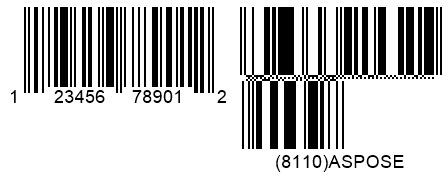
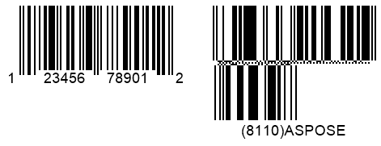

{}[Generate GS1 Code 128 and](https://products.aspose.app/barcode/generate/code128?type=gs1code128) [GS1 Data Matrix Barcodes Online](https://products.aspose.app/barcode/generate/datamatrix?type=gs1datamatrix): You can test the quality of ***Aspose.BarCode*** generation for GS1 barcodes and view the results online.{}

## **Overview**
GS1 is one of the main developers of data processing and encoding standards for barcodes. It is an international non-profit organization that introduces standardized machine data reading methods for item tracking based on the mechanism of automatic identification and data capture (AIDC). GS1 has proposed using application identifiers (AIs) that are defined as identification codes to encode information about items or goods. Such codes serve as prefixes that may be added to barcodes or RFID tags to store some extra information. Moreover, GS1 has introduced special encoding standards for various types.  
  
The barcode types compatible with all GS1 Application Identifiers or the GS1AI_01 type only are listed in the table below.  
  
|
**Compatibility with GS1 AIs**
|
**Supported Symbologies**
|
|---|---|
|Supports All GS1 AIs|DataBar Expanded, DataBar Expanded Stacked, GS1 Codablock-F, GS1 Code 128, GS1 Data Matrix, GS1 QR Code, UPC-A GS1 DataBar Coupon, UPC-A GS1 Code 128 Coupon|
|Supports Only GS1AI_01|DataBar Omnidirectional, DataBar Stacked Omnidirectional, Databar Limited, DataBar Truncated, DataBar Stacked, EAN 14, ITF 14|
  
{}*If you need any clarifications, feel free to reach out [Aspose Technical Support](/barcode/java/technical-support/): ask your questions at [Aspose.Barcode Forum](https://forum.aspose.com/c/barcode/13) or contact [Aspose Paid Support Helpdesk](https://helpdesk.aspose.com/).*{}

## **GS1 Barcode Generation Standards**
***Aspose.BarCode for Java*** supports creating barcodes of various symbologies using formats based on GS1 standards. To generate barcodes in this way, developers first need to pass barcode text through the *setCodeText* method of class [*BarcodeGenerator*](https://reference.aspose.com/barcode/java/com.aspose.barcode.generation/BarcodeGenerator) using the following format:  

<mark>"(Application_Identifier_1)Application_Data(Application_Identifier_2)Application_Data"</mark>
 

As an example, it is possible to set the string "(01)12345678901231(21)ASPOSE(30)9876" as barcode text using the *setCodeText* method.  
      
**GS1 Code 128**  
  
<!--Following code samples are given to show how to create *Code 128* and *DataMatrix* barcodes according to the GS1-compatible format.
BarcodeGenerator gen = new BarcodeGenerator(EncodeTypes.GS1Code128, "(01)12345678901231(21)ASPOSE(30)9876");
gen.Parameters.Barcode.XDimension.Pixels = 2;
gen.Save($"{path}GS1Code128Example.png", BarCodeImageFormat.Png);
-->
  

    
**GS1 DataMatrix**  
  
<!--
BarcodeGenerator gen = new BarcodeGenerator(EncodeTypes.GS1DataMatrix, "(01)12345678901231(21)ASPOSE(30)9876");
gen.Parameters.Barcode.XDimension.Pixels = 8;
gen.Parameters.Barcode.DataMatrix.Columns = 36;
gen.Parameters.Barcode.DataMatrix.Rows = 12;
gen.Save($"{path}Gs1DataMatrixExample.png", BarCodeImageFormat.Png);
-->
  

  
## **GS1 UPC-A Coupon Barcodes**
In ***Aspose.BarCode for Java***, it is possible to generate *UPC-A* barcodes with coupon add-ons in the form of *DataBar Expanded* or *GS1 Code128* barcodes displayed nearby the primary barcode label. This can be done also by creating two barcode images separately and then merging them into the same image using special graphic libraries. ***Aspose.BarCode for Java*** allows generating barcodes with coupons in a faster and easier manner.  
  
Specifically, ***Aspose.BarCode for Java*** enables creating barcodes with coupons using two formats:
- *UPC-A GS1 DataBar Coupon*: *UPC-A* + *DataBar Expanded* coupon
- *UPC-A GS1 Code 128 Coupon*: *UPC-A* + *GS1 Code128* coupon
  
In ***Aspose.BarCode for Java***, developers can generated aforementioned barcodes with coupons using the [*EncodeTypes*](https://reference.aspose.com/barcode/java/com.aspose.barcode.generation/EncodeTypes) class and fields *UPCA_GS_1_CODE_128_COUPON* and *UPCA_GS_1_DATABAR_COUPON* of its subclass [*SymbologyEncodeType*](https://reference.aspose.com/barcode/java/com.aspose.barcode.generation/SymbologyEncodeType). First, it is needed to call the *setCodeText* method of class [*BarcodeGenerator*](https://reference.aspose.com/barcode/java/com.aspose.barcode.generation/BarcodeGenerator) passing barcode text as a string in the special format:  

<mark>"UPC-A Input Data(Application Identifier)GS1 Barcode Text"</mark>
  
  
As an example, it is possible to pass the string "123456789012(8110)ASPOSE" to the *setCodeText* method. 
  
<!--Following code snippets explain how to create *UpcaGs1DatabarCoupon* and *UpcaGs1DatabarCoupon* barcodes.-->  
  
### **UPC-A + DataBar Expanded**
<!--
BarcodeGenerator gen = new BarcodeGenerator(EncodeTypes.UpcaGs1DatabarCoupon, "123456789012(8110)ASPOSE");
gen.Parameters.Barcode.XDimension.Pixels = 2;
gen.Save($"{path}Gs1CouponUpcaDatabar.png", BarCodeImageFormat.Png);
-->

  
  
BarcodeGenerator generator = new BarcodeGenerator(EncodeTypes.UPCA_GS_1_DATABAR_COUPON);

// UPCA part is "514141100906", GS1Databar part is "(8110)001234502239811110555"
generator.setCodeText("512345678900(8110)001234502239811110555");

generator.save("UpcaGs1DatabarCoupon.png");



### **UPC-A + GS1 Code 128**
<!--
BarcodeGenerator gen = new BarcodeGenerator(EncodeTypes.UpcaGs1Code128Coupon, "123456789012(8110)ASPOSE");
gen.Parameters.Barcode.XDimension.Pixels = 2;
gen.Save($"{path}Gs1CouponUpcaCode128.png", BarCodeImageFormat.Png);
-->

## **Spacing Settings for Barcodes with Coupons**
***Aspose.BarCode for Java*** provides a possibility to modify the size of spacings between primary barcodes and their coupons using the *setSupplementSpace* method of class [*CouponParameters*](https://reference.aspose.com/barcode/java/com.aspose.barcode.generation/CouponParameters).  
  
Following *UPC-A GS1 DataBar Coupon* barcodes have been created with different spacing settings.
     
|Spacing Size|Is Set to 30 Pixels|Is Set to 50 Pixels|
| :-: | :-: | :-: |
| |||
  
<!--The following code sample demonstrates how to manage the size of spacing between primary barcodes and their coupon add-ons.
    

BarcodeGenerator gen = new BarcodeGenerator(EncodeTypes.UpcaGs1Code128Coupon, "123456789012(8110)ASPOSE");
gen.Parameters.Barcode.XDimension.Pixels = 2;
//set coupon supplement space 30 pixels
gen.Parameters.Barcode.Coupon.SupplementSpace.Pixels = 30;
gen.Save($"{path}Gs1CouponSpace30Pixels.png", BarCodeImageFormat.Png);
//set coupon supplement space 50 pixels
gen.Parameters.Barcode.Coupon.SupplementSpace.Pixels = 50;
gen.Save($"{path}Gs1CouponSpace50Pixels.png", BarCodeImageFormat.Png);
-->