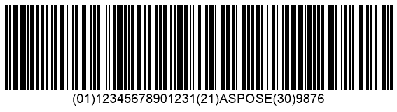
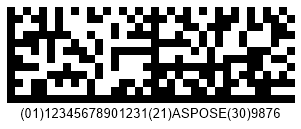

{}[Generate GS1 Code 128 and](https://products.aspose.app/barcode/generate/code128?type=gs1code128) [GS1 DataMatrix Barcodes Online](https://products.aspose.app/barcode/generate/datamatrix?type=gs1datamatrix): You can test the quality of ***Aspose.BarCode*** generation for GS1 barcodes and view the results online.{}

## **Overview**
GS1 is a non-profit international organization that is aimed at developing encoding standards for automatic identification and data capture (AIDC) that refers to the methods of machine data reading used in trading and transportation of goods. To facilitate item tracking, GS1 has introduced multiple identification codes (so called application identifiers) that are used to encode various information about goods. GS1 Application Identifiers (AIs) are defined as prefixes included in barcodes and RFID tags to specify the context and format of the data to be encoded. For barcodes that correspond to one of the most widely used item identification methods, GS1 also has developed its own data encoding standards for different barcode types.  
  
The table below outlines the barcode types that support all GS1 Application Identifiers and those that are compatible only with the GS1AI_01 type.  
  
|
**Compatibility with GS1 AIs**
|
**Barcode Types**
|
|---|---|
|All GS1 Application Indentifiers Are Supported|DataBar Expanded, DataBar Expanded Stacked, GS1 Codablock-F, GS1 Code 128, GS1 DataMatrix, GS1 QR Code, UPC-A GS1 DataBar Coupon, UPC-A GS1 Code 128 Coupon|
|Only GS1AI_01 Is Supported|DataBar OmniDirectional, DataBar Stacked OmniDirectional, DatabarLimited, DataBar Truncated, DataBar Stacked, EAN14, ITF14|
  
{}*If you need any clarifications, feel free to reach out [Aspose Technical Support](/barcode/java/technical-support/): ask your questions at [Aspose.Barcode Forum](https://forum.aspose.com/c/barcode/13) or contact [Aspose Paid Support Helpdesk](https://helpdesk.aspose.com/).*{}

## **Barcode Generation according to GS1 Standards**
***Aspose.BarCode for Java*** enables barcode generation in formats that are compatible with GS1 standards. To do this for the barcode types that support GS encoding, it is required to set barcode text using the *setCodeText* method of class [*BarcodeGenerator*](https://apireference.aspose.com/barcode/java/com.aspose.barcode.generation/BarcodeGenerator) as a string formulated using the predefined format:  

<mark>"(Application_Identifier_1)Application_Data(Application_Identifier_2)Application_Data"</mark>
 

For example, the following value "(01)12345678901231(21)ASPOSE(30)9876" can be passed while calling the *setCodeText* method.  
  
Further, you can see the code snippets provided as examples to illustrate how to generate GS1-compatible barcodes for *Code 128* and *DataMatrix* symbologies along with corresponding sample barcode labels.  
  
**GS1 Code 128**  
   

BarcodeGenerator gen = new BarcodeGenerator(EncodeTypes.GS1Code128, "(01)12345678901231(21)ASPOSE(30)9876");
gen.Parameters.Barcode.XDimension.Pixels = 2;
gen.Save($"{path}GS1Code128Example.png", BarCodeImageFormat.Png);

  

  
**GS1 DataMatrix**  
  

BarcodeGenerator gen = new BarcodeGenerator(EncodeTypes.GS1DataMatrix, "(01)12345678901231(21)ASPOSE(30)9876");
gen.Parameters.Barcode.XDimension.Pixels = 8;
gen.Parameters.Barcode.DataMatrix.Columns = 36;
gen.Parameters.Barcode.DataMatrix.Rows = 12;
gen.Save($"{path}Gs1DataMatrixExample.png", BarCodeImageFormat.Png);

  

  
## **GS1 UPC-A Coupon Generation**
For the *UPC-A* symbology, ***Aspose.BarCode for Java*** allows generating a barcode label with an additional coupon barcode (*DataBar Expanded* or *GS1 Code128*) placed in the same image. This operation can be also performed by generating two barcodes separately and then combining them in an image using an appropriate graphic library; however, the feature provided by ***Aspose.BarCode for Java*** facilitates generating such barcodes in a much simpler and faster way.  
  
As mentioned above, in ***Aspose.BarCode for Java***, it is possible to generate two types of coupon barcodes:
- *UPC-A GS1 DataBar Coupon* that allows combining *UPC-A* and *DataBar Expanded*
- *UPC-A GS1 Code 128 Coupon* that allows merging *UPC-A* and *GS1 Code128*
  
In the library, these two barcode types can be specified using the [*EncodeTypes*](https://apireference.aspose.com/barcode/java/com.aspose.barcode.generation/EncodeTypes) class and the following fields: *UPCA_GS_1_CODE_128_COUPON* and *UPCA_GS_1_DATABAR_COUPON*. To generate a barcode with coupon, it is necessary to use the *setCodeText* method of class [*BarcodeGenerator*](https://apireference.aspose.com/barcode/java/com.aspose.barcode.generation/BarcodeGenerator) using an input string in the following format:  

<mark>"UPC-A Input Data(Application Identifier)GS1 Barcode Text"</mark>
  
  
For example, the following value "123456789012(8110)ASPOSE" can be passed to the *setCodeText* method. 
  
Below, the code samples are provided to explain how to generate barcodes with coupons for *UpcaGs1DatabarCoupon* and *UpcaGs1DatabarCoupon* barcode types along with corresponding sample barcode labels.  
  
### **UPC-A + DataBar Expanded**

BarcodeGenerator gen = new BarcodeGenerator(EncodeTypes.UpcaGs1DatabarCoupon, "123456789012(8110)ASPOSE");
gen.Parameters.Barcode.XDimension.Pixels = 2;
gen.Save($"{path}Gs1CouponUpcaDatabar.png", BarCodeImageFormat.Png);


### **UPC-A + GS1 Code 128**

BarcodeGenerator gen = new BarcodeGenerator(EncodeTypes.UpcaGs1Code128Coupon, "123456789012(8110)ASPOSE");
gen.Parameters.Barcode.XDimension.Pixels = 2;
gen.Save($"{path}Gs1CouponUpcaCode128.png", BarCodeImageFormat.Png);


## **Coupon Spacing Settings**
In ***Aspose.BarCode for Java***, it is possible to adjust the size of spacing between coupon barcodes placed in the same image. It can be done by setting the *setSupplementSpace* method of class [*CouponParameters*](https://apireference.aspose.com/barcode/java/com.aspose.barcode.generation/CouponParameters).  
  
Sample barcode images provided below have been generated using the *UPC-A GS1 DataBar Coupon* standard and applying different spacing settings.
     
|
**Supplement Space**
|
**Is Set to 30 Pixels**
|
**Is Set to 50 Pixels**
|
| :-: | :-: | :-: |
| |||
  
The following code snippet shows how to modify the size of spacing between coupon barcodes.
    

BarcodeGenerator gen = new BarcodeGenerator(EncodeTypes.UpcaGs1Code128Coupon, "123456789012(8110)ASPOSE");
gen.Parameters.Barcode.XDimension.Pixels = 2;
//set coupon supplement space 30 pixels
gen.Parameters.Barcode.Coupon.SupplementSpace.Pixels = 30;
gen.Save($"{path}Gs1CouponSpace30Pixels.png", BarCodeImageFormat.Png);
//set coupon supplement space 50 pixels
gen.Parameters.Barcode.Coupon.SupplementSpace.Pixels = 50;
gen.Save($"{path}Gs1CouponSpace50Pixels.png", BarCodeImageFormat.Png);
