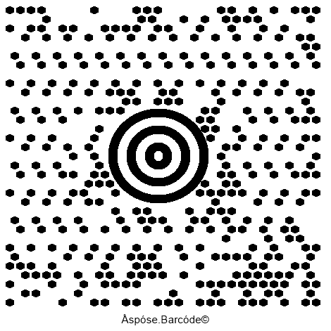
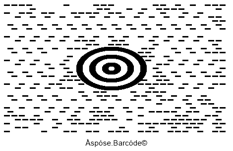

{}[Generate MaxiCode Barcodes Online](https://products.aspose.app/barcode/generate/maxicode): You can test the quality of ***Aspose.BarCode*** generation for MaxiCode barcodes and view the results online.{}

## **Overview**
*MaxiCode* is a 2D barcode type used to encode textual data and streams of bytes. *MaxiCode* barcodes contain special round bullseye finder patterns consisting of 3 circles, 6 orientation patterns, and 33 rows composed of 29 or 30 hexagonal modules. This barcode standard has been developed for postal services and is recommended for industrial tasks. Its encoding capacity may vary according to properties of encoded information and may reach up to 60 bytes or 90 alphanumeric characters or 140 numerical digits. The *MaxiCode* symbology supports Reed-Solomon error correction.
  
{}*If you need any clarifications, feel free to reach out [Aspose Technical Support](/barcode/java/technical-support/): ask your questions at [Aspose.Barcode Forum](https://forum.aspose.com/c/barcode/13) or contact [Aspose Paid Support Helpdesk](https://helpdesk.aspose.com/).*{}

## **Encoding Modes**
***Aspose.BarCode for Java*** supports several encoding modes for the *MaxiCode* symbology that can be managed through the *setMaxiCodeEncodeMode* method of class [*MaxiCodeParameters*](https://apireference.aspose.com/barcode/java/com.aspose.barcode.generation/MaxiCodeParameters): 
- *Encoding Modes 2 and 3* - specific industrial standards used in the transportation industry and aimed at encoding shipping information
- *Encoding Modes 4 and 5* - these modes used to encode arbitrary textual data or streams of bytes; the difference between this mode is encoding capacity and the number of codewords reserved for error correction
- *Encoding Mode 6* - this mode is alike *Encoding Mode 4*; however, barcode data is used only to program hardware readers

### **Encoding Modes 2 and 3**
To ensure appropriate barcode generation, input data for *Encoding Modes 2 and 3* needs to be organized using specific formats defined as follows:  
- <mark>Format1: “[)>(rs)01(gs)(Postal Code)(gs)(Country Code)(gs)(Service Category)(gs)(Secondary Message)(eot)”</mark>
- <mark>Format2: “(Postal Code 9 digits)(gs)(Country Code)(gs)(Service Category)(gs)(Secondary Message)(eot)”</mark>
  
The standard includes several special characters:
- Group separator Unicode symbol: (gs) - \u001d
- Record separator Unicode symbol: (rs) - \u001e
- End-of-transmision Unicode symbol: (eot) - \u0004
  
Following *MaxiCode* barcodes have been generated applying Formats 1 and 2 of *Encoding Mode 2*.
   
|
**Mode 2**
|
**Format 1**
|
**Format 2**
|
| :-: | :-: | :-: |
| |||
  
<!--The following code sample shows how to switch between different encoding modes.


BarcodeGenerator gen = new BarcodeGenerator(EncodeTypes.MaxiCode, "");
gen.Parameters.Barcode.XDimension.Pixels = 15;
gen.Parameters.Barcode.CodeTextParameters.TwoDDisplayText = "MaxiCode Mode 2";

string gs = "\u001d";
string rs = "\u001e";
string eot = "\u0004";
//set MaxiCode encode mode to 2 and valid codetext
gen.Parameters.Barcode.MaxiCode.MaxiCodeEncodeMode = 2;
//[)>(rs)01(gs)(Postal Code)(gs)(Country Code)(gs)(Service Category)(gs)(Secondary Message)(eot)
gen.CodeText = $"[)>{rs}01{gs}B1050{gs}056{gs}001{gs}ADDITIONAL DATA{eot}";
gen.Save($"{path}MaxiCodeEncodeMode2First.png", BarCodeImageFormat.Png);

//set MaxiCode encode mode to 2 and valid codetext
gen.Parameters.Barcode.MaxiCode.MaxiCodeEncodeMode = 2;
//(Postal Code 9 digits)(gs)(Country Code)(gs)(Service Category)(gs)(Secondary Message)(eot)
gen.CodeText = $"123456789{gs}056{gs}001{gs}ADDITIONAL DATA{eot}";
gen.Save($"{path}MaxiCodeEncodeMode2Second.png", BarCodeImageFormat.Png);
-->  
  
### **Encoding Modes 4, 5, and 6**
*Encoding modes 4, 5, and 6* can be used to encode arbitrary textual data or streams of bytes. 
<!--The following code snippet explains how to encode byte streams using *Encoding Mode 4*.


BarcodeGenerator gen = new BarcodeGenerator(EncodeTypes.MaxiCode, "Åspóse.Barcóde©");
gen.Parameters.Barcode.XDimension.Pixels = 15;
//set MaxiCode encode mode to 4
gen.Parameters.Barcode.MaxiCode.MaxiCodeEncodeMode = 4;
gen.Save($"{path}MaxiCodeEncodeMode4.png", BarCodeImageFormat.Png);
-->
  

## **Aspect Ratio Settings**
*Aspect Ratio* is one of the most importan parameters for barcode generation that is determined as the ratio between barcode height and width. The *setAspectRatio* method of class [*MaxiCodeParameters*](https://apireference.aspose.com/barcode/java/com.aspose.barcode.generation/MaxiCodeParameters) can be used to modify barcode proportions corresponding to X and Y coordinates. *Aspect Ratio* is defined as a relative coefficient to the *XDimension* value. For *MaxiCode* barcode generation, it is recommended to set the value of *Aspect Ratio* to 1. The following *MaxiCode* has been created with the *Aspect Ratio* equal to 0.5.
  

  
<!--The following code sample shows how to customize *Aspect Ratio* for *MaxiCode* barcodes.
  

BarcodeGenerator gen = new BarcodeGenerator(EncodeTypes.MaxiCode, "Åspóse.Barcóde©");
gen.Parameters.Barcode.XDimension.Pixels = 15;
//set aspect ratio 0.5
gen.Parameters.Barcode.MaxiCode.AspectRatio = 0.5f;
gen.Save($"{path}MaxiCodeAspectRatio0.5.png", BarCodeImageFormat.Png);
-->