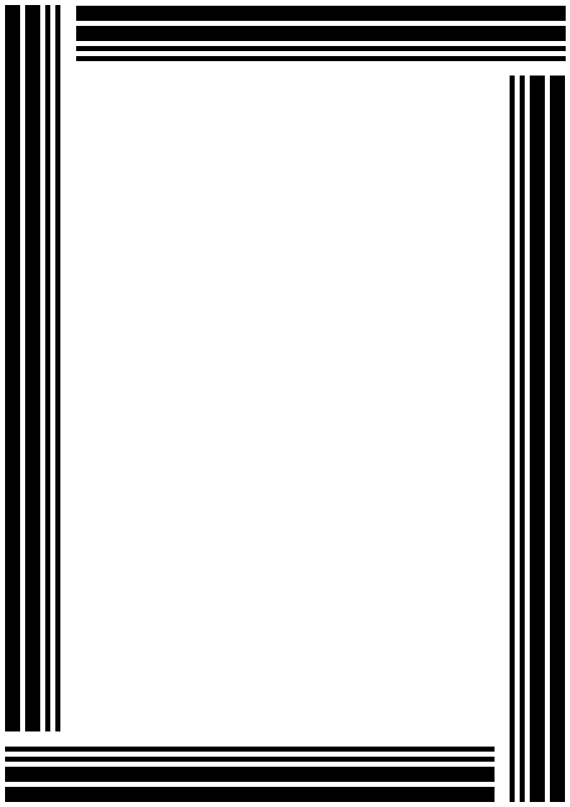
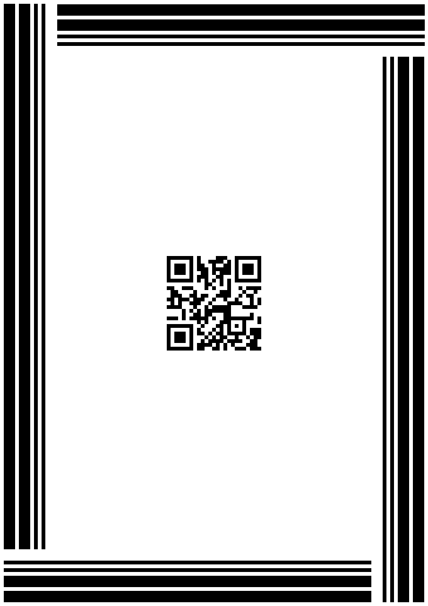

{}[Generate Patch Code Barcodes Online](https://products.aspose.app/barcode/generate/patchcode): You can check the quality of ***Aspose.BarCode*** generation for Patch Code barcodes and view the results online.{}

## **Overview**
Kodak introduced the *Patch Code* barcode standard to improve the efficiency of automated multi-page document scanning. *Patch Code* barcodes are not intended to encode information. Here, barcode patterns denote various tasks to be executed. ***Aspose.BarCode for Java*** allows generating six *Patch Code* patterns and provide two generation modes: creating barcode images for manual placement on a page or generating entire A4 or US Letter pages. *Patch Code* barcodes are printed out on four sides of a document page. By design, scanning only one of the sides is sufficient to perform barcode reading. This enables barcode recognition for rotated pages.
  
{}*If you need any clarifications, feel free to reach out [Aspose Technical Support](/barcode/java/technical-support/): ask your questions at [Aspose.Barcode Forum](https://forum.aspose.com/c/barcode/13) or contact [Aspose Paid Support Helpdesk](https://helpdesk.aspose.com/).*{}

## **Patch Code Patterns**
***Aspose.BarCode for Java*** supports *Patch Code* barcode generation using six main patterns. The extended set of patterns suggested by Kodak that has not been standardized is not available. The main six patterns are: *Patch I*, *Patch II*, *Patch III*, *Patch IV*, *Patch T*, and *Patch VI*.  
  
Following *Patch Code* barcodes correspond to six basic *Patch Code* patterns.
  
|
**Patch Code Patterns**
|
**Patch I**
|
**Patch II**
|
**Patch III**
|
**Patch IV**
|
**Patch T**
|
**Patch VI**
|  
| :-: | :-: | :-: | :-: | :-: | :-: | :-: |
| |||||||
  
<!--The following code sample shows how to work with different *Patch Code* patterns.
  

BarcodeGenerator gen = new BarcodeGenerator(EncodeTypes.PatchCode, "Patch I");
gen.Parameters.Barcode.CodeTextParameters.FontMode = FontMode.Manual;
gen.Parameters.Barcode.CodeTextParameters.Font.Size.Pixels = 20;
//Patch I
gen.CodeText = "Patch I";
gen.Save($"{path}PatchCodeI.png", BarCodeImageFormat.Png);
//Patch II
gen.CodeText = "Patch II";
gen.Save($"{path}PatchCodeII.png", BarCodeImageFormat.Png);
//Patch III
gen.CodeText = "Patch III";
gen.Save($"{path}PatchCodeIII.png", BarCodeImageFormat.Png);
//Patch IV
gen.CodeText = "Patch IV";
gen.Save($"{path}PatchCodeIV.png", BarCodeImageFormat.Png);
//Patch T
gen.CodeText = "Patch T";
gen.Save($"{path}PatchCodeT.png", BarCodeImageFormat.Png);
//Patch VI
gen.CodeText = "Patch VI";
gen.Save($"{path}PatchCodeVI.png", BarCodeImageFormat.Png);
-->

## **Patch Code Generation Modes**
In ***Aspose.BarCode for Java***, two generation modes are available for the *Patch Code* symbology: generating barcode images or creating A4 or US Letter pages with landscape or portrait orientation. Moreover, it is possible to add an optional *QR Code* barcode as a supplement barcode add-on that may be useful to complete barcode scanning. Using other symbologies as add-on barcodes is not available.  
  
**Patch Code Generation Formats** 
  
To manage the generation format for *Patch Code* barcodes, developers can use the *setPatchFormat* method of class [*PatchCodeParameters*](https://reference.aspose.com/barcode/java/com.aspose.barcode.generation/PatchCodeParameters). This method refers to the [*PatchFormat*](https://reference.aspose.com/barcode/java/com.aspose.barcode.generation/PatchFormat) enum that includes the following values: 
- *PatchOnly* - the default mode that is used to generate basic *Patch Code* barcodes are generated 
- *A4* - this mode is intended to create portrait-oriented A4 pages with *Patch Code* barcodes on borders and a *QR Code* barcode inside the page (optionally)
- *A4_LANDSCAPE* - this mode is used to generate landscape-oriented A4 pages with *Patch Code* barcodes on borders and a *QR Code* barcode inside the page (optionally) 
- *US_Letter* - this mode is used to create portrait-oriented US Letter pages with *Patch Code* barcodes on borders and a *QR Code* barcode inside the page (optionally)
- *US_Letter_LANDSCAPE* - this mode is applied to generate landscape-oriented US pages with *Patch Code* barcodes on borders and a *QR Code* inside the page (optionally)

**Complementary QR Code Settings**  
As mentioned above, it is possible to place a complementary *QR Code* add-on inside a page (A4 or US Letter) with *Patch Code* barcodes. It can be done by passing some textual data to the *setExtraBarcodeText* method of class [*PatchCodeParameters*](https://reference.aspose.com/barcode/java/com.aspose.barcode.generation/PatchCodeParameters) and then calling the *setLocation* method of class [*CodeTextParameters*](https://reference.aspose.com/barcode/java/com.aspose.barcode.generation/CodetextParameters) with the *NONE* value (the [*CodeLocation*](https://reference.aspose.com/barcode/java/com.aspose.barcode.generation/CodeLocation) enum).  
  
Following *Patch Code* barcodes have been created with and without complementary *QR Code* add-ons.
  
|
**Complementary QR Code Add-On**
|
**Is Disabled**
|
**Is Enabled**
|
| :-: | :-: | :-: |
| |<a href="patchcodea4withoutqr.png"> 

</a>|<a href="patchcodea4withqr.png"> 

</a>|
  
<!--The following code sample shows how to manage *Patch Code* generation and how to enable displaying a complementary *QR Code* add-on.
  

BarcodeGenerator gen = new BarcodeGenerator(EncodeTypes.PatchCode, "Patch I");
//create a PatchCode barcode without complimentary QR
gen.Parameters.Barcode.PatchCode.PatchFormat = PatchFormat.A4;
gen.Save($"{path}PatchCodeA4WithoutQR.png", BarCodeImageFormat.Png);
//create a PatchCode barcode with complimentary QR
gen.Parameters.Barcode.PatchCode.PatchFormat = PatchFormat.A4;
gen.Parameters.Barcode.PatchCode.ExtraBarcodeText = "Aspose page extra info";
gen.Parameters.Barcode.CodeTextParameters.Location = CodeLocation.None;
gen.Save($"{path}PatchCodeA4WithQR.png", BarCodeImageFormat.Png);
-->