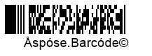
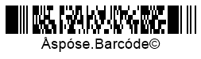

{}[Generate PDF417 Barcodes Online](https://products.aspose.app/barcode/generate/pdf417): You can test the quality of ***Aspose.BarCode*** generation for PDF417 barcodes and get the results online.{}

## **Overview**
*PDF417* is a group of 2D variable-length stacked symbologies that are similar to matrix barcodes in terms of various parameters. This standard supports laser scanning for high-quality documents (except *Compact PDF417* that requires photo scanning). *PDF417* barcodes have data density lower than that of matrix symbologies but several times greater compared to basic 1D stacked barcode types. *PDF417* standards enable encoding both byte streams and Unicode symbols. Moreover, *PDF417* barcodes include additional information for data recovery through Reed-Solomon error correction.  
  
The other peculiarity of the *PDF417* barcode family is the extended format of representing metadata so that one file can be divided into several barcodes and then transmitted on a printed document indicating file date, name, checksum, and other information. However, metadata require additional space in a barcode image. The layout of *PDF417* barcodes includes rows and columns. The basic *PDF417* standard can encode up to 1,108 bytes or 1,850 alphanumeric (2,710 numerical) symbols in up to 30 columns and 90 rows while *Micro PDF417* is capable of encoding at most 150 bytes of data or 266 alphanumeric (366 numerical) characters in up to 4 columns and 44 rows.  
  
|
**PDF417 Standard**
|
**Description**
|
|---|---|
|[**Basic PDF417**](#pdf417)|Basic *PDF417* symbology that is intended for work with documents of any quality and provides the possibility of laser scanning|
|[**Micro PDF417**](#micropdf417)|Specialized *PDF417* standard that allows saving print space and is intended for joint use with two-component barcodes based on GS1 composite symbologies or for work with high-quality documents|
|[**Macro PDF417**](#macropdf417)|*PDF417* barcode type with the possibility to add metainformation|
|[**Compact PDF417**](#compactpdf417)|*PDF417* standard that can be with or without metainformation and is intended to address space limitations; in such barcodes, the right-side block of metadata is omitted, and the stop pattern is removed. This barcode type does not support laser scanning (only photo scanning can be used) and requires high-quality documents for successful recognition|
  
{}*If you need any clarifications, feel free to reach out [Aspose Technical Support](/barcode/java/technical-support/): ask your questions at [Aspose.Barcode Forum](https://forum.aspose.com/c/barcode/13) or contact [Aspose Paid Support Helpdesk](https://helpdesk.aspose.com/).*{}

## **PDF417 and Macro PDF417 Symbology**
*PDF417* and *Macro PDF417* barcodes may contain from 1 to 30 columns with input data, 2 columns with auxiliary metainformation (such as row indicator, the number of rows and columns) and then, start and stop patterns. The number of rows can vary from 3 to 90. The main distinction between *Macro PDF417* and *Basic PDF417* is the possibility to encode additional metadata about barcode contents. This redundancy associated with auxiliary metadata allows reading such barcodes using laser scanners as well as reducing barcode image quality requirements. The specificities of using *Macro PDF417* in ***Aspose.BarCode for Java*** are discussed further in the corresponding [**subsection**](#macropdf417).
  

  

The following code snippet illustrates how to generate a *Basic PDF417* barcode.
  

            BarcodeGenerator gen = new BarcodeGenerator(EncodeTypes.Pdf417, "Åspóse.Barcóde©");
            gen.Parameters.Barcode.XDimension.Pixels = 2;
            gen.Parameters.Barcode.Pdf417.Columns = 3;
            gen.Save($"{path}Pdf417Basic.png", BarCodeImageFormat.Png);


## **Micro PDF417 Symbologies**
*Micro PDF417* can include from 1 to 4 columns and from 4 to 44 rows; the maximal and minimal numbers of rows depend on the number of columns according to the predefined combinations of rows, columns, and error correction codewords. In addition, each barcode contains two columns with metadata that serve as targets for barcode location in an image. In general, *Micro PDF417* is used for work with high-quality documents due to barcode recognition difficulties; at the same time, these barcodes can be read by laser scanners. 

  

The following code sample shows how to create a *Micro PDF417* barcode.
  

BarcodeGenerator gen = new BarcodeGenerator(EncodeTypes.MicroPdf417, "Åspóse.Barcóde©");
gen.Parameters.Barcode.XDimension.Pixels = 2;
gen.Parameters.Barcode.Pdf417.Columns = 4;
gen.Save($"{path}MicroPdf417Basic.png", BarCodeImageFormat.Png);


## **Compact PDF417 Symbology**
The specification of *Compact PDF417* is similar to those of *Basic PDF417* and *Marco PDF417*; however, the right-side metainformation column and the right-side stop pattern are removed to save space for small-sized barcodes. This symbology does not support laser scanning; moreover, due to the absence of metainformation redundancy, it has difficulties with low-quality barcode image recognition. To set the *Compact PDF417* generation mode in ***Aspose.BarCode for Java***, it is necessary to initialize the [*Pdf417Truncate*]() property of class [*Pdf417Parameters*]().
  

  

The following code snippet explains how to generate *Compact PDF417* barcodes.
  

BarcodeGenerator gen = new BarcodeGenerator(EncodeTypes.Pdf417, "Åspóse.Barcóde©");
gen.Parameters.Barcode.XDimension.Pixels = 2;
gen.Parameters.Barcode.Pdf417.Columns = 3;
//set Pdf417 truncated or Compact Pdf417
gen.Parameters.Barcode.Pdf417.Pdf417Truncate = true;
gen.Save($"{path}CompactPdf417Basic.png", BarCodeImageFormat.Png);


## **PDF417 Data Encoding Modes**
To select the data encoding mode in ***Aspose.BarCode for Java***, it is required to set the [*Pdf417CompactionMode*]() property of class [*Pdf417Parameters*]() that specifies data compaction regimes to be used during barcode generation. To encode Unicode symbols, two other properties, [*Pdf417ECIEncoding*]() and [*CodeTextEncoding*](), can be used. Detailed explanations and code samples for these properties are provided further in the article.

### **ECI Encoding Mode**
Besides encoding Unicode characters into byte streams, the [*Pdf417ECIEncoding*]() property allows setting the ECI identifier for the current encoding that can be read and correctly interpreted by decoders. In the case of setting this property using any value that differs from *ECIEncodings.NONE*, data processing is performed using the specified ECI encoding. The present library implementation includes all well-known charset encodings that are listed in the [*ECIEncodings*]() enumeration.  
  
The code sample given below illustrates how to set the *ECI Encoding* mode.
  

Console.OutputEncoding = Encoding.Unicode;
BarcodeGenerator gen = new BarcodeGenerator(EncodeTypes.Pdf417, "Aspose常に先を行く");
gen.Parameters.Barcode.XDimension.Pixels = 2;
gen.Parameters.Barcode.Pdf417.Columns = 3;
//set UTF8 ECI encoding
gen.Parameters.Barcode.Pdf417.Pdf417ECIEncoding = ECIEncodings.UTF8;
gen.Save($"{path}Pdf417ECIEncoding.png", BarCodeImageFormat.Png);
//attempt to recognize it
BarCodeReader read = new BarCodeReader(gen.GenerateBarCodeImage(), DecodeType.Pdf417);
foreach (BarCodeResult result in read.ReadBarCodes())
    Console.WriteLine("Pdf417ECIEncoding:" + result.CodeText);

  

  
### **Compaction Mode**
As mentioned above, to select the required data compaction way, the [*Pdf417CompactionMode*]() property needs to be initialized using one of the supported compaction modes are described below.
  
|
**Compaction Mode**
|
**Description**
|
|---|---|
|**Auto**|Encoding is performed in the most high-density data compaction mode that is selected automatically. In the case when [*CodeText*]() contents include a digit greater than 255, data compaction is executed using the encoding specified in [*CodeTextEncoding*]()|
|**Binary**|This mode is intended to encode binary byte streams with digits from 0 to 255. If [*CodeText*]() contains a digit greater than 255, data compaction is performed using the encoding set in [*CodeTextEncoding*]()|
|**Text**|Legacy mode to encode alphanumeric data. It is recommended to use the *Auto* mode|
|**Numeric**|Legacy mode to encode numerical digits. It is recommended to use the *Auto* mode|
  
Barcode images demonstrated below have been generated using different compaction mode settings.
  
|
**Compaction Mode**
|
***Auto***
|
***Binary***
|
***Text***
|
***Numeric***
|
| :-: | :-: | :-: | :-: | :-: |
| |||||
  
The following code snippet explains how to set different compaction modes.


            BarcodeGenerator gen = new BarcodeGenerator(EncodeTypes.Pdf417, "");
            gen.Parameters.Barcode.XDimension.Pixels = 2;
            gen.Parameters.Barcode.Pdf417.Columns = 3;
            //Set compaction mode to Auto
            gen.Parameters.Barcode.Pdf417.Pdf417CompactionMode = Pdf417CompactionMode.Auto;
            gen.CodeText = "Åspóse.Barcóde©";
            gen.Save($"{path}Pdf417CompactionAuto.png", BarCodeImageFormat.Png);
            //Set compaction mode to Binary
            gen.Parameters.Barcode.Pdf417.Pdf417CompactionMode = Pdf417CompactionMode.Binary;
            gen.CodeText = "Åspóse.Barcóde©";
            gen.Save($"{path}Pdf417CompactionBinary.png", BarCodeImageFormat.Png);
            //Set compaction mode to Text
            gen.Parameters.Barcode.Pdf417.Pdf417CompactionMode = Pdf417CompactionMode.Text;
            gen.CodeText = "ASPOSE";
            gen.Save($"{path}Pdf417CompactionText.png", BarCodeImageFormat.Png);
            //Set compaction mode to Numeric
            gen.Parameters.Barcode.Pdf417.Pdf417CompactionMode = Pdf417CompactionMode.Numeric;
            gen.CodeText = "1234567890";
            gen.Save($"{path}Pdf417CompactionNumeric.png", BarCodeImageFormat.Png);

    
### **Unicode Encoding Mode**
The following code sample demonstrates how to use the [*CodeTextEncoding*]() property to encode Unicode characters in the *Binary* mode.
  

            Console.OutputEncoding = Encoding.Unicode;
            BarcodeGenerator gen = new BarcodeGenerator(EncodeTypes.Pdf417, "Aspose常に先を行く");
            gen.Parameters.Barcode.XDimension.Pixels = 2;
            gen.Parameters.Barcode.Pdf417.Columns = 3;
            //set UTF8 encoding
            gen.Parameters.Barcode.Pdf417.CodeTextEncoding = Encoding.UTF8;
            gen.Save($"{path}Pdf417CodeTextEncoding.png", BarCodeImageFormat.Png);
            //attempt to recognize it
            BarCodeReader read = new BarCodeReader(gen.GenerateBarCodeImage(), DecodeType.Pdf417);
            foreach (BarCodeResult result in read.ReadBarCodes())
                Console.WriteLine("Pdf417CodeTextEncoding:" + result.GetCodeText(Encoding.UTF8));

  

  
### **Byte Stream Encoding in Binary Mode**
When it is needed to encode and transmit an array of bytes in a barcode, developers can use the *Binary* mode that can be set in ***Aspose.BarCode for Java*** using the [*Pdf417CompactionMode*]() property of class [*Pdf417Parameters*](). The following code snippet shows how to use this mode to encode an arbitrary stream of bytes. To display the custom text under a barcode, the [*TwoDDisplayText*]() property needs to be set (see more information about this property [here](https://docs.aspose.com/barcode/java/barcode-text-appearance/#replacing-barcode-text-in-2d-barcodes/)).
  

byte[] encodedArr = { 0xFF, 0xFE, 0xFD, 0xFC, 0xFB, 0xFA, 0xF9 };

//encode array to string
StringBuilder strBld = new StringBuilder();
foreach (byte bval in encodedArr)
    strBld.Append((char)bval);

//encode in Pdf417 code
BarcodeGenerator gen = new BarcodeGenerator(EncodeTypes.Pdf417, strBld.ToString());
gen.Parameters.Barcode.XDimension.Pixels = 2;
//set encode mode to Binary
gen.Parameters.Barcode.Pdf417.Pdf417CompactionMode = Pdf417CompactionMode.Binary;
gen.Parameters.Barcode.CodeTextParameters.TwoDDisplayText = "Bytes mode";
gen.Save($"{path}Pdf417BytesEncoding.png", BarCodeImageFormat.Png);

//attempt to recognize
BarCodeReader read = new BarCodeReader(gen.GenerateBarCodeImage(), DecodeType.Pdf417);
foreach (BarCodeResult result in read.ReadBarCodes())
    Console.WriteLine("Pdf417BytesEncoding:" + BitConverter.ToString(result.CodeBytes));

  

  
## **Barcode Layout Settings**
To set the number of rows and columns in *PDF417* barcodes, ***Aspose.BarCode for Java*** enables the corresponding properties of class [*Pdf417Parameters*]() that are called [*Rows*]() and [*Columns*](). *Basic PDF417*, *Macro PDF417*, and *Micro PDF417* standards allow arbitrarily set the number of columns from 1 to 30 and the number of rows from 3 to 90. The number of rows and columns can be set independently. In turn, *Micro PDF417* supports setting from 1 to 4 columns so that the maximal and minimal numbers of rows depend on the number of columns. In case if the barcode type capacity is insufficient to generate a barcode with the requested number of rows and columns, an exception will be thrown.  
  
*PDF417* barcode images provided below have been generated using different layout settings.

|
**Layout Settings**
|
**2 Columns**
|
**6 Rows**
|
**9 Rows and 6 Columns**
|
| :-: | :-: | :-: | :-: |
| ||||
  
Following code samples explain how to set different layout settings (rows and columns) in *PDF417* and *Micro PDF417* barcodes.
  
**Basic PDF417**  
  

BarcodeGenerator gen = new BarcodeGenerator(EncodeTypes.Pdf417, "Åspóse.Barcóde©");
gen.Parameters.Barcode.XDimension.Pixels = 2;
//set 4 columns
gen.Parameters.Barcode.Pdf417.Columns = 4;
gen.Save($"{path}MicroPdf417Columns4.png", BarCodeImageFormat.Png);

  
**Micro PDF417**


BarcodeGenerator gen = new BarcodeGenerator(EncodeTypes.Pdf417, "Åspóse.Barcóde©");
gen.Parameters.Barcode.XDimension.Pixels = 2;
//set 4 columns
gen.Parameters.Barcode.Pdf417.Columns = 4;
gen.Save($"{path}MicroPdf417Columns4.png", BarCodeImageFormat.Png);


## **Error Correction Level Settings**
The *PDF417* barcode family applies the Reed-Solomon error correction mechanism to perform data recovery and integrity check. In *Micro PDF417* barcodes, the amount of redundant recovery information is defined automatically. To set the error correction level for *Basic PDF417*, *Macro PDF417*, and *Compact PDF417* in ***Aspose.BarCode for Java***, developers can use the [*Pdf417ErrorLevel*]() property of class [*Pdf417Parameters*](). Adding each two error correction (EC) codewords allows recovering one unknown error or two known character removals. The higher is the EC level, the larger is the number of EC codewords in a barcode and accordingly, the better is the result of data recovery for severely damaged barcode images. The maximal *Level8* implies that 265 errors can be corrected; at the same time, the barcode encoding capacity will be reduced by 614 bytes. All supported EC levels are listed below.  
  
|
**EC Level**
|
**Number of EC Codewords**
|
**Error Correction Level**
|
**Number of EC Codewords**
|
| :-: | :-: | :-: | :-: |
|**Level 0**|2 EC codewords|**Level 5**|64 EC codewords|
|**Level 1**|4 EC codewords|**Level 6**|128 EC codewords|
|**Level 2**|8 EC codewords|**Level 7**|256 EC codewords|
|**Level 3**|16 EC codewords|**Level 8**|512 EC codewords|
|**Level 4**|32 EC codewords| |
  
*PDF417* barcode images shown below have been created using different error correction level settings.  
  
|
**Error Correction Level**
|
**Is Set to 2**
|
**Is Set to 5**
|
| :-: | :-: | :-: |
| |||
  
The following code sample explains how to set different error correction levels for *PDF417* barcodes.
  

BarcodeGenerator gen = new BarcodeGenerator(EncodeTypes.Pdf417, "Åspóse.Barcóde©");
gen.Parameters.Barcode.XDimension.Pixels = 2;
gen.Parameters.Barcode.Pdf417.Columns = 3;
//set error level 2
gen.Parameters.Barcode.Pdf417.Pdf417ErrorLevel = Pdf417ErrorLevel.Level2;
gen.Save($"{path}Pdf417ErrorLevel2.png", BarCodeImageFormat.Png);
//set error level 5
gen.Parameters.Barcode.Pdf417.Pdf417ErrorLevel = Pdf417ErrorLevel.Level5;
gen.Save($"{path}Pdf417ErrorLevel5.png", BarCodeImageFormat.Png);

  
## **Aspect Ratio Settings**
*Aspect Ratio* is defined as the ratio between the barcode width and height. In ***Aspose.BarCode for Java***, to customize barcode proportions using the X and Y coordinates, the [*AspectRatio*]() property of class [*Pdf417Parameters*]() can be used. It is implemented as a relative coefficient to the value of the [*XDimension*]() parameter. For *PDF417* barcodes, the value of *AspectRatio* should be set between 3 and 5.

*PDF417* barcodes demonstrated below have been created using different aspect ratio settings.  
  
|
**Aspect Ratio**
|
**Is Set to 2**
|
**Is Set to 5**
|
| :-: | :-: | :-: |
| |||
  
The following code snippet illustrates how to set different aspect ratio values for *PDF417* barcodes.
  

            BarcodeGenerator gen = new BarcodeGenerator(EncodeTypes.Pdf417, "Åspóse.Barcóde©");
            gen.Parameters.Barcode.XDimension.Pixels = 2;
            gen.Parameters.Barcode.Pdf417.Columns = 3;
            //set aspect ratio to 2
            gen.Parameters.Barcode.Pdf417.AspectRatio = 2;
            gen.Save($"{path}Pdf417AspectRatio2.png", BarCodeImageFormat.Png);
            //set aspect ratio to 5
            gen.Parameters.Barcode.Pdf417.AspectRatio = 5;
            gen.Save($"{path}Pdf417AspectRatio5.png", BarCodeImageFormat.Png);

  
## **PDF417 Metadata Encoding**
*Macro PDF417* and *Micro PDF417* standards enable encoding additional metainformation about data origins and identification. These metadata are encoded in barcodes along with main input information and occupy the same data blocks. Metadata can be classified into permanent and optional ones that are explained further.

### **Permanent Metadata Settings**
Permanent metadata that determine encoding the rest of the fields include the following parameters.

|
**Permanent Metadata Field**
|
**Description**
|
|---|---|
|[*Pdf417MacroFileID*]()|Unique identifier of a barcode series or PDF417 file that is set manually|
|[*Pdf417MacroSegmentID*]()|Current segment identifier that starts with 0 and often is accompanied with an optional field called [*Pdf417MacroSegmentsCount*]() that specifies the number of barcodes in a series|

The following code snippet illustrates how to manage permanent metadata for *MacroPDF417* barcodes.


Console.OutputEncoding = Encoding.Unicode;
BarcodeGenerator gen = new BarcodeGenerator(EncodeTypes.MacroPdf417, "Åspóse.Barcóde©");
gen.Parameters.Barcode.XDimension.Pixels = 2;
//set metadata
gen.Parameters.Barcode.Pdf417.Pdf417MacroFileID = 12345678;
gen.Parameters.Barcode.Pdf417.Pdf417MacroSegmentID = 12;
gen.Save($"{path}MacroPdf417Permanent.png", BarCodeImageFormat.Png);
//attempt to recognize it
BarCodeReader read = new BarCodeReader(gen.GenerateBarCodeImage(), DecodeType.MacroPdf417);
foreach (BarCodeResult result in read.ReadBarCodes())
{
    Console.WriteLine("---MacroPdf417Permanent---");
    Console.WriteLine("Codetext:" + result.CodeText);
    Console.WriteLine("Pdf417MacroFileID:" + result.Extended.Pdf417.MacroPdf417FileID);
    Console.WriteLine("Pdf417MacroSegmentID:" + result.Extended.Pdf417.MacroPdf417SegmentID.ToString());
}


### **Optional Metadata Settings**
Optional metadata include various fields that are listed in the table below.
  
|Optional Metadata Field|Description|
|---|---|
|[*Pdf417MacroSegmentsCount*]()|Number of barcodes in a series|
|[*Pdf417MacroFileName*]()|Name of a file|
|[*Pdf417MacroChecksum*]()|Checksum of a file that is calculated using CCITT-16 polynomial|
|[*Pdf417MacroFileSize*]()|Total size of bytes in a series|
|[*Pdf417MacroTimeStamp*]()|Time of creating/sending the file|
|[*Pdf417MacroAddressee*]()|Address of the file sender|
|[*Pdf417MacroSender*]()|Name of the file sender|
  
The following code sample shows how to set optional metadata for *MacroPDF417* barcodes.
  

Console.OutputEncoding = Encoding.Unicode;
BarcodeGenerator gen = new BarcodeGenerator(EncodeTypes.MacroPdf417, "Åspóse.Barcóde©");
gen.Parameters.Barcode.XDimension.Pixels = 2;
//set metadata
gen.Parameters.Barcode.Pdf417.Pdf417MacroFileID = 12345678;
gen.Parameters.Barcode.Pdf417.Pdf417MacroSegmentID = 12;
gen.Parameters.Barcode.Pdf417.Pdf417MacroSegmentsCount = 20;
gen.Parameters.Barcode.Pdf417.Pdf417MacroFileName = "file01";
//checksumm must be calculated in CCITT-16 / CRC-16-CCITT encoding
//https://en.wikipedia.org/wiki/Cyclic_redundancy_check#Polynomial_representations_of_cyclic_redundancy_checks
//for the example we use random number
gen.Parameters.Barcode.Pdf417.Pdf417MacroChecksum = 1234;
gen.Parameters.Barcode.Pdf417.Pdf417MacroFileSize = 400000;
gen.Parameters.Barcode.Pdf417.Pdf417MacroTimeStamp = new DateTime(2019, 11, 1);
gen.Parameters.Barcode.Pdf417.Pdf417MacroAddressee = "street";
gen.Parameters.Barcode.Pdf417.Pdf417MacroSender = "aspose";
gen.Save($"{path}MacroPdf417Optional.png", BarCodeImageFormat.Png);
//attempt to recognize it
BarCodeReader read = new BarCodeReader(gen.GenerateBarCodeImage(), DecodeType.MacroPdf417);
foreach (BarCodeResult result in read.ReadBarCodes())
{
    Console.WriteLine("---MacroPdf417Optional---");
    Console.WriteLine("Codetext:" + result.CodeText);
    Console.WriteLine("Pdf417MacroFileID:" + result.Extended.Pdf417.MacroPdf417FileID);
    Console.WriteLine("Pdf417MacroSegmentID:" + result.Extended.Pdf417.MacroPdf417SegmentID.ToString());
    Console.WriteLine("Pdf417MacroSegmentsCount:" + result.Extended.Pdf417.MacroPdf417SegmentsCount.ToString());
    Console.WriteLine("Pdf417MacroFileName:" + result.Extended.Pdf417.MacroPdf417FileName);
    Console.WriteLine("Pdf417MacroChecksum:" + result.Extended.Pdf417.MacroPdf417Checksum.ToString());
    Console.WriteLine("Pdf417MacroFileSize:" + result.Extended.Pdf417.MacroPdf417FileSize.ToString());
    Console.WriteLine("Pdf417MacroTimeStamp:" + result.Extended.Pdf417.MacroPdf417TimeStamp.ToString());
    Console.WriteLine("Pdf417MacroAddressee:" + result.Extended.Pdf417.MacroPdf417Addressee);
    Console.WriteLine("Pdf417MacroSender:" + result.Extended.Pdf417.MacroPdf417Sender);
}

  

  
### **Unicode Metadata Settings**
If required, it is possible to transmit optional metadata fields in the Unicode encoding by initializing the [*Pdf417MacroECIEncoding*]() property that converts the data and sends it together with the corresponding encoding identifier. The following code sample illustrates how to use this setting for *Marco PDF417* barcodes.
  

Console.OutputEncoding = Encoding.Unicode;
BarcodeGenerator gen = new BarcodeGenerator(EncodeTypes.MacroPdf417, "Åspóse.Barcóde©");
gen.Parameters.Barcode.XDimension.Pixels = 2;
//set metadata
gen.Parameters.Barcode.Pdf417.Pdf417MacroFileID = 12345678;
gen.Parameters.Barcode.Pdf417.Pdf417MacroSegmentID = 12;
gen.Parameters.Barcode.Pdf417.Pdf417MacroFileName = "伍01";
gen.Parameters.Barcode.Pdf417.Pdf417MacroAddressee = "街";
gen.Parameters.Barcode.Pdf417.Pdf417MacroSender = "компания";
//set metadata ECI UTF8
gen.Parameters.Barcode.Pdf417.Pdf417MacroECIEncoding = ECIEncodings.UTF8;
gen.Save($"{path}MacroPdf417ECIEncoding.png", BarCodeImageFormat.Png);
//attempt to recognize it
BarCodeReader read = new BarCodeReader(gen.GenerateBarCodeImage(), DecodeType.MacroPdf417);
foreach (BarCodeResult result in read.ReadBarCodes())
{
    Console.WriteLine("---MacroPdf417ECIEncoding---");
    Console.WriteLine("Codetext:" + result.CodeText);
    Console.WriteLine("Pdf417MacroFileID:" + result.Extended.Pdf417.MacroPdf417FileID);
    Console.WriteLine("Pdf417MacroSegmentID:" + result.Extended.Pdf417.MacroPdf417SegmentID.ToString());
    Console.WriteLine("Pdf417MacroFileName:" + result.Extended.Pdf417.MacroPdf417FileName);
    Console.WriteLine("Pdf417MacroAddressee:" + result.Extended.Pdf417.MacroPdf417Addressee);
    Console.WriteLine("Pdf417MacroSender:" + result.Extended.Pdf417.MacroPdf417Sender);
}

  

  
## **PDF417 Special Parameters**
For the *PDF417* barcode family, ***Aspose.BarCode for Java*** allows encoding special control parameters, such as indicating hardware reader initialization and *Code 128* emulation. Code snippets explaining how to work with these settings are provided further.

### **Hardware Reader Initialization**
To encode the special flag indicating that the barcode data is intended for hardware reader initialization, developers can use the [*IsReaderInitialization*]() property. The following code sample illustrates how to set this field.
  

BarcodeGenerator gen = new BarcodeGenerator(EncodeTypes.Pdf417, "Aspose");
gen.Parameters.Barcode.XDimension.Pixels = 2;
gen.Parameters.Barcode.Pdf417.Columns = 3;
//set flag that indicates that data is encoded for reader initialization
gen.Parameters.Barcode.Pdf417.IsReaderInitialization = true;
gen.Save($"{path}Pdf417ReaderInitialization.png", BarCodeImageFormat.Png);


### ***Code 128* Emulation**
To indicate that hardware readers must emulate the considered *Micro PDF417* barcode as the data read from a *Code 128* barcode, the [*Code128Emulation*]() field needs to be initialized as demonstrated in the code snippet below. 
  

            BarcodeGenerator gen = new BarcodeGenerator(EncodeTypes.Pdf417, "Aspose");
            gen.Parameters.Barcode.XDimension.Pixels = 2;
            gen.Parameters.Barcode.Pdf417.Columns = 3;
            //set flag that encoded data must be decoded as Code 128
            gen.Parameters.Barcode.Pdf417.Code128Emulation = Code128Emulation.Code903;
            gen.Save($"{path}Pdf417Code128Emulation.png", BarCodeImageFormat.Png);


