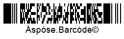
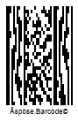
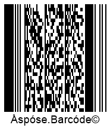
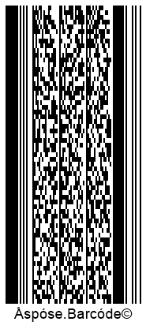

{}[Generate PDF417 Barcodes Online](https://products.aspose.app/barcode/generate/pdf417): You can test the quality of ***Aspose.BarCode*** generation for PDF417 barcodes and get the results online.{}

## **Overview**
*PDF417* is a family of 2D variable-length stacked barcode standards that enables laser scanning for documents of high quality (with the exception of *Compact PDF417*, which supports only photo scanning). The *PDF417* type provides smaller data density compared with matrix barcode types. However, it is several times larger than the data density of conventional 1D stacked barcode standards. *PDF417* barcodes can be used to encode streams of bytes or Unicode characters and contain recovery data required for Reed-Solomon error correction.  
  
One of the main specificities of *PDF417* types is that they support the special format of encoding metadata. This allows dividing a single document into several parts marked with barcode labels indicating file name, creation date, checksum control, and some other additional information. Thereafter, these parts can be transmitted one by one and reassembled together according to barcode markers. Adding metadata to barcodes occupies extra barcode capacity.  
  
The *PDF417* layout configuration is composed of multiple rows and columns. Basic *PDF417* can be used to encode at most 1,850 alphanumeric characters or 2,710 numerical digits or 1,108 bytes with the maximal configuration including 90 rows and 30 columns. In turn, the *Micro PDF417* type can encode up to 266 alphanumeric characters or 366 numerical digits or 150 bytes with the maximal configuration of 44 rows and 4 columns.  
  
|
**PDF417 Standard**
|
**Description**
|
|---|---|
|[**Basic PDF417**](#pdf417)|Can be used to work with documents of any quality and supports laser scanning|
|[**Micro PDF417**](#micropdf417)|Allows minimizing the barcode area and can be used as an add-on for GS1 composite symbologies or applied to high-quality documents|
|[**Macro PDF417**](#macropdf417)|Provides increased encoding capacity and supports metainformation|
|[**Compact PDF417**](#compactpdf417)|Supports optional metainformation and can be useful in cases of limited printing space. It suggests omitting the right-side block of metadata and removing the stop pattern is removed. Laser scanning is not supported; only photo scanning is available. It is applicable to high-quality documents only|
  
{}*If you need any clarifications, feel free to reach out [Aspose Technical Support](/barcode/java/technical-support/): ask your questions at [Aspose.Barcode Forum](https://forum.aspose.com/c/barcode/13) or contact [Aspose Paid Support Helpdesk](https://helpdesk.aspose.com/).*{}

## **Basic PDF417 and Macro PDF417 Types**
*Basic PDF417* and *Macro PDF417* support the following configuration: from 1 to 30 columns to encode information; 2 columns to store metainformation (i.e. row indicator, layout information); start and stop patterns. It is possible to add from 3 to 90 rows. The key difference between *Basic PDF417* and *Macro PDF417* is that the latter supports metadata.
  

  

  
<!--The following code sample shows how to create *Basic PDF417* barcodes.
  

            BarcodeGenerator gen = new BarcodeGenerator(EncodeTypes.Pdf417, "Åspóse.Barcóde©");
            gen.Parameters.Barcode.XDimension.Pixels = 2;
            gen.Parameters.Barcode.Pdf417.Columns = 3;
            gen.Save($"{path}Pdf417Basic.png", BarCodeImageFormat.Png);
-->

## **Micro PDF417 Symbology**
The layout of *Micro PDF417* supports adding from 4 to 44 rows and from 1 to 4 columns. Layout options are strictly predefined in terms of maximum and minimum numbers of rows and columns, as well as error correction codewords. Moreover, barcodes include two columns with metadata. Commonly, *Micro PDF417* is suggested for use in high-quality documents to ensure correct recognition. However, this type supports laser scanning. 

  

<!--The following code snippet demonstrates how to generate *Micro PDF417* barcodes.
  

BarcodeGenerator gen = new BarcodeGenerator(EncodeTypes.MicroPdf417, "Åspóse.Barcóde©");
gen.Parameters.Barcode.XDimension.Pixels = 2;
gen.Parameters.Barcode.Pdf417.Columns = 4;
gen.Save($"{path}MicroPdf417Basic.png", BarCodeImageFormat.Png);
-->

## **Compact PDF417 Symbology**
*Compact PDF417* has a specification like *Basic PDF417* and *Macro PDF417*. The difference is that in *Compact PDF417* barcodes, the right-side metainformation column and the corresponding stop pattern are eliminated to decrease barcode size. This is the only barcode type in the *PDF417* family that does not support laser scanning. It should be also noted that reading low-quality barcode images may have issues due to the lack of metainformation redundancy. To enable the *Compact PDF417* mode, developers can use the *setPdf417Truncate* method of class [*Pdf417Parameters*](https://reference.aspose.com/barcode/java/com.aspose.barcode.generation/Pdf417Parameters).
  

  

<!--The following code sample shows how to create *Compact PDF417* barcodes.
  

BarcodeGenerator gen = new BarcodeGenerator(EncodeTypes.Pdf417, "Åspóse.Barcóde©");
gen.Parameters.Barcode.XDimension.Pixels = 2;
gen.Parameters.Barcode.Pdf417.Columns = 3;
//set Pdf417 truncated or Compact Pdf417
gen.Parameters.Barcode.Pdf417.Pdf417Truncate = true;
gen.Save($"{path}CompactPdf417Basic.png", BarCodeImageFormat.Png);
-->

## **PDF417 Encoding Modes**
To enable the required encoding mode for *PDF417* generation, it is necessary to call the *setPdf417CompactionMode* method of class [*Pdf417Parameters*](https://reference.aspose.com/barcode/java/com.aspose.barcode.generation/Pdf417Parameters) that is intended to manage data compaction regimes. Two other methods, i.e. *setPdf417ECIEncoding* and *setCodeTextEncoding*, can be used to enable encoding modes suitable for Unicode symbols. In this article, it is described how to work with different encoding modes.

### **ECI Encoding Mode**
The *setPdf417ECIEncoding* method can be used to encode Unicode symbols to streams of bytes. Moreover, it allows determining an ECI identifier for the present encoding that can be detected and interpreted by decoders. When this method is called passing any value from the [*ECIEncodings*](https://reference.aspose.com/barcode/java/com.aspose.barcode.generation/ECIEncodings) enum besides *ECIEncodings.NONE*, information is processed using the determined ECI encoding. At present, ***Aspose.BarCode*** supports all widely used charset encodings included in the [*ECIEncodings*](https://reference.aspose.com/barcode/java/com.aspose.barcode.generation/ECIEncodings) enumeration.  
  
<!--The following code snippet shows how to enable the *ECI Encoding* mode.
  

Console.OutputEncoding = Encoding.Unicode;
BarcodeGenerator gen = new BarcodeGenerator(EncodeTypes.Pdf417, "Aspose常に先を行く");
gen.Parameters.Barcode.XDimension.Pixels = 2;
gen.Parameters.Barcode.Pdf417.Columns = 3;
//set UTF8 ECI encoding
gen.Parameters.Barcode.Pdf417.Pdf417ECIEncoding = ECIEncodings.UTF8;
gen.Save($"{path}Pdf417ECIEncoding.png", BarCodeImageFormat.Png);
//attempt to recognize it
BarCodeReader read = new BarCodeReader(gen.GenerateBarCodeImage(), DecodeType.Pdf417);
foreach (BarCodeResult result in read.ReadBarCodes())
    Console.WriteLine("Pdf417ECIEncoding:" + result.CodeText);
-->
  

  
### **Compaction Mode**
Developers can enable the desired data compaction mode through the *setPdf417CompactionMode* method passing the value from the [*Pdf417CompactionMode*](https://reference.aspose.com/barcode/java/com.aspose.barcode.generation/Pdf417CompactionMode) enum.
  
|
**Compaction Mode**
|
**Description**
|
|---|---|
|**AUTO**|Automatically selects the data compaction mode with the highest data density. If barcode data contains a digit greater than 255, data compaction is performed with the specified encoding|
|**BINARY**|Encodes binary streams of bytes comprising digits from 0 to 255. If barcode data has a digit greater than 255, data compaction is conducted using the specified encoding|
|**NUMERIC**|Legacy mode for numerical digits. Using the *AUTO* mode is recommended|
|**TEXT**|Legacy mode for alphanumeric characters. Using the *Auto* mode is recommended|

Following barcodes have been created applying various compaction modes.
  
|
**Compaction Mode**
|
***AUTO***
|
***BINARY***
|
***TEXT***
|
***NUMERIC***
|
| :-: | :-: | :-: | :-: | :-: |
| |||||
  
<!--The following code sample shows how to manage data compaction modes.


            BarcodeGenerator gen = new BarcodeGenerator(EncodeTypes.Pdf417, "");
            gen.Parameters.Barcode.XDimension.Pixels = 2;
            gen.Parameters.Barcode.Pdf417.Columns = 3;
            //Set compaction mode to Auto
            gen.Parameters.Barcode.Pdf417.Pdf417CompactionMode = Pdf417CompactionMode.Auto;
            gen.CodeText = "Åspóse.Barcóde©";
            gen.Save($"{path}Pdf417CompactionAuto.png", BarCodeImageFormat.Png);
            //Set compaction mode to Binary
            gen.Parameters.Barcode.Pdf417.Pdf417CompactionMode = Pdf417CompactionMode.Binary;
            gen.CodeText = "Åspóse.Barcóde©";
            gen.Save($"{path}Pdf417CompactionBinary.png", BarCodeImageFormat.Png);
            //Set compaction mode to Text
            gen.Parameters.Barcode.Pdf417.Pdf417CompactionMode = Pdf417CompactionMode.Text;
            gen.CodeText = "ASPOSE";
            gen.Save($"{path}Pdf417CompactionText.png", BarCodeImageFormat.Png);
            //Set compaction mode to Numeric
            gen.Parameters.Barcode.Pdf417.Pdf417CompactionMode = Pdf417CompactionMode.Numeric;
            gen.CodeText = "1234567890";
            gen.Save($"{path}Pdf417CompactionNumeric.png", BarCodeImageFormat.Png);
-->
    
### **Unicode Encoding Mode**
The *setCodeTextEncoding* method can be used to encode Unicode characters. 
<!--The following code snippet explains how to enable the *BINARY* compaction mode.
  

            Console.OutputEncoding = Encoding.Unicode;
            BarcodeGenerator gen = new BarcodeGenerator(EncodeTypes.Pdf417, "Aspose常に先を行く");
            gen.Parameters.Barcode.XDimension.Pixels = 2;
            gen.Parameters.Barcode.Pdf417.Columns = 3;
            //set UTF8 encoding
            gen.Parameters.Barcode.Pdf417.CodeTextEncoding = Encoding.UTF8;
            gen.Save($"{path}Pdf417CodeTextEncoding.png", BarCodeImageFormat.Png);
            //attempt to recognize it
            BarCodeReader read = new BarCodeReader(gen.GenerateBarCodeImage(), DecodeType.Pdf417);
            foreach (BarCodeResult result in read.ReadBarCodes())
                Console.WriteLine("Pdf417CodeTextEncoding:" + result.GetCodeText(Encoding.UTF8));
-->
  

  
### **Encoding Streams of Bytes in Binary Mode**
Developers can encode and transmit an array of bytes through the *BINARY* mode that can be enabled through the *setPdf417CompactionMode* method of class [*Pdf417Parameters*](https://reference.aspose.com/barcode/java/com.aspose.barcode.generation/Pdf417Parameters). To show the text line under a barcode, it is possible to call the *setTwoDDisplayText* method. 
<!--The following code sample explains how to encode a stream of bytes using the *BINARY* mode.
  

byte[] encodedArr = { 0xFF, 0xFE, 0xFD, 0xFC, 0xFB, 0xFA, 0xF9 };

//encode array to string
StringBuilder strBld = new StringBuilder();
foreach (byte bval in encodedArr)
    strBld.Append((char)bval);

//encode in Pdf417 code
BarcodeGenerator gen = new BarcodeGenerator(EncodeTypes.Pdf417, strBld.ToString());
gen.Parameters.Barcode.XDimension.Pixels = 2;
//set encode mode to Binary
gen.Parameters.Barcode.Pdf417.Pdf417CompactionMode = Pdf417CompactionMode.Binary;
gen.Parameters.Barcode.CodeTextParameters.TwoDDisplayText = "Bytes mode";
gen.Save($"{path}Pdf417BytesEncoding.png", BarCodeImageFormat.Png);

//attempt to recognize
BarCodeReader read = new BarCodeReader(gen.GenerateBarCodeImage(), DecodeType.Pdf417);
foreach (BarCodeResult result in read.ReadBarCodes())
    Console.WriteLine("Pdf417BytesEncoding:" + BitConverter.ToString(result.CodeBytes));
-->
  

  
## **Layout Configuration Settings**
Developers can define the required layout configuration for *PDF417* generation using dedicated methods of class [*Pdf417Parameters*](https://reference.aspose.com/barcode/java/com.aspose.barcode.generation/Pdf417Parameters), i.e. *setRows* and *setColumns*. All *PDF417* standards besides *Micro PDF417* may have the following configuration settings: from 1 to 30 columns and from 3 to 90 rows. The number of rows and columns can be defined separately. The layout of *Micro PDF417* allows adding from 1 to 4 columns.  
  
Following *PDF417* barcodes have different layout configurations.

|
**Layout Configuration**
|
**2 Columns**
|
**6 Rows**
|
**9 Rows and 6 Columns**
|
| :-: | :-: | :-: | :-: |
| ||||
  
<!--Following code snippets demonstrate how to manage layout settings for *PDF417* and *Micro PDF417* barcodes.
  
**Basic PDF417**  
  

BarcodeGenerator gen = new BarcodeGenerator(EncodeTypes.Pdf417, "Åspóse.Barcóde©");
gen.Parameters.Barcode.XDimension.Pixels = 2;
//set 4 columns
gen.Parameters.Barcode.Pdf417.Columns = 4;
gen.Save($"{path}MicroPdf417Columns4.png", BarCodeImageFormat.Png);

  
**Micro PDF417**


BarcodeGenerator gen = new BarcodeGenerator(EncodeTypes.Pdf417, "Åspóse.Barcóde©");
gen.Parameters.Barcode.XDimension.Pixels = 2;
//set 4 columns
gen.Parameters.Barcode.Pdf417.Columns = 4;
gen.Save($"{path}MicroPdf417Columns4.png", BarCodeImageFormat.Png);
-->

## **Managing Error Correction Level**
The *PDF417* barcode family supports Reed-Solomon error correction to provide data recovery and integrity check. *Micro PDF417* enables determining the size of redundant recovery data automatically. Other *PDF417* standards allow customizing the error correction level through the *setPdf417ErrorLevel* method of class [*Pdf417Parameters*](https://reference.aspose.com/barcode/java/com.aspose.barcode.generation/Pdf417Parameters). Each additional pair of error correction codewords serves to recover one unknown error or two known missing digits. A higher error correction level requires storing more codewords and enables more efficient data recovery for damaged barcodes. The maximal level of error correction, i.e. *Level8*, means that 265 errors can be corrected. However, data encoding capacity will decrease by 614 bytes. Available error correction levels are represented in the following table.  
  
|
**Eroor Correction Level**
|
**Number of Codewords**
|
**Error Correction Level**
|
**Number of Codewords**
|
| :-: | :-: | :-: | :-: |
|**Level 0**|2 codewords|**Level 5**|64 codewords|
|**Level 1**|4 codewords|**Level 6**|128 codewords|
|**Level 2**|8 codewords|**Level 7**|256 codewords|
|**Level 3**|16 codewords|**Level 8**|512 codewords|
|**Level 4**|32 codewords| |
  
Following *PDF417* barcodes have different error correction levels.  
  
|
**Error Correction Level**
|
**Is Set to 2**
|
**Is Set to 5**
|
| :-: | :-: | :-: |
| |||
  
<!--The following code snippet shows how to customize error correction levels for *PDF417* barcodes.
  

BarcodeGenerator gen = new BarcodeGenerator(EncodeTypes.Pdf417, "Åspóse.Barcóde©");
gen.Parameters.Barcode.XDimension.Pixels = 2;
gen.Parameters.Barcode.Pdf417.Columns = 3;
//set error level 2
gen.Parameters.Barcode.Pdf417.Pdf417ErrorLevel = Pdf417ErrorLevel.Level2;
gen.Save($"{path}Pdf417ErrorLevel2.png", BarCodeImageFormat.Png);
//set error level 5
gen.Parameters.Barcode.Pdf417.Pdf417ErrorLevel = Pdf417ErrorLevel.Level5;
gen.Save($"{path}Pdf417ErrorLevel5.png", BarCodeImageFormat.Png);
-->
  
## **Aspect Ratio Settings**
In ***Aspose.BarCode for Java***, *Aspect Ratio* is one of the main parameters used to manage barcode proportions along X and Y coordinates. *Aspect Ratio* can be determined as the ratio between barcode height and width or as the relative coefficient to the *XDimension* value. Its value can be modified through the *setAspectRatio* method of class [*Pdf417Parameters*](https://reference.aspose.com/barcode/java/com.aspose.barcode.generation/Pdf417Parameters). To generate *PDF417* barcodes, it is recommended to select the value of *AspectRatio* between 3 and 5.

Following *PDF417* barcodes have been generated with different aspect ratio values.  
  
|
**Aspect Ratio**
|
**Is Set to 2**
|
**Is Set to 5**
|
| :-: | :-: | :-: |
| |||
  
<!--The following code sample explains how to adjust the value of *Aspect Ratio* for *PDF417* barcodes.
  

            BarcodeGenerator gen = new BarcodeGenerator(EncodeTypes.Pdf417, "Åspóse.Barcóde©");
            gen.Parameters.Barcode.XDimension.Pixels = 2;
            gen.Parameters.Barcode.Pdf417.Columns = 3;
            //set aspect ratio to 2
            gen.Parameters.Barcode.Pdf417.AspectRatio = 2;
            gen.Save($"{path}Pdf417AspectRatio2.png", BarCodeImageFormat.Png);
            //set aspect ratio to 5
            gen.Parameters.Barcode.Pdf417.AspectRatio = 5;
            gen.Save($"{path}Pdf417AspectRatio5.png", BarCodeImageFormat.Png);
-->
  
## **Working withPDF417 Metadata**
*Micro PDF417* and *Macro PDF417* allow adding special metainformation about barcode data. Such metadata can be encoded together with main barcode information sharing the same blocks of data. It is possible to classify barcode metadata into permanent data and optional data as clarified further. All methods mentioned below correspond to class [*Pdf417Parameters*](https://reference.aspose.com/barcode/java/com.aspose.barcode.generation/Pdf417Parameters).

### **Permanent Metadata**
Permanent metadata can be used to encode different special parameters through the methods listed below.
  
|
**Permanent Metadata Method**
|
**Description**
|
|---|---|
|*setPdf417MacroFileID*|Manually adjusted unique identifier used for a series of barcodes or a PDF417 file|
|*setPdf417MacroSegmentID*|Identifier of the current barcode segment starting from 0. It is often used together with the *setPdf417MacroSegmentsCount* method that allows setting the number of barcodes in a series|
  
<!--The following code sample explains how to encode permanent metadata in *Macro PDF417* barcodes.


Console.OutputEncoding = Encoding.Unicode;
BarcodeGenerator gen = new BarcodeGenerator(EncodeTypes.MacroPdf417, "Åspóse.Barcóde©");
gen.Parameters.Barcode.XDimension.Pixels = 2;
//set metadata
gen.Parameters.Barcode.Pdf417.Pdf417MacroFileID = 12345678;
gen.Parameters.Barcode.Pdf417.Pdf417MacroSegmentID = 12;
gen.Save($"{path}MacroPdf417Permanent.png", BarCodeImageFormat.Png);
//attempt to recognize it
BarCodeReader read = new BarCodeReader(gen.GenerateBarCodeImage(), DecodeType.MacroPdf417);
foreach (BarCodeResult result in read.ReadBarCodes())
{
    Console.WriteLine("---MacroPdf417Permanent---");
    Console.WriteLine("Codetext:" + result.CodeText);
    Console.WriteLine("Pdf417MacroFileID:" + result.Extended.Pdf417.MacroPdf417FileID);
    Console.WriteLine("Pdf417MacroSegmentID:" + result.Extended.Pdf417.MacroPdf417SegmentID.ToString());
}
-->

### **Optional Metadata**
Optional metadata are used to store information about various data properties that can be encoded through special methods described below.
  
|Optional Metadata Method|Description|
|---|---|
|*setPdf417MacroSegmentsCount*|Number of barcodes in a series|
|*setPdf417MacroFileName*|File name|
|*setPdf417MacroChecksum*|Checksum computed based on the CCITT-16 polynomial|
|*setPdf417MacroFileSize*|Overall size of bytes in a barcode series|
|*setPdf417MacroTimeStamp*|Time spent to generate/send a file|
|*setPdf417MacroAddressee*|File sender address|
|*setPdf417MacroSender*|File sender name|
  
<!--The following code snippet demonstrates how to add optional metadata to *MacroPDF417* barcodes.
  

Console.OutputEncoding = Encoding.Unicode;
BarcodeGenerator gen = new BarcodeGenerator(EncodeTypes.MacroPdf417, "Åspóse.Barcóde©");
gen.Parameters.Barcode.XDimension.Pixels = 2;
//set metadata
gen.Parameters.Barcode.Pdf417.Pdf417MacroFileID = 12345678;
gen.Parameters.Barcode.Pdf417.Pdf417MacroSegmentID = 12;
gen.Parameters.Barcode.Pdf417.Pdf417MacroSegmentsCount = 20;
gen.Parameters.Barcode.Pdf417.Pdf417MacroFileName = "file01";
//checksum must be calculated in CCITT-16 / CRC-16-CCITT encoding
//https://en.wikipedia.org/wiki/Cyclic_redundancy_check#Polynomial_representations_of_cyclic_redundancy_checks
//for the example we use random number
gen.Parameters.Barcode.Pdf417.Pdf417MacroChecksum = 1234;
gen.Parameters.Barcode.Pdf417.Pdf417MacroFileSize = 400000;
gen.Parameters.Barcode.Pdf417.Pdf417MacroTimeStamp = new DateTime(2019, 11, 1);
gen.Parameters.Barcode.Pdf417.Pdf417MacroAddressee = "street";
gen.Parameters.Barcode.Pdf417.Pdf417MacroSender = "aspose";
gen.Save($"{path}MacroPdf417Optional.png", BarCodeImageFormat.Png);
//attempt to recognize it
BarCodeReader read = new BarCodeReader(gen.GenerateBarCodeImage(), DecodeType.MacroPdf417);
foreach (BarCodeResult result in read.ReadBarCodes())
{
    Console.WriteLine("---MacroPdf417Optional---");
    Console.WriteLine("Codetext:" + result.CodeText);
    Console.WriteLine("Pdf417MacroFileID:" + result.Extended.Pdf417.MacroPdf417FileID);
    Console.WriteLine("Pdf417MacroSegmentID:" + result.Extended.Pdf417.MacroPdf417SegmentID.ToString());
    Console.WriteLine("Pdf417MacroSegmentsCount:" + result.Extended.Pdf417.MacroPdf417SegmentsCount.ToString());
    Console.WriteLine("Pdf417MacroFileName:" + result.Extended.Pdf417.MacroPdf417FileName);
    Console.WriteLine("Pdf417MacroChecksum:" + result.Extended.Pdf417.MacroPdf417Checksum.ToString());
    Console.WriteLine("Pdf417MacroFileSize:" + result.Extended.Pdf417.MacroPdf417FileSize.ToString());
    Console.WriteLine("Pdf417MacroTimeStamp:" + result.Extended.Pdf417.MacroPdf417TimeStamp.ToString());
    Console.WriteLine("Pdf417MacroAddressee:" + result.Extended.Pdf417.MacroPdf417Addressee);
    Console.WriteLine("Pdf417MacroSender:" + result.Extended.Pdf417.MacroPdf417Sender);
}
-->
  

  
### **Unicode Metadata**
In ***Aspose.BarCode for Java***, developers can re-encode optional metadata using the Unicode encoding through the *setPdf417MacroECIEncoding* method of class [*Pdf417Parameters*](https://reference.aspose.com/barcode/java/com.aspose.barcode.generation/Pdf417Parameters). This method is intended to perform the conversion of metadata and send it along with the related encoding identifier. 
<!--The following code snippet shows how to encode metadata using the UTF8 encoding in *Macro PDF417* barcodes.
  

Console.OutputEncoding = Encoding.Unicode;
BarcodeGenerator gen = new BarcodeGenerator(EncodeTypes.MacroPdf417, "Åspóse.Barcóde©");
gen.Parameters.Barcode.XDimension.Pixels = 2;
//set metadata
gen.Parameters.Barcode.Pdf417.Pdf417MacroFileID = 12345678;
gen.Parameters.Barcode.Pdf417.Pdf417MacroSegmentID = 12;
gen.Parameters.Barcode.Pdf417.Pdf417MacroFileName = "伍01";
gen.Parameters.Barcode.Pdf417.Pdf417MacroAddressee = "街";
gen.Parameters.Barcode.Pdf417.Pdf417MacroSender = "компания";
//set metadata ECI UTF8
gen.Parameters.Barcode.Pdf417.Pdf417MacroECIEncoding = ECIEncodings.UTF8;
gen.Save($"{path}MacroPdf417ECIEncoding.png", BarCodeImageFormat.Png);
//attempt to recognize it
BarCodeReader read = new BarCodeReader(gen.GenerateBarCodeImage(), DecodeType.MacroPdf417);
foreach (BarCodeResult result in read.ReadBarCodes())
{
    Console.WriteLine("---MacroPdf417ECIEncoding---");
    Console.WriteLine("Codetext:" + result.CodeText);
    Console.WriteLine("Pdf417MacroFileID:" + result.Extended.Pdf417.MacroPdf417FileID);
    Console.WriteLine("Pdf417MacroSegmentID:" + result.Extended.Pdf417.MacroPdf417SegmentID.ToString());
    Console.WriteLine("Pdf417MacroFileName:" + result.Extended.Pdf417.MacroPdf417FileName);
    Console.WriteLine("Pdf417MacroAddressee:" + result.Extended.Pdf417.MacroPdf417Addressee);
    Console.WriteLine("Pdf417MacroSender:" + result.Extended.Pdf417.MacroPdf417Sender);
}
-->
  

  
## **Setting Special Parameters**
In ***Aspose.BarCode for Java***, developers can encode specific control parameters for *PDF417* barcodes, i.e. hardware reader initialization and emulation for the *Code 128* symbology. 

### **Hardware Reader Initialization**
***Aspose.BarCode for Java*** provides the *setReaderInitialization* method of class [*Pdf417Parameters*](https://reference.aspose.com/barcode/java/com.aspose.barcode.generation/Pdf417Parameters) that allows encoding the special flag used to indicate that barcode data will serve for hardware reader initialization. 
<!--The following code snippet shows how to enable this flag.
  

BarcodeGenerator gen = new BarcodeGenerator(EncodeTypes.Pdf417, "Aspose");
gen.Parameters.Barcode.XDimension.Pixels = 2;
gen.Parameters.Barcode.Pdf417.Columns = 3;
//set flag that indicates that data is encoded for reader initialization
gen.Parameters.Barcode.Pdf417.IsReaderInitialization = true;
gen.Save($"{path}Pdf417ReaderInitialization.png", BarCodeImageFormat.Png);
-->

### ***Code 128* Emulation**
In some cases, it may be necessary to make hardware readers emulate information encoded in *Micro PDF417* barcodes in the format of *Code 128* barcode data. This can be done by calling the *setCode128Emulation* method of class [*Pdf417Parameters*](https://reference.aspose.com/barcode/java/com.aspose.barcode.generation/Pdf417Parameters) and passing the required value from the [*Code128Emulation*](https://reference.aspose.com/barcode/java/com.aspose.barcode.generation/Code128Emulation) enum. This method is applicable to *Micro PDF417* barcodes only. 
<!--The following code sample shows how to enable *Code 128* emulation.
  

            BarcodeGenerator gen = new BarcodeGenerator(EncodeTypes.Pdf417, "Aspose");
            gen.Parameters.Barcode.XDimension.Pixels = 2;
            gen.Parameters.Barcode.Pdf417.Columns = 3;
            //set flag that encoded data must be decoded as Code 128
            gen.Parameters.Barcode.Pdf417.Code128Emulation = Code128Emulation.Code903;
            gen.Save($"{path}Pdf417Code128Emulation.png", BarCodeImageFormat.Png);
-->

