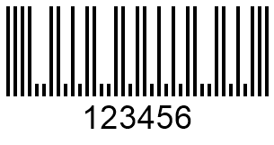
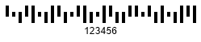
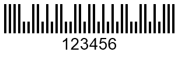
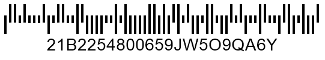

## **Overview**
Postal barcode types have been introduced to address some problems of 1D barcode types to facilitate postal operations. Such barcode types suggest encoding input information by altering the height of bars and not the width of bars and spaces as in 1D standards. Postal barcode standards usually ignore horizontal parameters to mitigate the risk of false-positive barcode detection.  
  
Many countries use their own barcode specifications for postal services. Generally, such barcode types are similar to each other in terms of design with some minor distinctions. Postal barcode standards can be classified into two main groups: two-state ones that can encode only numerical characters and four-state ones that allow encoding both numerical digits and uppercase English characters.  
  
***Aspose.BarCode for Java*** can be used to create and read various two- and four-state postal standards, i.e. *RM4SCC*, *Postnet*, *Planet*, *Dutch KIX*, *Australia Post*, *OneCode*, and *Mailmark*. Further, this article describes how to work with postal symbologies using the *Aspose.BarCode* library functional.
  
{}*If you need any clarifications, feel free to reach out [Aspose Technical Support](/barcode/java/technical-support/): ask your questions at [Aspose.Barcode Forum](https://forum.aspose.com/c/barcode/13) or contact Aspose [Paid Support Helpdesk](https://helpdesk.aspose.com/).*{}

## **Barcode Height Settings**
By default, ***Aspose.BarCode for Java*** enables automatic calculation of bar height and width for postal barcode standards depending on the *XDimension* value. It also enables manually customizing bar height regardless of barcode width through the *setBarHeight* method of class [*BarcodeParameters*](https://reference.aspose.com/barcode/java/com.aspose.barcode.generation/BarcodeParameters).  
  
Following *Planet* and *RM4SCC* barcode images have been created with varying bar height settings.  
  
|Barcode Height Settings for **Planet**| | |
|---| :-: | :-: |
|
**Bar Height**
|
**Is Set to None**
|
**Is Set to 100 Pixels**
|
| |||
  
|Barcode Height Settings for **RM4SCC**| | |
|---| :-: | :-: |
|
**Bar Height**
|
**Is Set to None**
|
**Is Set to 100 Pixels**
|
| |||
  
<!--The following code snippet explains how to adjust bar height in *Planet* and *RM4SCC* barcodes.
  

BarcodeGenerator gen = null;
//set Planet barcode BarHeight none
gen = new BarcodeGenerator(EncodeTypes.Planet, "123456");
gen.Parameters.Barcode.XDimension.Pixels = 4;
gen.Save($"{path}PostalPlanetBarHeightNone.png", BarCodeImageFormat.Png);
//set RM4SCC barcode BarHeight none
gen = new BarcodeGenerator(EncodeTypes.RM4SCC, "123456");
gen.Parameters.Barcode.XDimension.Pixels = 4;
gen.Save($"{path}PostalRM4SCCBarHeightNone.png", BarCodeImageFormat.Png);
//set Planet barcode BarHeight 100 pixels
gen = new BarcodeGenerator(EncodeTypes.Planet, "123456");
gen.Parameters.Barcode.XDimension.Pixels = 4;
gen.Parameters.Barcode.BarHeight.Pixels = 100;
gen.Save($"{path}PostalPlanetBarHeight100Pixels.png", BarCodeImageFormat.Png);
//set RM4SCC barcode BarHeight 100 pixels
gen = new BarcodeGenerator(EncodeTypes.RM4SCC, "123456");
gen.Parameters.Barcode.XDimension.Pixels = 4;
gen.Parameters.Barcode.BarHeight.Pixels = 100;
gen.Save($"{path}PostalRM4SCCBarHeight100Pixels.png", BarCodeImageFormat.Png);
-->

## **Bar Filling Settings**
***Aspose.BarCode for Java*** enables adjusting the appearance of postal barcode images in terms of setting full or empty filling for bars. Developers can generate postal barcodes with empty bars using the *setFilledBars* method of class [*BarcodeParameters*](https://reference.aspose.com/barcode/java/com.aspose.barcode.generation/BarcodeParameters). The default value of this parameter is *True*, meaning that the generated postal barcode image will have fully colored bars.  
  
Following *Planet* and *RM4SCC* barcode images have been generated using different bar filling settings.
  
|Bar Filling for **Planet** Barcodes| | |
|---| :-: | :-: |
|**Bar Filling Settings**|**Filled Bars**|**Empty Bars**|
| |||
  
|Bar Filling for **RM4SCC** Barcodes| | |
|---| :-: | :-: |
|**Bar Filling Settings**|**Filled Bars**|**Empty Bars**|
| |||
  
<!--The following code snippet shows how to customize the bar filling parameter for *Planet* and *RM4SCC* barcodes.
  

BarcodeGenerator gen = null;
//generate a Planet barcode with filled bars
gen = new BarcodeGenerator(EncodeTypes.Planet, "123456");
gen.Parameters.Barcode.XDimension.Pixels = 4;
gen.Save($"{path}PostalPlanetFilledBars.png", BarCodeImageFormat.Png);
//generate an RM4SCC barcode with filled bars
gen = new BarcodeGenerator(EncodeTypes.RM4SCC, "123456");
gen.Parameters.Barcode.XDimension.Pixels = 4;
gen.Save($"{path}PostalRM4SCCFilledBars.png", BarCodeImageFormat.Png);
//generate a Planet barcode with empty bars
gen = new BarcodeGenerator(EncodeTypes.Planet, "123456");
gen.Parameters.Barcode.XDimension.Pixels = 4;
gen.Parameters.Barcode.FilledBars = false;
gen.Save($"{path}PostalPlanetEmptyBars.png", BarCodeImageFormat.Png);
//generate an RM4SCC barcode with empty bars
gen = new BarcodeGenerator(EncodeTypes.RM4SCC, "123456");
gen.Parameters.Barcode.XDimension.Pixels = 4;
gen.Parameters.Barcode.FilledBars = false;
gen.Save($"{path}PostalRM4SCCEmptyBars.png", BarCodeImageFormat.Png);
-->
  
## **2-State Postal Standard**
In ***Aspose.BarCode for Java***, developers can generate barcodes using various two-state postal symbologies, i.e. *Postnet* and *Planet*. These barcode standards allow encoding only numerical characters and require obligatory checksum controls. Code snippets and sample barcode images provided further demonstrate how to create postal barcodes of *Planet* and *Postnet* types.  

### **Planet Symbology**
The *Planet* symbology suggests encoding each character in five bars. Among them, three bars are full-length, and two bars are half-length.  
<!--The following code sample explains how to create *Planet* barcodes.
  

BarcodeGenerator gen = new BarcodeGenerator(EncodeTypes.Planet, "123456");
gen.Parameters.Barcode.XDimension.Pixels = 4;
gen.Parameters.Barcode.BarHeight.Pixels = 50;
gen.Parameters.Barcode.Postal.PostalShortBarHeight.Pixels = 20;
gen.Save($"{path}PostalPlanetBarcode.png", BarCodeImageFormat.Png);
-->
  

 
  
### **Postnet Symbology**
The *Postnet* symbology encodes each digit in five bars so that three bars are full-length and two bars are half-length.  
<!--The following code snippet demonstrates how to generate *Postnet* barcodes.


BarcodeGenerator gen = new BarcodeGenerator(EncodeTypes.Postnet, "123456");
gen.Parameters.Barcode.XDimension.Pixels = 4;
gen.Parameters.Barcode.BarHeight.Pixels = 50;
gen.Parameters.Barcode.Postal.PostalShortBarHeight.Pixels = 20;
gen.Save($"{path}PostalPostnetBarcode.png", BarCodeImageFormat.Png);
-->
  

## **Generation Specifics for 2-State Barcodes**
The ***Aspose.BarCode*** library has several specificities in the way of working with two-state postal barcodes. They are associated with handling invalid barcode text and changing bar length. These special cases are outlined further.

### **Incorrect Input Text Handling**
When invalid barcode text is passed to the *setCodeText* method (in the case of *Postnet* and *Planet*, this means entering any characters besides numerical digits), the default approach implemented in class [*BarcodeGenerator*](https://reference.aspose.com/barcode/java/com.aspose.barcode.generation/BarcodeGenerator) implies the necessity to filter out erroneous symbols that do not comply with the specification and then to generate a barcode image encoding suitable characters only. If developers need to establish special controls for such situations, they can request throwing an exception upon entering invalid characters through the *setCodeText* method. In this case, it is necessary to call the *setThrowExceptionWhenCodeTextIncorrect* method of class [*BarcodeParameters*](https://reference.aspose.com/barcode/java/com.aspose.barcode.generation/BarcodeParameters) passing *True*<!-- as shown in the following code sample-->.

<!--
BarcodeGenerator gen = null;
gen = new BarcodeGenerator(EncodeTypes.Planet, "1234567WRONG");
gen.Parameters.Barcode.ThrowExceptionWhenCodeTextIncorrect = true;
try
{
    gen.GenerateBarCodeImage();
}
catch (Exception e)
{
    Console.WriteLine(e.Message);
}
gen = new BarcodeGenerator(EncodeTypes.Postnet, "1234567WRONG");
gen.Parameters.Barcode.ThrowExceptionWhenCodeTextIncorrect = true;
try
{
    gen.GenerateBarCodeImage();
}
catch (Exception e)
{
    Console.WriteLine(e.Message);
}
-->

### **Short Bar Height Settings**
By design, two-state postal barcodes contain long and short bars in such a way that the shorter bars are half-length with respect to the longer bars. ***Aspose.BarCode for Java*** allows modifying bar height for short bars manually. To do this, the *setPostalShortBarHeight* method of class [*PostalParameters*](https://reference.aspose.com/barcode/java/com.aspose.barcode.generation/PostalParameters) needs to be used.  
  
Following barcode images have been created with varying short bar heights.
  
|Short Bar Height|Is Set to 10 Pixels|Is Set to 30 Pixels|
| :-: | :-: | :-: |  
| |||
  
<!--The following code sample explains how to adjust short bar height in two-state postal barcodes.


BarcodeGenerator gen = null;
//set Planet barcode ShortBarHeight 10 pixels
gen = new BarcodeGenerator(EncodeTypes.Planet, "123456");
gen.Parameters.Barcode.XDimension.Pixels = 4;
gen.Parameters.Barcode.BarHeight.Pixels = 50;
gen.Parameters.Barcode.Postal.PostalShortBarHeight.Pixels = 10;
gen.Save($"{path}PostalPlanetShortBarHeight10Pixels.png", BarCodeImageFormat.Png);
//set Planet barcode ShortBarHeight 30 pixels
gen = new BarcodeGenerator(EncodeTypes.Planet, "123456");
gen.Parameters.Barcode.XDimension.Pixels = 4;
gen.Parameters.Barcode.BarHeight.Pixels = 50;
gen.Parameters.Barcode.Postal.PostalShortBarHeight.Pixels = 30;
gen.Save($"{path}PostalPlanetShortBarHeight30Pixels.png", BarCodeImageFormat.Png);
-->
   
## **4-State Postal Standards**
***Aspose.BarCode for Java*** enables generating and reading several four-state postal barcode standards, including *RM4SCC*, *Dutch KIX*, *OneCode*, *Australia Post*, and *Mailmark*. By design, four-state barcode types use four different bar types to encode data: tracker (T), descender (D), ascender (A), and full (F). Therefore, each symbol is encoded in four bars meaning that two bits are encoded in one character. In general, four-state symbologies are designed as variations of the *RM4SCC* standard and support encoding numerical characters and uppercase English letters. All aforementioned four-state barcode types except *Dutch KIX* contain checksum controls. In addition, *Mailmark* and *Australia Post* support Reed-Solomon error correction to enable data recovery. 

### **RM4SCC Symbology**
The *RM4SCC* symbology can be used to encode numerical characters and uppercase English letters. In this barcode standard, each symbol in a barcode is encoded in four bars among which two bars are enlarged upwards and the other two bars - downwards. Using supported combinations of bars with different lengths, it is possible to encode up to 36 characters, i.e. 10 digits and 26 letters. *RM4SCC* contains obligatory checksum controls using the modulo 6 algorithm.
   

  
<!--The following code sample shows how to generate *RM4SCC* barcodes.
  

BarcodeGenerator gen = new BarcodeGenerator(EncodeTypes.RM4SCC, "123456ASPOSE");
gen.Parameters.Barcode.XDimension.Pixels = 4;
gen.Parameters.Barcode.BarHeight.Pixels = 50;
gen.Save($"{path}PostalRM4SCCBarcode.png", BarCodeImageFormat.Png);
-->

### **Dutch KIX Symbology**
The Royal Dutch TPG Post of Netherlands uses the *Dutch KIX* barcode standard to facilitate automatic sorting of mails and process postal codes. It is similar to the RM4SCC symbology and allows encoding numerical digits and uppercase English letters. By design, it does not require checksum controls and does not contain start and stop symbols.
  

  
<!--The following code snippet shows how to create *Dutch KIX* barcodes.
  

BarcodeGenerator gen = new BarcodeGenerator(EncodeTypes.DutchKIX, "123456ASPOSE");
gen.Parameters.Barcode.XDimension.Pixels = 4;
gen.Parameters.Barcode.BarHeight.Pixels = 50;
gen.Save($"{path}PostalDutchKIXBarcode.png", BarCodeImageFormat.Png);
-->
  
### **OneCode Symbology**
The *OneCode* postal symbology allows encoding fixed-length sets of numerical characters, i.e. 20, 25, 29, or 31 digits. It supports eleven-bit cyclic redundancy verification to detect errors but does not include an error correction mechanism.  
  
|
**Number of Digits**
|
**20 Digits**
|
**25 Digits**
|
**29 Digits**
|
**31 Digits**
|
| :-: | :-: | :-: | :-: | :-: |  
| |||||
  
<!--The following code sample explains how to generate *OneCode* barcodes.
    

BarcodeGenerator gen = null;
//create OneCode with 20 digits
gen = new BarcodeGenerator(EncodeTypes.OneCode, "12345678901234567890");
gen.Parameters.Barcode.XDimension.Pixels = 4;
gen.Parameters.Barcode.BarHeight.Pixels = 50;
gen.Save($"{path}PostalOneCodeBarcode20Digits.png", BarCodeImageFormat.Png);
//create OneCode with 25 digits
gen = new BarcodeGenerator(EncodeTypes.OneCode, "1234567890123456789012345");
gen.Parameters.Barcode.XDimension.Pixels = 4;
gen.Parameters.Barcode.BarHeight.Pixels = 50;
gen.Save($"{path}PostalOneCodeBarcode25Digits.png", BarCodeImageFormat.Png);
//create OneCode with 29 digits
gen = new BarcodeGenerator(EncodeTypes.OneCode, "12345678901234567890123456789");
gen.Parameters.Barcode.XDimension.Pixels = 4;
gen.Parameters.Barcode.BarHeight.Pixels = 50;
gen.Save($"{path}PostalOneCodeBarcode29Digits.png", BarCodeImageFormat.Png);
//create OneCode with 31 digits
gen = new BarcodeGenerator(EncodeTypes.OneCode, "1234567890123456789012345678901");
gen.Parameters.Barcode.XDimension.Pixels = 4;
gen.Parameters.Barcode.BarHeight.Pixels = 50;
gen.Save($"{path}PostalOneCodeBarcode31Digits.png", BarCodeImageFormat.Png);
-->

### **Australia Post Symbology**
The *Australia Post* postal type uses special two-digit format control code (FCC) fields and eight-digit sorting code (SC) fields to generate barcodes. FCC fields are intended to determine one of three supported subtypes that have various fixed lengths, i.e. 37, 52, or 67 bars. Moreover, barcodes may include a customer information (CI) field to specify one of the available encoding types (numerical or alphanumeric characters). These settings can be customized through the *setAustralianPostEncodingTable* method of class [*AustralianPostPatrameters*](https://reference.aspose.com/barcode/java/com.aspose.barcode.generation/AustralianPostParameters). Customer data can take 31 bars in barcodes with 67 bars or 16 bars in barcodes with 52 bars. *Australia Post* has checksum controls and supports Reed-Solomon error correction.  
  
Barcode data can be prepared using one of the supported formats as explained below.  
  
|FCC Field|Sorting Code Field|Customer Information Field|  
| :-: | :-: | :-: |
|11|8 digits|None|
|59|8 digits|16 bars|
|62|8 digits|31 bars|
  
The FCC field can be determined through the *setAustralianPostEncodingTable* method that has to be called by passing one of the values from the [*CustomerInformationInterpretingType*](https://reference.aspose.com/barcode/java/com.aspose.barcode.barcoderecognition/CustomerInformationInterpretingType) enumeration listed in the table below.
  
|Australia Post Encoding Table|Supported Symbols|
| :-: |---|
|CTable|0-9, A-Z, a-z, space symbol, and #|
|NTable|0-9|
|Other|0, 1, 2, and 3 that correspond to H, A, D, and T states, respectively|
  
Following barcode images have been created with varying FCC field settings.
  
|Australia Post Subtypes|FCC 11|FCC 59 Table|FCC 62N Table|FCC 62C Table|FCC 62C Other Table|
| :-: | :-: | :-: | :-: | :-: | :-: |  
| ||||||
  
<!--The following code snippet demonstrates how to create *Australia Post* barcodes of different types.
  

BarcodeGenerator gen = null;
//create AustraliaPost FCC 11
gen = new BarcodeGenerator(EncodeTypes.AustraliaPost, "1101234567");
gen.Parameters.Barcode.XDimension.Pixels = 4;
gen.Parameters.Barcode.BarHeight.Pixels = 50;
gen.Save($"{path}PostalAustraliaPostFCC11.png", BarCodeImageFormat.Png);
//create AustraliaPost FCC 59 NTable
gen = new BarcodeGenerator(EncodeTypes.AustraliaPost, "590123456701234");
gen.Parameters.Barcode.XDimension.Pixels = 4;
gen.Parameters.Barcode.BarHeight.Pixels = 50;
gen.Parameters.Barcode.AustralianPost.AustralianPostEncodingTable = CustomerInformationInterpretingType.NTable;
gen.Save($"{path}PostalAustraliaPostFCC59NTable.png", BarCodeImageFormat.Png);
//create AustraliaPost FCC 62 NTable
gen = new BarcodeGenerator(EncodeTypes.AustraliaPost, "620123456701234");
gen.Parameters.Barcode.XDimension.Pixels = 4;
gen.Parameters.Barcode.BarHeight.Pixels = 50;
gen.Parameters.Barcode.AustralianPost.AustralianPostEncodingTable = CustomerInformationInterpretingType.NTable;
gen.Save($"{path}PostalAustraliaPostFCC62NTable.png", BarCodeImageFormat.Png);
//create AustraliaPost FCC 62 CTable
gen = new BarcodeGenerator(EncodeTypes.AustraliaPost, "6201234567ASPOSE");
gen.Parameters.Barcode.XDimension.Pixels = 4;
gen.Parameters.Barcode.BarHeight.Pixels = 50;
gen.Parameters.Barcode.AustralianPost.AustralianPostEncodingTable = CustomerInformationInterpretingType.CTable;
gen.Save($"{path}PostalAustraliaPostFCC62CTable.png", BarCodeImageFormat.Png);
//create AustraliaPost FCC 62
gen = new BarcodeGenerator(EncodeTypes.AustraliaPost, "6201234567321032103210");
gen.Parameters.Barcode.XDimension.Pixels = 4;
gen.Parameters.Barcode.BarHeight.Pixels = 50;
gen.Parameters.Barcode.AustralianPost.AustralianPostEncodingTable = CustomerInformationInterpretingType.Other;
gen.Save($"{path}PostalAustraliaPostFCC62OtherTable.png", BarCodeImageFormat.Png);
-->

### **Mailmark Symbology**
The *Mailmark* postal standard has been introduced by Royal Mail of the United Kingdom. In general, its design is similar to *RM4SCC*; however, it requires entering barcode information in a strict format and does not support adding customer data. This symbology can be used to encode numerical characters, uppercase English letters, and space. It has checksum controls and supports Reed-Solomon error correction.  
*Mailmark* has two main subtypes: 
- **Type L** - allows encoding 26 characters 
- **Type C** - allows encoding 22 characters
  
|Mailmark Subtype|Type C|Type L|
| :-: | :-: | :-: |  
| |||
  
<!--The following code sample explains how to generate *Mailmark* barcodes of different types.
    

BarcodeGenerator gen = null;
//create Mailmark C Type
gen = new BarcodeGenerator(EncodeTypes.Mailmark, "21B2254800659JW5O9QA6Y");
gen.Parameters.Barcode.XDimension.Pixels = 4;
gen.Parameters.Barcode.BarHeight.Pixels = 50;
gen.Save($"{path}PostalMailmarkCType.png", BarCodeImageFormat.Png);
//create Mailmark L Type
gen = new BarcodeGenerator(EncodeTypes.Mailmark, "41038422416563762EF61AH8T");
gen.Parameters.Barcode.XDimension.Pixels = 4;
gen.Parameters.Barcode.BarHeight.Pixels = 50;
gen.Save($"{path}PostalMailmarkLType.png", BarCodeImageFormat.Png);
-->