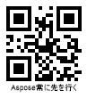
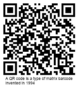

{}[Generate QR Code Online](https://products.aspose.app/barcode/generate/qr): You can test the quality of ***Aspose.BarCode*** generation for QR Codes and get the results online.{}

## **Overview**
*QR Code* corresponds to a group of 2D square types that benefits from high data density and allows encoding streams of bytes and textual data composed of Unicode symbols. ***Aspose.BarCode for Java*** supports Extended Channel Interpretation (ECI) to encode Unicode data and provides various encoding modes; UTF8 is one of the most widely used encoding modes.  
  
Reserving the minimum possible amount of data for error correction, the *QR Code* standard can be used to encode at most 7,089 numerical digits or 4,296 alphanumeric characters or 2,953 bytes. The other standard, *Micro QR Code*, allows encoding up to 35 numerical digits or 21 alphanumeric characters or 15 bytes. *Micro QR Code* serves to create considerably small *QR Code* images. However, it does not enable Extended Channel Interpretation (ECI) and does not allow encoding Unicode characters. In particular, *Micro Qr Code* barcodes corresponding to the *M1* version can encode at most five numerical digits; the *M2* version allows encoding up to ten numerical or six alphanumeric characters. This encoding capacity is usually suitable to work with industrial markers.  

The main advantages of the *QR Code* symbology can be outlined as follows:
- large data density
- the capability to perform scanning and reading even for severely distorted barcode images 
- the possibility of encoding streams of bytes
- high scanning and decoding speed 
- the possibility to encode Unicode characters through ECI (not supported in *Micro QR Code*)
- several error correction modes; the maximal error correction level H allows restoring up to 30% of encoded information 
  
It should be noted that considerable damage to target patterns in *QR Code* images may result in the deterioration of barcode scanning and reading efficiency.

{}*If you need any clarifications, feel free to reach out Aspose [Technical Support](/barcode/java/technical-support/): ask your questions at [Aspose.Barcode Forum](https://forum.aspose.com/c/barcode/13) or contact [Aspose Paid Support Helpdesk](https://helpdesk.aspose.com/).*{}

## **Generation Modes**
***Aspose.BarCode for Java*** allows generating *QR Code* or *Micro QR Code* images corresponding to different versions. This can done through two methods of class [*QrParameters*](https://reference.aspose.com/barcode/java/com.aspose.barcode.generation/QrParameters), i.e. *setQrEncodeType* (using values from the [*QREncodeType*](https://reference.aspose.com/barcode/java/com.aspose.barcode.generation/QREncodeType) enum) and *setQrVersion* (with values from the [*QRVersion*](https://reference.aspose.com/barcode/java/com.aspose.barcode.generation/QRVersion) enum). By default, the *AUTO* setting is enabled.  
  
The first way to set the required version of *QR Code* or *Micro QR Code* is to use the *setQrVersion* method. If data inputted for encoding does not occupy the entire capacity of the target version, padding characters are used to fill the leftover space. If barcode information exceeds the available capacity, barcode images cannot be generated, and the corresponding exception is thrown.  
  
The second way to determine the desired *QR Code* generation mode is applicable when [*QrVersion*](https://reference.aspose.com/barcode/java/com.aspose.barcode.generation/QRVersion) remains set to *AUTO*. In this case, the *setQrEncodeType* method can be used to select the barcode type according to the input data size. The [*QREncodeType*](https://reference.aspose.com/barcode/java/com.aspose.barcode.generation/QREncodeType) enum can take the following values:

- *AUTO*: firstly, the library aims to identify the most appropriate *Micro QR Code* version from M1 to M4. If no suitable version is found, the library iterates over supported *QR Code* versions from *Version 01* to *Version 40*. If the data to be encoded does not fit the data capacity of *Version 40*, an exception is thrown.
- *FORSE_QR*: the most appropriate *QR Code* version is automatically selected among options from *Version 01* to *Version 40*.
- *FORSE_MICRO_QR*: the library aims at selecting the most applicable *Micro QR Code* version from M1 to M4. If the input data exceeds the data capacity of the M4 version, an exception is thrown. 
  
### **Automatic Version Setting**
The following barcode images are given to explain how to create different types of *QR Code* using various automatic version setting modes.
  
|Generation Mode|***AUTO***|***FORSE_QR***|***FORSE_MICRO_QR***|
| :-: | :-: | :-: | :-: |
| ||||
  
<!--
BarcodeGenerator gen = new BarcodeGenerator(EncodeTypes.QR, "ASPOSE");
gen.Parameters.Barcode.XDimension.Pixels = 4;
//set Auto version
gen.Parameters.Barcode.QR.QrVersion = QRVersion.Auto;
//Set Auto QR encode type
gen.Parameters.Barcode.QR.QrEncodeType = QREncodeType.Auto;
gen.Save($"{path}QREncodeTypeAuto.png", BarCodeImageFormat.Png);
//Set ForceMicroQR QR encode type
gen.Parameters.Barcode.QR.QrEncodeType = QREncodeType.ForceMicroQR;
gen.Save($"{path}QREncodeTypeForceMicroQR.png", BarCodeImageFormat.Png);
//Set ForceQR QR encode type
gen.Parameters.Barcode.QR.QrEncodeType = QREncodeType.ForceQR;
gen.Save($"{path}QREncodeTypeForceQR.png", BarCodeImageFormat.Png);
-->
   
### **Manual Version Selection**
In ***Aspose.BarCode for Java***, developers can manually select the desired *QR Code* version for barcode generation. In this case, it is required to call the *setQRVersion* method of class [*QrParameters*](https://reference.aspose.com/barcode/java/com.aspose.barcode.generation/QrParameters) passing a value from the [*QRVersion*](https://reference.aspose.com/barcode/java/com.aspose.barcode.generation/QRVersion) enum, i.e. from *VERSION_01* to *VERSION_40* for *QR Code* or from *VERSION_M1* to *VERSION_M4* for *Micro QR Code*. The following barcode images are intended to explain how to create *QR Code* barcodes using manual settings to define the requested version.
  
|Version|QR Code VERSION_05|Micro QR VERSION_M4|
| :-: | :-: | :-: |
| |||
  
<!--
BarcodeGenerator gen = new BarcodeGenerator(EncodeTypes.QR, "ASPOSE");
gen.Parameters.Barcode.XDimension.Pixels = 4;
//set MicroQR 4 version
gen.Parameters.Barcode.QR.QrVersion = QRVersion.VersionM4;
gen.Save($"{path}QRVersionM4.png", BarCodeImageFormat.Png);
//set QR 5 version
gen.Parameters.Barcode.QR.QrVersion = QRVersion.Version05;
gen.Save($"{path}QRVersion05.png", BarCodeImageFormat.Png);
-->

## **Encoding Modes**
***Aspose.BarCode for Java*** enables the variety of widely used data encoding specifications, such as Unicode and others. Developers can select the desired encoding mode through the *setQrEncodeMode* method of class [*QrParameters*](https://reference.aspose.com/barcode/java/com.aspose.barcode.generation/QrParameters) passing a value from the [*QrEncodeMode*](https://reference.aspose.com/barcode/java/com.aspose.barcode.generation/QREncodeMode) enum that includes the following options:
-	*AUTO*: information inputted through the *setCodeText* method gets encoded using the value set through the *setCodeTextEncoding* method (UTF8 is applied by default).
-	*BYTES*: is intended to encode byte streams and allows encoding digits from 0 to 255. In cases when a byte stream includes digits larger than 255, the library applies the *UTF16LE*. 
-	*UTF_8_BOM* and *UTF_16_BEBOM*: allow encoding barcode data in UTF8 and UTF16BE encodings. The first character is encoded as a byte order mark (BOM) character to denote the enabled encoding. However, the *ECI_ENCODING* mode is recommended for use because it is more suitable to set the encodings suitable for the *QR Code* standard.  
-	*ECI_ENCODING*: applies encodings from the list defined in the [*ECIEncodings*](https://reference.aspose.com/barcode/java/com.aspose.barcode.generation/ECIEncodings) enum.
-	*EXTENDED_CODETEXT*: in addition to the main information, barcode data must include special control words that are required to establish improved controls over the data encoding process; in this mode, textual parts with various encodings can be stored in one *QR Code* barcode.
  
### ***AUTO* Mode**
To encode input data when the *AUTO* encoding mode is enabled, the library applies the encoding defined through the *setCodeTextEncoding* method. If the required encoding is not specified explicitly, UTF8 is applied. 
<!--The following code sample shows how to enable the *AUTO* encoding mode.
  

BarcodeGenerator gen = new BarcodeGenerator(EncodeTypes.QR, "Aspose常に先を行く");
gen.Parameters.Barcode.XDimension.Pixels = 4;
Console.OutputEncoding = Encoding.Unicode;
//set encode mode to Auto
gen.Parameters.Barcode.QR.QrEncodeMode = QREncodeMode.Auto;
//set CodeText encoding to UTF8
gen.Parameters.Barcode.QR.CodeTextEncoding = Encoding.UTF8;
gen.Save($"{path}QrEncodeModeAuto.png", BarCodeImageFormat.Png);
//attempt to recognize it
BarCodeReader read = new BarCodeReader(gen.GenerateBarCodeImage(), DecodeType.QR);
read.BarcodeSettings.DetectEncoding = true;
foreach (BarCodeResult result in read.ReadBarCodes())
    Console.WriteLine("QrEncodeModeAuto:" + result.CodeText);
-->
  

### ***BYTES* Mode**
When the *BYTES* encoding mode is used, input information presented in a form of a plain byte stream is transformed into an array of symbols and then to a string. Digits from 0 to 255 can be encoded. If a byte stream contains digits larger than 255, this symbol gets encoded as two bytes in the UTF16LE encoding (the lower byte is put first). 
<!--The following code snippet illustrates how to work with the *BYTES* encoding mode.
  

byte[] encodedArr = { 0xFF, 0xFE, 0xFD, 0xFC, 0xFB, 0xFA, 0xF9};

//encode an array to a string
StringBuilder strBld = new StringBuilder(); ;
foreach(byte bval in encodedArr)
    strBld.Append((char)bval);

//encode to a QR code
BarcodeGenerator gen = new BarcodeGenerator(EncodeTypes.QR, strBld.ToString());
gen.Parameters.Barcode.XDimension.Pixels = 4;
//set encode mode to Bytes
gen.Parameters.Barcode.QR.QrEncodeMode = QREncodeMode.Bytes;
gen.Parameters.Barcode.CodeTextParameters.TwoDDisplayText = "Bytes mode";
gen.Save($"{path}QrEncodeModeBytes.png", BarCodeImageFormat.Png);

//attempt to read the barcode
BarCodeReader read = new BarCodeReader(gen.GenerateBarCodeImage(), DecodeType.QR);
foreach (BarCodeResult result in read.ReadBarCodes())
    Console.WriteLine("QrEncodeModeBytes:" + BitConverter.ToString(result.CodeBytes));
-->
  

  
### ***UTF_8_BOM* and *UTF_16_BEBOM* Modes**
The library provides two special encoding modes called *UTF_8_BOM* and *UTF_16_BEBOM*, which serve to encode information according to *UTF8* and *UTF16BE* specifications. A byte order mark (BOM) symbol is added as the first digit. The following code sample shows how to enable with the *UTF_16_BEBOM* encoding mode.
  
<!--
BarcodeGenerator gen = new BarcodeGenerator(EncodeTypes.QR, "Aspose常に先を行く");
gen.Parameters.Barcode.XDimension.Pixels = 4;
Console.OutputEncoding = Encoding.Unicode;
//set the encode mode to UTF16BE with BOM
gen.Parameters.Barcode.QR.QrEncodeMode = QREncodeMode.Utf16BEBOM;
gen.Save($"{path}QrEncodeModeUtfBOM.png", BarCodeImageFormat.Png);
//attempt to read the barcode
BarCodeReader read = new BarCodeReader(gen.GenerateBarCodeImage(), DecodeType.QR);
read.BarcodeSettings.DetectEncoding = true;
foreach (BarCodeResult result in read.ReadBarCodes())
    Console.WriteLine("QrEncodeModeUtfBOM:" + result.CodeText);
-->
  

  
### ***ECI_ENCODING* Mode**

The *ECI_ENCODING* encoding mode suggests applying one of the encodings listed in the [*ECIEncodings*](https://reference.aspose.com/barcode/java/com.aspose.barcode.generation/ECIEncodings) enum. ***Aspose.BarCode for Java*** supports the variety of widely used encodings. In this mode, the extended channel interpretation (ECI) identifier is added to denote the enabled encoding to transfer the information about it to decoders. It is recommended to use the UTF8 value. 
<!--The following code snippet explains how to use the *ECI_ENCODING* mode.
  

BarcodeGenerator gen = new BarcodeGenerator(EncodeTypes.QR, "Aspose常に先を行く");
gen.Parameters.Barcode.XDimension.Pixels = 4;
Console.OutputEncoding = Encoding.Unicode;
//set the encoding mode to ECI_Encoding and ECI to UTF8
gen.Parameters.Barcode.QR.QrEncodeMode = QREncodeMode.ECIEncoding;
gen.Parameters.Barcode.QR.QrECIEncoding = ECIEncodings.UTF8;
gen.Save($"{path}QrEncodeModeECIEncoding.png", BarCodeImageFormat.Png);
//attempt to read the barcode
BarCodeReader read = new BarCodeReader(gen.GenerateBarCodeImage(), DecodeType.QR);
foreach (BarCodeResult result in read.ReadBarCodes())
    Console.WriteLine("QrEncodeModeECIEncoding:" + result.CodeText);
-->
  

  
### ***EXTENDED_CODETEXT* Mode**
***Aspose.BarCode for Java*** supports the *EXTENDED_CODETEXT* mode that allows customizing settings for the *QR Code* generation process manually. This mode enables activating the multi-ECI mode and adding FNC characters (special symbols to differentiate between fields in variable-length identifiers) to work with extended textual information. The library provides a special class called [*ExtCodetextBuilder*](https://reference.aspose.com/barcode/java/com.aspose.barcode.generation/ExtCodetextBuilder) that facilitates working with this encoding mode. When the multi-ECI mode is enabled, barcode information gets processed for all predefined encodings automatically. In all other cases, the encoding defined through the *setCodeTextEncoding* method is applied.    

<!--The following code sample shows how to enable the multi-encoding ECI regime when the *EXTENDED_CODETEXT* mode is enabled. 
  

//create the extended barcode text
QrExtCodetextBuilder lTextBuilder = new QrExtCodetextBuilder();
lTextBuilder.AddECICodetext(ECIEncodings.Win1251, "Aspose");
lTextBuilder.AddECICodetext(ECIEncodings.UTF8, "常に先");
lTextBuilder.AddECICodetext(ECIEncodings.UTF16BE, "を行く");
lTextBuilder.AddPlainCodetext(@"!!!");
//generate a QR Code
BarcodeGenerator gen = new BarcodeGenerator(EncodeTypes.QR, lTextBuilder.GetExtendedCodetext());
gen.Parameters.Barcode.XDimension.Pixels = 4;
Console.OutputEncoding = Encoding.Unicode;
//set the encoding mode to EXTENDED_CODETEXT
gen.Parameters.Barcode.QR.QrEncodeMode = QREncodeMode.ExtendedCodetext;
gen.Parameters.Barcode.CodeTextParameters.TwoDDisplayText = "ExtendedCodetext mode";
gen.Save($"{path}QrEncodeModeExtendedCodetext.png", BarCodeImageFormat.Png);
//attempt to read the barcode
BarCodeReader read = new BarCodeReader(gen.GenerateBarCodeImage(), DecodeType.QR);
foreach (BarCodeResult result in read.ReadBarCodes())
    Console.WriteLine("QrEncodeModeExtendedCodetext:" + result.CodeText);
-->
  

  
## **Error Correction Level**
The *QR Code* group of barcode standards provides four types of Reed-Solomon error correction (EC). The error correction mechanism prescribes storing redundant data to facilitate automatic error detection and correction in the case of barcode image distortions or damages. To recover 1% of corrupted data, 2% redundancy is required.  
  
Following error correction levels are supported for *QR Code* symbologies.
  
|Error Correction Level|Data Recovery Capacity|
| :-: | :-: |
|Level L| 7% |
|Level M| 15% |
|Level Q| 25% |
|Level H| 30% |
  
For all *QR Code* subtypes with the exception of *Micro QR* developers can use any error correction level. For *Micro QR*, different subtypes are compatible with specific EC levels only, i.e. *M1* enables EC level L; *M2* - levels L and M; *M3* and *M4* - levels L, M, and Q. 
  
|Error Correction Level|Level L|Level M|Level Q|Level H|
| :-: | :-: | :-: | :-: | :-: |
| |||||
  
<!--The following code snippet demonstrates how to enable various error correction levels for *QR Code* barcodes.
  

BarcodeGenerator gen = new BarcodeGenerator(EncodeTypes.QR, "A QR code is a type of matrix barcode invented in 1994");
gen.Parameters.Barcode.XDimension.Pixels = 4;
//set error correction level to L
gen.Parameters.Barcode.QR.QrErrorLevel = QRErrorLevel.LevelL;
gen.Save($"{path}QrErrorLevelL.png", BarCodeImageFormat.Png);
//set error correction level to M
gen.Parameters.Barcode.QR.QrErrorLevel = QRErrorLevel.LevelM;
gen.Save($"{path}QrErrorLevelM.png", BarCodeImageFormat.Png);
//set error correction level to Q
gen.Parameters.Barcode.QR.QrErrorLevel = QRErrorLevel.LevelQ;
gen.Save($"{path}QrErrorLevelQ.png", BarCodeImageFormat.Png);
//set error correction level to H
gen.Parameters.Barcode.QR.QrErrorLevel = QRErrorLevel.LevelH;
gen.Save($"{path}QrErrorLevelH.png", BarCodeImageFormat.Png);
-->

## **Structured Append Mechanism**
*QR Code* types (except *Micro QR*) support the possibility to generate composite barcodes using the structured append mechanism. In this mode, the input data can be divided among different *QR Code* barcodes and then composed into a single image. ***Aspose.BarCode for Java*** does not enable distributing input barcode data across several *QR Code* barcodes; however, it allows creating a composite *QR Code* label manually. This can be done through the *setStructuredAppend* method passing an object of class [*QrStructuredAppendParameters*](https://reference.aspose.com/barcode/java/com.aspose.barcode.generation/QrStructuredAppendParameters) class. This class provides the following methods: 
- *setTotalCount* - the number of barcodes in a composite *QR Code* image (can take values from 2 to 16)
- *setSequenceIndicator* - the sequence number of the current barcode (starting from 0)
- *setParityByte* - a byte that serves as a checksum identifier. In the general case, it is calculated as *XOR* of all bytes in which UTF16BE symbols are encoded using two bytes   
  
Sample barcode images provided below have been created using the structured append mechanism.
  
|Structured Append Type|First Type|Second Type|
| :-: | :-: | :-: |
| |||
  
<!--
BarcodeGenerator gen = null;
BarCodeReader read = null;
Console.OutputEncoding = Encoding.Unicode;
//messages
string firstMessage = "Aspose";
string secondMessage = "常に先を行く";
//calculate parity byte
byte parity = 0;
foreach (char val in firstMessage.ToCharArray())
    parity ^= (val <= 255) ? (byte)val : (byte)((byte)val ^ (byte)((int)val >> 8));
foreach (char val in secondMessage.ToCharArray())
    parity ^= (val <= 255) ? (byte)val : (byte)((byte)val ^ (byte)((int)val >> 8));

//generate the first barcode
gen = new BarcodeGenerator(EncodeTypes.QR, firstMessage);
gen.Parameters.Barcode.XDimension.Pixels = 4;
gen.Parameters.Barcode.QR.QrEncodeMode = QREncodeMode.ECIEncoding;
gen.Parameters.Barcode.QR.QrECIEncoding = ECIEncodings.UTF8;
gen.Parameters.Barcode.QR.StructuredAppend.ParityByte = parity;
gen.Parameters.Barcode.QR.StructuredAppend.TotalCount = 2;
gen.Parameters.Barcode.QR.StructuredAppend.SequenceIndicator = 0;
gen.Save($"{path}QrStructuredAppendFirst.png", BarCodeImageFormat.Png);
//attempt to recognize it
read = new BarCodeReader(gen.GenerateBarCodeImage(), DecodeType.QR);
foreach (BarCodeResult result in read.ReadBarCodes())
    Console.WriteLine($"QrStructuredAppend: Count:{result.Extended.QR.QRStructuredAppendModeBarCodesQuantity} " +
        $"Index: {result.Extended.QR.QRStructuredAppendModeBarCodeIndex} Parity:{result.Extended.QR.QRStructuredAppendModeParityData.ToString()} "+ 
        $"Codetext: {result.CodeText}");

//generate the second barcode
gen = new BarcodeGenerator(EncodeTypes.QR, secondMessage);
gen.Parameters.Barcode.XDimension.Pixels = 4;
gen.Parameters.Barcode.QR.QrEncodeMode = QREncodeMode.ECIEncoding;
gen.Parameters.Barcode.QR.QrECIEncoding = ECIEncodings.UTF8;
gen.Parameters.Barcode.QR.StructuredAppend.ParityByte = parity;
gen.Parameters.Barcode.QR.StructuredAppend.TotalCount = 2;
gen.Parameters.Barcode.QR.StructuredAppend.SequenceIndicator = 1;
gen.Save($"{path}QrStructuredAppendSecond.png", BarCodeImageFormat.Png);
//attempt to recognize it
read = new BarCodeReader(gen.GenerateBarCodeImage(), DecodeType.QR);
foreach (BarCodeResult result in read.ReadBarCodes())
    Console.WriteLine($"QrStructuredAppend: Count:{result.Extended.QR.QRStructuredAppendModeBarCodesQuantity} " +
        $"Index: {result.Extended.QR.QRStructuredAppendModeBarCodeIndex} Parity:{result.Extended.QR.QRStructuredAppendModeParityData.ToString()} " +
        $"Codetext: {result.CodeText}");
-->

## **Aspect Ratio Settings**
*Aspect Ratio* is the ratio between the height and the width of a barcode. To adjust barcode proportions using the X and Y coordinates in ***Aspose.BarCode for Java***, it is required to use the *setAspectRatio* method of class [*QrParameters*](https://reference.aspose.com/barcode/java/com.aspose.barcode.generation/QrParameters). This property is defined as a relative coefficient to the value of *XDimension* parameter. Generally, the value of *AspectRatio* should be set to 1. When it is necessary to adjust the proportions of generated *QR Code* barcodes, the *setAspectRatio* method can be used. Sample barcode labels shown below have been generated using different aspect ratio settings.  
  
|Aspect Ratio|Is Set to 1|Is Set to 2|
| :-: | :-: | :-: |
| |||
  
<!--The following code snippet explains how to set the required value of *AspectRatio* for *QR Code* barcodes.
  

BarcodeGenerator gen = new BarcodeGenerator(EncodeTypes.QR, "ASPOSE");
gen.Parameters.Barcode.XDimension.Pixels = 4;
//set Aspect Ratio to 1
gen.Parameters.Barcode.QR.AspectRatio = 1;
gen.Save($"{path}QrAspectRatio1.png", BarCodeImageFormat.Png);
//set Aspect Ratio to 2
gen.Parameters.Barcode.QR.AspectRatio = 2;
gen.Save($"{path}QrAspectRatio2.png", BarCodeImageFormat.Png);
-->