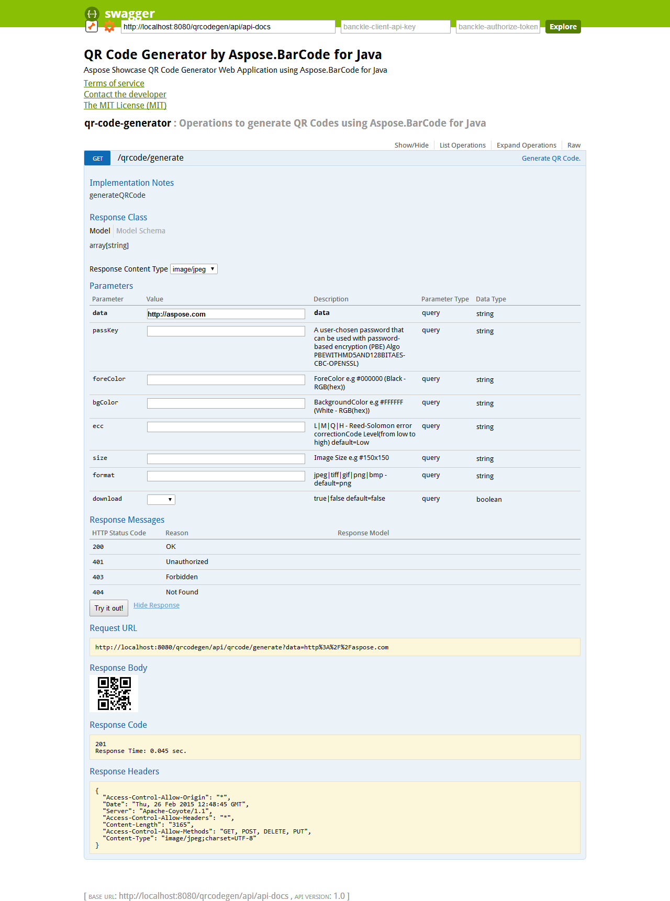

The QR Code Generator application also exports its Restful APIs documentation by using the swagger specification. You can view the application APIs swagger-based documentation by accessing the following [link](http://localhost:8080/qrcodegen/public/docs/).

-----
  
|

|
| :- |
  
