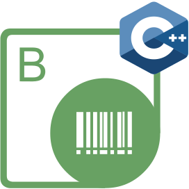

{}

      

**Welcome to Aspose.BarCode for JavaScript via C++**

***Aspose.BarCode for JavaScript via C++*** is a robust library designed to provide barcode generation and recognition components for JavaScript applications. It offers a collection of classes that allow developers to easily work with barcodes on the frontend.

***Aspose.BarCode for JavaScript via C++*** supports compatibility with most existing barcode standards and specifications. It not only facilitates barcode generation but also provides a comprehensive framework to control essential aspects of barcode processing.

**Why choose Aspose.BarCode for JavaScript via C++ for managing barcodes?**

- **Flexible Recognition Engine:** Allows customization of barcode recognition engine variables to balance reading quality and speed, enabling the recognition of even severely corrupted barcodes.
- **Customizable Barcode Parameters:** Provides options to adjust various barcode parameters and its appearance, including background color, bar color, rotation angle, X-dimension, image quality, resolution, captions, size, and more.
- **Broad Symbology Support:** Supports a wide range of symbologies and offers multiple barcode reading and generation functions, enabling you to implement barcode functionality tailored to your business processes and needs.

**Aspose.BarCode for JavaScript via C++ Resources**

Below are links to some useful resources:

- [Aspose.BarCode for JavaScript via C++ Product Overview and Features](/barcode/javascript-cpp/product-overview/)
- [Aspose.BarCode for JavaScript via C++ Release Notes](https://releases.aspose.com/barcode/javascript-cpp/release-notes/)
- [Aspose.BarCode for JavaScript via C++ Product Page](https://products.aspose.com/barcode/javascript-cpp)
- [Download Aspose.BarCode for JavaScript via C++](https://releases.aspose.com/barcode/javascript-cpp/)
- [Download Code Examples from GitHub Repository](https://github.com/aspose-barcode/Aspose.BarCode-for-JavaScript-via-CPP)
- [Aspose.BarCode for JavaScript via C++ API Reference Guide](https://reference.aspose.com/barcode/javascript-cpp)
- [Aspose.BarCode for JavaScript via C++ Free Support Forum](https://forum.aspose.com/c/barcode)
- [Aspose.BarCode for JavaScript via C++ Paid Support Helpdesk](https://helpdesk.aspose.com/)
