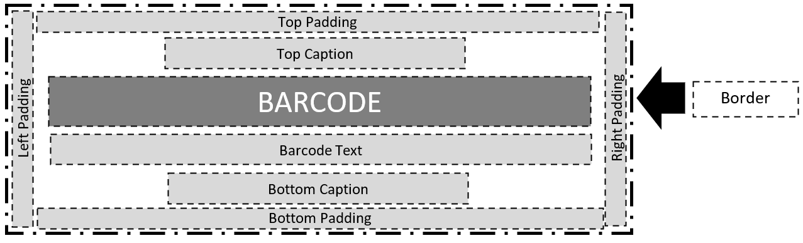
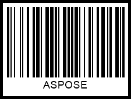
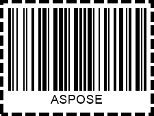
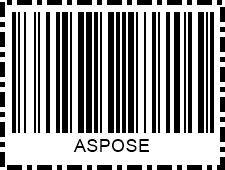
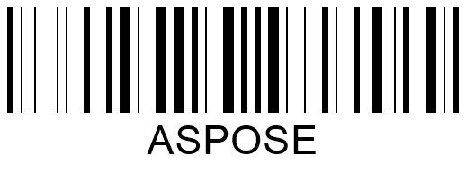

This article provides detailed information on how to adjust properties related to barcode appearance, including image size, rotation angle, paddings, and borders.

{}*If you need any clarifications, feel free to reach out to [Aspose Technical Support](/barcode/javascript-cpp/technical-support/): ask your questions at [Aspose.Barcode Forum](https://forum.aspose.com/c/barcode/13) or contact [Aspose Paid Support Helpdesk](https://helpdesk.aspose.com/).*{}

## **Overview**
In ***Aspose.BarCode for JavaScript via C++***, the [*BarcodeGenerator*](https://reference.aspose.com/barcode/javascript-cpp/aspose.barcode.generation/barcodegenerator) class enables the creation of barcode labels with elements positioned relative to each other in the barcode image, as shown in the diagram below. A barcode image can include the following elements: barcode bars, borders, paddings, top and bottom captions, and barcode text. All elements besides the barcode itself are optional.

<p align="center"></p>

## **Set Barcode Sizing Mode**

By default, ***Aspose.BarCode for JavaScript via C++*** automatically adjusts the size of a barcode image (width and height). However, you can manually set the image size using the [*ImageHeight*](https://reference.aspose.com/barcode/javascript-cpp/aspose.barcode.generation/basegenerationparameters/properties/imageheight) and [*ImageWidth*](https://reference.aspose.com/barcode/javascript-cpp/aspose.barcode.generation/basegenerationparameters/properties/imagewidth) properties of the [*BaseGenerationParameters*](https://reference.aspose.com/barcode/javascript-cpp/aspose.barcode.generation/basegenerationparameters) class.

The barcode image size can be controlled by different sizing modes, set with the [*AutoSizeMode*](https://reference.aspose.com/barcode/javascript-cpp/aspose.barcode.generation/basegenerationparameters/properties/autosizemode) property of the *BaseGenerationParameters* class. This property can have the following values: *Interpolation*, *Nearest*, and *None*. The *Interpolation* and *Nearest* modes adjust the barcode image size according to the specified width and height, while most other settings are ignored. The *None* mode defines the barcode image size by ignoring the width and height, but other parameters, such as [*XDimension*](https://reference.aspose.com/barcode/javascript-cpp/aspose.barcode.generation/barcodeparameters/properties/xdimension), are considered. By default, *AutoSizeMode* is set to "*None*".

Below, detailed descriptions of available barcode sizing modes are provided, along with sample barcode images and code snippets.


### **AutoSizeMode.None**

When the *None* mode is selected, the barcode image size is determined by properties other than width and height. The primary property used is [*XDimension*](https://reference.aspose.com/barcode/javascript-cpp/aspose.barcode.generation/barcodeparameters/properties/xdimension), which sets the minimum size for bars in 1D barcodes or cells in 2D barcodes. This value helps calculate other barcode parameters.

The *XDimension* ensures compatibility between scanning and printing equipment, as barcodes need to be readable by different scanners. A smaller *X-Dimension* means more data can be stored in the barcode, as each character takes up less space. Conversely, a larger *X-Dimension* increases the size of each character and reduces the amount of data per inch.

The barcode image below shows an example generated in *None* mode.

<p align="center"></p>

The code snippet below demonstrates how to set *AutoSizeMode* to *None*.
 

[How to get *BarCodeInstance*](/barcode/javascript-cpp/get-barcode-module-instance/)
```javascript
// Generate a DataMatrix barcode with custom image size settings
var gen = new BarCodeInstance.BarcodeGenerator("DataMatrix", "ASPOSE");
gen.Parameters.AutoSizeMode = BarCodeInstance.AutoSizeMode.None;
gen.Parameters.ImageWidth = "300px";
gen.Parameters.ImageHeight = "300px";
gen.Parameters.Barcode.XDimension = "3px";

document.getElementById("img").src = gen.GenerateBarCodeImage(); // Display barcode image

gen.delete();


```
  
### **AutoSizeMode.Interpolation**
When the [*AutoSizeMode*](https://reference.aspose.com/barcode/javascript-cpp/aspose.barcode.generation/basegenerationparameters/properties/autosizemode) property is set to "*Interpolation*", only the values of [*ImageHeight*](https://reference.aspose.com/barcode/javascript-cpp/aspose.barcode.generation/basegenerationparameters/properties/imageheight) and [*ImageWidth*](https://reference.aspose.com/barcode/javascript-cpp/aspose.barcode.generation/basegenerationparameters/properties/imagewidth) are taken into account. This sizing mode prescribes to adjust barcode image size to the specified height and width precisely even though it may lead to the distortion of barcode proportions and accordingly, to the loss of barcode readability for side scanners. The *Interpolation* mode is suitable to generate barcode images with the resolution of 300 dpi or higher as in this case proportion distortion will be negligible and will not affect barcode readability.  
  
The sample barcode image created using the *Interpolation* mode is shown below.  

<p align="center"></p> 

The following code sample explains how to initialize the *AutoSizeMode* property with the *Interpolation* value.
  
[How to get *BarCodeInstance*](/barcode/javascript-cpp/get-barcode-module-instance/)
```javascript

// Generate a DataMatrix barcode with interpolation auto size mode and custom image size settings
var gen = new BarCodeInstance.BarcodeGenerator("DataMatrix", "ASPOSE");
gen.Parameters.AutoSizeMode = BarCodeInstance.AutoSizeMode.Interpolation;
gen.Parameters.ImageWidth = "300px";
gen.Parameters.ImageHeight = "300px";
gen.Parameters.Barcode.XDimension = "3px";

document.getElementById("img").src = gen.GenerateBarCodeImage(); // Display barcode image

gen.delete();


```
  
### **AutoSizeMode.Nearest**

The *Nearest* mode uses the [*ImageHeight*](https://reference.aspose.com/barcode/javascript-cpp/aspose.barcode.generation/basegenerationparameters/properties/imageheight) and [*ImageWidth*](https://reference.aspose.com/barcode/javascript-cpp/aspose.barcode.generation/basegenerationparameters/properties/autosizemode) values to determine the barcode image size, similar to *Interpolation*. However, in *Nearest* mode, *BarcodeGenerator* aims to choose the most suitable size to maintain the barcode proportions and ensure readability.

The barcode image below shows the result of using the *Nearest* mode.

<p align="center"></p>

The code snippet below demonstrates how to set the *AutoSizeMode* property to *Nearest*.

  
[How to get *BarCodeInstance*](/barcode/javascript-cpp/get-barcode-module-instance/)
```javascript

// Generate a DataMatrix barcode with nearest auto size mode and custom image size settings
var gen = new BarCodeInstance.BarcodeGenerator("DataMatrix", "ASPOSE");
gen.Parameters.AutoSizeMode = BarCodeInstance.AutoSizeMode.Nearest;
gen.Parameters.ImageWidth = "300px";
gen.Parameters.ImageHeight = "300px";
gen.Parameters.Barcode.XDimension = "3px";

document.getElementById("img").src = gen.GenerateBarCodeImage(); // Display barcode image

gen.delete();


```
## **Set Barcode Rotation Angle**

***Aspose.BarCode for JavaScript via C++*** allows barcode image rotation by setting the [*RotationAngle*](https://reference.aspose.com/barcode/javascript-cpp/aspose.barcode.generation/basegenerationparameters/properties/rotationangle) property of the [*BaseGenerationParameters*](https://reference.aspose.com/barcode/javascript-cpp/aspose.barcode.generation/basegenerationparameters) class. By assigning a value in degrees, the barcode image can be rotated clockwise or counterclockwise to the specified angle.

The sample barcode images below demonstrate the effect of different rotation angles:

|Rotation Angle|Is Set to +90°|Is Set to -90°|Is Set to +45°|Is Set to -45°|Is Set to 180°| 
| :-: | :-: | :-: | :-: | :-: | :-: | 
| ||||||

The code snippet below shows how to set different rotation angles.

   
[How to get *BarCodeInstance*](/barcode/javascript-cpp/get-barcode-module-instance/)
```javascript

// Generate a Code128 barcode with various rotation angles
var gen = new BarCodeInstance.BarcodeGenerator("Code128", "ASPOSE");

// Set and save barcode with 90-degree rotation
gen.Parameters.RotationAngle = 90;
document.getElementById("img").src = gen.GenerateBarCodeImage(); // Display barcode image

// Set and save barcode with -90-degree rotation
gen.Parameters.RotationAngle = -90;
document.getElementById("img2").src = gen.GenerateBarCodeImage(); // Display barcode image

// Set and save barcode with 45-degree rotation
gen.Parameters.RotationAngle = 45;
document.getElementById("img3").src = gen.GenerateBarCodeImage(); // Display barcode image

// Set and save barcode with -45-degree rotation
gen.Parameters.RotationAngle = -45;
document.getElementById("img4").src = gen.GenerateBarCodeImage(); // Display barcode image

// Set and save barcode with 180-degree rotation
gen.Parameters.RotationAngle = 180;
document.getElementById("img5").src = gen.GenerateBarCodeImage(); // Display barcode image

gen.delete();


```
## **Customize Barcode Borders and Padding**

***Aspose.BarCode for JavaScript via C++*** allows you to customize barcode borders and padding during barcode generation. By default, barcode borders are positioned close to the image edges, and padding can be adjusted as needed.

### **Border Settings**

By default, barcode images are generated without borders. However, borders can be added and customized using five styles: solid, dashed, dotted, dash-dot, and dash dot dot. The [*Border*](https://reference.aspose.com/barcode/javascript-cpp/aspose.barcode.generation/basegenerationparameters/properties/border) property of the [*BaseGenerationParameters*](https://reference.aspose.com/barcode/javascript-cpp/aspose.barcode.generation/basegenerationparameters) class is used to set border configurations. This property receives an instance of the [*BorderParameters*](https://reference.aspose.com/barcode/javascript-cpp/aspose.barcode.generation/borderparameters) class, which manages all border settings.

You can adjust the border thickness and color by setting the [*Width*](https://reference.aspose.com/barcode/javascript-cpp/aspose.barcode.generation/borderparameters/properties/width) and [*Color*](https://reference.aspose.com/barcode/javascript-cpp/aspose.barcode.generation/borderparameters/properties/color) properties, respectively, and specify supported [**units**](http://localhost:1313/barcode/javascript-cpp/setting-barcode-parameters/#measuring-barcode-size-in-different-units).

The following barcode images illustrate sample barcode labels generated with different border styles. You can change the border style by setting the [*DashStyle*](https://reference.aspose.com/barcode/javascript-cpp/aspose.barcode.generation/borderparameters/properties/dashstyle) property of the *BorderParameters* class.

|Border Style|Solid|Dashed|Dotted|Dash Dot|Dash Dot Dot| 
| :-: | :-: | :-: | :-: | :-: | :-: | 
| ||||||

The following code sample demonstrates how to set the barcode border style.

  
[How to get *BarCodeInstance*](/barcode/javascript-cpp/get-barcode-module-instance/)
```javascript

// Generate a Code128 barcode with various border styles and settings
var gen = new BarCodeInstance.BarcodeGenerator("Code128", "ASPOSE");

// Set border visible and size properties
gen.Parameters.Border.Visible = true;
gen.Parameters.Border.Width = "5px";
gen.Parameters.Border.DashStyle = BarCodeInstance.BorderDashStyle.Solid;
document.getElementById("img").src = gen.GenerateBarCodeImage(); // Display barcode image

// Set border style to Dash
gen.Parameters.Border.DashStyle = BarCodeInstance.BorderDashStyle.Dash;
document.getElementById("img").src = gen.GenerateBarCodeImage(); // Display barcode image

// Set border style to Dot
gen.Parameters.Border.DashStyle = BarCodeInstance.BorderDashStyle.Dot;
document.getElementById("img").src = gen.GenerateBarCodeImage(); // Display barcode image

// Set border style to DashDot
gen.Parameters.Border.DashStyle = BarCodeInstance.BorderDashStyle.DashDot;
document.getElementById("img").src = gen.GenerateBarCodeImage(); // Display barcode image

// Set border style to DashDotDot
gen.Parameters.Border.DashStyle = BarCodeInstance.BorderDashStyle.DashDotDot;
document.getElementById("img").src = gen.GenerateBarCodeImage(); // Display barcode image

gen.delete();


```
### **Paddings**

The border paddings for a barcode image or its borders can be set in four directions using the [Padding](https://reference.aspose.com/barcode/javascript-cpp/aspose.barcode.generation/barcodeparameters/properties/padding) property of the [*BarcodeParameters*](https://reference.aspose.com/barcode/javascript-cpp/aspose.barcode.generation/barcodeparameters) class. This property creates an instance of the [Aspose.BarCode.Generation.Padding](https://reference.aspose.com/barcode/javascript-cpp/aspose.barcode.generation/padding) class, which specifies the *Left*, *Right*, *Top*, and *Bottom* padding settings. By default, the padding values are set to 5 points for all directions.

|Padding|Millimeters|Pixels|  
| :-: | :-: | :-: |  
| |||  


[How to get *BarCodeInstance*](/barcode/javascript-cpp/get-barcode-module-instance/)
```javascript

// Generate a Code128 barcode with various padding settings and border properties
var gen = new BarCodeInstance.BarcodeGenerator("Code128", "ASPOSE");

// Set border properties
gen.Parameters.Border.Visible = true;
gen.Parameters.Border.Width = "5px";
gen.Parameters.Border.DashStyle = BarCodeInstance.BorderDashStyle.Solid;

// Set padding to 10 pixels
gen.Parameters.Barcode.Padding.Left = "10px";
gen.Parameters.Barcode.Padding.Top = "10px";
gen.Parameters.Barcode.Padding.Right = "10px";
gen.Parameters.Barcode.Padding.Bottom = "10px";
document.getElementById("img").src = gen.GenerateBarCodeImage(); // Display barcode image

// Set padding to 10 millimeters
gen.Parameters.Barcode.Padding.Left = "10mm";
gen.Parameters.Barcode.Padding.Top = "10mm";
gen.Parameters.Barcode.Padding.Right = "10mm";
gen.Parameters.Barcode.Padding.Bottom = "10mm";
document.getElementById("img").src = gen.GenerateBarCodeImage(); // Display barcode image


gen.delete();


``` 
## **Bar Width Reduction**

The width of bars in a barcode is a crucial parameter that must be set precisely to ensure proper scanning. Depending on the printing method, the initial bar width may increase due to ink spread, which is common in commercial printing using traditional presses. To maintain acceptable bar width on printed barcode labels, it may be necessary to apply a bar width reduction (BWR).

Bar width reduction (BWR) is a technique used to modify the graphic design of a barcode to compensate for ink spread. In ***Aspose.BarCode for JavaScript via C++***, the width of bars in generated barcodes can be adjusted by setting the [*BarWidthReduction*](https://reference.aspose.com/barcode/javascript-cpp/aspose.barcode.generation/barcodeparameters/properties/barwidthreduction) property of the [*BarcodeParameters*](https://reference.aspose.com/barcode/javascript-cpp/aspose.barcode.generation/barcodeparameters) class. Setting this property reduces the width of bars or cell sizes in 1D and 2D barcodes. The BWR value for a specific printer can be found in manufacturer tables. Note that this setting has no effect for laser printers.

Below are sample barcodes generated with and without bar width reduction.

|Barcode Type|Bar Width Reduction 0|Bar Width Reduction 3|  
| :-: | :-: | :-: |  
|**Code 128**||| 
|**Data Matrix**|||

The following code sample shows how to set bar width reduction.

[How to get *BarCodeInstance*](/barcode/javascript-cpp/get-barcode-module-instance/)
```javascript

// Generate Code128 and DataMatrix barcodes with various bar width reduction settings

// Code128 barcode generation
var gen = new BarCodeInstance.BarcodeGenerator("Code128", "ASPOSE");
gen.Parameters.Barcode.XDimension = "10px";

// Code 128 without bar width reduction
gen.Parameters.Barcode.BarWidthReduction = "0px";
document.getElementById("img").src = gen.GenerateBarCodeImage(); // Display barcode image

// Code 128 with 4 pixels bar width reduction
gen.Parameters.Barcode.BarWidthReduction = "4px";
document.getElementById("img").src = gen.GenerateBarCodeImage(); // Display barcode image

// DataMatrix barcode generation
gen = new BarCodeInstance.BarcodeGenerator("DataMatrix", "ASPOSE");
gen.Parameters.Barcode.XDimension = "10px";

// DataMatrix without bar width reduction
gen.Parameters.Barcode.BarWidthReduction = "0px";
document.getElementById("img").src = gen.GenerateBarCodeImage(); // Display barcode image

// DataMatrix with 4 pixels bar width reduction
gen.Parameters.Barcode.BarWidthReduction = "4px";
document.getElementById("img").src = gen.GenerateBarCodeImage(); // Display barcode image

gen.delete();


``` 
  
