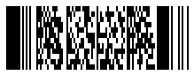
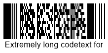
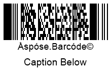
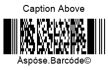

In the present article, you can find detailed information about how to manage text that can be placed onto barcode labels. To customize appearance-related parameters of barcode text in ***Aspose.BarCode for JavaScript via C++***, developers can adjust various settings, such as visibility, location, font, spacings, and wrapping modes.

{}*If you need any clarifications, feel free to reach out [Aspose Technical Support](/barcode/javascript-cpp/technical-support/): ask your questions at [Aspose.Barcode Forum](https://forum.aspose.com/c/barcode/13) or contact [Aspose Paid Support Helpdesk](https://helpdesk.aspose.com/).*{}

## **Overview**
Besides a barcode label itself, ***Aspose.BarCode for JavaScript via C++*** enables the possibility to place human-readable text onto generated barcode images. This text information may include three fields as shown in the scheme below: main text, top caption, and bottom caption; any of these elements can be hidden.
    
<p align="center"></p>
   
## **Barcode Text Settings**
Main barcode text represents short text information that is separated from the barcode label itself by some spacing. It can be placed on a barcode label in six different positions as shown in the scheme provided below: top left, top center, top right, bottom left, bottom center, or bottom right.
  
<p align="center"></p>
   
### **Set Text Visibility**

In ***Aspose.BarCode for JavaScript via C++***, developers can decide whether barcode text needs to be displayed or not. If there is no necessity to place additional text on a barcode image, it can be hidden as shown in the barcode sample image below.
  
<p align="center"></p>  
   
The following code snippet explains how to hide barcode text.

  
[How to get *BarCodeInstance*](/barcode/javascript-cpp/get-barcode-module-instance/)
```javascript

// Create a Pdf417 barcode generator with custom settings
var gen = new BarCodeInstance.BarcodeGenerator("Pdf417", "Åspóse.Barcóde©");

// Set the number of rows to 12 and unit size to 2 pixels
gen.Parameters.Barcode.Pdf417.Rows = 12;
gen.Parameters.Barcode.XDimension = "2px";

// Hide the code text
gen.Parameters.Barcode.CodeTextParameters.Location = BarCodeInstance.CodeLocation.None;

// Generate and display the barcode image
document.getElementById("img").src = gen.GenerateBarCodeImage(); // Display barcode image with hidden code text

// Cleanup
gen.delete();


```
  
### **Set Text Positioning**
Barcode text can be positioned on a barcode image by adjusting its location and alignment. To do this, set the [*Location*](https://reference.aspose.com/barcode/javascript-cpp/aspose.barcode.generation/codetextparameters/properties/location) and [*Alignment*](https://reference.aspose.com/barcode/javascript-cpp/aspose.barcode.generation/codetextparameters/properties/alignment) properties of the [*CodeTextParameters*](https://reference.aspose.com/barcode/javascript-cpp/aspose.barcode.generation/codetextparameters) class.

**Location**

The [*Location*](https://reference.aspose.com/barcode/javascript-cpp/aspose.barcode.generation/codetextparameters/properties/location) property controls the vertical position of the barcode text—either above or below the barcode. By default, the location is set to "Below".

| Text Location | Above Barcode | Below Barcode |
|---------------|---------------|---------------|
|               |  |  |

The following code snippet shows how to set the barcode text location.

    
[How to get *BarCodeInstance*](/barcode/javascript-cpp/get-barcode-module-instance/)
```javascript

// Create a Pdf417 barcode generator with custom settings
var gen = new BarCodeInstance.BarcodeGenerator("Pdf417", "Åspóse.Barcóde©");

// Set the number of rows to 12 and unit size to 2 pixels
gen.Parameters.Barcode.Pdf417.Rows = 12;
gen.Parameters.Barcode.XDimension = "2px";

// Set code text location to above the barcode and save
gen.Parameters.Barcode.CodeTextParameters.Location = BarCodeInstance.CodeLocation.Above;
document.getElementById("img").src = gen.GenerateBarCodeImage(); // Display barcode image with code text above

// Set code text location to below the barcode and save
gen.Parameters.Barcode.CodeTextParameters.Location = BarCodeInstance.CodeLocation.Below;
document.getElementById("img").src = gen.GenerateBarCodeImage(); // Display barcode image with code text below

// Cleanup
gen.delete();


``` 
 **Alignment**

The [*Alignment*](https://reference.aspose.com/barcode/javascript-cpp/aspose.barcode.generation/codetextparameters/properties/alignment) property controls the horizontal position of the barcode text: left, center, or right. By default, the alignment is set to "Center".

| Text Alignment | Left | Center | Right |
|----------------|------|--------|-------|
|                |  |  |  |

The following code example shows how to set the desired barcode text alignment.

     
[How to get *BarCodeInstance*](/barcode/javascript-cpp/get-barcode-module-instance/)
```javascript

// Generate a PDF417 barcode with various code text alignments
var gen = new BarCodeInstance.BarcodeGenerator("Pdf417", "Åspóse.Barcóde©");
gen.Parameters.Barcode.Pdf417.Rows = 12;
gen.Parameters.Barcode.XDimension = "2px";

// Set Codetext Left alignment
gen.Parameters.Barcode.CodeTextParameters.Alignment = BarCodeInstance.TextAlignment.Left;
document.getElementById("img").src = gen.GenerateBarCodeImage(); // Display barcode image

// Set Codetext Center alignment
gen.Parameters.Barcode.CodeTextParameters.Alignment = BarCodeInstance.TextAlignment.Center;
document.getElementById("img").src = gen.GenerateBarCodeImage(); // Display barcode image


// Set Codetext Right alignment
gen.Parameters.Barcode.CodeTextParameters.Alignment = BarCodeInstance.TextAlignment.Right;
document.getElementById("img").src = gen.GenerateBarCodeImage(); // Display barcode image

gen.delete();

``` 
  
### **Set Spacing between Barcode and Text**
The default spacing between a barcode label and the text is 2pt. Developers can adjust this spacing by setting the [*Space*](https://reference.aspose.com/barcode/javascript-cpp/aspose.barcode.generation/codetextparameters/properties/space) property of the [*CodetextParameters*](https://reference.aspose.com/barcode/javascript-cpp/aspose.barcode.generation/codetextparameters) class. This property controls the distance between the barcode text and the barcode label, depending on the text position. Note that it cannot be set for certain symbologies such as EAN8, EAN13, UPC E, UPC A, ISBN, ISMN, ISSN, and UpcaGs1DatabarCoupon.

The images below show barcodes with different spacing settings (5 pixels and 40 pixels).

| Text Spacing | 5 Pixels | 40 Pixels |
|--------------|----------|-----------|
|              |  |  |

The following code snippet demonstrates how to modify the spacing between the barcode label and the text.

   
[How to get *BarCodeInstance*](/barcode/javascript-cpp/get-barcode-module-instance/)
```javascript

// Generate a PDF417 barcode with different code text spacing
var gen = new BarCodeInstance.BarcodeGenerator("Pdf417", "Åspóse.Barcóde©");
gen.Parameters.Barcode.Pdf417.Rows = 12;
gen.Parameters.Barcode.XDimension = "2px";

// Set codetext space to 5 pixels
gen.Parameters.Barcode.CodeTextParameters.Space = "5px";
document.getElementById("img").src = gen.GenerateBarCodeImage(); // Display barcode image

// Set codetext space to 40 pixels
gen.Parameters.Barcode.CodeTextParameters.Space = "40px";
document.getElementById("img").src = gen.GenerateBarCodeImage(); // Display barcode image

gen.delete();


``` 
### **Set Text Font**
To customize the font of barcode text, use the [*Font*](https://reference.aspose.com/barcode/javascript-cpp/aspose.barcode.generation/codetextparameters/properties/font) and [*FontMode*](https://reference.aspose.com/barcode/javascript-cpp/aspose.barcode.generation/codetextparameters/properties/fontmode) properties of the [*CodetextParameters*](https://reference.aspose.com/barcode/javascript-cpp/aspose.barcode.generation/codetextparameters) class. By default, the *Font* property is set to Arial 5pt regular and is ignored if the *Auto* mode is used in the *FontMode* property.

The *FontMode* property determines the font size of the barcode text. When set to *Auto*, the font size is calculated automatically to fit the text into one line, based on the *xDimension* value. The *Manual* mode allows for manual font size specification. It is recommended to use *FontMode.Auto*, especially when the [*AutoSize*](https://reference.aspose.com/barcode/javascript-cpp/aspose.barcode.generation/autosizemode) property is set to *AutoSizeMode.Nearest* or *AutoSizeMode.Interpolation*. Other font properties, such as font style, are set similarly in both *Auto* and *Manual* modes.

The following images show barcodes generated with different font settings.

| Font Setting Mode | Auto | Manual |
|-------------------|------|--------|
|                   |  |  |

**Auto Mode**

The following code snippet demonstrates how to set the barcode text font in *Auto* mode.

  
[How to get *BarCodeInstance*](/barcode/javascript-cpp/get-barcode-module-instance/)
```javascript

// Generate a PDF417 barcode with automatic font settings
var gen = new BarCodeInstance.BarcodeGenerator("Pdf417", "Åspóse.Barcóde©");
gen.Parameters.Barcode.Pdf417.Rows = 12;
gen.Parameters.Barcode.XDimension = "2px";

// Set automatic font mode and specify font properties
gen.Parameters.Barcode.CodeTextParameters.FontMode = BarCodeInstance.FontMode.Auto;
gen.Parameters.Barcode.CodeTextParameters.Font.FamilyName = "Times New Roman";
gen.Parameters.Barcode.CodeTextParameters.Font.Style = BarCodeInstance.FontStyle.Underline;
// Font size is ignored when FontMode is set to Auto
gen.Parameters.Barcode.CodeTextParameters.Font.Size = "10pt";

document.getElementById("img").src = gen.GenerateBarCodeImage(); // Display barcode image


gen.delete();


``` 
  
**Manual Mode**
  
The code snippet provided below explains how to set barcode text font in the *Manual* mode.
    
[How to get *BarCodeInstance*](/barcode/javascript-cpp/get-barcode-module-instance/)
```javascript
// Generate a PDF417 barcode with manual font settings
var gen = new BarCodeInstance.BarcodeGenerator("Pdf417", "Åspóse.Barcóde©");
gen.Parameters.Barcode.Pdf417.Rows = 12;
gen.Parameters.Barcode.XDimension = "2px";

// Set manual font mode and specify font properties
gen.Parameters.Barcode.CodeTextParameters.FontMode = BarCodeInstance.FontMode.Manual;
gen.Parameters.Barcode.CodeTextParameters.Font.FamilyName = "Times New Roman";
gen.Parameters.Barcode.CodeTextParameters.Font.Style = BarCodeInstance.FontStyle.Underline;
// Set font size
gen.Parameters.Barcode.CodeTextParameters.Font.Size = "10pt";

document.getElementById("img").src = gen.GenerateBarCodeImage(); // Display barcode image


gen.delete();


``` 
### **Set NoWrap Mode for Text**
The [*NoWrap*](https://reference.aspose.com/barcode/javascript-cpp/aspose.barcode.generation/codetextparameters/properties/nowrap) property of the [*CodetextParameters*](https://reference.aspose.com/barcode/javascript-cpp/aspose.barcode.generation/codetextparameters) class is used to prevent line breaks within barcode text when it is too long to fit in one row. When *NoWrap* is set to "*True*", the barcode text is displayed in a single line. By default, the property is set to "*False*".

The images below show the difference between barcode text wrapping when *NoWrap* is set to *True* and *False*.

| Text Wrapping Mode | **Wrap** Mode | **NoWrap** Mode |
|--------------------|---------------|-----------------|
|                    |  |  |

The following code sample demonstrates how to enable and disable the *NoWrap* mode.

  
[How to get *BarCodeInstance*](/barcode/javascript-cpp/get-barcode-module-instance/)
```javascript

// Generate a PDF417 barcode with text wrapping settings for long codetext
var gen = new BarCodeInstance.BarcodeGenerator("Pdf417", "Extremely long codetext for one row");
gen.Parameters.Barcode.Pdf417.Rows = 12;
gen.Parameters.Barcode.XDimension = "2px";
gen.Parameters.Barcode.CodeTextParameters.FontMode = BarCodeInstance.FontMode.Manual;
gen.Parameters.Barcode.CodeTextParameters.Font.Size = "12pt";

// Text wrapping mode on
gen.Parameters.Barcode.CodeTextParameters.NoWrap = false;
document.getElementById("img").src = gen.GenerateBarCodeImage(); // Display barcode image


// Text wrapping mode off
gen.Parameters.Barcode.CodeTextParameters.NoWrap = true;
document.getElementById("img").src = gen.GenerateBarCodeImage(); // Display barcode image


gen.delete();


```
## **Replace Barcode Text in 2D Barcodes**
To replace the barcode text in 2D barcodes with more readable text without altering the actual barcode, developers can use the [*TwoDDisplayText*](https://reference.aspose.com/barcode/javascript-cpp/aspose.barcode.generation/codetextparameters/properties/twoddisplaytext) property of the [*CodetextParameters*](https://reference.aspose.com/barcode/javascript-cpp/aspose.barcode.generation/codetextparameters) class. This property allows inserting new text to be displayed on the barcode. This feature is supported for the following 2D symbologies: Aztec Code, PDF417, Data Matrix, QR Code, MaxiCode, and DotCode.

The barcode image below shows an example where the barcode text has been replaced using the *TwoDDisplayText* property.

<p align="center"></p>

The following code snippet demonstrates how to replace barcode text for 2D barcodes.

    
[How to get *BarCodeInstance*](/barcode/javascript-cpp/get-barcode-module-instance/)
```javascript

// Generate a PDF417 barcode with replaced visible codetext
var gen = new BarCodeInstance.BarcodeGenerator("Pdf417", "Åspóse.Barcóde©");
gen.Parameters.Barcode.Pdf417.Rows = 12;
gen.Parameters.Barcode.XDimension = "2px";

// Replace visible codetext for 2D barcodes
gen.Parameters.Barcode.CodeTextParameters.TwoDDisplayText = "Replace Codetext";
document.getElementById("img").src = gen.GenerateBarCodeImage(); // Display barcode image

gen.delete();


```
## **Barcode Caption Settings**
In some cases, additional text information may need to be displayed on a barcode image. ***Aspose.BarCode for JavaScript via C++*** allows for the addition of captions above and below the barcode label. These captions have a *Padding* property to set the spacing between the caption and nearby elements (barcode label, barcode text, or border). By default, both captions are hidden and can be displayed individually or together.

<p align="center"></p>

### **Set Caption Visibility**

By default, the captions [*CaptionAbove*](https://reference.aspose.com/barcode/javascript-cpp/aspose.barcode.generation/basegenerationparameters/properties/captionabove) and [*CaptionBelow*](https://reference.aspose.com/barcode/javascript-cpp/aspose.barcode.generation/basegenerationparameters/properties/captionbelow) in the [*BaseGenerationParameters*](https://reference.aspose.com/barcode/javascript-cpp/aspose.barcode.generation/basegenerationparameters) class are hidden. To make them visible, the [*Visible*](https://reference.aspose.com/barcode/javascript-cpp/aspose.barcode.generation/captionparameters/properties/visible) property of the [*CaptionParameters*](https://reference.aspose.com/barcode/javascript-cpp/aspose.barcode.generation/captionparameters) class should be set, and text should be added to the [*Text*](https://reference.aspose.com/barcode/javascript-cpp/aspose.barcode.generation/captionparameters/properties/text) property of the same class. Captions can be placed independently above or below the barcode image. If needed, a caption can replace barcode text for 1D barcodes by making it visible and hiding the barcode text.

The images below show examples of captions displayed on barcode images.

|Caption Visibility|Above|Below|
| :-: | :-: | :-: |
| |||

The following code snippet demonstrates how to make captions visible.

  
[How to get *BarCodeInstance*](/barcode/javascript-cpp/get-barcode-module-instance/)
```javascript

// Generate a PDF417 barcode with captions above and below
var gen = new BarCodeInstance.BarcodeGenerator("Pdf417", "Åspóse.Barcóde©");
gen.Parameters.Barcode.Pdf417.Rows = 12;
gen.Parameters.Barcode.XDimension = "2px";

// Set top caption visible
gen.Parameters.CaptionAbove.Visible = true;
gen.Parameters.CaptionAbove.Text = "Caption Above";
gen.Parameters.CaptionAbove.Font.Size = "14pt";
document.getElementById("img").src = gen.GenerateBarCodeImage(); // Display barcode image

// Set top caption invisible
gen.Parameters.CaptionAbove.Visible = false;

// Set bottom caption visible
gen.Parameters.CaptionBelow.Visible = true;
gen.Parameters.CaptionBelow.Text = "Caption Below";
gen.Parameters.CaptionBelow.Font.Size = "14pt";
document.getElementById("img").src = gen.GenerateBarCodeImage(); // Display barcode image

gen.delete();


```
    
### **Set Caption Positioning**
The [*Alignment*](https://reference.aspose.com/barcode/javascript-cpp/aspose.barcode.generation/captionparameters/properties/alignment) property is used to adjust the horizontal positioning of captions. Captions can be aligned to the left, center, or right, with the default alignment set to the center. The images below show barcode examples with the top caption aligned in each of these three ways.

|Caption Alignment|Left|Center|Right|
| :-: | :-: | :-: | :-: |
| ||||

The following code sample demonstrates how to adjust the caption alignment.


[How to get *BarCodeInstance*](/barcode/javascript-cpp/get-barcode-module-instance/)
```javascript

// Generate a PDF417 barcode with caption alignment settings
var gen = new BarCodeInstance.BarcodeGenerator("Pdf417", "Åspóse.Barcóde©");
gen.Parameters.Barcode.Pdf417.Rows = 12;
gen.Parameters.Barcode.XDimension = "2px";
gen.Parameters.CaptionAbove.Visible = true;
gen.Parameters.CaptionAbove.Text = "Caption Above";
gen.Parameters.CaptionAbove.Font.Size = "14pt";

// Set caption above left alignment
gen.Parameters.CaptionAbove.Alignment = BarCodeInstance.TextAlignment.Left;
document.getElementById("img").src = gen.GenerateBarCodeImage(); // Display barcode image

// Set caption above center alignment
gen.Parameters.CaptionAbove.Alignment = BarCodeInstance.TextAlignment.Center;
document.getElementById("img").src = gen.GenerateBarCodeImage(); // Display barcode image

// Set caption above right alignment
gen.Parameters.CaptionAbove.Alignment = BarCodeInstance.TextAlignment.Right;
document.getElementById("img").src = gen.GenerateBarCodeImage(); // Display barcode image

gen.delete();


``` 
   
### **Set Caption Padding**
The [*Padding*](https://reference.aspose.com/barcode/javascript-cpp/aspose.barcode.generation/captionparameters/properties/padding) property sets the spacing for top and bottom captions. By default, the padding value is {5pt; 5pt; 0; 5pt} for *CaptionAbove* and {0; 5pt; 5pt; 5pt} for *CaptionBelow*, based on the standard Windows Rectangle properties {Top, Left, Bottom, Right}. If the captions are set to invisible, this property is not applied. The barcode images below illustrate how the *Padding* property affects the spacing for captions, with settings of five and forty pixels.

|Caption Padding|Is Set to 5 Pixels|Is Set to 40 Pixels|
| :-: | :-: | :-: |
| |||

The following code snippet shows how to set the caption padding.

  
[How to get *BarCodeInstance*](/barcode/javascript-cpp/get-barcode-module-instance/)
```javascript

// Generate a PDF417 barcode with caption padding settings
var gen = new BarCodeInstance.BarcodeGenerator("Pdf417", "Åspóse.Barcóde©");
gen.Parameters.Barcode.Pdf417.Rows = 12;
gen.Parameters.Barcode.XDimension = "2px";
gen.Parameters.CaptionAbove.Visible = true;
gen.Parameters.CaptionAbove.Text = "Caption Above";
gen.Parameters.CaptionAbove.Font.Size = "14pt";

// Set all padding values around the caption to 5 pixels
gen.Parameters.CaptionAbove.Padding.Left = "5px";
gen.Parameters.CaptionAbove.Padding.Top = "5px";
gen.Parameters.CaptionAbove.Padding.Right = "5px";
gen.Parameters.CaptionAbove.Padding.Bottom = "5px";
document.getElementById("img").src = gen.GenerateBarCodeImage(); // Display barcode image

// Set all padding values around the caption to 40 pixels
gen.Parameters.CaptionAbove.Padding.Left = "40px";
gen.Parameters.CaptionAbove.Padding.Top = "40px";
gen.Parameters.CaptionAbove.Padding.Right = "40px";
gen.Parameters.CaptionAbove.Padding.Bottom = "40px";
document.getElementById("img").src = gen.GenerateBarCodeImage(); // Display barcode image


gen.delete();


``` 

### **Set Caption Font**
***Aspose.BarCode for JavaScript via C++*** does not support automatic font size adjustment based on the barcode label size, so this must be set manually. The font, style, and size of top and bottom captions can be configured independently using the [*Font*](https://reference.aspose.com/barcode/javascript-cpp/aspose.barcode.generation/captionparameters/properties/font) property of the [CaptionParameters](https://reference.aspose.com/barcode/javascript-cpp/aspose.barcode.generation/captionparameters) class. By default, the font is set to Arial 8pt regular. 

The barcode image below demonstrates how to apply specific font settings for captions.

<p align="center"></p>

The following code snippet illustrates how to adjust the caption font settings.

   
[How to get *BarCodeInstance*](/barcode/javascript-cpp/get-barcode-module-instance/)
```javascript

// Generate a PDF417 barcode with a custom caption font
var gen = new BarCodeInstance.BarcodeGenerator("Pdf417", "Åspóse.Barcóde©");
gen.Parameters.Barcode.Pdf417.Rows = 12;
gen.Parameters.Barcode.XDimension = "2px";
gen.Parameters.CaptionAbove.Visible = true;
gen.Parameters.CaptionAbove.Text = "Caption Above";

// Set caption font properties
gen.Parameters.CaptionAbove.Font.FamilyName = "Lucida Handwriting";
gen.Parameters.CaptionAbove.Font.Style = BarCodeInstance.FontStyle.Underline;
gen.Parameters.CaptionAbove.Font.Size = "10pt";

document.getElementById("img").src = gen.GenerateBarCodeImage(); // Display barcode image

gen.delete();


```
### **Set NoWrap Mode for Caption**

The [*NoWrap*](https://reference.aspose.com/barcode/javascript-cpp/aspose.barcode.generation/captionparameters/properties/nowrap) property of the [*CaptionParameters*](https://reference.aspose.com/barcode/javascript-cpp/aspose.barcode.generation/captionparameters) class is used to prevent line breaks in captions when the text is too long to fit on a single line. Setting this property to "*True*" ensures that the caption text is displayed in one line. The images below illustrate the effect of setting the *NoWrap* property to *True* and *False*.

|Caption Wrapping|Is Set to *Wrap*|Is Set to *No Wrap*|
| :-: | :-: | :-: |
| |||

The following code snippet demonstrates how to enable the *NoWrap* mode for a barcode caption.

[How to get *BarCodeInstance*](/barcode/javascript-cpp/get-barcode-module-instance/)
```javascript

// Generate a PDF417 barcode with caption text wrapping settings
var gen = new BarCodeInstance.BarcodeGenerator("Pdf417", "Åspóse.Barcóde©");
gen.Parameters.Barcode.Pdf417.Rows = 12;
gen.Parameters.Barcode.XDimension = "2px";
gen.Parameters.CaptionAbove.Visible = true;
gen.Parameters.CaptionAbove.Text = "Caption Above";
gen.Parameters.CaptionAbove.Font.Size = "28pt";

// Set caption text wrapping mode
gen.Parameters.CaptionAbove.NoWrap = false;
document.getElementById("img").src = gen.GenerateBarCodeImage(); // Display barcode image

// Set caption text no wrapping mode
gen.Parameters.CaptionAbove.NoWrap = true;
document.getElementById("img").src = gen.GenerateBarCodeImage(); // Display barcode image

gen.delete();


``` 
