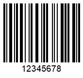

This article explains how to save generated barcode images to files, streams, or bitmaps. It also covers how to output barcode labels in various raster (BMP, PNG, JPEG, GIF, TIFF) and vector (EMF, SVG) formats.

## **Overview**
When working with barcodes, you might need to save them in different formats, including raster and vector formats. ***Aspose.BarCode for JavaScript via C++*** offers several options for saving barcodes, whether to files or bitmaps. Below, you'll find descriptions and code examples for saving barcodes in various formats.

{}*For any questions or support, contact [Aspose Technical Support](/barcode/javascript-cpp/technical-support/), visit the [Aspose.Barcode Forum](https://forum.aspose.com/c/barcode/13), or reach out to the [Aspose Paid Support Helpdesk](https://helpdesk.aspose.com/).*{}

## **Save Barcode to File**
With ***Aspose.BarCode for JavaScript via C++***, you can save barcodes directly to a file in your desired format. Below are examples showing how to save barcodes in different formats.

  
```javascript
var gen = new BarCodeInstance.BarcodeGenerator("Code128", "12345678");
gen.Save("StoreImageAsFile.png");
//or
gen.SaveExt("StoreImageAsFile.png", BarCodeInstance.BarCodeImageFormat.Png);

```


## **Save Barcode as data:image**

***Aspose.BarCode for JavaScript via C++*** allows you to output a barcode image as a bitmap object, which can then be saved in various formats or used for further graphical transformations. To obtain such a bitmap object, you can use the `GenerateBarCodeImage` method from the `BarcodeGenerator` class. The following code snippet demonstrates how to implement this functionality in ***Aspose.BarCode for JavaScript via C++***.


```javascript

var gen = new BarCodeInstance.BarcodeGenerator("Code128", "12345678");
document.getElementById("img").src = gen.GenerateBarCodeImage();

```

## **Output Barcodes in Raster Formats**

***Aspose.BarCode for JavaScript via C++*** allows saving barcode images in several popular raster formats, including BMP, PNG, GIF, JPEG, and TIFF. To save a barcode in a specific format, pass the [BarCodeImageFormat](https://reference.aspose.com/barcode/javascript-cpp/aspose.barcode.generation/barcodeimageformat) enum as the second argument to the `BarcodeGenerator.Save` method. Below are descriptions and code samples for each supported raster image format.

### **BMP Format**
Files with the .BMP extension are bitmap files designed to store bitmap digital images. BMP files are independent of graphics adapters and can store data as two-dimensional digital images in monochrome or color formats with various color depths. The BMP format creates uncompressed images, resulting in larger file sizes with 24-bit color depth and no loss or artifacts.

The following code snippet demonstrates how to save barcode images in BMP format.

```javascript

// JavaScript code for generating and saving a Code128 barcode as a BMP image
var gen = new BarCodeInstance.BarcodeGenerator("Code128", "12345678");
// Saving the barcode image as a BMP file
gen.SaveExt("RasterImageBmp.bmp", BarCodeInstance.BarCodeImageFormat.Bmp);

```
  
The example of a barcode image generated in the BMP format is demonstrated below.

<p align="center"></p>

### **PNG Format**
Portable Network Graphics (PNG) is a raster file format that supports lossless data compression. PNG is a popular choice for barcode images due to its ability to maintain high quality with 32-bit color depth and no loss of data. 

The following code example demonstrates how to save barcode images in the PNG format.

```javascript

// JavaScript code for generating and saving a Code128 barcode as a PNG image
var gen = new BarCodeInstance.BarcodeGenerator("Code128", "12345678");
// Saving the barcode image as a PNG file
gen.SaveExt("RasterImagePng.png", BarCodeInstance.BarCodeImageFormat.Png);


```
The resulting barcode label generated in the PNG format is given below.

<p align="center"></p>

### **GIF Format**
Graphics Interchange Format (GIF) is a lossless raster image format that supports up to 256 colors and can handle both static and animated images. In ***Aspose.BarCode for JavaScript via C++***, GIF is primarily used for black and white raster images. 

The following code snippet demonstrates how to save barcode images in the GIF format.

```javascript

// JavaScript code for generating and saving a Code128 barcode as a GIF image
var gen = new BarCodeInstance.BarcodeGenerator("Code128", "12345678");
// Saving the barcode image as a GIF file
gen.SaveExt("RasterImageGif.gif", BarCodeInstance.BarCodeImageFormat.Gif);


```
   
The barcode image example generated in the GIF format is demonstrated below.

<p align="center"></p>

### **JPEG Format**
JPEG (Joint Photographic Experts Group) is a widely used image format that supports lossy compression, resulting in reduced file sizes at the expense of image quality. This format is generally less suitable for saving barcode images due to potential artifacts and graphical noise introduced by compression. However, it can still be used if file size is a significant concern. 

The following code snippet shows how to save barcode images in the JPEG format.


```javascript

// JavaScript code for generating and saving a Code128 barcode as a JPEG image
var gen = new BarCodeInstance.BarcodeGenerator("Code128", "12345678");
// Saving the barcode image as a JPEG file
gen.SaveExt("RasterImageJpeg.jpeg", BarCodeInstance.BarCodeImageFormat.Jpeg);


```
 The example of a barcode image generated in the JPEG format is represented below.

<p align="center"></p>

### **TIFF (TIFFInCMYK) Format**
Tagged Image File Format (TIFF) is a high-quality raster image format that supports lossless compression and 32-bit color depth. It is particularly useful for applications requiring high image fidelity. Additionally, the TIFF format offers a variant known as TIFFInCMYK, which utilizes the CMYK color model, commonly used in color printing.

The following code snippet demonstrates how to generate barcode images in both standard TIFF and TIFFInCMYK formats.

```javascript

// JavaScript code for generating and saving a Code128 barcode as a TIFF image
var gen = new BarCodeInstance.BarcodeGenerator("Code128", "12345678");
// Saving the barcode image as a TIFF file
gen.SaveExt("RasterImageTiff.tiff", BarCodeInstance.BarCodeImageFormat.Tiff);
// Saving the barcode image as a TIFF file in CMYK color mode
gen.SaveExt("RasterImageTiffInCmyk.tiff", BarCodeInstance.BarCodeImageFormat.TiffInCmyk);


```
The examples of barcode labels created in TIFF and TIFFInCMYK formats are provided below.

| Output Format | TIFF | TIFFInCMYK |
| :-: | :-: | :-: |
| | <a href="rasterimagetiff.tiff"></a> | <a href="rasterimagetiffincmyk.tiff"></a> |

## **Output Barcodes in Vector Formats**
Vector formats represent images as mathematical equations and graphical operations, allowing for scaling without loss of quality. This makes vector images suitable for tasks where resolution preservation is important. ***Aspose.BarCode for JavaScript via C++*** supports saving barcode labels in two vector formats: EMF and SVG.

### **EMF Format**
Enhanced Metafile (EMF) is a vector image format used primarily in Windows for printing. EMF files store image data in a series of variable-length records that describe drawing commands and graphics properties. This allows the image to be rendered consistently across different devices and platforms. The code snippet below demonstrates how to generate barcode images in the EMF format.

```javascript

// JavaScript code for generating and saving a Code128 barcode as an EMF vector image
var gen = new BarCodeInstance.BarcodeGenerator("Code128", "12345678");
// Saving the barcode image as an EMF file
gen.SaveExt("VectorImageEmf.emf", BarCodeInstance.BarCodeImageFormat.Emf);


``` 
 The examples of barcode labels created in TIFF and TIFFInCMYK formats are provided below.

| Output Format | TIFF | TIFFInCMYK |
| :-: | :-: | :-: |
| | <a href="rasterimagetiff.tiff"></a> | <a href="rasterimagetiffincmyk.tiff"></a> |

## **Output Barcodes in Vector Formats**
Vector formats represent images as mathematical equations and graphical operations, allowing for scaling without loss of quality. This makes vector images suitable for tasks where resolution preservation is important. ***Aspose.BarCode for JavaScript via C++*** supports saving barcode labels in two vector formats: EMF and SVG.

### **EMF Format**
Enhanced Metafile (EMF) is a vector image format used primarily in Windows for printing. EMF files store image data in a series of variable-length records that describe drawing commands and graphics properties. This allows the image to be rendered consistently across different devices and platforms.

The example of a barcode image generated in the EMF format is demonstrated below.

<a href="vectorimageemf.emf"> <p align="center"> </p></a>

### **SVG Format**
Scalable Vector Graphics (SVG) is an XML-based vector image format used to render two-dimensional images in web applications. SVG files use XML text to describe how the image should appear, allowing them to be scaled to any size without losing resolution. This format is commonly used for web graphics and print designs that need to be resized.

The following code sample describes how to generate barcode images in the SVG format.

```javascript

// JavaScript code for generating and saving a Code128 barcode as an SVG vector image
var gen = new BarCodeInstance.BarcodeGenerator("Code128", "12345678");
// Saving the barcode image as an SVG file
gen.SaveExt("VectorImageSvg.svg", BarCodeInstance.BarCodeImageFormat.Svg);


``` 
  
The example of a barcode label created in the SVG format is provided below.
  
<p align="center"><image src="vectorimagesvg.svg"></p>
