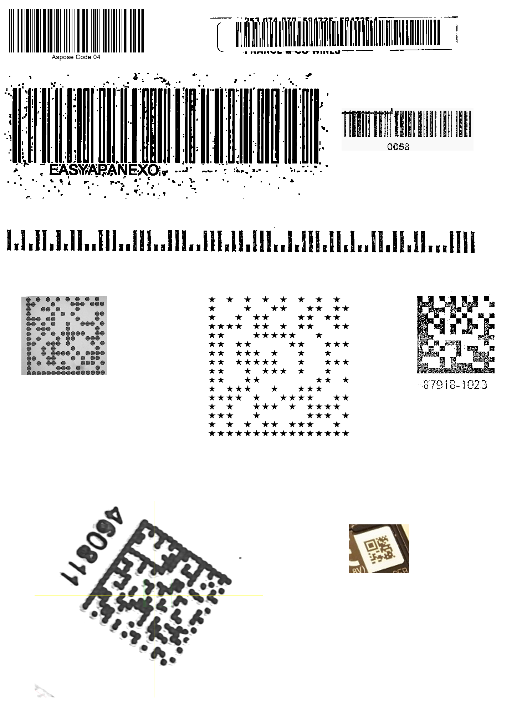

{}[Read Barcodes Online](https://products.aspose.app/barcode/recognize): You can check the quality of Aspose.BarCode recognition and view the results online.{}
## **Overview**

***Aspose.BarCode for JavaScript via C++*** offers special modes that utilize advanced algorithms to recognize barcode elements even when dealing with low-quality barcodes or images. The **[BarcodeQuality](https://reference.aspose.com/barcode/javascript-cpp/aspose.barcode.barcoderecognition/qualitysettings/properties/barcodequality)** mode improves recognition for barcodes of varying quality by enabling specific recognition methods. Additionally, **[Deconvolution](https://reference.aspose.com/barcode/javascript-cpp/aspose.barcode.barcoderecognition/qualitysettings/properties/deconvolution)** allows the engine to apply image preprocessing techniques that enhance the quality of images before barcode recognition. Both of these methods prioritize recognition accuracy over processing speed.

{}*If you need any clarifications, feel free to reach out to [Aspose Technical Support](/barcode/javascript-cpp/technical-support/): ask your questions at [Aspose.Barcode Forum](https://forum.aspose.com/c/barcode/13) or contact [Aspose Paid Support Helpdesk](https://helpdesk.aspose.com/).*{}

## **Barcode Quality Mode**

The **[BarcodeQuality](https://reference.aspose.com/barcode/javascript-cpp/aspose.barcode.barcoderecognition/qualitysettings/properties/barcodequality)** property allows you to set the recognition method based on the barcode's quality. Lower-quality barcodes require more complex recognition processes, which can result in slower performance but better accuracy. The mode options are as follows:

| **Barcode Quality Mode** | **Description** |
|--------------------------|-----------------|
| *High*                    | Enables recognition methods optimized for high-quality barcodes. This is the fastest mode but may not be sufficient for lower-quality barcodes. |
| *Normal*                  | Uses standard recognition methods suitable for barcodes of common or normal quality. This is the default mode for most barcodes. |
| *Low*                     | Applies advanced recognition methods tailored for low-quality barcodes. This is the slowest mode but provides the highest accuracy for damaged or difficult-to-read barcodes. |

### **Example Scenario:**
- **High mode** is ideal for clear, well-printed barcodes with minimal distortion.
- **Normal mode** is suitable for barcodes that are in good condition but may have minor imperfections.
- **Low mode** is best used when working with barcodes printed on damaged surfaces or images with low resolution and high noise.

### **Impact on Performance:**
Selecting higher-quality recognition modes may slow down the processing speed but increases the likelihood of successfully decoding challenging barcodes. Choosing *High* mode optimizes for speed, while *Low* mode maximizes accuracy at the cost of performance.


## **Deconvolution Mode**

The **[Deconvolution](https://reference.aspose.com/barcode/javascript-cpp/aspose.barcode.barcoderecognition/qualitysettings/properties/deconvolution)** mode in **Aspose.BarCode for JavaScript via C++** allows you to improve image quality by applying deconvolution techniques. Deconvolution restores an image that has been blurred or distorted during its capture, such as through camera motion or focus issues. Since the precise nature of the distortion cannot always be determined, commonly known methods such as **[sharp](https://en.wikipedia.org/wiki/Kernel_(image_processing))** and **[mathematical morphology](https://en.wikipedia.org/wiki/Mathematical_morphology)** are applied.

Deconvolution algorithms can be computationally intensive and may slow down barcode recognition. The available deconvolution modes are:

| **Deconvolution Mode** | **Description** |
|------------------------|-----------------|
| *Fast*                  | Utilizes quick deconvolution algorithms suitable for high-quality images without significant distortions. Offers a balance between performance and quality. |
| *Normal*                | Applies moderate deconvolution methods for images with light distortions, such as slight noise or blur. This mode balances performance and the enhancement of image quality. |
| *Slow*                  | Implements intensive deconvolution processes for images with severe distortions, like significant blur or noise. Provides the highest quality improvement but impacts processing speed. |

## **Using Barcode Quality and Deconvolution Modes**

To optimize the recognition quality of barcodes, the **[BarcodeQuality](https://reference.aspose.com/barcode/javascript-cpp/aspose.barcode.barcoderecognition/qualitysettings/properties/barcodequality)** and **[Deconvolution](https://reference.aspose.com/barcode/javascript-cpp/aspose.barcode.barcoderecognition/qualitysettings/properties/deconvolution)** modes can be combined strategically. The following table illustrates the impact of different combinations of **BarcodeQuality** and **Deconvolution** settings on the number of recognized barcodes:

<p align="center"></p>

| **Barcode Quality** | **Deconvolution** | **Recognized barcodes** |
|---------------------|-------------------|-------------------------|
| **High**             | **Fast**          | **4**                   |
| **Normal**           | **Normal**        | **6**                   |
| **Low**              | **Normal**        | **9**                   |
| **Normal**           | **Slow**          | **7**                   |
| **Low**              | **Slow**          | **10**                  |

### **Explanation of the Results:**
- **High + Fast**: Best suited for high-quality images, where minimal enhancement is needed. Recognizes fewer barcodes due to the limited deconvolution scope.
- **Normal + Normal**: Offers a balanced approach with moderate image preprocessing for typical image conditions.
- **Low + Normal**: Suitable for images that have more pronounced distortions. Provides good recognition results with normal deconvolution.
- **Normal + Slow**: Enhances images with heavier distortions, but with a reduced performance speed.
- **Low + Slow**: Delivers the highest recognition accuracy, ideal for images with severe distortion but at the cost of slower processing.

These settings allow you to fine-tune the barcode recognition engine based on your image quality and processing needs.


```javascript
// recognize image with BarcodeQualityMode High, DeconvolutionMode Fast
console.log("BarcodeQualityMode: High, DeconvolutionMode: Fast");
var reader = new BarCodeInstance.BarCodeReader(`${path}manybarcodes_quality_deconvolution.png`, "Code128,Code39Extended,Planet,QR,MicroQR,DataMatrix");
reader.QualitySettings.BarcodeQuality = BarCodeInstance.BarcodeQualityMode.High;
reader.QualitySettings.Deconvolution = BarCodeInstance.DeconvolutionMode.Fast;
reader.ReadBarCodes();
for (var i = 0; i < reader.FoundCount; i++) {
    const result = reader.FoundBarCodes(i);
    console.log(`${result.CodeType}: ${result.CodeText}`);
}

// recognize image with BarcodeQualityMode Normal, DeconvolutionMode Normal
console.log("BarcodeQualityMode: Normal, DeconvolutionMode: Normal");
var reader = new BarCodeInstance.BarCodeReader(`${path}manybarcodes_quality_deconvolution.png`, "Code128,Code39Extended,Planet,QR,MicroQR,DataMatrix");
reader.QualitySettings.BarcodeQuality = BarCodeInstance.BarcodeQualityMode.Normal;
reader.QualitySettings.Deconvolution = BarCodeInstance.DeconvolutionMode.Normal;
reader.ReadBarCodes();
for (var i = 0; i < reader.FoundCount; i++) {
    const result = reader.FoundBarCodes(i);
    console.log(`${result.CodeType}: ${result.CodeText}`);
}

// recognize image with BarcodeQualityMode Low, DeconvolutionMode Normal
console.log("BarcodeQualityMode: Low, DeconvolutionMode: Normal");
var reader = new BarCodeInstance.BarCodeReader(`${path}manybarcodes_quality_deconvolution.png`, "Code128,Code39Extended,Planet,QR,MicroQR,DataMatrix");
reader.QualitySettings.BarcodeQuality = BarCodeInstance.BarcodeQualityMode.Low;
reader.QualitySettings.Deconvolution = BarCodeInstance.DeconvolutionMode.Normal;
reader.ReadBarCodes();
for (var i = 0; i < reader.FoundCount; i++) {
    const result = reader.FoundBarCodes(i);
    console.log(`${result.CodeType}: ${result.CodeText}`);
}

// recognize image with BarcodeQualityMode Normal, DeconvolutionMode Slow
console.log("BarcodeQualityMode: Normal, DeconvolutionMode: Slow");
var reader = new BarCodeInstance.BarCodeReader(`${path}manybarcodes_quality_deconvolution.png`, "Code128,Code39Extended,Planet,QR,MicroQR,DataMatrix");
reader.QualitySettings.BarcodeQuality = BarCodeInstance.BarcodeQualityMode.Normal;
reader.QualitySettings.Deconvolution = BarCodeInstance.DeconvolutionMode.Slow;
reader.ReadBarCodes();
for (var i = 0; i < reader.FoundCount; i++) {
    const result = reader.FoundBarCodes(i);
    console.log(`${result.CodeType}: ${result.CodeText}`);
}

// recognize image with BarcodeQualityMode Low, DeconvolutionMode Slow
console.log("BarcodeQualityMode: Low, DeconvolutionMode: Slow");
var reader = new BarCodeInstance.BarCodeReader(`${path}manybarcodes_quality_deconvolution.png`, "Code128,Code39Extended,Planet,QR,MicroQR,DataMatrix");
reader.QualitySettings.BarcodeQuality = BarCodeInstance.BarcodeQualityMode.Low;
reader.QualitySettings.Deconvolution = BarCodeInstance.DeconvolutionMode.Slow;
reader.ReadBarCodes();
for (var i = 0; i < reader.FoundCount; i++) {
    const result = reader.FoundBarCodes(i);
    console.log(`${result.CodeType}: ${result.CodeText}`);
}

reader.delete();

```

