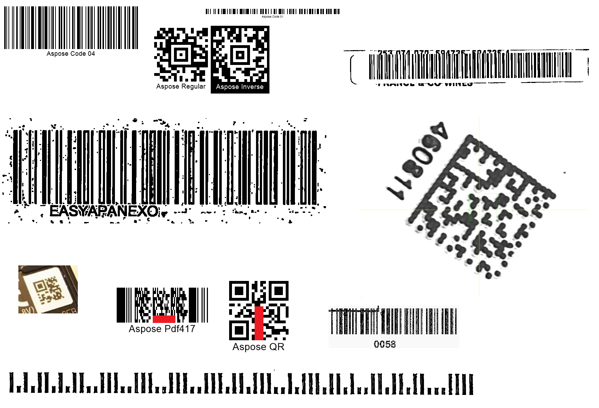

{}[Read Barcodes Online](https://products.aspose.app/barcode/recognize): You can check the quality of Aspose.BarCode recognition and view the results online.{}
## **Overview**
***Aspose.BarCode for JavaScript via C++*** provides the [*QualitySettings*](https://reference.aspose.com/barcode/javascript-cpp/aspose.barcode.barcoderecognition/qualitysettings) class, enabling developers to fine-tune various algorithms for image recovery and barcode recognition. This functionality helps handle distortions or artifacts in barcode images. The class also provides preset parameters to balance reading speed and quality, catering to different recognition scenarios.

{}*If you need clarifications, reach out to [Aspose Technical Support](/barcode/javascript-cpp/technical-support/): ask questions at the [Aspose.Barcode Forum](https://forum.aspose.com/c/barcode/13) or contact [Aspose Paid Support Helpdesk](https://helpdesk.aspose.com/).*{}

## **Supported Presets**
Below is a summary of supported recognition presets in [*QualitySettings*](https://reference.aspose.com/barcode/javascript-cpp/aspose.barcode.barcoderecognition/qualitysettings), including *NormalQuality*, *HighPerformance*, *HighQuality*, and *MaxQuality*. By default, the *NormalQuality* preset is used.

| **Recognition Preset** | **Description** |
|-------------------------|-----------------|
| [*HighPerformance*](https://reference.aspose.com/barcode/javascript-cpp/aspose.barcode.barcoderecognition/qualitysettings/properties/highperformance) | Recommended for high-quality barcode images. |
| [*NormalQuality*](https://reference.aspose.com/barcode/javascript-cpp/aspose.barcode.barcoderecognition/qualitysettings/properties/normalquality) | Suitable for most barcodes with regular quality. |
| [*HighQuality*](https://reference.aspose.com/barcode/javascript-cpp/aspose.barcode.barcoderecognition/qualitysettings/properties/highquality) | Designed for low-quality barcodes. |
| [*MaxQuality*](https://reference.aspose.com/barcode/javascript-cpp/aspose.barcode.barcoderecognition/qualitysettings/properties/maxquality) | Targets low-quality barcodes and employs all recognition methods, offering recognition quality close to *HighQuality*. |


## **Supported Options**
Aspose.BarCode for JavaScript via C++ offers a variety of manually configurable options to enhance barcode recognition performance and quality. These options, including *XDimension*, *BarcodeQuality*, *Deconvolution*, *InverseImage*, *ComplexBackground*, and others, are described in the table below.

| **Recognition Option** | **Description** |
|-------------------------|-----------------|
| [*XDimension*](https://reference.aspose.com/barcode/javascript-cpp/aspose.barcode.barcoderecognition/qualitysettings/properties/xdimension) | Recognition mode utilizing knowledge of the minimal barcode element (e.g., matrix cell or bar). This helps cut off noise, text, and non-barcode elements to improve performance. Works alongside [*UseMinimalXDimension*](https://reference.aspose.com/barcode/javascript-cpp/aspose.barcode.barcoderecognition/xdimensionmode/) and [*MinimalXDimension*](https://reference.aspose.com/barcode/javascript-cpp/aspose.barcode.barcoderecognition/qualitysettings/properties/minimalxdimension). |
| [*MinimalXDimension*](https://reference.aspose.com/barcode/javascript-cpp/aspose.barcode.barcoderecognition/qualitysettings/properties/minimalxdimension) | Specifies the minimal size of the [*XDimension*](https://reference.aspose.com/barcode/javascript-cpp/aspose.barcode.barcoderecognition/qualitysettings/properties/xdimension) in pixels, used in conjunction with [*UseMinimalXDimension*](https://reference.aspose.com/barcode/javascript-cpp/aspose.barcode.barcoderecognition/xdimensionmode/). |
| [*BarcodeQuality*](https://reference.aspose.com/barcode/javascript-cpp/aspose.barcode.barcoderecognition/qualitysettings/properties/barcodequality) | Enables methods to recognize barcode elements with the selected quality. Higher-quality barcode elements may require more complex recognition methods, potentially slowing the process. |
| [*Deconvolution*](https://reference.aspose.com/barcode/javascript-cpp/aspose.barcode.barcoderecognition/qualitysettings/properties/deconvolution) | Defines the level of image degradation restoration (deconvolution). Attempts to recover barcodes obscured by factors such as blur using well-known functions like [sharp](https://en.wikipedia.org/wiki/Kernel_(image_processing)) or [mathematical morphology](https://en.wikipedia.org/wiki/Mathematical_morphology). |
| [*InverseImage*](https://reference.aspose.com/barcode/javascript-cpp/aspose.barcode.barcoderecognition/qualitysettings/properties/inverseimage) | Enables or disables additional recognition of barcodes in images with inverted colors (e.g., white bars on a black background). |
| [*ComplexBackground*](https://reference.aspose.com/barcode/javascript-cpp/aspose.barcode.barcoderecognition/qualitysettings/properties/complexbackground) | Enables or disables recognition of color barcodes on complex or colorful backgrounds. |
| [*AllowIncorrectBarcodes*](https://reference.aspose.com/barcode/javascript-cpp/aspose.barcode.barcoderecognition/qualitysettings/properties/allowincorrectbarcodes) | Allows recognition of barcodes with incorrect checksum or values. Useful for identifying or marking damaged barcodes with erroneous text. |

## **Difference in Barcode Reading with Quality Presets**

Aspose.BarCode for JavaScript via C++ offers four universal recognition quality presets: 
- [*HighPerformance*](https://reference.aspose.com/barcode/javascript-cpp/aspose.barcode.barcoderecognition/qualitysettings/properties/highperformance)
- [*NormalQuality*](https://reference.aspose.com/barcode/javascript-cpp/aspose.barcode.barcoderecognition/qualitysettings/properties/normalquality) (default)
- [*HighQuality*](https://reference.aspose.com/barcode/javascript-cpp/aspose.barcode.barcoderecognition/qualitysettings/properties/highquality)
- [*MaxQuality*](https://reference.aspose.com/barcode/javascript-cpp/aspose.barcode.barcoderecognition/qualitysettings/properties/maxquality)

These presets enable developers to balance recognition quality and speed for various barcode types. For most barcodes with standard scanning quality, the default *NormalQuality* preset is usually sufficient.

The table below illustrates the difference in recognition results for the same barcodes based on the preset used:

<p align="center"></p>

| **HighPerformance Preset** | **NormalQuality Preset** | **HighQuality Preset** | **MaxQuality Preset** | **MaxQuality Preset and Incorrect Barcodes** |
|----------------------------|--------------------------|-------------------------|------------------------|---------------------------------------------|
| Recognized barcodes: **5** | Recognized barcodes: **7** | Recognized barcodes: **10** | Recognized barcodes: **10** | Recognized barcodes: **12** |

### **Key Observations:**
- **HighPerformance** focuses on speed, identifying fewer barcodes in complex scenarios.
- **NormalQuality** balances speed and accuracy, making it ideal for standard use cases.
- **HighQuality** enables advanced algorithms for low-quality or partially damaged barcodes.
- **MaxQuality** utilizes all available recognition methods, ensuring maximum detection at the cost of performance.
- Combining *MaxQuality* with the *AllowIncorrectBarcodes* mode further increases recognition for damaged or incomplete barcodes.


[How to get *BarCodeInstance*](/barcode/javascript-cpp/get-barcode-module-instance/)
```javascript
console.log("ReadQualityPresets:");
// recognize image with HighPerformance
console.log("ReadQualityPresets: HighPerformance");
var reader = new BarCodeInstance.BarCodeReader(`${path}barcodes_different_quality.png`, "Code128,Code39Extended,Planet,QR,MicroQR,Pdf417,DataMatrix,Aztec");
reader.QualitySettings = BarCodeInstance.QualitySettings.HighPerformance;
reader.ReadBarCodes();
for (var i = 0; i < reader.FoundCount; i++) {
    const result = reader.FoundBarCodes(i);
    console.log(`${result.CodeType}: ${result.CodeText}`);
}

// recognize image with NormalQuality
console.log("ReadQualityPresets: NormalQuality");
var reader = new BarCodeInstance.BarCodeReader(`${path}barcodes_different_quality.png`, "Code128,Code39Extended,Planet,QR,MicroQR,Pdf417,DataMatrix,Aztec");
reader.QualitySettings = BarCodeInstance.QualitySettings.NormalQuality;
reader.ReadBarCodes();
for (var i = 0; i < reader.FoundCount; i++) {
    const result = reader.FoundBarCodes(i);
    console.log(`${result.CodeType}: ${result.CodeText}`);
}

// recognize image with HighQuality
console.log("ReadQualityPresets: HighQuality");
var reader = new BarCodeInstance.BarCodeReader(`${path}barcodes_different_quality.png`, "Code128,Code39Extended,Planet,QR,MicroQR,Pdf417,DataMatrix,Aztec");
reader.QualitySettings = BarCodeInstance.QualitySettings.HighQuality;
reader.ReadBarCodes();
for (var i = 0; i < reader.FoundCount; i++) {
    const result = reader.FoundBarCodes(i);
    console.log(`${result.CodeType}: ${result.CodeText}`);
}

// recognize image with MaxQuality
console.log("ReadQualityPresets: MaxQuality");
var reader = new BarCodeInstance.BarCodeReader(`${path}barcodes_different_quality.png`, "Code128,Code39Extended,Planet,QR,MicroQR,Pdf417,DataMatrix,Aztec");
reader.QualitySettings = BarCodeInstance.QualitySettings.MaxQuality;
reader.ReadBarCodes();
for (var i = 0; i < reader.FoundCount; i++) {
    const result = reader.FoundBarCodes(i);
    console.log(`${result.CodeType}: ${result.CodeText}`);
}

// recognize image with MaxQuality and Incorrect Barcodes
console.log("ReadQualityPresets: MaxQuality and Incorrect Barcodes");
var reader = new BarCodeInstance.BarCodeReader(`${path}barcodes_different_quality.png`, "Code128,Code39Extended,Planet,QR,MicroQR,Pdf417,DataMatrix,Aztec");
reader.QualitySettings = BarCodeInstance.QualitySettings.MaxQuality;
reader.QualitySettings.AllowIncorrectBarcodes = true;
reader.ReadBarCodes();
for (var i = 0; i < reader.FoundCount; i++) {
    const result = reader.FoundBarCodes(i);
    console.log(`${result.CodeType}: ${result.CodeText}`);
}

reader.delete();

```
## **Read Evidently Incorrect Barcodes**

Aspose.BarCode for JavaScript via C++ includes an option called [*AllowIncorrectBarcodes*](https://reference.aspose.com/barcode/javascript-cpp/aspose.barcode.barcoderecognition/qualitysettings/properties/allowincorrectbarcodes) that enables the recognition of potentially problematic barcodes in an image, even if they fail checksum validation. This is particularly useful for debugging purposes, as it allows the library to mark or partially recognize barcodes that are incomplete or corrupted.

When the *AllowIncorrectBarcodes* mode is enabled, the recognition process proceeds with a [*Confidence*](https://reference.aspose.com/barcode/javascript-cpp/aspose.barcode.barcoderecognition/barcoderesult/properties/confidence) level set to *None*. This means that while the barcode is decoded, its accuracy is not guaranteed.

The code snippet below demonstrates how to force the recognition of barcodes that might otherwise be unreadable:

<p align="center"></p>

### **Recognition Results:**
| **Incorrect Barcodes: disabled** | **Incorrect Barcodes: enabled** |
|----------------------------------|---------------------------------|
| Recognized barcodes: **0**        | Recognized barcodes: **2**      |

### **Explanation:**
- **Disabled mode**: The engine does not recognize the corrupted barcodes.
- **Enabled mode**: The engine attempts to recognize and decode the barcodes, even if their checksums fail, leading to partial or inaccurate results. This mode is suitable for situations where developers want to extract data for further investigation or troubleshooting.


[How to get *BarCodeInstance*](/barcode/javascript-cpp/get-barcode-module-instance/)
```javascript
console.log("ReadIncorrectBarcodes:");
// recognize image with disabled AllowIncorrectBarcodes
console.log("AllowIncorrectBarcodes: false");
var reader = new BarCodeInstance.BarCodeReader(`${path}pdf417_qr_corrupted.png`, "QR,Pdf417");
reader.QualitySettings.AllowIncorrectBarcodes = false;
reader.ReadBarCodes();
for (var i = 0; i < reader.FoundCount; i++) {
    const result = reader.FoundBarCodes(i);
    console.log(`${result.CodeType}: ${result.CodeText}`);
}

// recognize image with enabled AllowIncorrectBarcodes
console.log("AllowIncorrectBarcodes: true");
var reader = new BarCodeInstance.BarCodeReader(`${path}pdf417_qr_corrupted.png`, "QR,Pdf417");
reader.QualitySettings.AllowIncorrectBarcodes = true;
reader.ReadBarCodes();
for (var i = 0; i < reader.FoundCount; i++) {
    const result = reader.FoundBarCodes(i);
    console.log(`${result.CodeType}: ${result.CodeText}`);
}

reader.delete();

```

