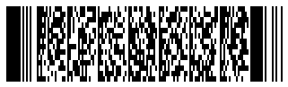
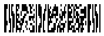
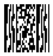
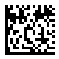
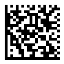
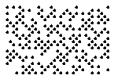
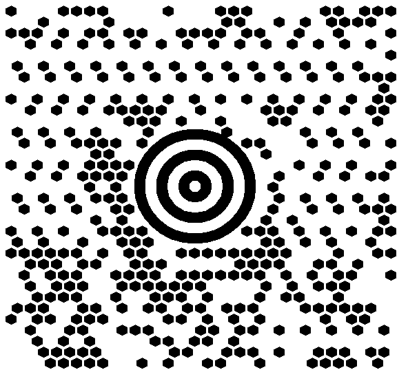

  
## **Read Metadata from PDF417, Macro PDF417, and Micro PDF417 Barcodes**

To read metadata from *PDF417* and *Micro PDF417* barcodes, ***Aspose.BarCode for JavaScript via C++*** provides a group of properties called [*Pdf417ExtendedParameters*](https://reference.aspose.com/barcode/javascript-cpp/aspose.barcode.barcoderecognition/pdf417extendedparameters).

### **Read Structured Append and Macro Fields from PDF417 and Micro PDF417 Barcodes**

The table below describes the Structured Append and Macro fields that can be read from *PDF417* and *Micro PDF417* barcodes:

|PDF417 Metadata Field|Description|
|---|---|
|[*Pdf417MacroFileID*](https://reference.aspose.com/barcode/javascript-cpp/aspose.barcode.generation/pdf417parameters/properties/pdf417macrofileid)|Unique identifier for a barcode series or PDF417 file|
|[*Pdf417MacroSegmentID*](https://reference.aspose.com/barcode/javascript-cpp/aspose.barcode.generation/pdf417parameters/properties/pdf417macrosegmentid)|Identifier for the current segment|
|[*Pdf417MacroSegmentsCount*](https://reference.aspose.com/barcode/javascript-cpp/aspose.barcode.generation/pdf417parameters/properties/pdf417macrosegmentscount)|Total number of barcodes in the series|
|[*Pdf417MacroFileName*](https://reference.aspose.com/barcode/javascript-cpp/aspose.barcode.generation/pdf417parameters/properties/pdf417macrofilename)|Name of the file|
|[*Pdf417MacroChecksum*](https://reference.aspose.com/barcode/javascript-cpp/aspose.barcode.generation/pdf417parameters/properties/pdf417macrochecksum)|File checksum, calculated using the CCITT-16 polynomial|
|[*Pdf417MacroFileSize*](https://reference.aspose.com/barcode/javascript-cpp/aspose.barcode.generation/pdf417parameters/properties/pdf417macrofilesize)|Total byte size of the file series|
|[*Pdf417MacroTimeStamp*](https://reference.aspose.com/barcode/javascript-cpp/aspose.barcode.generation/pdf417parameters/properties/pdf417macrotimestamp)|Time of file creation or transmission|
|[*Pdf417MacroAddressee*](https://reference.aspose.com/barcode/javascript-cpp/aspose.barcode.generation/pdf417parameters/properties/pdf417macroaddressee)|Address of the file recipient|
|[*Pdf417MacroSender*](https://reference.aspose.com/barcode/javascript-cpp/aspose.barcode.generation/pdf417parameters/properties/pdf417macrosender)|Name of the file sender|

The following code snippet demonstrates how to extract Structured Append and Macro fields from a sample *PDF417* barcode provided below.

 
[How to get *BarCodeInstance*](/barcode/javascript-cpp/get-barcode-module-instance/)
```javascript
// Generate MacroPdf417 with metadata
var gen = new BarCodeInstance.BarcodeGenerator("MacroPdf417", "Åspóse.Barcóde©");
gen.Parameters.Barcode.XDimension.Pixels = 2;
gen.Parameters.Barcode.Pdf417.Columns = 5;
gen.Parameters.Barcode.Pdf417.Pdf417MacroFileID = 12345678;
gen.Parameters.Barcode.Pdf417.Pdf417MacroSegmentID = 12;
gen.Parameters.Barcode.Pdf417.Pdf417MacroSegmentsCount = 20;
gen.Parameters.Barcode.Pdf417.Pdf417MacroFileName = "file01";
// Checksum must be calculated in CCITT-16 / CRC-16-CCITT encoding
gen.Parameters.Barcode.Pdf417.Pdf417MacroChecksum = 1234;
gen.Parameters.Barcode.Pdf417.Pdf417MacroFileSize = 400000;
gen.Parameters.Barcode.Pdf417.Pdf417MacroTimeStamp = "1970-10-20T15:20:35.123Z"
gen.Parameters.Barcode.Pdf417.Pdf417MacroAddressee = "street";
gen.Parameters.Barcode.Pdf417.Pdf417MacroSender = "aspose";
gen.Parameters.Barcode.Pdf417.Pdf417MacroTerminator = BarCodeInstance.Pdf417MacroTerminator.Set;
document.getElementById("img").src = gen.GenerateBarCodeImage(); // Display barcode image

// Try to recognize Pdf417 metadata
console.log("ReadExtPDF417Meta:");
var reader = new BarCodeInstance.BarCodeReader(gen.GenerateBarCodeImage(), "MacroPdf417");
reader.ReadBarCodes();
for (var i = 0; i < reader.FoundCount; i++) {
    var result = reader.FoundBarCodes(i);
    console.log(`CodeType: ${result.CodeType}`);
    console.log(`CodeText: ${result.CodeText}`);
    console.log(`Pdf417MacroFileID: ${result.Extended.Pdf417.MacroPdf417FileID}`);
    console.log(`Pdf417MacroSegmentID: ${result.Extended.Pdf417.MacroPdf417SegmentID}`);
    console.log(`Pdf417MacroSegmentsCount: ${result.Extended.Pdf417.MacroPdf417SegmentsCount}`);
    console.log(`Pdf417MacroFileName: ${result.Extended.Pdf417.MacroPdf417FileName}`);
    console.log(`Pdf417MacroChecksum: ${result.Extended.Pdf417.MacroPdf417Checksum}`);
    console.log(`Pdf417MacroFileSize: ${result.Extended.Pdf417.MacroPdf417FileSize}`);
    console.log(`Pdf417MacroTimeStamp: ${result.Extended.Pdf417.MacroPdf417TimeStamp}`);
    console.log(`Pdf417MacroAddressee: ${result.Extended.Pdf417.MacroPdf417Addressee}`);
    console.log(`Pdf417MacroSender: ${result.Extended.Pdf417.MacroPdf417Sender}`);
    console.log(`MacroPdf417Terminator: ${result.Extended.Pdf417.MacroPdf417Terminator}`);
}

gen.delete();
read.delete();

```

<p align="center"></p>  

### **Read Special Modes Indicators from PDF417 and Micro PDF417 Barcodes**

Special modes indicators can be read from [*Pdf417ExtendedParameters*](https://reference.aspose.com/barcode/javascript-cpp/aspose.barcode.barcoderecognition/pdf417extendedparameters). To check if a barcode contains initialization or reprogramming instructions for the barcode reader, use the [*IsReaderInitialization*](https://reference.aspose.com/barcode/javascript-cpp/aspose.barcode.barcoderecognition/pdf417extendedparameters/isreaderinitialization/) property.

[How to get *BarCodeInstance*](/barcode/javascript-cpp/get-barcode-module-instance/)
```javascript
// Generate MacroPdf417 with Reader Initialization
var gen = new BarCodeInstance.BarcodeGenerator("Pdf417", "Åspóse.Barcóde©");
gen.Parameters.Barcode.XDimension.Pixels = 2;
gen.Parameters.Barcode.Pdf417.Columns = 5;
gen.Parameters.Barcode.Pdf417.IsReaderInitialization = true;
document.getElementById("img").src = gen.GenerateBarCodeImage(); // Display barcode image

// Try to recognize Pdf417 Reader Initialization
console.log("ReadExtPDF417Meta: Reader Initialization");
var reader = new BarCodeInstance.BarCodeReader(gen.GenerateBarCodeImage(), "Pdf417");

reader.ReadBarCodes();
for (var i = 0; i < reader.FoundCount; i++) {
    var result = reader.FoundBarCodes(i);
    console.log(`CodeType: ${result.CodeType}`);
    console.log(`CodeText: ${result.CodeText}`);
    console.log(`IsReaderInitialization: ${result.Extended.Pdf417.IsReaderInitialization}`);
}

gen.delete();
read.delete();

```
<p align="center"></p>  

To read the linked state of *PDF417* and *Micro PDF417* barcodes, use the [*IsLinked*](https://reference.aspose.com/barcode/javascript-cpp/aspose.barcode.barcoderecognition/pdf417extendedparameters/islinked/) property. This property is set when modes 906, 907, 912, 914, 915, 918, or 920 are present in the barcode data.

[How to get *BarCodeInstance*](/barcode/javascript-cpp/get-barcode-module-instance/)
```javascript
// Generate MacroPdf417 with Linked state
var gen = new BarCodeInstance.BarcodeGenerator("MicroPdf417", "Åspóse.Barcóde©");
gen.Parameters.Barcode.XDimension.Pixels = 2;
gen.Parameters.Barcode.Pdf417.IsLinked = true;
document.getElementById("img").src = gen.GenerateBarCodeImage(); // Display barcode image

// Try to recognize Pdf417 Linked state
console.log("ReadExtPDF417Meta: Linked state");
var reader = new BarCodeInstance.BarCodeReader(gen.GenerateBarCodeImage(), "MicroPdf417");
reader.ReadBarCodes();
for (var i = 0; i < reader.FoundCount; i++) {
    var result = reader.FoundBarCodes(i);
    console.log(`CodeType: ${result.CodeType}`);
    console.log(`CodeText: ${result.CodeText}`);
    console.log(`IsLinked: ${result.Extended.Pdf417.IsLinked}`);
}

gen.delete();
reader.delete();

```
<p align="center"></p>  

To read the Code128 emulation state in *Micro PDF417* barcodes, use the [*IsCode128Emulation*](https://reference.aspose.com/barcode/javascript-cpp/aspose.barcode.barcoderecognition/pdf417extendedparameters/iscode128emulation/) property. This property is set when modes 908, 909, 910, or 911 are present in the barcode data.

[How to get *BarCodeInstance*](/barcode/javascript-cpp/get-barcode-module-instance/)
```javascript
// Generate MacroPdf417 with Code128 Emulation state
var gen = new BarCodeInstance.BarcodeGenerator("MicroPdf417", "Aspose.Barcode");
gen.Parameters.Barcode.XDimension.Pixels = 2;
gen.Parameters.Barcode.Pdf417.IsCode128Emulation = true;
document.getElementById("img").src = gen.GenerateBarCodeImage(); // Display barcode image

// Try to recognize Pdf417 Code128 Emulation state
console.log("ReadExtPDF417Meta: Code128 Emulation");
var reader = new BarCodeInstance.BarCodeReader(gen.GenerateBarCodeImage(), "MicroPdf417");
reader.ReadBarCodes();
for (var i = 0; i < reader.FoundCount; i++) {
    var result = reader.FoundBarCodes(i);
    console.log(`CodeType: ${result.CodeType}`);
    console.log(`CodeText: ${result.CodeText}`);
    console.log(`IsCode128Emulation: ${result.Extended.Pdf417.IsCode128Emulation}`);
}

gen.delete();
reader.delete();

```
<p align="center"></p>  

## **Read Metadata from QR Code with Structured Append**

To read metadata from *QR Code* barcodes, use the [*QrExtendedParameters*](https://reference.aspose.com/barcode/javascript-cpp/aspose.barcode.barcoderecognition/qrextendedparameters) properties. These properties help read information about *QR Code* barcodes with structured append, allowing multiple *QR Code* labels to be combined into one. The relevant fields include:

- [*QRStructuredAppendModeBarCodeIndex*](https://reference.aspose.com/barcode/javascript-cpp/aspose.barcode.barcoderecognition/qrextendedparameters/properties/qrstructuredappendmodebarcodeindex) - the sequence number of the current barcode (starting from 0)
- [*QRStructuredAppendModeBarCodesQuantity*](https://reference.aspose.com/barcode/javascript-cpp/aspose.barcode.barcoderecognition/qrextendedparameters/properties/qrstructuredappendmodebarcodesquantity) - the total number of barcodes in a composite *QR Code* image (values range from 2 to 16)
- [*QRStructuredAppendModeParityData*](https://reference.aspose.com/barcode/javascript-cpp/aspose.barcode.barcoderecognition/qrextendedparameters/properties/qrstructuredappendmodeparitydata) - a byte used as a checksum identifier, generally calculated as *XOR* of all bytes representing UTF16BE symbols encoded with two bytes.

The following code snippet demonstrates how to retrieve metadata from a sample *QR Code* image with structured append.

   
[How to get *BarCodeInstance*](/barcode/javascript-cpp/get-barcode-module-instance/)
```javascript
// Generate QR with metadata
var gen = new BarCodeInstance.BarcodeGenerator("QR", "Åspóse.Barcóde©");
gen.Parameters.Barcode.XDimension.Pixels = 4;
gen.Parameters.Barcode.QR.StructuredAppend.TotalCount = 3;
gen.Parameters.Barcode.QR.StructuredAppend.SequenceIndicator = 1;
gen.Parameters.Barcode.QR.StructuredAppend.ParityByte = 123;
document.getElementById("img").src = gen.GenerateBarCodeImage(); // Display barcode image

// Attempt to recognize QR metadata
console.log("ReadExtQRMeta:");
var reader = new BarCodeInstance.BarCodeReader(gen.GenerateBarCodeImage(), "QR");
reader.ReadBarCodes();
for (var i = 0; i < reader.FoundCount; i++) {
    var result = reader.FoundBarCodes(i);
    console.log(`CodeType: ${result.CodeType}`);
    console.log(`CodeText: ${result.CodeText}`);
    console.log(`BarCodesQuantity: ${result.Extended.QR.QRStructuredAppendModeBarCodesQuantity}`);
    console.log(`BarCodeIndex: ${result.Extended.QR.QRStructuredAppendModeBarCodeIndex}`);
    console.log(`ParityData: ${result.Extended.QR.QRStructuredAppendModeParityData}`);
}

gen.delete();
reader.delete();

```

<p align="center"></p>

## **Read Metadata from Aztec Code**

Metadata from *Aztec Code* barcodes can be accessed using the [*AztecExtendedParameters*](https://reference.aspose.com/barcode/javascript-cpp/aspose.barcode.barcoderecognition/aztecextendedparameters/) properties. These properties allow reading extended information about *Aztec Code* barcodes, such as:

- [*IsReaderInitialization*](https://reference.aspose.com/barcode/javascript-cpp/aspose.barcode.barcoderecognition/aztecextendedparameters/isreaderinitialization/) – indicates that the barcode data contains instructions for initializing or reprogramming the barcode reader.
- [*StructuredAppendBarcodeId*](https://reference.aspose.com/barcode/javascript-cpp/aspose.barcode.barcoderecognition/aztecextendedparameters/structuredappendbarcodeid/) – the sequence number of the barcode part, ranging from 1 to 26, and not exceeding *StructuredAppendBarcodesCount*.
- [*StructuredAppendBarcodesCount*](https://reference.aspose.com/barcode/javascript-cpp/aspose.barcode.barcoderecognition/aztecextendedparameters/structuredappendbarcodescount/) – the total number of barcode parts in the sequence, between 1 and 26.
- [*StructuredAppendFileId*](https://reference.aspose.com/barcode/javascript-cpp/aspose.barcode.barcoderecognition/aztecextendedparameters/structuredappendfileid/) – a variable string composed of digits, uppercase, and lowercase letters that identifies the barcode group. The maximum length is 24 characters, and spaces are not allowed.

The code snippet below illustrates how to retrieve metadata from a sample *Aztec Code* barcode.

[How to get *BarCodeInstance*](/barcode/javascript-cpp/get-barcode-module-instance/)
```javascript
// Generate an Aztec barcode with metadata
var gen = new BarCodeInstance.BarcodeGenerator("Aztec", "Åspóse.Barcóde©");
gen.Parameters.Barcode.XDimension.Pixels = 4;
gen.Parameters.Barcode.Aztec.AztecSymbolMode = BarCodeInstance.AztecSymbolMode.FullRange;
gen.Parameters.Barcode.Aztec.IsReaderInitialization = true;
gen.Parameters.Barcode.Aztec.StructuredAppendBarcodeId = 2;
gen.Parameters.Barcode.Aztec.StructuredAppendBarcodesCount = 4;
gen.Parameters.Barcode.Aztec.StructuredAppendFileId = "File01";
document.getElementById("img").src = gen.GenerateBarCodeImage(); // Display barcode image

// Read Aztec metadata
var reader = new BarCodeInstance.BarCodeReader(gen.GenerateBarCodeImage(), "Aztec");
reader.ReadBarCodes();
for (var i = 0; i < reader.FoundCount; i++) {
    var result = reader.FoundBarCodes(i);
    console.log(`CodeType: ${result.CodeType}`);
    console.log(`CodeText: ${result.CodeText}`);
    console.log(`IsReaderInitialization: ${result.Extended.Aztec.IsReaderInitialization}`);
    console.log(`StructuredAppendBarcodeId: ${result.Extended.Aztec.StructuredAppendBarcodeId}`);
    console.log(`StructuredAppendBarcodesCount: ${result.Extended.Aztec.StructuredAppendBarcodesCount}`);
    console.log(`StructuredAppendFileId: ${result.Extended.Aztec.StructuredAppendFileId}`);
}

gen.delete();
reader.delete();

```
<p align="center"></p>

## **Read Metadata from DataMatrix**

Metadata from *DataMatrix* barcodes can be accessed using the [*DataMatrixExtendedParameters*](https://reference.aspose.com/barcode/javascript-cpp/aspose.barcode.barcoderecognition/datamatrixextendedparameters/) properties.

The [*IsReaderProgramming*](https://reference.aspose.com/barcode/javascript-cpp/aspose.barcode.barcoderecognition/datamatrixextendedparameters/isreaderprogramming/) property can be used to determine if the barcode data includes instructions for initializing or reprogramming the barcode reader.


[How to get *BarCodeInstance*](/barcode/javascript-cpp/get-barcode-module-instance/)
```javascript
// Generate a DataMatrix barcode with Reader Programming metadata
var gen = new BarCodeInstance.BarcodeGenerator("DataMatrix", "Åspóse.Barcóde©");
gen.Parameters.Barcode.XDimension.Pixels = 4;
gen.Parameters.Barcode.DataMatrix.IsReaderProgramming = true;
document.getElementById("img").src = gen.GenerateBarCodeImage(); // Display barcode image

// Read DataMatrix metadata with Reader Programming
var reader = new BarCodeInstance.BarCodeReader(gen.GenerateBarCodeImage(), "DataMatrix");
reader.ReadBarCodes();
for (var i = 0; i < reader.FoundCount; i++) {
    const result = reader.FoundBarCodes(i);
    console.log(`CodeType: ${result.CodeType}`);
    console.log(`CodeText: ${result.CodeText}`);
    console.log(`IsReaderProgramming: ${result.Extended.DataMatrix.IsReaderProgramming}`);
}

gen.delete();
reader.delete();

```
<p align="center"></p>
The *Structured Append* properties indicate if the *DataMatrix* is part of a barcode sequence and include the following fields:

- [*StructuredAppendBarcodeId*](https://reference.aspose.com/barcode/javascript-cpp/aspose.barcode.barcoderecognition/datamatrixextendedparameters/structuredappendbarcodeid/) – the identifier of the barcode in the sequence, starting from 1 and must be less than or equal to the total number of barcodes.
- [*StructuredAppendBarcodesCount*](https://reference.aspose.com/barcode/javascript-cpp/aspose.barcode.barcoderecognition/datamatrixextendedparameters/structuredappendbarcodescount/) – the total count of barcodes in the sequence, ranging from 2 to 16.
- [*StructuredAppendFileId*](https://reference.aspose.com/barcode/javascript-cpp/aspose.barcode.barcoderecognition/datamatrixextendedparameters/structuredappendfileid/) – a value from 1 to 64516 that identifies the group of the sequence.


[How to get *BarCodeInstance*](/barcode/javascript-cpp/get-barcode-module-instance/)
```javascript
// Generate a DataMatrix barcode with Structured Append metadata
var gen = new BarCodeInstance.BarcodeGenerator("DataMatrix", "Åspóse.Barcóde©");
gen.Parameters.Barcode.XDimension.Pixels = 4;
gen.Parameters.Barcode.DataMatrix.StructuredAppendBarcodesCount = 4;
gen.Parameters.Barcode.DataMatrix.StructuredAppendBarcodeId = 2;
gen.Parameters.Barcode.DataMatrix.StructuredAppendFileId = 4321;
document.getElementById("img").src = gen.GenerateBarCodeImage(); // Display barcode image

// Read DataMatrix metadata with Structured Append
var reader = new BarCodeInstance.BarCodeReader(gen.GenerateBarCodeImage(), "DataMatrix");
reader.ReadBarCodes();
for (var i = 0; i < reader.FoundCount; i++) {
    const result = reader.FoundBarCodes(i);
    console.log(`CodeType: ${result.CodeType}`);
    console.log(`CodeText: ${result.CodeText}`);
    console.log(`StructuredAppendBarcodesCount: ${result.Extended.DataMatrix.StructuredAppendBarcodesCount}`);
    console.log(`StructuredAppendBarcodeId: ${result.Extended.DataMatrix.StructuredAppendBarcodeId}`);
    console.log(`StructuredAppendFileId: ${result.Extended.DataMatrix.StructuredAppendFileId}`);
}

gen.delete();
reader.delete();

```
<p align="center"></p>

Metadata can be read from *DotCode* barcodes using the group of properties called [*DotCodeExtendedParameters*](https://reference.aspose.com/barcode/javascript-cpp/aspose.barcode.barcoderecognition/dotcodeextendedparameters/). These properties allow you to access extended information about *DotCode* barcodes, including:

- [*DotCodeIsReaderInitialization*](https://reference.aspose.com/barcode/javascript-cpp/aspose.barcode.barcoderecognition/dotcodeextendedparameters/dotcodeisreaderinitialization/) – indicates that the barcode data contains instructions for initializing or reprogramming the barcode reader.
- [*DotCodeStructuredAppendModeBarcodeId*](https://reference.aspose.com/barcode/javascript-cpp/aspose.barcode.barcoderecognition/dotcodeextendedparameters/dotcodestructuredappendmodebarcodeid/) – the identifier of the barcode in the sequence, starting from 1 and must be less than or equal to the total number of barcodes.
- [*DotCodeStructuredAppendModeBarcodesCount*](https://reference.aspose.com/barcode/javascript-cpp/aspose.barcode.barcoderecognition/dotcodeextendedparameters/dotcodestructuredappendmodebarcodescount/) – the total number of barcodes in the sequence, ranging from 1 to 35.

[How to get *BarCodeInstance*](/barcode/javascript-cpp/get-barcode-module-instance/)
```javascript
// Generate a DotCode barcode with metadata
var gen = new BarCodeInstance.BarcodeGenerator("DotCode", "Åspóse.Barcóde©");
gen.Parameters.Barcode.XDimension.Pixels = 4;
gen.Parameters.Barcode.DotCode.IsReaderInitialization = true;
gen.Parameters.Barcode.DotCode.DotCodeStructuredAppendModeBarcodesCount = 4;
gen.Parameters.Barcode.DotCode.DotCodeStructuredAppendModeBarcodeId = 2;
document.getElementById("img").src = gen.GenerateBarCodeImage(); // Display barcode image

// Read DotCode metadata
var reader = new BarCodeInstance.BarCodeReader(gen.GenerateBarCodeImage(), "DotCode");
reader.ReadBarCodes();
for (var i = 0; i < reader.FoundCount; i++) {
    const result = reader.FoundBarCodes(i);
    console.log(`CodeType: ${result.CodeType}`);
    console.log(`CodeText: ${result.CodeText}`);
    console.log(`DotCodeIsReaderInitialization: ${result.Extended.DotCode.DotCodeIsReaderInitialization}`);
    console.log(`DotCodeStructuredAppendModeBarcodesCount: ${result.Extended.DotCode.DotCodeStructuredAppendModeBarcodesCount}`);
    console.log(`DotCodeStructuredAppendModeBarcodeId: ${result.Extended.DotCode.DotCodeStructuredAppendModeBarcodeId}`);
}

gen.delete();
reader.delete();

```
<p align="center"></p>

## **Read Metadata from MaxiCode**

Metadata from *MaxiCode* barcodes can be read using [*MaxiCodeExtendedParameters*](https://reference.aspose.com/barcode/javascript-cpp/aspose.barcode.barcoderecognition/maxicodeextendedparameters/). The properties include:

- [*MaxiCodeMode*](https://reference.aspose.com/barcode/javascript-cpp/aspose.barcode.barcoderecognition/maxicodeextendedparameters/maxicodemode/) – the mode (2 to 6) used for encoding the barcode data. Modes 4 and 5 are for general data; mode 6 is for reader initialization or reprogramming.
- [*MaxiCodeStructuredAppendModeBarcodeId*](https://reference.aspose.com/barcode/javascript-cpp/aspose.barcode.barcoderecognition/maxicodeextendedparameters/maxicodestructuredappendmodebarcodeid/) – the barcode's sequence ID, starting from 1 and not exceeding the total number of barcodes.
- [*MaxiCodeStructuredAppendModeBarcodesCount*](https://reference.aspose.com/barcode/javascript-cpp/aspose.barcode.barcoderecognition/maxicodeextendedparameters/maxicodestructuredappendmodebarcodescount/) – the total number of barcodes in the sequence, between 2 and 8.

[How to get *BarCodeInstance*](/barcode/javascript-cpp/get-barcode-module-instance/)
```javascript
// Generate a MaxiCode barcode with metadata
var gen = new BarCodeInstance.BarcodeGenerator("MaxiCode", "Åspóse.Barcóde©");
gen.Parameters.Barcode.MaxiCode.MaxiCodeMode = BarCodeInstance.MaxiCodeMode.Mode5;
gen.Parameters.Barcode.MaxiCode.MaxiCodeStructuredAppendModeBarcodesCount = 4;
gen.Parameters.Barcode.MaxiCode.MaxiCodeStructuredAppendModeBarcodeId = 2;
document.getElementById("img").src = gen.GenerateBarCodeImage(); // Display barcode image

// Read MaxiCode metadata
var reader = new BarCodeInstance.BarCodeReader(gen.GenerateBarCodeImage(), "MaxiCode");
reader.ReadBarCodes();
for (var i = 0; i < reader.FoundCount; i++) {
    const result = reader.FoundBarCodes(i);
    console.log(`CodeType: ${result.CodeType}`);
    console.log(`CodeText: ${result.CodeText}`);
    console.log(`MaxiCodeMode: ${result.Extended.MaxiCode.MaxiCodeMode}`);
    console.log(`MaxiCodeStructuredAppendModeBarcodesCount: ${result.Extended.MaxiCode.MaxiCodeStructuredAppendModeBarcodesCount}`);
    console.log(`MaxiCodeStructuredAppendModeBarcodeId: ${result.Extended.MaxiCode.MaxiCodeStructuredAppendModeBarcodeId}`);
}

gen.delete();
reader.delete();

```
<p align="center"></p>

## **Read Metadata from GS1 Composite**

*GS1 Composite* barcodes consist of a *1D* and a *2D* symbol combined into one barcode. You may need to identify the symbology used for each part and read the data encoded separately in the *1D* and *2D* symbols. This can be done using [*GS1CompositeBarExtendedParameters*](https://reference.aspose.com/barcode/javascript-cpp/aspose.barcode.barcoderecognition/gs1compositebarextendedparameters/), which includes:

- [*OneDType*](https://reference.aspose.com/barcode/javascript-cpp/aspose.barcode.barcoderecognition/gs1compositebarextendedparameters/onedtype/) – the type of *1D (linear)* barcode in the *GS1 Composite* barcode.
- [*OneDCodeText*](https://reference.aspose.com/barcode/javascript-cpp/aspose.barcode.barcoderecognition/gs1compositebarextendedparameters/onedcodetext/) – the value of the *1D (linear)* barcode in the *GS1 Composite* barcode.
- [*TwoDType*](https://reference.aspose.com/barcode/javascript-cpp/aspose.barcode.barcoderecognition/gs1compositebarextendedparameters/twodtype/) – the type of *2D* barcode in the *GS1 Composite* barcode.
- [*TwoDCodeText*](https://reference.aspose.com/barcode/javascript-cpp/aspose.barcode.barcoderecognition/gs1compositebarextendedparameters/twodcodetext/) – the value of the *2D* barcode in the *GS1 Composite* barcode.


[How to get *BarCodeInstance*](/barcode/javascript-cpp/get-barcode-module-instance/)
```javascript
// Generate a GS1 Composite Bar barcode with metadata
var gen = new BarCodeInstance.BarcodeGenerator("GS1CompositeBar", "(01)98898765432106(3202)012345|(10)ABCD0123(240)0123456789");
gen.Parameters.Barcode.XDimension.Pixels = 2;
gen.Parameters.Barcode.CodeTextParameters.Location = BarCodeInstance.CodeLocation.None; // No code text display
gen.Parameters.Barcode.GS1CompositeBar.TwoDComponentType = BarCodeInstance.TwoDComponentType.CC_C;
gen.Parameters.Barcode.GS1CompositeBar.LinearComponentType = "GS1Code128";
document.getElementById("img").src = gen.GenerateBarCodeImage(); // Display barcode image

// Read GS1 Composite Bar metadata
var reader = new BarCodeInstance.BarCodeReader(gen.GenerateBarCodeImage(), "GS1CompositeBar");
reader.ReadBarCodes();
for (var i = 0; i < reader.FoundCount; i++) {
    const result = reader.FoundBarCodes(i);
    console.log(`CodeType: ${result.CodeType}`);
    console.log(`CodeText: ${result.CodeText}`);
    console.log(`OneDType: ${result.Extended.GS1CompositeBar.OneDType}`);
    console.log(`OneDCodeText: ${result.Extended.GS1CompositeBar.OneDCodeText}`);
    console.log(`TwoDType: ${result.Extended.GS1CompositeBar.TwoDType}`);
    console.log(`TwoDCodeText: ${result.Extended.GS1CompositeBar.TwoDCodeText}`);
}

gen.delete();
reader.delete();
```
<p align="center"></p>

## **Read Metadata from DataBar Barcodes with 2D Components**

To read metadata from *DataBar* barcodes containing 2D components, use the [*DataBarExtendedParameters*](https://reference.aspose.com/barcode/javascript-cpp/aspose.barcode.barcoderecognition/databarextendedparameters) group of properties. This group includes the [*Is2DCompositeComponent*](https://reference.aspose.com/barcode/javascript-cpp/aspose.barcode.barcoderecognition/databarextendedparameters/properties/is2dcompositecomponent) property, which allows enabling or disabling the 2D component in *DataBar* barcodes.

The following code sample demonstrates how to read metadata from a sample *DataBar* barcode with a 2D component (shown below).

  
[How to get *BarCodeInstance*](/barcode/javascript-cpp/get-barcode-module-instance/)
```javascript
// Generate a Databar barcode with metadata
var gen = new BarCodeInstance.BarcodeGenerator("DatabarExpandedStacked", "ASPOSE.BARCODE");
gen.Parameters.Barcode.XDimension.Pixels = 2;
gen.Parameters.Barcode.DataBar.Rows = 2;
gen.Parameters.Barcode.DataBar.Is2DCompositeComponent = true;
document.getElementById("img").src = gen.GenerateBarCodeImage(); // Display barcode image

// Read Databar metadata
var reader = new BarCodeInstance.BarCodeReader(gen.GenerateBarCodeImage(), "DatabarExpanded,DatabarExpandedStacked");
reader.ReadBarCodes();
for (var i = 0; i < reader.FoundCount; i++) {
    const result = reader.FoundBarCodes(i);
    console.log(`CodeType: ${result.CodeType}`);
    console.log(`CodeText: ${result.CodeText}`);
    console.log(`Is2DCompositeComponent: ${result.Extended.DataBar.Is2DCompositeComponent}`);
}

gen.delete();
reader.delete();

```

<p align="center"></p>

## **Read Metadata from 1D Barcodes**

For certain 1D symbologies, such as *EAN 13*, you can separate the decoded barcode data into the main barcode information and the checksum value. This can be done using the [*OneDExtendedParameters*](https://reference.aspose.com/barcode/javascript-cpp/aspose.barcode.barcoderecognition/onedextendedparameters) group of properties, which includes:

- [*Value*](https://reference.aspose.com/barcode/javascript-cpp/aspose.barcode.barcoderecognition/onedextendedparameters/properties/value) – stores the decoded 1D barcode text.
- [*CheckSum*](https://reference.aspose.com/barcode/javascript-cpp/aspose.barcode.barcoderecognition/onedextendedparameters/properties/checksum) – contains the result of the checksum calculation.

  
[How to get *BarCodeInstance*](/barcode/javascript-cpp/get-barcode-module-instance/)
```javascript
// Generate an EAN 13 barcode with metadata
var gen = new BarCodeInstance.BarcodeGenerator("EAN13", "1234567890128");
gen.Parameters.Barcode.XDimension.Pixels = 2;
document.getElementById("img").src = gen.GenerateBarCodeImage(); // Display barcode image

// Read EAN 13 metadata
var reader = new BarCodeInstance.BarCodeReader(gen.GenerateBarCodeImage(), "EAN13");
reader.ReadBarCodes();
for (var i = 0; i < reader.FoundCount; i++) {
    const result = reader.FoundBarCodes(i);
    console.log(`CodeType: ${result.CodeType}`);
    console.log(`CodeText: ${result.CodeText}`);
    console.log(`Value: ${result.Extended.OneD.Value}`);
    console.log(`CheckSum: ${result.Extended.OneD.CheckSum}`);
}

gen.delete();
reader.delete();

```

<p align="center"></p>
  
## **Get Raw Data from Code 128 Barcodes**

*Code 128* barcodes can encode input data in three different modes: A, B, or C. The library offers a group of properties called [*Code128ExtendedParameters*](https://reference.aspose.com/barcode/javascript-cpp/aspose.barcode.barcoderecognition/code128extendedparameters), which includes a special field:

- [*Code128DataPortions*](https://reference.aspose.com/barcode/javascript-cpp/aspose.barcode.barcoderecognition/code128extendedparameters/properties/code128dataportions) – stores the decoded parts of the input data along with information about their encoding mode.


[How to get *BarCodeInstance*](/barcode/javascript-cpp/get-barcode-module-instance/)
```javascript
// Generate a Code 128 barcode with metadata
var gen = new BarCodeInstance.BarcodeGenerator("Code128", "Aspose1234");
gen.Parameters.Barcode.XDimension.Pixels = 2;
document.getElementById("img").src = gen.GenerateBarCodeImage(); // Display barcode image

// Read Code 128 metadata with data portions
var reader = new BarCodeInstance.BarCodeReader(gen.GenerateBarCodeImage(), "Code128");
reader.ReadBarCodes();
for (var i = 0; i < reader.FoundCount; i++) {
    var result = reader.FoundBarCodes(i);
    console.log(`CodeType: ${result.CodeType}`);
    console.log(`CodeText: ${result.CodeText}`);
    let data = "";
    for(var j = 0; j < result.Extended.Code128.Code128DataPortionsCount; j++)
    {
        portion = result.Extended.Code128.GetCode128DataPortion(j);
        data += `Type{${portion.Code128SubType.constructor.name}}, Data{${portion.Data}}; `;
    }
    console.log(`Code128DataPortions: ${data}`);
}

gen.delete();
reader.delete();

```

<p align="center"></p>
