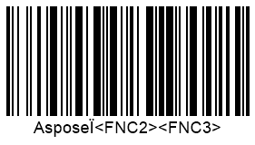

The GS1 association uses FNC symbols to manage decoding for *Code 128* and other barcode types. There are four types of FNC symbols (FNC1-4), with FNC1 being the most common, used for GS1 Application Identifier (AI) marking. When the library detects a barcode that does not match any GS1 type (e.g., *Code 128* or *GS1 Code 128*), the decoder outputs FNC symbols as “<FNJavaScript>”. These messages can be removed from the recognition results by setting the [*StripFNC*](https://reference.aspose.com/barcode/javascript-cpp/aspose.barcode.barcoderecognition/barcodesettings/properties/stripfnc) property to false.

The following code snippet demonstrates how to handle FNC symbols when reading a *Code 128* barcode as shown below.


```javascript
// Create barcode
var gen = new BarCodeInstance.BarcodeGenerator("Code128", "Aspose<FNC1><FNC2><FNC3>");
gen.Parameters.Barcode.XDimension.Pixels = 2;
document.getElementById("img").src = gen.GenerateBarCodeImage(); // Display the barcode image

// Read barcode image with StripFNC set to false
console.log("ReadWithStripFNC:");
console.log("StripFNC: false");
var read = new BarCodeInstance.BarCodeReader(gen.GenerateBarCodeImage(), "Code128");
read.BarcodeSettings.StripFNC = false;
read.ReadBarCodes();
for (var i = 0; i < reader.FoundCount; i++) {
    var result = reader.FoundBarCodes(i);
    console.log(`CodeType: ${result.CodeType}`);
    console.log(`CodeText: ${result.CodeText}`);
}
read.delete();

// Read barcode image with StripFNC set to true
console.log("StripFNC: true");
var read = new BarCodeInstance.BarCodeReader(gen.GenerateBarCodeImage(), "Code128");
read.BarcodeSettings.StripFNC = true;
read.ReadBarCodes();
for (var i = 0; i < reader.FoundCount; i++) {
    var result = reader.FoundBarCodes(i);
    console.log(`CodeType: ${result.CodeType}`);
    console.log(`CodeText: ${result.CodeText}`);
}

gen.delete();
read.delete();

```
  
<p align="center"></p>

