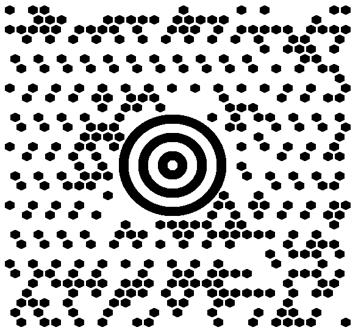
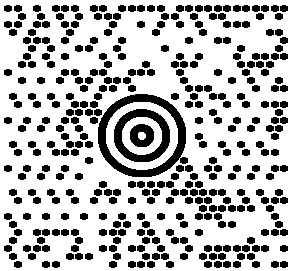
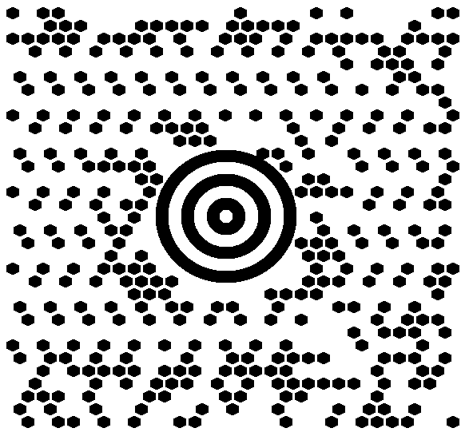
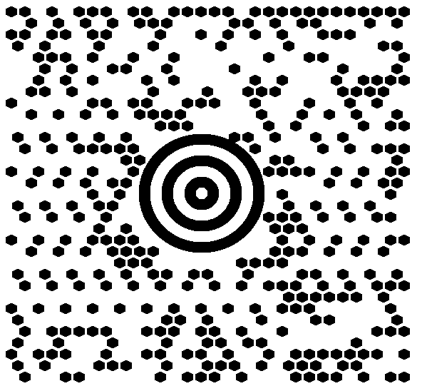

{}[Generate MaxiCode Barcodes Online](https://products.aspose.app/barcode/generate/maxicode): You can test the quality of ***Aspose.BarCode*** generation for MaxiCode barcodes and view the results online.{}

## Overview
*MaxiCode* is a 2D matrix barcode designed to encode textual data and byte streams. It features a round bullseye finder pattern, six orientation patterns, and 33 rows with 29 or 30 hexagonal modules. It can encode up to 60 bytes or 140 numerical (or 90 alphanumeric) digits. Initially introduced for postal services, *MaxiCode* supports industrial standards but is not commonly used in regular business applications.  
For more details, visit [this page](/javascript-cpp/maxicode-barcodes/).

## MaxiCode Mode Settings
Using ***Aspose.BarCode for JavaScript via C++***, developers can generate *MaxiCode* barcodes by configuring the [*MaxiCodeMode*](https://reference.aspose.com/barcode/javascript-cpp/aspose.barcode.generation/maxicodeparameters/maxicodemode) property of the [*MaxiCodeParameters*](https://reference.aspose.com/barcode/javascript-cpp/aspose.barcode.generation/maxicodeparameters) class. The following modes are supported:

- **Modes 2 and 3**: Used in the transportation industry to encode shipping information and additional data.
- **Modes 4 and 5**: Store arbitrary text or byte streams, differing in error correction codewords and data capacity.
- **Mode 6**: Similar to Mode 4, but used to configure hardware readers.

Details of these modes are covered in subsequent sections.


### **MaxiCode Modes 2 and 3**
To generate barcodes correctly, *MaxiCode Modes 2 and 3* require input data to follow specific predefined formats:

- **Format 1:** `[)>(rs)01(gs)(Postal Code)(gs)(Country Code)(gs)(Service Category)(gs)(Secondary Message)(eot)`  
- **Format 2:** `(Postal Code 9 digits)(gs)(Country Code)(gs)(Service Category)(gs)(Secondary Message)(eot)`

Special characters used in these formats:
- **Group separator (gs):** Unicode \u001d  
- **Record separator (rs):** Unicode \u001e  
- **End-of-transmission (eot):** Unicode \u0004  

---

## **MaxiCode Barcodes with Complex Data Modes**
To facilitate the creation and reading of MaxiCode barcodes with complex data, the library includes these classes:  
- [*MaxiCodeCodetext*](https://reference.aspose.com/barcode/javascript-cpp/aspose.barcode.complexbarcode/maxicodecodetext/)  
- [*MaxiCodeStructuredCodetext*](https://reference.aspose.com/barcode/javascript-cpp/aspose.barcode.complexbarcode/maxicodestructuredcodetext/)  
- [*MaxiCodeCodetextMode2*](https://reference.aspose.com/barcode/javascript-cpp/aspose.barcode.complexbarcode/maxicodecodetextmode2/)  
- [*MaxiCodeCodetextMode3*](https://reference.aspose.com/barcode/javascript-cpp/aspose.barcode.complexbarcode/maxicodecodetextmode3/)  
- [*MaxiCodeStandardCodetext*](https://reference.aspose.com/barcode/javascript-cpp/aspose.barcode.complexbarcode/maxicodestandardcodetext/)  
- [*MaxiCodeSecondMessage*](https://reference.aspose.com/barcode/javascript-cpp/aspose.barcode.complexbarcode/maxicodesecondmessage/)  
- [*MaxiCodeStandartSecondMessage*](https://reference.aspose.com/barcode/javascript-cpp/aspose.barcode.complexbarcode/maxicodestandartsecondmessage/)  
- [*MaxiCodeStructuredSecondMessage*](https://reference.aspose.com/barcode/javascript-cpp/aspose.barcode.complexbarcode/maxicodestructuredsecondmessage/)  

These classes are part of [*ComplexBarcode*](https://reference.aspose.com/barcode/javascript-cpp/aspose.barcode.complexbarcode/).  

Developers may find the following classes particularly helpful for handling the complex data formats of MaxiCode Modes 2 and 3:  
- [*MaxiCodeCodetextMode2*](https://reference.aspose.com/barcode/javascript-cpp/aspose.barcode.complexbarcode/maxicodecodetextmode2/)  
- [*MaxiCodeCodetextMode3*](https://reference.aspose.com/barcode/javascript-cpp/aspose.barcode.complexbarcode/maxicodecodetextmode3/)  
- [*MaxiCodeStandartSecondMessage*](https://reference.aspose.com/barcode/javascript-cpp/aspose.barcode.complexbarcode/maxicodestandartsecondmessage/)  
- [*MaxiCodeStructuredSecondMessage*](https://reference.aspose.com/barcode/javascript-cpp/aspose.barcode.complexbarcode/maxicodestructuredsecondmessage/)
### **Generation Modes**

#### **MaxiCode Mode 2**

The class [*MaxiCodeCodetextMode2*](https://reference.aspose.com/barcode/javascript-cpp/aspose.barcode.complexbarcode/maxicodecodetextmode2/) is used to generate barcodes in *MaxiCode Mode 2*.  

The example below demonstrates how to create a *MaxiCode* barcode using input data where the secondary part is an unstructured message.


[How to get *BarCodeInstance*](/barcode/javascript-cpp/get-barcode-module-instance/)
```javascript
// Create MaxiCode in Mode 2 with structured second message
var maxiCodeCodetext = new BarCodeInstance.MaxiCodeCodetextMode2();
maxiCodeCodetext.PostalCode = "524032140";
maxiCodeCodetext.CountryCode = 56; // Country code for Brazil
maxiCodeCodetext.ServiceCategory = 999; // Service category

// Create structured second message
var maxiCodeStructuredSecondMessage = new BarCodeInstance.MaxiCodeStructuredSecondMessage();
maxiCodeStructuredSecondMessage.Add("634 ALPHA DRIVE");
maxiCodeStructuredSecondMessage.Add("PITTSBURGH");
maxiCodeStructuredSecondMessage.Add("PA");
maxiCodeStructuredSecondMessage.Year = 99; // Year

// Assign structured second message to the MaxiCode
maxiCodeCodetext.SecondMessage = maxiCodeStructuredSecondMessage;

// Generate and save the MaxiCode barcode
var complexGenerator = new BarCodeInstance.ComplexBarcodeGenerator(maxiCodeCodetext);
document.getElementById("img").src = complexGenerator.GenerateBarCodeImage(); // Display MaxiCode image

complexGenerator.delete();

```
  
<p align="center"></p>
  
The following code sample shows how to create *MaxiCode* with the secondary part of the input data being a structured message.

[How to get *BarCodeInstance*](/barcode/javascript-cpp/get-barcode-module-instance/)
```javascript
// Create MaxiCode in mode 2 with structured second message
var maxiCodeCodetext = new BarCodeInstance.MaxiCodeCodetextMode2();
maxiCodeCodetext.PostalCode = "524032140";
maxiCodeCodetext.CountryCode = 56;
maxiCodeCodetext.ServiceCategory = 999;

// Create structured second message
var maxiCodeStructuredSecondMessage = new BarCodeInstance.MaxiCodeStructuredSecondMessage();
maxiCodeStructuredSecondMessage.Add("634 ALPHA DRIVE");
maxiCodeStructuredSecondMessage.Add("PITTSBURGH");
maxiCodeStructuredSecondMessage.Add("PA");
maxiCodeStructuredSecondMessage.Year = 99;
maxiCodeCodetext.SecondMessage = maxiCodeStructuredSecondMessage;

// Encode message
var complexGenerator = new BarCodeInstance.ComplexBarcodeGenerator(maxiCodeCodetext);
document.getElementById("img").src = complexGenerator.GenerateBarCodeImage(); // Display MaxiCode image

complexGenerator.delete();

```
  
<p align="center"></p>

#### **MaxiCode Mode 3**
The [*MaxiCodeCodetextMode3*](https://reference.aspose.com/barcode/javascript-cpp/aspose.barcode.complexbarcode/maxicodecodetextmode3/) class enables developers to create *MaxiCode* barcodes in *Mode 3* for the required data format.

The following code sample shows how to generate a *MaxiCode* barcode with the input data formatted as an unstructured message in the secondary part.


[How to get *BarCodeInstance*](/barcode/javascript-cpp/get-barcode-module-instance/)
```javascript
// Create MaxiCode in mode 3 with a standard second message
var maxiCodeCodetext = new BarCodeInstance.MaxiCodeCodetextMode3();
maxiCodeCodetext.PostalCode = "B1050";
maxiCodeCodetext.CountryCode = 056;
maxiCodeCodetext.ServiceCategory = 999;

// Create a standard second message
var maxiCodeStandartSecondMessage = new BarCodeInstance.MaxiCodeStandartSecondMessage();
maxiCodeStandartSecondMessage.Message = "Second message";
maxiCodeCodetext.SecondMessage = maxiCodeStandartSecondMessage;

// Encode the message
var complexGenerator = new BarCodeInstance.ComplexBarcodeGenerator(maxiCodeCodetext);
document.getElementById("img").src = complexGenerator.GenerateBarCodeImage(); // Display barcode image

complexGenerator.delete();

```
  
<p align="center"></p>

The following code sample demonstrates how to create a *MaxiCode* barcode with the input data formatted to include the secondary part as a structured message.


[How to get *BarCodeInstance*](/barcode/javascript-cpp/get-barcode-module-instance/)
```javascript
// Create MaxiCode in mode 3 with a structured second message
var maxiCodeCodetext = new BarCodeInstance.MaxiCodeCodetextMode3();
maxiCodeCodetext.PostalCode = "B1050";
maxiCodeCodetext.CountryCode = 056;
maxiCodeCodetext.ServiceCategory = 999;

// Create a structured second message
var maxiCodeStructuredSecondMessage = new BarCodeInstance.MaxiCodeStructuredSecondMessage();
maxiCodeStructuredSecondMessage.Add("634 ALPHA DRIVE");
maxiCodeStructuredSecondMessage.Add("PITTSBURGH");
maxiCodeStructuredSecondMessage.Add("PA");
maxiCodeStructuredSecondMessage.Year = 99;
maxiCodeCodetext.SecondMessage = maxiCodeStructuredSecondMessage;

// Encode the message
var complexGenerator = new BarCodeInstance.ComplexBarcodeGenerator(maxiCodeCodetext);
document.getElementById("img").src = complexGenerator.GenerateBarCodeImage(); // Display barcode image

complexGenerator.delete();

```

<p align="center"></p>

#### **Modes 4, 5, and 6**

The [*MaxiCodeCodetextMode*](https://reference.aspose.com/barcode/javascript-cpp/aspose.barcode.complexbarcode/maxicodecodetext/) class can be used to generate *MaxiCode* barcodes with data formats suitable for *Modes 4, 5, and 6*. To specify the desired mode, set the *Mode* property accordingly.


[How to get *BarCodeInstance*](/barcode/javascript-cpp/get-barcode-module-instance/)
```javascript
// Create MaxiCode in standard mode 4 with a standard message
var maxiCodeCodetext = new BarCodeInstance.MaxiCodeStandardCodetext();
maxiCodeCodetext.Mode = BarCodeInstance.MaxiCodeMode.Mode4;
maxiCodeCodetext.Message = "MaxiCode standard codetext";

// Encode the message
var complexGenerator = new BarCodeInstance.ComplexBarcodeGenerator(maxiCodeCodetext);
document.getElementById("img").src = complexGenerator.GenerateBarCodeImage(); // Display barcode image

complexGenerator.delete();

```

### **Decoding Settings**
To read a *MaxiCode* barcode, create an instance of the [*BarcodeReader*](https://reference.aspose.com/barcode/javascript-cpp/aspose.barcode.barcoderecognition/barcodereader/) class and set *DecodeType.MaxiCode*. The data can then be processed using the *TryDecodeMaxiCode* method from the [*ComplexCodetextReader*](https://reference.aspose.com/barcode/javascript-cpp/aspose.barcode.complexbarcode/complexcodetextreader/) class, which returns an object of the [*MaxiCodeCodetext*](https://reference.aspose.com/barcode/javascript-cpp/aspose.barcode.complexbarcode/maxicodecodetext/) class. This object can be converted to instances of [*MaxiCodeCodetextMode2*](https://reference.aspose.com/barcode/javascript-cpp/aspose.barcode.complexbarcode/maxicodecodetextmode2/), [*MaxiCodeCodetextMode3*](https://reference.aspose.com/barcode/javascript-cpp/aspose.barcode.complexbarcode/maxicodecodetextmode3/), or [*MaxiCodeStandardCodetext*](https://reference.aspose.com/barcode/javascript-cpp/aspose.barcode.complexbarcode/maxicodestandardcodetext/), depending on the *MaxiCode* data mode used.

The following code sample shows how to decode a *MaxiCode* barcode with input data formatted as a structured secondary message.


[How to get *BarCodeInstance*](/barcode/javascript-cpp/get-barcode-module-instance/)
```javascript
// Recognize MaxiCode in mode 2 with a standard second message
var reader = new BarCodeInstance.BarCodeReader(`${path}MaxiCodeMode2StandardSecondMessage.png`, "MaxiCode");
reader.ReadBarCodes();
for (var i = 0; i < reader.FoundCount; i++) {
    const result = reader.FoundBarCodes(i);
    var complexCodetext = BarCodeInstance.ComplexCodetextReader.TryDecodeMaxiCode(result.Extended.MaxiCode.MaxiCodeMode, result.CodeText);
    var maxiCodeStructuredCodetext = complexCodetext instanceof BarCodeInstance.MaxiCodeCodetextMode2 ? complexCodetext : null;
    if (!maxiCodeStructuredCodetext) continue;

    console.log("PostalCode: " + maxiCodeStructuredCodetext.PostalCode);
    console.log("CountryCode: " + maxiCodeStructuredCodetext.CountryCode);
    console.log("ServiceCategory: " + maxiCodeStructuredCodetext.ServiceCategory);

    var secondMessage = maxiCodeStructuredCodetext.SecondMessage instanceof BarCodeInstance.MaxiCodeStandartSecondMessage ? maxiCodeStructuredCodetext.SecondMessage : null;
    if (!secondMessage) continue;

    console.log("Second message: " + secondMessage.Message);
}

reader.delete();

```

