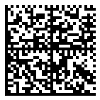

## **Overview**
The Royal Mail *Mailmark* symbology has been developed to encode postal and shipping information in the format defined in the *DataMatrix* standard. The *Mailmark 2D* symbology includes three types denoted as 7, 9, and 29; they differ from each other in terms of customer data capacity. Customer information is encoded in addition to the main barcode data in special predefined barcode fields. The amount of space to store customer data depends on the barcode type and the used encoding. This information can serve to describe print and scanning operations, identify items, or enable barcode scanning with smartphones.  

To perform data encoding, the *Mailmark 2D* standard uses the basic C40 character set (numerical digits, uppercase English letters, and the space character). All fields of information to be encoded in a *Mailmark 2D* barcode except customer data must be entered in the format compatible with the mentioned encoding standard. The customer information field does not require to comply with this encoding; however, using alternative encodings may affect the overall barcode data capacity.  
  
To work with *Mailmark 2D* barcodes in ***Aspose.BarCode for JavaScript via C++***, it is necessary to use class [*Mailmark2DCodetext*](https://reference.aspose.com/barcode/javascript-cpp/aspose.barcode.complexbarcode/mailmark2dcodetext).
  
{}*If you need any clarifications, feel free to reach out [Aspose Technical Support](/barcode/javascript-cpp/technical-support/): ask your questions at [Aspose.Barcode Forum](https://forum.aspose.com/c/barcode/13) or contact [Aspose Paid Support Helpdesk](https://helpdesk.aspose.com/).*{}

## **Generate Mailmark 2D Barcodes**
To generate *Mailmark 2D* barcodes, ***Aspose.BarCode for JavaScript via C++*** provides class [*Mailmark2DCodetext*](https://reference.aspose.com/barcode/javascript-cpp/aspose.barcode.complexbarcode/mailmark2dcodetext) to specify barcode fields and class [*ComplexBarcodeGenerator*](https://reference.aspose.com/barcode/javascript-cpp/aspose.barcode.complexbarcode/complexbarcodegenerator) to generate barcodes. The [*Mailmark2DType*](https://reference.aspose.com/barcode/javascript-cpp/aspose.barcode.complexbarcode/mailmark2dtype) enumeration is used to select the type of a *Mailmark 2D* barcode to be generated.  
  
Sample *Mailmark 2D* barcodes demonstrated below have been created setting different *Mailmark 2D* types.
  
|<p align="center">**Mailmark 2D**</p>|<p align="center">**Type 7**</p>|<p align="center">**Type 9**</p>|<p align="center">**Type 29**</p>|
| :-: | :-: | :-: | :-: |
| ||||
  
The following code snippet illustrates how to generate *Mailmark 2D* barcodes of types 7, 9, and 29.
  
```javascript
ComplexBarcodeGenerator generator = null;

//create Mailmark 2D Code
Mailmark2DCodetext mailmark2D = new Mailmark2DCodetext();
mailmark2D.UPUCountryID = "JGB ";
mailmark2D.InformationTypeID = "0";
mailmark2D.VersionID = "1";
mailmark2D.Class = "1";
mailmark2D.SupplyChainID = 123;
mailmark2D.ItemID = 1234;
mailmark2D.DestinationPostCodeAndDPS = "QWE1";
mailmark2D.RTSFlag = "0";
mailmark2D.ReturnToSenderPostCode = "QWE2";

//encode Mailmark 2D Type 7 Code
mailmark2D.DataMatrixType = Mailmark2DType.Type_7;
mailmark2D.CustomerContent = "CUSTOM";
generator = new ComplexBarcodeGenerator(mailmark2D);
generator.Parameters.Barcode.XDimension.Pixels = 4;
generator.Save($"{path}Mailmark2DType7.png");

//encode Mailmark 2D Type 9 Code
mailmark2D.DataMatrixType = Mailmark2DType.Type_9;
mailmark2D.CustomerContent = "CUSTOM DATA";
generator = new ComplexBarcodeGenerator(mailmark2D);
generator.Parameters.Barcode.XDimension.Pixels = 4;
generator.Save($"{path}Mailmark2DType9.png");

//encode Mailmark 2D Type 29 Code
mailmark2D.DataMatrixType = Mailmark2DType.Type_29;
mailmark2D.CustomerContent = "CUSTOM DATA";
generator = new ComplexBarcodeGenerator(mailmark2D);
generator.Parameters.Barcode.XDimension.Pixels = 4;
generator.Save($"{path}Mailmark2DType29.png");
```
  
## **Read Mailmark 2D Barcodes**
To read and parse Royal Mail *Mailmark 2D* barcodes in ***Aspose.BarCode for JavaScript via C++***, first, it is required to create an instance of class [*BarCodeReader*](https://reference.aspose.com/barcode/javascript-cpp/aspose.barcode.barcoderecognition/barcodereader) and set it to the value *DecodeType.DataMatrix*. Then, the obtained information can be parsed further in class [*ComplexCodetextReader*](https://reference.aspose.com/barcode/javascript-cpp/aspose.barcode.complexbarcode/complexcodetextreader) by calling the [*TryDecodeMailmark2D*](https://reference.aspose.com/barcode/javascript-cpp/aspose.barcode.complexbarcode/complexcodetextreader/methods/trydecodemailmark2d) method that returns an instance of [*Mailmark2DCodetext*](https://reference.aspose.com/barcode/javascript-cpp/aspose.barcode.complexbarcode/mailmark2dcodetext) with the decoded barcode data.  
  
The following code snippet explains how to read *Mailmark 2D* barcodes.

```javascript
Console.OutputEncoding = Encoding.Unicode;
//recognize Mailmark 2D Code
BarCodeReader reader = new BarCodeReader($"{path}Mailmark2DType9.png", DecodeType.DataMatrix);
foreach (BarCodeResult result in reader.ReadBarCodes())
{
    Mailmark2DCodetext mailmarkResult = ComplexCodetextReader.TryDecodeMailmark2D(result.CodeText);
    if (null == mailmarkResult) continue;
    Console.WriteLine($"UPUCountryID:{mailmarkResult.UPUCountryID}");
    Console.WriteLine($"InformationTypeID:{mailmarkResult.InformationTypeID}");
    Console.WriteLine($"VersionID:{mailmarkResult.VersionID}");
    Console.WriteLine($"Class:{mailmarkResult.Class}");
    Console.WriteLine($"SupplyChainID:{mailmarkResult.SupplyChainID}");
    Console.WriteLine($"ItemID:{mailmarkResult.ItemID}");
    Console.WriteLine($"DestinationPostCodeAndDPS:{mailmarkResult.DestinationPostCodeAndDPS}");
    Console.WriteLine($"RTSFlag:{mailmarkResult.RTSFlag}");
    Console.WriteLine($"ReturnToSenderPostCode:{mailmarkResult.ReturnToSenderPostCode}");
    Console.WriteLine($"CustomerContent:{mailmarkResult.CustomerContent}");
}
``` 