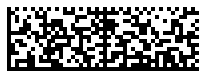

## Overview
The Royal Mail *Mailmark* symbology is based on the *DataMatrix* standard and is designed for encoding postal and shipping data. It supports three types: **7**, **9**, and **29**, differing in customer data capacity. Additional customer information can be encoded in specific fields, providing details for print operations, item identification, or barcode scanning via smartphones.

The *Mailmark 2D* standard uses the C40 character set (numerical digits, uppercase English letters, and space). All data except customer information must comply with this encoding standard. The customer information field can use alternative encodings, though this may reduce the overall data capacity.

To handle *Mailmark 2D* barcodes, ***Aspose.BarCode for JavaScript via C++*** provides the [*Mailmark2DCodetext*](https://reference.aspose.com/barcode/javascript-cpp/aspose.barcode.complexbarcode/mailmark2dcodetext) class.

## Generate Mailmark 2D Barcodes
To generate *Mailmark 2D* barcodes:
1. Use the [*Mailmark2DCodetext*](https://reference.aspose.com/barcode/javascript-cpp/aspose.barcode.complexbarcode/mailmark2dcodetext) class to set barcode fields.
2. Use the [*Mailmark2DType*](https://reference.aspose.com/barcode/javascript-cpp/aspose.barcode.complexbarcode/mailmark2dtype) enumeration to select the barcode type.

Below are examples of *Mailmark 2D* barcodes created using types **7**, **9**, and **29**.

| **Mailmark 2D** | **Type 7** | **Type 9** | **Type 29** |
| :-: | :-: | :-: | :-: |
| |  |  |  |

The following code snippet demonstrates how to generate *Mailmark 2D* barcodes for all three types.

  
[How to get *BarCodeInstance*](/barcode/javascript-cpp/get-barcode-module-instance/)
```javascript
// Create Mailmark 2D Code
var mailmark2D = new BarCodeInstance.Mailmark2DCodetext();
mailmark2D.UPUCountryID = "JGB ";
mailmark2D.InformationTypeID = "0";
mailmark2D.VersionID = "1";
mailmark2D.Class = "1";
mailmark2D.SupplyChainID = 123;
mailmark2D.ItemID = 1234;
mailmark2D.DestinationPostCodeAndDPS = "QWE1";
mailmark2D.RTSFlag = "0";
mailmark2D.ReturnToSenderPostCode = "QWE2";

// Encode Mailmark 2D Type 7 Code
mailmark2D.DataMatrixType = BarCodeInstance.Mailmark2DType.Type_7;
mailmark2D.CustomerContent = "CUSTOM";
var generator = mailmark2D.GetGenerator();
generator.Parameters.Barcode.XDimension = "4px";
document.getElementById("img7").src = generator.GenerateBarCodeImage(); // Display barcode image for Type 7


// Encode Mailmark 2D Type 9 Code
mailmark2D.DataMatrixType = BarCodeInstance.Mailmark2DType.Type_9;
mailmark2D.CustomerContent = "CUSTOM DATA";
generator = mailmark2D.GetGenerator();
generator.Parameters.Barcode.XDimension = "4px";
document.getElementById("img9").src = generator.GenerateBarCodeImage(); // Display barcode image for Type 9


// Encode Mailmark 2D Type 29 Code
mailmark2D.DataMatrixType = BarCodeInstance.Mailmark2DType.Type_29;
mailmark2D.CustomerContent = "CUSTOM DATA";
generator = mailmark2D.GetGenerator();
generator.Parameters.Barcode.XDimension = "4px";
document.getElementById("img").src = generator.GenerateBarCodeImage(); // Display barcode image for Type 29

mailmark2D.delete();
generator.delete();

```
  
## Read Mailmark 2D Barcodes
To decode Royal Mail *Mailmark 2D* barcodes using ***Aspose.BarCode for JavaScript via C++***:

1. Create an instance of the [*BarCodeReader*](https://reference.aspose.com/barcode/javascript-cpp/aspose.barcode.barcoderecognition/barcodereader) class and set it to *DecodeType.DataMatrix*.
2. Use the [*ComplexCodetextReader*](https://reference.aspose.com/barcode/javascript-cpp/aspose.barcode.complexbarcode/complexcodetextreader) class to parse the barcode data by invoking the [*TryDecodeMailmark2D*](https://reference.aspose.com/barcode/javascript-cpp/aspose.barcode.complexbarcode/complexcodetextreader/methods/trydecodemailmark2d) method.
3. The method returns an instance of [*Mailmark2DCodetext*](https://reference.aspose.com/barcode/javascript-cpp/aspose.barcode.complexbarcode/mailmark2dcodetext) containing the decoded barcode information.

The following code snippet demonstrates how to read *Mailmark 2D* barcodes.


[How to get *BarCodeInstance*](/barcode/javascript-cpp/get-barcode-module-instance/)
```javascript
//recognize Mailmark 2D Code
// Read and decode Mailmark 2D Type 9 Barcode
var reader = new BarCodeInstance.BarCodeReader("Mailmark2DType9.png", "DataMatrix");
reader.ReadBarCodes();

for (var i = 0; i < reader.FoundCount; i++) {
    var result = reader.FoundBarCodes(i);
    var mailmarkResult = BarCodeInstance.ComplexCodetextReader.TryDecodeMailmark2D(result.CodeText);

    if (mailmarkResult.IsEmpty) continue;

    console.log(`UPUCountryID: ${mailmarkResult.UPUCountryID}`);
    console.log(`InformationTypeID: ${mailmarkResult.InformationTypeID}`);
    console.log(`VersionID: ${mailmarkResult.VersionID}`);
    console.log(`Class: ${mailmarkResult.Class}`);
    console.log(`SupplyChainID: ${mailmarkResult.SupplyChainID}`);
    console.log(`ItemID: ${mailmarkResult.ItemID}`);
    console.log(`DestinationPostCodeAndDPS: ${mailmarkResult.DestinationPostCodeAndDPS}`);
    console.log(`RTSFlag: ${mailmarkResult.RTSFlag}`);
    console.log(`ReturnToSenderPostCode: ${mailmarkResult.ReturnToSenderPostCode}`);
    console.log(`CustomerContent: ${mailmarkResult.CustomerContent}`);
}

reader.delete();

``` 