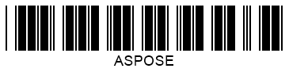

## Overview

**One-dimensional (1D)** barcodes, also known as linear barcodes, encode data using parallel lines with varying widths and spacing. A typical linear barcode consists of a leading margin, start character, encoded message, optional check character, stop character, and trailing margin. Each symbology has its unique encoding rules, but all represent data in binary form (0s and 1s), which can be decoded digitally.

***Aspose.BarCode for JavaScript via C++*** allows customization of various parameters for generating 1D barcodes, including bar height, bar fill modes, wide-to-narrow ratios, and automatic correction of invalid text. This guide outlines how to configure these properties.

## Bar Height Settings

The library provides options to adjust bar height for single-row 1D barcodes. This adjustment is only available when the [*AutoSizeMode*](https://reference.aspose.com/barcode/javascript-cpp/aspose.barcode.generation/basegenerationparameters/properties/autosizemode) property is set to *AutoSizeMode.None*. When enabled, bar height can be defined independently of the [*XDimension*](https://reference.aspose.com/barcode/javascript-cpp/aspose.barcode.generation/barcodeparameters/properties/xdimension) property by setting the [*BarHeight*](https://reference.aspose.com/barcode/javascript-cpp/aspose.barcode.generation/barcodeparameters/properties/barheight) property in the [*BarcodeParameters*](https://reference.aspose.com/barcode/javascript-cpp/aspose.barcode.generation/barcodeparameters) class. This setting is not applicable for multi-row or 2D barcodes.

### Examples of Bar Height Settings

| **Bar Height**       | **Set to 40 Pixels**          | **Set to 80 Pixels**          |
|-----------------------|-------------------------------|--------------------------------|
|                       |  |  |

### Code Example

The following example demonstrates how to set different bar heights for a *Code 128* barcode.

     
```javascript
// Generate Code128 barcode with specified bar heights
var gen = new BarCodeInstance.BarcodeGenerator("Code128", "ASPOSE");
gen.Parameters.Barcode.XDimension.Pixels = 2;

// Set bar height to 40 pixels
gen.Parameters.Barcode.BarHeight.Pixels = 40;
document.getElementById("img1").src = gen.GenerateBarCodeImage(); // Display barcode image

// Set bar height to 80 pixels
gen.Parameters.Barcode.BarHeight.Pixels = 80;
document.getElementById("img2").src = gen.GenerateBarCodeImage(); // Display barcode image

gen.delete();

```
  
## Bar Filling Modes

For 1D barcodes, ***Aspose.BarCode for JavaScript via C++*** allows generating barcodes with either filled or empty bars. This can be configured using the [*FilledBars*](https://reference.aspose.com/barcode/javascript-cpp/aspose.barcode.generation/barcodeparameters/properties/filledbars) property in the [*BarcodeParameters*](https://reference.aspose.com/barcode/javascript-cpp/aspose.barcode.generation/barcodeparameters) class. By default, this property is set to *True*, enabling filled bars. This feature is only applicable to 1D barcodes.

### Examples of Bar Filling Modes

| **Bar Filling**       | **Filled**                   | **Empty**                     |
|------------------------|------------------------------|--------------------------------|
|                        |  |  |

### Code Example

Below is an example of how to configure the bar filling mode for a *Code 128* barcode.


```javascript
// Generate Code128 barcode with filled and empty bars
var gen = new BarCodeInstance.BarcodeGenerator("Code128", "ASPOSE");
gen.Parameters.Barcode.XDimension.Pixels = 2;

// Set bars filled
gen.Parameters.Barcode.FilledBars = true;
document.getElementById("img1").src = gen.GenerateBarCodeImage(); // Display filled bars barcode image

// Set bars empty
gen.Parameters.Barcode.FilledBars = false;
document.getElementById("img2").src = gen.GenerateBarCodeImage(); // Display empty bars barcode image

gen.delete();

```

## Wide-to-Narrow Ratio

Two-width 1D barcodes encode data using wide and narrow bars and spaces, following the binary code principle. Examples of two-width barcode symbologies include: *Codabar*, *Code 11*, *Code 32*, *Code 39*, *DataLogic 2-of-5*, *IATA 2-of-5*, *Interleaved 2-of-5*, *ITF 6*, *ITF 14*, *Matrix 2-of-5*, *MSI*, *OPC*, *PZN*, *Standard 2-of-5*, and *VIN*.

In ***Aspose.BarCode for JavaScript via C++***, the **wide-to-narrow ratio** determines the proportion between the widths of wide and narrow elements. This is controlled using the [*WideNarrowRatio*](https://reference.aspose.com/barcode/javascript-cpp/aspose.barcode.generation/barcodeparameters/properties/widenarrowratio) property in the [*BarcodeParameters*](https://reference.aspose.com/barcode/javascript-cpp/aspose.barcode.generation/barcodeparameters) class. Increasing this value enhances barcode readability by making it wider. The default value is 3.

### Examples of Wide-to-Narrow Ratios

| **Wide-to-Narrow Ratio** | **Set to 2**                     | **Set to 5**                     |
|---------------------------|----------------------------------|----------------------------------|
|                           |  |  |

### Code Example

Below is an example of how to set the wide-to-narrow ratio for a *Code 39* barcode.


```javascript
// Generate Code39Extended barcode with different Wide-to-Narrow ratios
var gen = new BarCodeInstance.BarcodeGenerator("Code39FullASCII", "ASPOSE");
gen.Parameters.Barcode.XDimension.Pixels = 2;

// Set Wide-to-Narrow Ratio to 2
gen.Parameters.Barcode.WideNarrowRatio = 2;
document.getElementById("img2").src = gen.GenerateBarCodeImage(); // Display barcode with Wide-to-Narrow Ratio 2

// Set Wide-to-Narrow Ratio to 5
gen.Parameters.Barcode.WideNarrowRatio = 5;
document.getElementById("img5").src = gen.GenerateBarCodeImage(); // Display barcode with Wide-to-Narrow Ratio 5

gen.delete();

```
## Handle Exceptions on Incorrect Barcode Text

If a barcode cannot be created correctly due to invalid text, ***Aspose.BarCode for JavaScript via C++*** by default generates dummy data to make the barcode compliant with the standard or removes conflicting characters, allowing successful barcode generation.

This behavior can be modified by setting the [*ThrowExceptionWhenCodeTextIncorrect*](https://reference.aspose.com/barcode/javascript-cpp/aspose.barcode.generation/barcodeparameters/properties/throwexceptionwhencodetextincorrect) property of the [*BarcodeParameters*](https://reference.aspose.com/barcode/javascript-cpp/aspose.barcode.generation/barcodeparameters) class. When enabled, this property will cause an exception to be thrown if the barcode text is found to be incorrect or incomplete.

### Examples of Barcode Text Correctness

| **Barcode Text Correctness** | **Correct with Valid Barcode Text** | **Adjusted with Invalid Barcode Text** |
|------------------------------|--------------------------------------|----------------------------------------|
|                              |       |        |

### Code Example

The following code snippet demonstrates how to set the [*ThrowExceptionWhenCodeTextIncorrect*](https://reference.aspose.com/barcode/javascript-cpp/aspose.barcode.generation/barcodeparameters/properties/throwexceptionwhencodetextincorrect) property. In this case, an exception message such as "*Symbology ITF 6 - codetext is invalid*" will be thrown if the text is incorrect.

```javascript
// Generate an ITF6 barcode with correct code text and correction check enabled
var gen = new BarCodeInstance.BarcodeGenerator("ITF6", "123457");
gen.Parameters.Barcode.XDimension.Pixels = 2;
gen.CodeText = "12345";
gen.Parameters.Barcode.ThrowExceptionWhenCodeTextIncorrect = true;
document.getElementById("img").src = gen.GenerateBarCodeImage(); // Display barcode image

// Generate an ITF6 barcode with incorrect code text and correction check disabled
gen.CodeText = "12";
gen.Parameters.Barcode.ThrowExceptionWhenCodeTextIncorrect = false;
document.getElementById("img").src = gen.GenerateBarCodeImage(); // Display barcode image

// Attempt to generate an ITF6 barcode with incorrect code text and correction check enabled
try {
    gen.CodeText = "12";
    gen.Parameters.Barcode.ThrowExceptionWhenCodeTextIncorrect = true;
    gen.GenerateBarCodeImage();
} catch (e) {
    console.log(e.message);
}

gen.delete();

```