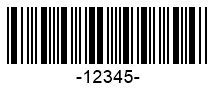
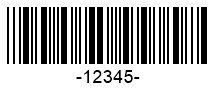
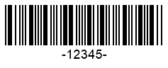

{}[Generate Codabar Barcodes Online](https://products.aspose.app/barcode/generate/codabar): You can test the quality of ***Aspose.BarCode*** generation for Codabar barcodes and get the results online.{}

## **Overview**
***Aspose.BarCode for JavaScript via C++*** enables generating barcode labels according to the *Codabar* standard, which supports encoding numerical digits and six punctuation signs. The number of digits to be encoded in a barcode is unlimited. A *Codabar* barcode may contain four optional alphabet characters (usually A, B, C, or D) that serve as start and stop digits. This symbology provides four types of start characters and four types of stop characters, allowing the generation of 16 distinct barcodes with different start and stop character combinations for the same encoded information.

Input text for *Codabar* barcodes follows the format below:  
<p align="center"><mark>[Start Character "A/B/C/D"] [Data Digits from the charset: "0-9" and "–$./:+"] [Stop Character "A/B/C/D"]</mark></p>

{}*If you need any clarifications, feel free to reach out to [Aspose Technical Support](/barcode/javascript-cpp/technical-support/): ask your questions at [Aspose.Barcode Forum](https://forum.aspose.com/c/barcode/13) or contact the [Aspose Paid Support Helpdesk](https://helpdesk.aspose.com/).*{}

## **Start and Stop Symbols**
The library allows for encoding start and stop characters independently using any of the four supported characters: A, B, C, or D. To define the required format, you can configure the [*CodabarStartSymbol*](https://reference.aspose.com/barcode/javascript-cpp/aspose.barcode.generation/codabarparameters/properties/codabarstartsymbol) and [*CodabarStopSymbol*](https://reference.aspose.com/barcode/javascript-cpp/aspose.barcode.generation/codabarparameters/properties/codabarstopsymbol) properties, which are part of the [*Codabar*](https://reference.aspose.com/barcode/javascript-cpp/aspose.barcode.generation/barcodeparameters/properties/codabar) group in the class [*BarcodeParameters*](https://reference.aspose.com/barcode/javascript-cpp/aspose.barcode.generation/barcodeparameters).  
By default, both start and stop characters are set to "A".

Below are examples of barcode labels generated with different combinations of start and stop characters:

| Start and Stop Characters | A+A | B+B | C+C | D+D |
| :-: | :-: | :-: | :-: | :-: |
| |  |  |  |  |

The following code snippet demonstrates how to configure different combinations of start and stop characters in *Codabar* barcodes:

    
[How to get *BarCodeInstance*](/barcode/javascript-cpp/get-barcode-module-instance/)
```javascript
var gen = new BarCodeInstance.BarcodeGenerator("Codabar", "-12345-");
gen.Parameters.Barcode.XDimention = "2px";
//set start A and stop A
gen.Parameters.Barcode.Codabar.CodabarStartSymbol = BarCodeInstance.CodabarSymbol.A;
gen.Parameters.Barcode.Codabar.CodabarStopSymbol = BarCodeInstance.CodabarSymbol.A;
document.getElementById("img").src = gen.GenerateBarCodeImage();
//set start B and stop B
gen.Parameters.Barcode.Codabar.CodabarStartSymbol = BarCodeInstance.CodabarSymbol.B;
gen.Parameters.Barcode.Codabar.CodabarStopSymbol = BarCodeInstance.CodabarSymbol.B;
document.getElementById("img").src = gen.GenerateBarCodeImage();
//set start C and stop C
gen.Parameters.Barcode.Codabar.CodabarStartSymbol = BarCodeInstance.CodabarSymbol.C;
gen.Parameters.Barcode.Codabar.CodabarStopSymbol = BarCodeInstance.CodabarSymbol.C;
document.getElementById("img").src = gen.GenerateBarCodeImage();
//set start D and stop D
gen.Parameters.Barcode.Codabar.CodabarStartSymbol = BarCodeInstance.CodabarSymbol.D;
gen.Parameters.Barcode.Codabar.CodabarStopSymbol = BarCodeInstance.CodabarSymbol.D;
document.getElementById("img").src = gen.GenerateBarCodeImage();

gen.delete();

```
  
## **Checksum Settings**
By default, the *Codabar* symbology does not require a mandatory checksum, but it supports two optional checksum algorithms: Mod10 and Mod16, with Mod16 being the more commonly used. 

To enable a checksum for *Codabar* barcodes, set the [*IsChecksumEnabled*](https://reference.aspose.com/barcode/javascript-cpp/aspose.barcode.generation/barcodeparameters/properties/ischecksumenabled) property to *EnableChecksum.Yes*. After enabling, choose the checksum algorithm by configuring the [*CodabarChecksumMode*](https://reference.aspose.com/barcode/javascript-cpp/aspose.barcode.generation/codabarparameters/properties/codabarchecksummode) property. By default, the *Mod16* checksum is applied.

Below are sample barcode images generated with different checksum calculation settings:

|Checksum Calculation|No Checksum|*Mod10* Checksum|*Mod16* Checksum|
| :-: | :-: | :-: | :-: |
| ||||

The following code sample demonstrates how to enable different checksum algorithms, *Mod10* and *Mod16*, for *Codabar* barcodes.


[How to get *BarCodeInstance*](/barcode/javascript-cpp/get-barcode-module-instance/)
```javascript

var gen = new BarCodeInstance.BarcodeGenerator("Codabar", "-12345-");
gen.Parameters.Barcode.XDimention = "2px";
//set None checksum
gen.Parameters.Barcode.IsChecksumEnabled = BarCodeInstance.EnableChecksum.Default;
document.getElementById("img").src = gen.GenerateBarCodeImage();

//set Mod10 checksum
gen.Parameters.Barcode.IsChecksumEnabled = BarCodeInstance.EnableChecksum.Yes;
gen.Parameters.Barcode.Codabar.CodabarChecksumMode = BarCodeInstance.CodabarChecksumMode.Mod10;
document.getElementById("img").src = gen.GenerateBarCodeImage();
//set Mod16 checksum
gen.Parameters.Barcode.IsChecksumEnabled = BarCodeInstance.EnableChecksum.Yes;
gen.Parameters.Barcode.Codabar.CodabarChecksumMode = BarCodeInstance.CodabarChecksumMode.Mod16;
document.getElementById("img").src = gen.GenerateBarCodeImage();

gen.delete();
```