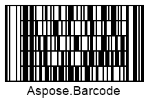

{}[Generate Codablock-F Barcodes Online](https://products.aspose.app/barcode/generate/codablock?type=codablockf): You can check the quality of ***Aspose.BarCode*** generation for Codablock-F barcodes and view the results online.{}
## Overview
*Codablock-F* is a stacked barcode symbology consisting of multiple *Code128* barcodes. It supports encoding up to 2,725 characters by configuring 2 to 44 rows, each holding 4 to 62 digits. This symbology offers two advantages over *Code128*: efficient use of horizontal and vertical space through flexible layout settings and additional security with two check digits (modulo 86 algorithm) for the entire message, alongside individual row checksums. *Codablock-F* can also be scanned with laser scanners.

## Barcode Height Settings
In ***Aspose.BarCode for JavaScript via C++***, the height of each row in a stacked barcode can be adjusted by setting the [*AspectRatio*](https://reference.aspose.com/barcode/javascript-cpp/aspose.barcode.generation/codablockparameters/properties/aspectratio) property in the [*CodablockParameters*](https://reference.aspose.com/barcode/javascript-cpp/aspose.barcode.generation/codablockparameters) class. The *AspectRatio* is a relative coefficient based on the [*XDimension*](https://reference.aspose.com/barcode/javascript-cpp/aspose.barcode.generation/barcodeparameters/properties/xdimension). A value greater than 10 is recommended for *AspectRatio*.

### Example Barcodes
Below are examples of *Codablock-F* barcodes with different aspect ratio settings:

| **Aspect Ratio** | **Set to 15**                      | **Set to 30**                      |
|-------------------|------------------------------------|------------------------------------|
|                   |  |  |

### Code Example
The following code demonstrates how to adjust the height of *Codablock-F* barcodes using the aspect ratio.

[How to get *BarCodeInstance*](/barcode/javascript-cpp/get-barcode-module-instance/)
```javascript

// Generate CodablockF barcode with different aspect ratios
var gen = new BarCodeInstance.BarcodeGenerator("CodablockF", "Aspose");
gen.Parameters.Barcode.XDimension.Pixels = 2;

// Set CodablockF aspect ratio to 15
gen.Parameters.Barcode.Codablock.AspectRatio = 15;
document.getElementById("img15").src = gen.GenerateBarCodeImage(); // Display barcode image

// Set CodablockF aspect ratio to 30
gen.Parameters.Barcode.Codablock.AspectRatio = 30;
document.getElementById("img30").src = gen.GenerateBarCodeImage(); // Display barcode image

gen.delete();


```
  

## Layout Settings

To configure the layout of *Codablock-F* barcodes, the [*Columns*](https://reference.aspose.com/barcode/javascript-cpp/aspose.barcode.generation/codablockparameters/properties/columns) and [*Rows*](https://reference.aspose.com/barcode/javascript-cpp/aspose.barcode.generation/codablockparameters/properties/rows) properties in the [*CodablockParameters*](https://reference.aspose.com/barcode/javascript-cpp/aspose.barcode.generation/codablockparameters) class must be set. The *Columns* property is prioritized and controls the number of segments per row, while *Rows* specifies the total rows. Maximum values are 62 for *Columns* and 44 for *Rows*.

### Example Layouts
Below are examples of *Codablock-F* barcodes with different layout settings:

| **Layout Settings** | **4 Columns**                   | **4 Rows**                     | **6 Rows and 4 Columns**             |
|----------------------|----------------------------------|---------------------------------|--------------------------------------|
|                      |  |  |  |

### Code Example
The following code demonstrates how to set layout settings for *Codablock-F* barcodes.

[How to get *BarCodeInstance*](/barcode/javascript-cpp/get-barcode-module-instance/)
```javascript
// Generate CodablockF barcode with specified columns and rows
var gen = new BarCodeInstance.BarcodeGenerator("CodablockF", "Aspose.Barcode");
gen.Parameters.Barcode.XDimension.Pixels = 2;

// Set CodablockF to 4 columns
gen.Parameters.Barcode.Codablock.Columns = 4;
gen.Parameters.Barcode.Codablock.Rows = 0;
document.getElementById("img1").src = gen.GenerateBarCodeImage(); // Display barcode image

// Set CodablockF to 4 rows
gen.Parameters.Barcode.Codablock.Columns = 0;
gen.Parameters.Barcode.Codablock.Rows = 4;
document.getElementById("img2").src = gen.GenerateBarCodeImage(); // Display barcode image

// Set CodablockF to 4 columns and 6 rows
gen.Parameters.Barcode.Codablock.Columns = 4;
gen.Parameters.Barcode.Codablock.Rows = 6;
document.getElementById("img3").src = gen.GenerateBarCodeImage(); // Display barcode image

gen.delete();


```