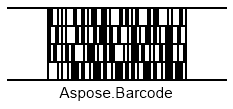

{}[Generate Code 16K Barcodes Online](https://products.aspose.app/barcode/generate/code16k): You can test the quality of ***Aspose.BarCode*** generation for Code 16K barcodes and get the results online.{}
## Overview
*Code 16K* is a multi-row barcode symbology that can have up to 16 rows, each with a fixed length capable of holding up to five characters. It uses a data encoding structure similar to *Code128*, offering the same character set with comparable data density. The *Code 16K* symbology includes a checksum for the entire barcode, calculated using the last two characters, but does not have separate checksums for individual rows. This barcode can encode up to 77 data characters or 154 numeric digits. Today, it is primarily of historical interest and is infrequently used in healthcare.

## Barcode Height Settings
With ***Aspose.BarCode for JavaScript via C++***, you can adjust the height of each row in a *Code 16K* barcode using the [*AspectRatio*](https://reference.aspose.com/barcode/javascript-cpp/aspose.barcode.generation/code16kparameters/properties/aspectratio) property in the [Code16KParameters](https://reference.aspose.com/barcode/javascript-cpp/aspose.barcode.generation/code16kparameters) class. The *AspectRatio* is a coefficient relative to the [*XDimension*](https://reference.aspose.com/barcode/javascript-cpp/aspose.barcode.generation/barcodeparameters/properties/xdimension) property. For *Code 16K*, it is recommended that the *AspectRatio* value be set to more than 8.

### Example Barcodes
Below are examples of *Code 16K* barcodes with different height settings:

| **Aspect Ratio** | **Set to 10** | **Set to 20** |
|------------------|---------------|---------------|
|                  |  |  |

### Code Example
The following code demonstrates how to set the height for *Code 16K* barcodes by defining the aspect ratio.

  
```javascript
// Generate Code 16K barcode with different aspect ratios
var gen = new BarCodeInstance.BarcodeGenerator("Code16K", "Aspose.Barcode");
gen.Parameters.Barcode.XDimension.Pixels = 2;

// Set Code 16K aspect ratio 10
gen.Parameters.Barcode.Code16K.AspectRatio = 10;
document.getElementById("img").src = gen.GenerateBarCodeImage(); // Display barcode image

// Set Code 16K aspect ratio 20
gen.Parameters.Barcode.Code16K.AspectRatio = 20;
document.getElementById("img").src = gen.GenerateBarCodeImage(); // Display barcode image

gen.delete();

```
## Quiet Zone Settings
With ***Aspose.BarCode for JavaScript via C++***, you can adjust the quiet zone size on the left and right sides of a *Code 16K* barcode using the [QuietZoneLeftCoef](https://reference.aspose.com/barcode/javascript-cpp/aspose.barcode.generation/code16kparameters/properties/quietzoneleftcoef) and [QuietZoneRightCoef](https://reference.aspose.com/barcode/javascript-cpp/aspose.barcode.generation/code16kparameters/properties/quietzonerightcoef) properties in the [Code16KParameters](https://reference.aspose.com/barcode/javascript-cpp/aspose.barcode.generation/code16kparameters) class. These properties are relative coefficients based on the [*XDimension*](https://reference.aspose.com/barcode/javascript-cpp/aspose.barcode.generation/barcodeparameters/properties/xdimension) value.

### Example Barcodes
Below are examples of *Code 16K* barcodes with different quiet zone settings:

| **Quiet Zone Coefficient** | **Set to 10** | **Set to 20** |
|----------------------------|---------------|---------------|
|                            |  |  |

### Code Example
The following code demonstrates how to customize the quiet zone settings for *Code 16K* barcodes.

  
```javascript
// Generate Code 16K barcode with different quiet zone settings
var gen = new BarCodeInstance.BarcodeGenerator("Code16K", "Aspose.Barcode");
gen.Parameters.Barcode.XDimension.Pixels = 2;

// Set Code 16K quiet zone 10 (left and right)
gen.Parameters.Barcode.Code16K.QuietZoneLeftCoef = 10;
gen.Parameters.Barcode.Code16K.QuietZoneRightCoef = 10;
document.getElementById("img10").src = gen.GenerateBarCodeImage(); // Display barcode image

// Set Code 16K quiet zone 20 (left and right)
gen.Parameters.Barcode.Code16K.QuietZoneLeftCoef = 20;
gen.Parameters.Barcode.Code16K.QuietZoneRightCoef = 20;
document.getElementById("img20").src = gen.GenerateBarCodeImage(); // Display barcode image

gen.delete();

```