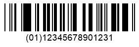
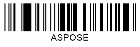

{}[Generate DataBar Barcodes Online](https://products.aspose.app/barcode/generate/databar): You can check the quality of ***Aspose.BarCode*** generation for DataBar barcodes and view the results online.{}
## **Overview**
The *DataBar* symbology was introduced in the early 2000s as part of the GS1 standards to address issues with older barcode types from the 1970s. It retains the capability of being scanned by laser readers and includes the following types:

- *DataBar Omnidirectional* / *DataBar Stacked Omnidirectional*
- *DataBar Truncated* / *DataBar Stacked*
- *DataBar Limited*
- *DataBar Expanded* / *DataBar Expanded Stacked*

All *DataBar* types, except *DataBar Limited*, can be represented in two-row or multi-row formats (up to 10 rows), making them adaptable for areas with limited horizontal space. These symbologies are designed to encode GS1 identification codes for trade items (Application Identifiers). Most *DataBar* types encode only Global Trade Item Numbers (GTIN) in *GTIN12* or *GTIN13* formats using a 14-digit structure. However, *DataBar Expanded* supports encoding a wider range of Application Identifiers and additional information, including alphanumeric characters and punctuation.

## **Barcode Height Settings**
*DataBar* symbologies are categorized into continuous and stacked types. ***Aspose.BarCode for JavaScript via C++*** provides specific methods for adjusting the height of each group. Below are details and examples.

### **Continuous Barcodes**
For continuous symbologies (*DataBar Omnidirectional*, *DataBar Truncated*, *DataBar Limited*, and *DataBar Expanded*), barcode height can be configured using the [*BarHeight*](https://reference.aspose.com/barcode/javascript-cpp/aspose.barcode.generation/barcodeparameters/properties/barheight) property of the [*BarcodeParameters*](https://reference.aspose.com/barcode/javascript-cpp/aspose.barcode.generation/barcodeparameters) class.

The examples below show *DataBar Omnidirectional* barcodes generated with different bar height settings.

|<p align="center">**Bar Height**</p>|<p align="center">**30 Pixels**</p>|<p align="center">**60 Pixels**</p>|
| :-: | :-: | :-: |
| |||

The following code snippet demonstrates how to set barcode height for continuous barcodes using *DataBar Omnidirectional* as an example.

  
```javascript
// Generate GS1 DataBar OmniDirectional barcode with different bar heights
var gen = new BarCodeInstance.BarcodeGenerator("DatabarOmniDirectional", "(01)12345678901231");
gen.Parameters.Barcode.XDimension.Pixels = 2;

// Set bar height to 30 pixels
gen.Parameters.Barcode.BarHeight.Pixels = 30;
document.getElementById("img30").src = gen.GenerateBarCodeImage(); // Display barcode image

// Set bar height to 60 pixels
gen.Parameters.Barcode.BarHeight.Pixels = 60;
document.getElementById("img").src = gen.GenerateBarCodeImage(); // Display barcode image

gen.delete();

```
### **Stacked Barcodes**
For stacked symbologies such as *DataBar Stacked Omnidirectional*, *DataBar Stacked*, and *DataBar Expanded Stacked*, barcode height can be adjusted using the [*AspectRatio*](https://reference.aspose.com/barcode/javascript-cpp/aspose.barcode.generation/databarparameters/properties/aspectratio) property in the [*DataBarParameters*](https://reference.aspose.com/barcode/javascript-cpp/aspose.barcode.generation/databarparameters) class. 

The *AspectRatio* is a relative coefficient to the [*XDimension*](https://reference.aspose.com/barcode/javascript-cpp/aspose.barcode.generation/barcodeparameters/properties/xdimension) property, allowing customization of the barcode's vertical layout.

The examples below illustrate *DataBar Stacked Omnidirectional* barcodes with varying aspect ratio settings.

|<p align="center">**Aspect Ratio**</p>|<p align="center">**15**</p>|<p align="center">**30**</p>|
| :-: | :-: | :-: |
| |||

The following code snippet demonstrates how to set the aspect ratio for stacked symbologies, using *DataBar Stacked Omnidirectional* as an example.

  
```javascript
// Generate GS1 DataBar Stacked OmniDirectional barcode with different aspect ratios
var gen = new BarCodeInstance.BarcodeGenerator("DatabarStackedOmniDirectional", "(01)12345678901231");
gen.Parameters.Barcode.XDimension.Pixels = 2;

// Set DataBar AspectRatio to 15
gen.Parameters.Barcode.DataBar.AspectRatio = 15;
document.getElementById("img15").src = gen.GenerateBarCodeImage(); // Display barcode image

// Set DataBar AspectRatio to 30
gen.Parameters.Barcode.DataBar.AspectRatio = 30;
document.getElementById("img30").src = gen.GenerateBarCodeImage(); // Display barcode image

gen.delete();

```
 ### **Stacked Barcodes**
For stacked symbologies such as *DataBar Stacked Omnidirectional*, *DataBar Stacked*, and *DataBar Expanded Stacked*, barcode height can be adjusted using the [*AspectRatio*](https://reference.aspose.com/barcode/javascript-cpp/aspose.barcode.generation/databarparameters/properties/aspectratio) property in the [*DataBarParameters*](https://reference.aspose.com/barcode/javascript-cpp/aspose.barcode.generation/databarparameters) class. 

The *AspectRatio* is a relative coefficient to the [*XDimension*](https://reference.aspose.com/barcode/javascript-cpp/aspose.barcode.generation/barcodeparameters/properties/xdimension) property, allowing customization of the barcode's vertical layout.

The examples below illustrate *DataBar Stacked Omnidirectional* barcodes with varying aspect ratio settings.

|<p align="center">**Aspect Ratio**</p>|<p align="center">**15**</p>|<p align="center">**30**</p>|
| :-: | :-: | :-: |
| |||

The following code snippet demonstrates how to set the aspect ratio for stacked symbologies, using *DataBar Stacked Omnidirectional* as an example.

   
```javascript
// Generate GS1 DataBar Expanded Stacked barcode with various column and row configurations
// Set 4 columns
var gen = new BarCodeInstance.BarcodeGenerator("DatabarExpandedStacked", "Databar Expanded Stacked long");
gen.Parameters.Barcode.DataBar.Columns = 4;
document.getElementById("img4").src = gen.GenerateBarCodeImage(); // Display barcode image

// Set 3 rows
gen.Parameters.Barcode.DataBar.Rows = 3;
document.getElementById("img3").src = gen.GenerateBarCodeImage(); // Display barcode image

// Set 6 columns and 10 rows
gen.Parameters.Barcode.DataBar.Columns = 6;
gen.Parameters.Barcode.DataBar.Rows = 10;
document.getElementById("img60").src = gen.GenerateBarCodeImage(); // Display barcode image

gen.delete();

```
  
## **Compatibility with GS1 Components**
Given that *DataBar Expanded* and *DataBar Expanded Stacked* symbologies, in theory, allow encoding any text, it may be required to ensure that encoded information is fully compatible with GS1 standards. To enable such controls, class [*DataBarParameters*](https://reference.aspose.com/barcode/javascript-cpp/aspose.barcode.generation/databarparameters) provides the [*IsAllowOnlyGS1Encoding*](https://reference.aspose.com/barcode/javascript-cpp/aspose.barcode.generation/databarparameters/properties/isallowonlygs1encoding) property that is aimed to verify the compatibility of the input barcode text with GS Application Identifiers and throws an exception in case of any mismatch. In addition, this property can be used to check the validity of input GTIN values for other *DataBar* standards.     
  
*DataBar Expanded* barcode image examples provided below have been created using the GS1 compatible and alternate encodings.
  
|<p align="center">**GS1 Compatibility**</p>|<p align="center">**GS1 Compatible Encoding**</p>|<p align="center">**Alternate Encoding**</p>|
| :-: | :-: | :-: |
| |||
  
The following code snippet explains how to enable the verification of compatibility with GS1 standards for *DataBar Expanded* barcodes. In case when the *IsAllowOnlyGS1Encoding* is set, and the used encoding does not match GS1 standards, the following exception is thrown: "*Exception: Wrong GS1 Application Identifiers format*".  
  
```javascript
// Generate GS1 DataBar Expanded barcode with GS1 encoding checks and variable codetext handling
var gen = new BarCodeInstance.BarcodeGenerator("DatabarExpanded", "");

// Correct codetext with GS1Encoding check
gen.CodeText = "(01)12345678901231";
gen.Parameters.Barcode.DataBar.IsAllowOnlyGS1Encoding = true;
document.getElementById("img").src = gen.GenerateBarCodeImage(); // Display barcode image

// Variable codetext without GS1Encoding check
gen.CodeText = "ASPOSE";
gen.Parameters.Barcode.DataBar.IsAllowOnlyGS1Encoding = false;
document.getElementById("img2").src = gen.GenerateBarCodeImage(); // Display barcode image

// Variable codetext with GS1Encoding check (throws error)
try {
    gen.CodeText = "ASPOSE";
    gen.Parameters.Barcode.DataBar.IsAllowOnlyGS1Encoding = true;
    document.getElementById("img").src = gen.GenerateBarCodeImage(); // Attempt to generate barcode
} catch (e) {
    console.error(e.message);
}

gen.delete();

```
### **Stacked Barcodes**
For stacked symbologies such as *DataBar Stacked Omnidirectional*, *DataBar Stacked*, and *DataBar Expanded Stacked*, barcode height can be adjusted using the [*AspectRatio*](https://reference.aspose.com/barcode/javascript-cpp/aspose.barcode.generation/databarparameters/properties/aspectratio) property in the [*DataBarParameters*](https://reference.aspose.com/barcode/javascript-cpp/aspose.barcode.generation/databarparameters) class. 

The *AspectRatio* is a relative coefficient to the [*XDimension*](https://reference.aspose.com/barcode/javascript-cpp/aspose.barcode.generation/barcodeparameters/properties/xdimension) property, allowing customization of the barcode's vertical layout.

The examples below illustrate *DataBar Stacked Omnidirectional* barcodes with varying aspect ratio settings.

|<p align="center">**Aspect Ratio**</p>|<p align="center">**15**</p>|<p align="center">**30**</p>|
| :-: | :-: | :-: |
| |||

The following code snippet demonstrates how to set the aspect ratio for stacked symbologies, using *DataBar Stacked Omnidirectional* as an example.

    
```javascript
// Generate GS1 DataBar Expanded barcode with 2D component flag enabled/disabled
var gen = new BarCodeInstance.BarcodeGenerator("DatabarStackedOmniDirectional", "(01)12345678901231");
gen.Parameters.Barcode.XDimension.Pixels = 2;

document.getElementById("img").src = gen.GenerateBarCodeImage(); // Display barcode image

gen.Parameters.Barcode.AspectRatio = 2;
document.getElementById("img2").src = gen.GenerateBarCodeImage(); // Display barcode image

gen.delete();

```