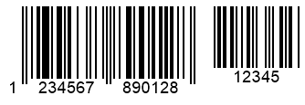

{}[Generate Barcodes Online](https://products.aspose.app/barcode/generate): You can check the quality of ***Aspose.BarCode*** barcode generation and view the results online.{}
## **Overview**
***Aspose.BarCode for JavaScript via C++*** supports the generation of *EAN 2* and *EAN 5* barcode types as supplements to the following symbologies: *EAN 13*, *EAN 8*, *Interleaved 2-of-5*, *ISBN*, *ISMN*, *ISSN*, *Standard 2-of-5*, *UPC-A*, and *UPC-E*. Supplement barcodes can encode two or five additional digits beyond the main barcode and have their own checksum. These barcodes are used in various industries to encode extra information, such as product details or pricing, although they can also be used for other purposes in production.

{}*For any clarifications, feel free to contact [Aspose Technical Support](/barcode/javascript-cpp/technical-support/), ask questions at the [Aspose.Barcode Forum](https://forum.aspose.com/c/barcode/13), or reach out to [Aspose Paid Support Helpdesk](https://helpdesk.aspose.com/).*{}

## **Supplement Barcode Settings**
The main product information is encoded in the primary barcode, while additional data is added using a supplement barcode. ***Aspose.BarCode for JavaScript via C++*** allows you to use the [*SupplementData*](https://reference.aspose.com/barcode/javascript-cpp/aspose.barcode.generation/supplementparameters/properties/supplementdata) property in the [*SupplementParameters*](https://reference.aspose.com/barcode/javascript-cpp/aspose.barcode.generation/supplementparameters) class, which is part of the [*Supplement*](https://reference.aspose.com/barcode/javascript-cpp/aspose.barcode.generation/barcodeparameters/properties/supplement) property group. The [*SupplementData*](https://reference.aspose.com/barcode/javascript-cpp/aspose.barcode.generation/supplementparameters/properties/supplementdata) property should be set with either 2 or 5 numerical digits for *EAN 2* or *EAN 5* supplements, respectively. The barcode type is determined automatically based on the number of digits, and the size of the supplement barcode is calculated based on the main barcode's parameters.

Below are examples of *EAN 13* barcodes with *EAN 2* and *EAN 5* supplement settings.

|<p align="center">**Supplement Barcode**</p>|<p align="center">**EAN 2**</p>|<p align="center">**EAN 5**</p>|
| :-: | :-: | :-: |
| |||

The code snippet below demonstrates how to generate supplement barcodes using *EAN 2* and *EAN 5* symbologies.

[How to get *BarCodeInstance*](/barcode/javascript-cpp/get-barcode-module-instance/)
```javascript
// Generate EAN-13 barcodes with different supplements
var gen = new BarCodeInstance.BarcodeGenerator("EAN13", "1234567890128");
gen.Parameters.Barcode.XDimension.Pixels = 2;
gen.Parameters.Barcode.Supplement.SupplementSpace.Pixels = 20;

// Set EAN-2 supplement
gen.Parameters.Barcode.Supplement.SupplementData = "12";
document.getElementById("img2").src = gen.GenerateBarCodeImage(); // Display barcode image

// Set EAN-5 supplement
gen.Parameters.Barcode.Supplement.SupplementData = "12345";
document.getElementById("img5").src = gen.GenerateBarCodeImage(); // Display barcode image

gen.delete();

```
## **Adjust Spacing Between Main and Supplement Barcodes**
To set the spacing between the main and supplement barcodes, the [*SupplementSpace*](https://reference.aspose.com/barcode/javascript-cpp/aspose.barcode.generation/supplementparameters/properties/supplementspace) property in the [*SupplementParameters*](https://reference.aspose.com/barcode/javascript-cpp/aspose.barcode.generation/supplementparameters) class can be used.

The barcode examples below show different gap settings between the main and supplement barcodes.

|<p align="center">**Supplement Spacing**</p>|<p align="center">**Set to 20 Pixels**</p>|<p align="center">**Set to 40 Pixels**</p>|
| :-: | :-: | :-: |
| |||

The following code snippet demonstrates how to set the spacing between the main and supplement barcodes for the *EAN 13* symbology.

  
[How to get *BarCodeInstance*](/barcode/javascript-cpp/get-barcode-module-instance/)
```javascript
// Generate EAN-13 barcode with different supplement space settings
var gen = new BarCodeInstance.BarcodeGenerator("EAN13", "1234567890128");
gen.Parameters.Barcode.XDimension.Pixels = 2;
gen.Parameters.Barcode.Supplement.SupplementData = "12345";

// Set supplement space to 20 pixels
gen.Parameters.Barcode.Supplement.SupplementSpace.Pixels = 20;
document.getElementById("img").src = gen.GenerateBarCodeImage(); // Display barcode image

// Set supplement space to 40 pixels
gen.Parameters.Barcode.Supplement.SupplementSpace.Pixels = 40;
document.getElementById("img").src = gen.GenerateBarCodeImage(); // Display barcode image

gen.delete();

```