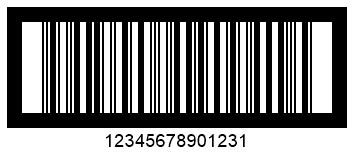

{}[Generate ITF Barcodes Online](https://products.aspose.app/barcode/generate/itf): You can check the quality of ***Aspose.BarCode*** generation for ITF barcodes and view the results online.{}
## **Overview**
The *ITF 14* barcode type, developed by GS1 based on the *Interleaved 2-of-5* standard, is used to encode Global Trade Item Numbers (GTIN). This type supports 14-digit encoding, with the last digit being a check digit. The *ITF 6* symbology complements *ITF 14* by encoding additional information such as the quantity or weight of the item. *ITF* barcodes typically feature various types of borders or frames with a quiet zone, which can be customized based on specific industrial needs. In ***Aspose.BarCode for JavaScript via C++***, these parameters can be modified using the [*ITF*](https://reference.aspose.com/barcode/javascript-cpp/aspose.barcode.generation/barcodeparameters/properties/itf) property group in the [*BarcodeParameters*](https://reference.aspose.com/barcode/javascript-cpp/aspose.barcode.generation/barcodeparameters) class. This section details these properties and provides examples for their usage.

{}*For any clarifications, feel free to contact [Aspose Technical Support](/barcode/javascript-cpp/technical-support/), ask questions at the [Aspose.Barcode Forum](https://forum.aspose.com/c/barcode/13), or reach out to [Aspose Paid Support Helpdesk](https://helpdesk.aspose.com/).*{}

## **Frame Settings**
*ITF* barcodes can have customized frames based on industrial requirements. ***Aspose.BarCode for JavaScript via C++*** allows developers to modify the frame style and thickness to meet specific needs.

### **Frame Style for ITF 14 and ITF 6**
Five frame styles are available for *ITF* barcodes in ***Aspose.BarCode for JavaScript via C++***, including an option for no frame. The frame style is set using the [*ItfBorderType*](https://reference.aspose.com/barcode/javascript-cpp/aspose.barcode.generation/itf14bordertype) enumeration, which includes the following options: *None*, *Frame*, *Bar*, *FrameOut*, and *BarOut*. The *FrameOut* and *BarOut* options create a frame outside the barcode image without altering its height.

The examples below show how different frame styles affect the appearance of the barcode.

|Frame Style|No Borders (*None*)|Normal Frame (*Frame*)|Horizontal Lines (*Bar*)|Outside Frame (*FrameOut*)|Outside Lines (*BarOut*)|
| :-: | :-: | :-: | :-: | :-: | :-: |
| ||||||

The following code snippet demonstrates how to set the frame style for *ITF 14* barcodes.

[How to get *BarCodeInstance*](/barcode/javascript-cpp/get-barcode-module-instance/)
```javascript
// Generate ITF-14 barcodes with different border types
var gen = new BarCodeInstance.BarcodeGenerator("ITF14", "12345678901231");
gen.Parameters.Barcode.XDimension = "2px";

// ITF border type None
gen.Parameters.Barcode.ITF.ItfBorderType = BarCodeInstance.ITF14BorderType.None;
document.getElementById("imgNone").src = gen.GenerateBarCodeImage(); // Display barcode image

// ITF border type Bar
gen.Parameters.Barcode.ITF.ItfBorderType = BarCodeInstance.ITF14BorderType.Bar;
document.getElementById("imgBar").src = gen.GenerateBarCodeImage(); // Display barcode image

// ITF border type BarOut
gen.Parameters.Barcode.ITF.ItfBorderType = BarCodeInstance.ITF14BorderType.BarOut;
document.getElementById("imgBarOut").src = gen.GenerateBarCodeImage(); // Display barcode image

// ITF border type Frame
gen.Parameters.Barcode.ITF.ItfBorderType = BarCodeInstance.ITF14BorderType.Frame;
document.getElementById("imgFrame").src = gen.GenerateBarCodeImage(); // Display barcode image

// ITF border type FrameOut
gen.Parameters.Barcode.ITF.ItfBorderType = BarCodeInstance.ITF14BorderType.FrameOut;
document.getElementById("imgFrameOut").src = gen.GenerateBarCodeImage(); // Display barcode image

gen.delete();


```
  
### **Border Thickness**
Depending on specific industrial requirements, the library enables adjusting border thickness for *ITF* barcodes by initializing the [*ItfBorderThickness*](https://reference.aspose.com/barcode/javascript-cpp/aspose.barcode.generation/itfparameters/properties/itfborderthickness) property of class [*ITFParameters*](https://reference.aspose.com/barcode/javascript-cpp/aspose.barcode.generation/itfparameters). By default, this property is set to 12 pt.
  
*ITF 14* barcode labels shown below have been generated with different border thickness settings.
  
|Border Thickness|Is Set to 5 Pixels|Is Set to 15 Pixels|
| :-: | :-: | :-: |
| |||
  
The following code sample shows how to set different border thickness values using the *ITF 14* symbology as an example.
  
[How to get *BarCodeInstance*](/barcode/javascript-cpp/get-barcode-module-instance/)
```javascript

// Generate ITF-14 barcodes with different border sizes
var gen = new BarCodeInstance.BarcodeGenerator("ITF14", "12345678901231");
gen.Parameters.Barcode.XDimension = "2px";
gen.Parameters.Barcode.ITF.ItfBorderType = BarCodeInstance.ITF14BorderType.Frame;

// ITF border size 5 Pixels
gen.Parameters.Barcode.ITF.ItfBorderThickness = "5px";
document.getElementById("img5").src = gen.GenerateBarCodeImage(); // Display barcode image

// ITF border size 15 Pixels
gen.Parameters.Barcode.ITF.ItfBorderThickness = "15px";
document.getElementById("img15").src = gen.GenerateBarCodeImage(); // Display barcode image

gen.delete();


```
  
## **Quiet Zone Settings**
In ***Aspose.BarCode for JavaScript via C++***, developers can customize the size of the quiet zone in *ITF* barcodes by setting the [*QuietZoneCoef*](https://reference.aspose.com/barcode/javascript-cpp/aspose.barcode.generation/itfparameters/properties/quietzonecoef) property of class [*ITFParameters*](https://reference.aspose.com/barcode/javascript-cpp/aspose.barcode.generation/itfparameters). This property is defined as a relative coefficient to the [*XDimension*](https://reference.aspose.com/barcode/javascript-cpp/aspose.barcode.generation/barcodeparameters/properties/xdimension) parameter.  
  
*ITF 14* barcode images demonstrated below as examples have been generated using different settings for the quiet zone. 
  
|Quiet Zone Coefficient|Is Set to 10|Is Set to 30|
| :-: | :-: | :-: |
| |||
  
The following code sample illustrates how to adjust the appearance of the quiet zone for *ITF 14* barcodes.
  
[How to get *BarCodeInstance*](/barcode/javascript-cpp/get-barcode-module-instance/)
```javascript
// Generate ITF-14 barcodes with different quiet zone sizes
var gen = new BarCodeInstance.BarcodeGenerator("ITF14", "12345678901231");
gen.Parameters.Barcode.XDimension = "2px";
gen.Parameters.Barcode.ITF.ItfBorderType = BarCodeInstance.ITF14BorderType.Frame;

// ITF quiet zone 10 * XDimension
gen.Parameters.Barcode.ITF.QuietZoneCoef = 10;
document.getElementById("img10").src = gen.GenerateBarCodeImage(); // Display barcode image

// ITF quiet zone 30 * XDimension
gen.Parameters.Barcode.ITF.QuietZoneCoef = 30;
document.getElementById("img30").src = gen.GenerateBarCodeImage(); // Display barcode image

gen.delete();


```