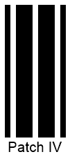
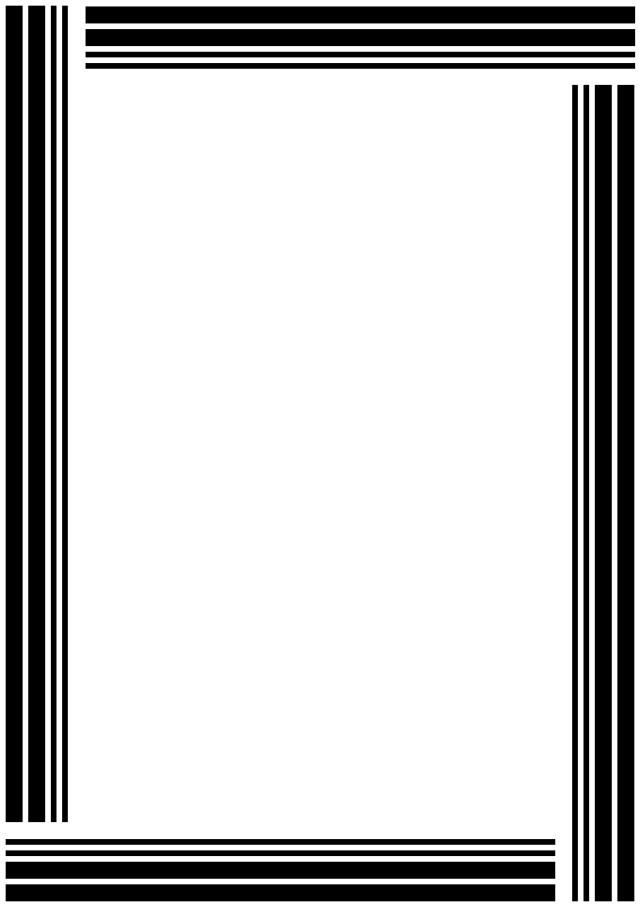
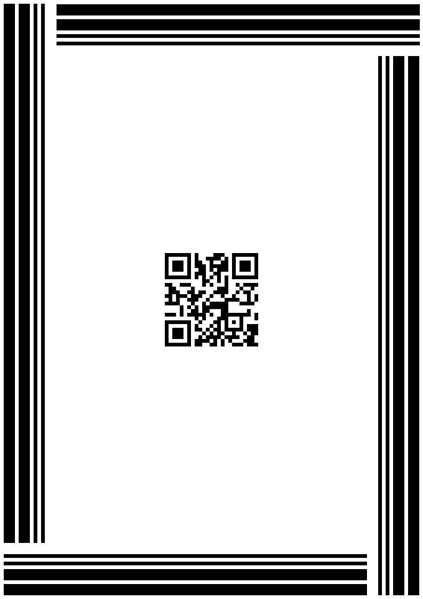

{}[Generate Patch Code Barcodes Online](https://products.aspose.app/barcode/generate/patchcode): You can check the quality of ***Aspose.BarCode*** generation for PatchCode barcodes and view the results online.{}

## **Overview**
*Patch Code* was developed by Kodak to support task management in automatic multi-page document scanning. These barcodes do not encode data; instead, they use a specific barcode pattern to indicate the action required. ***Aspose.BarCode for JavaScript via C++*** supports six main *Patch Code* patterns and allows barcodes to be generated in two modes: as separate images for manual placement on pages or as a complete A4 or US Letter page with the desired resolution. *Patch Code* labels can be printed on all four sides of a document, but reading just one side is sufficient for successful scanning, even if pages are rotated.

{}*If you need any clarifications, feel free to reach out [Aspose Technical Support](/barcode/javascript-cpp/technical-support/): ask your questions at [Aspose.Barcode Forum](https://forum.aspose.com/c/barcode/13) or contact [Aspose Paid Support Helpdesk](https://helpdesk.aspose.com/).*{}

## **Supported Patterns**
***Aspose.BarCode for JavaScript via C++*** supports the main *Patch Code* set, which includes six patterns. The extended pattern set introduced later by Kodak is not yet standardized and is not supported by the library. The main patterns available are: *Patch I*, *Patch II*, *Patch III*, *Patch IV*, *Patch T*, and *Patch VI*.

The sample barcode labels below show the six basic *Patch Code* barcode types.

|<p align="center">**PatchCode Standards**</p>|<p align="center">**Patch I**</p>|<p align="center">**Patch II**</p>|<p align="center">**Patch III**</p>|<p align="center">**Patch IV**</p>|<p align="center">**Patch T**</p>|<p align="center">**Patch VI**</p>|  
| :-: | :-: | :-: | :-: | :-: | :-: | :-: |
| |||||||

The following code snippet demonstrates how to generate *Patch Code* barcodes using the available patterns.

  
[How to get *BarCodeInstance*](/barcode/javascript-cpp/get-barcode-module-instance/)
```javascript
// Generate PatchCode barcodes with custom font size and text
var gen = new BarCodeInstance.BarcodeGenerator("PatchCode", "Patch I");
gen.Parameters.Barcode.CodeTextParameters.FontMode = BarCodeInstance.FontMode.Manual;
gen.Parameters.Barcode.CodeTextParameters.Font.Size.Pixels = 20;

// Generate and display PatchCode I
gen.CodeText = "Patch I";
document.getElementById("img1").src = gen.GenerateBarCodeImage(); // Display barcode image

// Generate and display PatchCode II
gen.CodeText = "Patch II";
document.getElementById("img2").src = gen.GenerateBarCodeImage(); // Display barcode image

// Generate and display PatchCode III
gen.CodeText = "Patch III";
document.getElementById("img3").src = gen.GenerateBarCodeImage(); // Display barcode image

// Generate and display PatchCode IV
gen.CodeText = "Patch IV";
document.getElementById("img4").src = gen.GenerateBarCodeImage(); // Display barcode image

// Generate and display PatchCode T
gen.CodeText = "Patch T";
document.getElementById("imgt").src = gen.GenerateBarCodeImage(); // Display barcode image

// Generate and display PatchCode VI
gen.CodeText = "Patch VI";
document.getElementById("img6").src = gen.GenerateBarCodeImage(); // Display barcode image

gen.delete();

```

## **Generation Modes**
***Aspose.BarCode for JavaScript via C++*** supports generating *Patch Code* barcodes as separate images or as A4/US Letter pages in portrait or landscape orientation. The library also allows adding an optional complementary *QR Code* for additional information needed in scanning tasks. Note that other barcode types cannot be set as complementary barcodes.

### **Setting Generation Format**
To set the format for *Patch Code* barcodes, configure the [*PatchFormat*](https://reference.aspose.com/barcode/javascript-cpp/aspose.barcode.generation/patchcodeparameters/properties/patchformat) property of the [*PatchCodeParameters*](https://reference.aspose.com/barcode/javascript-cpp/aspose.barcode.generation/patchcodeparameters) class. The available options are:

- **PatchOnly**: Generates standalone *Patch Code* barcode images (default setting).
- **A4**: Outputs A4 pages in portrait orientation with *Patch Code* barcodes on the borders and an optional QR code in the center.
- **A4_LANDSCAPE**: Creates A4 pages in landscape orientation with *Patch Code* barcodes on the borders and an optional QR code in the center.
- **US_Letter**: Produces US Letter pages in portrait orientation with *Patch Code* barcodes on the borders and an optional QR code in the center.
- **US_Letter_LANDSCAPE**: Generates US Letter pages in landscape orientation with *Patch Code* barcodes on the borders and an optional QR code in the center.

### **Adding Complementary QR Code**
To include a complementary QR code in a *Patch Code* barcode page (A4 or US Letter), set a text value in the [*ExtraBarcodeText*](https://reference.aspose.com/barcode/javascript-cpp/aspose.barcode.generation/patchcodeparameters/properties/extrabarcodetext) property of the [*PatchCodeParameters*](https://reference.aspose.com/barcode/javascript-cpp/aspose.barcode.generation/patchcodeparameters) class and set the [*Location*](https://reference.aspose.com/barcode/javascript-cpp/aspose.barcode.generation/codetextparameters/properties/location) property of the [*CodeTextParameters*](https://reference.aspose.com/barcode/javascript-cpp/aspose.barcode.generation/codetextparameters) class to "*CodeLocation.None*".

### **Illustrative Examples**
Below are images of *Patch Code* barcode pages with and without a complementary QR code:

|<p align="center">**Complementary QR Code**</p>|<p align="center">**Disabled**</p>|<p align="center">**Enabled**</p>|
| :-: | :-: | :-: |
| |<a href="patchcodea4withoutqr.png"> <p align="center"></p></a>|<a href="patchcodea4withqr.png"> <p align="center"></p></a>|

  
[How to get *BarCodeInstance*](/barcode/javascript-cpp/get-barcode-module-instance/)
```javascript
// Create PatchCode barcodes with and without complimentary QR
var gen = new BarCodeInstance.BarcodeGenerator("PatchCode", "Patch I");

// Create a PatchCode barcode without complimentary QR
gen.Parameters.Barcode.PatchCode.PatchFormat = BarCodeInstance.PatchFormat.A4;
document.getElementById("img").src = gen.GenerateBarCodeImage(); // Display barcode image

// Create a PatchCode barcode with complimentary QR
gen.Parameters.Barcode.PatchCode.ExtraBarcodeText = "Aspose page extra info";
gen.Parameters.Barcode.CodeTextParameters.Location = BarCodeInstance.CodeLocation.None; // No code text display
document.getElementById("imgQr").src = gen.GenerateBarCodeImage(); // Display barcode image

gen.delete();

```