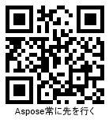
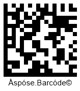
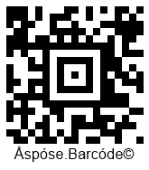
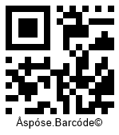
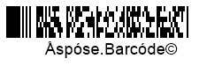

**Two-dimensional (2D)** barcodes were developed to overcome the limitations of linear symbologies. Unlike 1D barcodes, 2D barcodes can encode a much larger amount of information, including text, numeric data, URLs, and more. They use geometric patterns such as rectangles, dots, or hexagons to store data both horizontally and vertically, forming a square or rectangle. This allows them to store significantly more information than traditional 1D barcodes. Additionally, 2D barcodes have high readability and can withstand poor printing quality, as they include redundancy that helps recover the data even if some cells are damaged.

**QR Code**  
*QR Code* is a widely used 2D barcode symbology designed for encoding alphanumeric data, such as text or URLs. It consists of a matrix of black and white squares that can be scanned by smartphones and other readers. QR Codes are known for their high data density and support for **Reed-Solomon** error correction, which allows them to recover from data corruption and ensure accurate information retrieval.

<p align="center"></p>

The following code sample demonstrates how to generate a *QR Code* barcode:

```javascript
var gen = new BarCodeInstance.BarcodeGenerator("QR", "Aspose常に先を行く");
gen.Parameters.Barcode.QR.QrEncodeMode = BarCodeInstance.QREncodeMode.ECIEncoding;
gen.Parameters.Barcode.QR.QrECIEncoding = BarCodeInstance.ECIEncodings.UTF8;
gen.Parameters.Barcode.XDimension = "8px";
document.getElementById("img").src = gen.GenerateBarCodeImage();
```

**PDF417**  
The *PDF417* barcode is a 2D high-density symbology capable of encoding a wide range of data types, including text, numbers, files, and binary data. It employs Reed-Solomon error correction, ensuring high recognition accuracy even in less-than-ideal conditions.

<p align="center"></p>

The following code snippet illustrates how to generate a *PDF417* barcode in JavaScript:

```javascript
var gen = new BarCodeInstance.BarcodeGenerator("PDF417", "Åspóse.Barcóde©");
gen.Parameters.Barcode.PDF417.Rows = 6;
document.getElementById("img").src = gen.GenerateBarCodeImage();
```
**Data Matrix**  
*Data Matrix* is a 2D barcode type that allows encoding large amounts of data in a compact space. A single *Data Matrix* can hold up to 2,335 alphanumeric or 3,116 numerical characters, which is approximately ten times denser than standard 1D barcodes.

<p align="center"></p>

To create a *Data Matrix* barcode, use the following JavaScript code:

```javascript
var gen = new BarCodeInstance.BarcodeGenerator("DataMatrix", "Åspóse.Barcóde©");
gen.Parameters.Barcode.XDimension = "8px";
document.getElementById("img").src = gen.GenerateBarCodeImage();
```
**Aztec Code**  
*Aztec Code* is a highly efficient 2D symbology that uses square modules with a unique finder pattern in the center of the barcode. This allows barcode scanners to identify cell locations required for reading. The *Aztec Code* symbology supports encoding any sequence of bytes and ensures accurate data recognition.

<p align="center"></p>

To generate an *Aztec* barcode, use the following JavaScript code:

```javascript
var gen = new BarCodeInstance.BarcodeGenerator("Aztec", "Åspóse.Barcóde©");
gen.Parameters.Barcode.XDimension = "8px";
document.getElementById("img").src = gen.GenerateBarCodeImage();
```
**Micro QR Code**  
The *Micro QR Code* symbology offers high data density in a compact square shape. Unlike the regular *QR Code*, which has three position detection patterns, the *Micro QR Code* has only one. This makes it ideal for applications where space is limited.

<p align="center"></p>

To generate a *Micro QR Code*, use the following JavaScript code:

```javascript
var gen = new BarCodeInstance.BarcodeGenerator("QR", "Åspóse.Barcóde©");
gen.Parameters.Barcode.QR.QrEncodeType = BarCodeInstance.QREncodeType.ForceMicroQR;
gen.Parameters.Barcode.XDimension = "8px";
document.getElementById("img").src = gen.GenerateBarCodeImage();
```

**Compact PDF417**  
*Compact PDF417* is ideal for scenarios where space is limited and the risk of symbol damage is low. Although it has lower data density compared to other 2D barcodes, its elongated shape—64 times longer than its height—makes it well-suited for narrow, rectangular areas with size constraints.

<p align="center"></p>

To generate a *Compact PDF417* barcode, use the following JavaScript code:

```javascript
var gen = new BarCodeInstance.BarcodeGenerator("Pdf417", "Åspóse.Barcóde©");
// Compact version of Pdf417
gen.Parameters.Barcode.Pdf417.Pdf417Truncate = true;
gen.Parameters.Barcode.Pdf417.Rows = 6;
document.getElementById("img").src = gen.GenerateBarCodeImage();
```