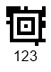

{}[Generate Aztec Barcodes Online](https://products.aspose.app/barcode/generate/aztec): You can check the quality of ***Aspose.BarCode*** generation for Aztec barcodes and view the results online.{}

## **Overview**
*Aztec Code* is a 2D matrix type that supports encoding both byte streams and alphanumeric characters. It features square-grid modules with a unique pattern in the middle of the barcode that facilitates scanning and recognition. Additionally, it uses Reed-Solomon error correction to verify data integrity and recover encoded information. This symbology offers high data density and recognition accuracy.

*Aztec Code* includes the following subtypes:
- **Full-Range Aztec Code** - Encodes up to 1,914 bytes or 3,832 numerical (3,067 alphanumeric) digits.
- **Compact Aztec Code** - Can encode up to 53 bytes or 110 numerical (89 alphanumeric) digits.
- **Aztec Rune** - Encodes values from 0 to 255 and is intended for Augmented Reality applications.

{}*If you need any clarifications, feel free to reach out [Aspose Technical Support](/barcode/javascript-cpp/technical-support/): ask your questions at [Aspose.Barcode Forum](https://forum.aspose.com/c/barcode/13) or contact [Aspose Paid Support Helpdesk](https://helpdesk.aspose.com/).*{}

## **Aztec Code Generation Mode Settings**
To select the required generation mode for *Aztec Code* barcodes in ***Aspose.BarCode for JavaScript via C++***, initialize the [*AztecSymbolMode*](https://reference.aspose.com/barcode/javascript-cpp/aspose.barcode.generation/aztecparameters/properties/aztecsymbolmode) field of the [*AztecParameters*](https://reference.aspose.com/barcode/javascript-cpp/aspose.barcode.generation/aztecparameters) class. This property can take the following values:
- **Auto**: The library selects the most compact *Aztec Code* type sufficient to encode the input data.
- **Compact**: Generates *Compact Aztec Code* barcodes up to 4 layers with a maximum size of 27x27 modules.
- **FullRange**: Creates *Full-Range Aztec Code* barcodes up to 32 layers with a maximum size of 151x151 modules.
- **Rune**: Generates *Aztec Rune* barcodes encoding numerical digits from 0 to 255, with a maximum size of 11x11 modules.

Sample *Aztec Code* barcodes created using different generation modes are shown below.

|Generation Mode|***Auto***|***Compact***|***Full-Range***|***Rune***|
| :-: | :-: | :-: | :-: | :-: |
| |||||

To set the required generation mode for *Aztec Code* in JavaScript, use the following code snippet:

[How to get *BarCodeInstance*](/barcode/javascript-cpp/get-barcode-module-instance/)
```javascript
var gen = new BarCodeInstance.BarcodeGenerator("Aztec", "Åspóse.Barcóde©");

// Set symbol mode Auto
gen.Parameters.Barcode.Aztec.AztecSymbolMode = BarCodeInstance.AztecSymbolMode.Auto;
document.getElementById("img-auto").src = gen.GenerateBarCodeImage();

// Set symbol mode FullRange
gen.Parameters.Barcode.Aztec.AztecSymbolMode = BarCodeInstance.AztecSymbolMode.FullRange;
document.getElementById("img-fullrange").src = gen.GenerateBarCodeImage();

// Set symbol mode Compact
gen.Parameters.Barcode.Aztec.AztecSymbolMode = BarCodeInstance.AztecSymbolMode.Compact;
document.getElementById("img-compact").src = gen.GenerateBarCodeImage();

// Set symbol mode Rune
gen.Parameters.Barcode.Aztec.AztecSymbolMode = BarCodeInstance.AztecSymbolMode.Rune;
document.getElementById("img-rune").src = gen.GenerateBarCodeImage();
```

## **Set Encoding Mode**

The barcode library supports various encoding modes for generating *Aztec* barcodes. The required mode can be selected by setting the [*AztecEncodeMode*](https://reference.aspose.com/barcode/javascript-cpp/aspose.barcode.generation/aztecparameters/aztecencodemode) property of the [*AztecParameters*](https://reference.aspose.com/barcode/javascript-cpp/aspose.barcode.generation/aztecparameters) class. The possible values are defined in the [*AztecEncodeMode*](https://reference.aspose.com/barcode/javascript-cpp/aspose.barcode.generation/aztecencodemode/) enumeration. These modes are described below:

- **Auto**: Encodes the CodeText with maximum data compactness. This is the default value.
- **Binary**: Used to encode binary data with maximum data compactness.
- **ECI**: Indicates that the encoded data is interpreted according to the Extended Channel Interpretation (ECI) protocol defined by the AIM ECI Specifications.
- **Extended**: Provides flexible encoding controls and allows for manually specifying the encoding for part of the CodeText.

### **Auto Encoding Mode**

In Auto mode, the CodeText is encoded with maximum data compactness. Unicode characters are re-encoded using the encoding specified in the [*ECIEncoding*](https://reference.aspose.com/barcode/javascript-cpp/aspose.barcode.generation/aztecparameters/eciencoding/) parameter, with an ECI identifier inserted. If a character is found that is not supported by the selected ECI encoding, an exception is thrown. By default, the [*ECIEncoding*](https://reference.aspose.com/barcode/javascript-cpp/aspose.barcode.generation/aztecparameters/eciencoding/) property is set to [*ECIEncodings*](https://reference.aspose.com/barcode/javascript-cpp/aspose.barcode.generation/eciencodings/).UTF8 (ECI ID:"\000026").

The following code snippet shows how to generate an Aztec barcode in the *Auto* mode.

<p align="center"></p>

[How to get *BarCodeInstance*](/barcode/javascript-cpp/get-barcode-module-instance/)
```javascript
var gen = new BarCodeInstance.BarcodeGenerator("Aztec", "犬Right狗");
gen.Parameters.Barcode.Aztec.AztecEncodeMode = BarCodeInstance.AztecEncodeMode.Auto;
document.getElementById("img").src = gen.GenerateBarCodeImage();
```
### **ECI Encoding Mode**

The Extended Channel Interpretation (ECI) mode indicates that the encoded data is interpreted according to the ECI protocol defined by the AIM ECI Specifications. When ECI mode is selected, the entire CodeText is re-encoded using the encoding specified in the [*ECIEncoding*](https://reference.aspose.com/barcode/javascript-cpp/aspose.barcode.generation/aztecparameters/eciencoding/) parameter, with an ECI identifier inserted. If a character is found that is not supported by the selected ECI encoding, an exception is thrown. By default, the [*ECIEncoding*](https://reference.aspose.com/barcode/javascript-cpp/aspose.barcode.generation/aztecparameters/eciencoding/) property is set to [*ECIEncodings*](https://reference.aspose.com/barcode/javascript-cpp/aspose.barcode.generation/eciencodings/).UTF8 (ECI ID:"\000026").

The following code snippet demonstrates how to use the *ECI* mode.

<p align="center"></p>

[How to get *BarCodeInstance*](/barcode/javascript-cpp/get-barcode-module-instance/)
```javascript
var gen = new BarCodeInstance.BarcodeGenerator("Aztec", "ΑΒΓΔΕ");
gen.Parameters.Barcode.Aztec.AztecEncodeMode = BarCodeInstance.AztecEncodeMode.ECI;
gen.Parameters.Barcode.Aztec.ECIEncoding = BarCodeInstance.ECIEncodings.ISO_8859_7;
document.getElementById("img").src = gen.GenerateBarCodeImage();
```
### **Extended Encoding Mode**

In the *Extended Codetext* mode, the input data passed to the [*CodeText*](https://reference.aspose.com/barcode/javascript-cpp/aspose.barcode.generation/barcodegenerator/codetext/) property contains special control words in addition to the main information. Such words activate extended controls over data encoding and enable storing textual parts with different encodings in a single barcode. To generate Aztec barcodes in this format, it is recommended to use the class [*AztecExtCodetextBuilder*](https://reference.aspose.com/barcode/javascript-cpp/aspose.barcode.generation/aztecextcodetextbuilder/).

The following code snippet demonstrates how to use the *Extended* mode.

<p align="center"></p>

[How to get *BarCodeInstance*](/barcode/javascript-cpp/get-barcode-module-instance/)
```javascript
// Create codetext
var textBuilder = new BarCodeInstance.AztecExtCodetextBuilder();
textBuilder.AddECICodetext(BarCodeInstance.ECIEncodings.Win1251, "One");
textBuilder.AddECICodetext(BarCodeInstance.ECIEncodings.UTF8, "犬Two狗");
textBuilder.AddECICodetext(BarCodeInstance.ECIEncodings.UTF16BE, "犬Three狗");
textBuilder.AddPlainCodetext("Plain text");

// Generate codetext
var codetext = textBuilder.GetExtendedCodetext();

// Generate barcode
var gen = new BarCodeInstance.BarcodeGenerator("Aztec", codetext);
gen.Parameters.Barcode.XDimension = "15px";
// Set encode mode to Extended
gen.Parameters.Barcode.Aztec.AztecEncodeMode = BarCodeInstance.AztecEncodeMode.Extended;
document.getElementById("img").src = gen.GenerateBarCodeImage();
```

## **Layout Settings**

By default, the size of the barcode will be automatically selected based on the data size. To manually determine the size of the barcode, you need to initialize the [*LayersCount*](https://reference.aspose.com/barcode/javascript-cpp/aspose.barcode.generation/aztecparameters/layerscount/) property of the [*AztecParameters*](https://reference.aspose.com/barcode/javascript-cpp/aspose.barcode.generation/aztecparameters/) class. This property can have values from 1 to 3 for *Compact Aztec Code* and from 1 to 32 for *Full-Range Aztec Code*. If the data size exceeds the capacity of the symbol with the specified size, an exception will be thrown.

The following code snippet demonstrates how to set the layout for a generated *Aztec Code* barcode.

| Layers Count | Is Set to Auto | Is Set to 10 |
| :-: | :-: | :-: |
| |  |  |

[How to get *BarCodeInstance*](/barcode/javascript-cpp/get-barcode-module-instance/)
```javascript
var gen = new BarCodeInstance.BarcodeGenerator("Aztec", "Åspóse.Barcóde©");
gen.Parameters.Barcode.XDimension = "4px";

// Auto (by default)
document.getElementById("img-auto").src = gen.GenerateBarCodeImage();

// Set layers count to 10
gen.Parameters.Barcode.Aztec.LayersCount = 10;
document.getElementById("img-10").src = gen.GenerateBarCodeImage();
```
## **Error Correction Level Settings**

In addition to the main barcode data, *Aztec Code* barcodes contain recovery information that can occupy from 5 to 95% of the entire encoded data stream. It is recommended to set this parameter to 23%. To select the required error correction level for *Aztec Code* in ***Aspose.BarCode for JavaScript via C++***, you need to initialize the [*AztecErrorLevel*](https://reference.aspose.com/barcode/javascript-cpp/aspose.barcode.generation/aztecparameters/properties/aztecerrorlevel) property of class [*AztecParameters*](https://reference.aspose.com/barcode/javascript-cpp/aspose.barcode.generation/aztecparameters/).

Sample barcodes demonstrated below have been generated with different error correction level settings.

| Error Correction Level | Is Set to 5 | Is Set to 50 |
| :-: | :-: | :-: |
| |  |  |

[How to get *BarCodeInstance*](/barcode/javascript-cpp/get-barcode-module-instance/)
```javascript
var gen = new BarCodeInstance.BarcodeGenerator("Aztec", "Åspóse.Barcóde© is a powerful library to generate & recognize 1D & 2D barcodes");
gen.Parameters.Barcode.XDimension = "4px";
gen.Parameters.Barcode.Aztec.AztecSymbolMode = BarCodeInstance.AztecSymbolMode.FullRange;

// Set error correction capacity to 5%
gen.Parameters.Barcode.Aztec.AztecErrorLevel = 5;
document.getElementById("img-error-level-5").src = gen.GenerateBarCodeImage();

// Set error correction capacity to 50%
gen.Parameters.Barcode.Aztec.AztecErrorLevel = 50;
document.getElementById("img-error-level-50").src = gen.GenerateBarCodeImage();
```
### **Structured Append Mode**

***Aspose.BarCode for JavaScript via C++*** supports a special generation mode to create *Aztec Code* barcodes with a structured append. This mode allows combining up to 26 *Aztec Code* barcodes. To enable this generation mode, initialize the following properties:
- [*StructuredAppendBarcodesCount*](https://reference.aspose.com/barcode/javascript-cpp/aspose.barcode.generation/aztecparameters/structuredappendbarcodescount/) – the number of barcodes to be combined (value from 1 to 26)
- [*StructuredAppendBarcodeId*](https://reference.aspose.com/barcode/javascript-cpp/aspose.barcode.generation/aztecparameters/structuredappendbarcodeid/) – the position of a barcode in the set (value from 1 to StructuredAppendBarcodesCount)  
- [*StructuredAppendFileId*](https://reference.aspose.com/barcode/javascript-cpp/aspose.barcode.generation/aztecparameters/structuredappendfileid/) – an optional field that must be the same in all symbols that make up the message. It should not contain spaces.

The following code sample shows how to enable the *Structured Append* mode.    

<p align="center"></p>

[How to get *BarCodeInstance*](/barcode/javascript-cpp/get-barcode-module-instance/)
```javascript
var gen = new BarCodeInstance.BarcodeGenerator("Aztec", "Aspose");
gen.Parameters.Barcode.XDimension = "15px";
// Set Aztec structured append mode
gen.Parameters.Barcode.Aztec.StructuredAppendBarcodeId = 3;
gen.Parameters.Barcode.Aztec.StructuredAppendBarcodesCount = 5;
gen.Parameters.Barcode.Aztec.StructuredAppendFileId = "ABCD";
document.getElementById("img").src = gen.GenerateBarCodeImage();
```

## **Hardware Reader Initialization**

To encode a special flag indicating that the data encoded in a *Aztec Code* barcode is intended to initialize a hardware reader, set the [*IsReaderInitialization*](https://reference.aspose.com/barcode/javascript-cpp/aspose.barcode.generation/aztecparameters/isreaderinitialization/) property. The following code sample shows how to enable this property.

[How to get *BarCodeInstance*](/barcode/javascript-cpp/get-barcode-module-instance/)
```javascript
var gen = new BarCodeInstance.BarcodeGenerator("Aztec", "Aspose");
gen.Parameters.Barcode.XDimension = "10px";
// Set flag that indicates that data is encoded for reader initialization
gen.Parameters.Barcode.Aztec.IsReaderInitialization = true;
document.getElementById("img").src = gen.GenerateBarCodeImage();
```
## **Aspect Ratio Settings**

*Aspect Ratio* is the ratio between the height and the width of a barcode. To adjust barcode proportions using the X and Y coordinates in ***Aspose.BarCode for JavaScript via C++***, use the [*AspectRatio*](https://reference.aspose.com/barcode/javascript-cpp/aspose.barcode.generation/aztecparameters/properties/aspectratio) property of class [*AztecParameters*](https://reference.aspose.com/barcode/javascript-cpp/aspose.barcode.generation/aztecparameters/). In ***Aspose.BarCode for JavaScript via C++***, it is defined as a relative coefficient to the value of [*XDimension*](https://reference.aspose.com/barcode/javascript-cpp/aspose.barcode.generation/barcodeparameters/properties/xdimension). By default, the value of *AspectRatio* should be set to 1. However, if developers need to adjust the proportions of generated barcodes, they can use the [*AspectRatio*](https://reference.aspose.com/barcode/javascript-cpp/aspose.barcode.generation/aztecparameters/properties/aspectratio) parameter.

The barcode images demonstrated below have been created using different aspect ratio settings.

| Aspect Ratio | Is Set to 1 | Is Set to 0.5 |
| :-: | :-: | :-: |
| |  |  |

The following code snippet shows how to manage aspect ratio settings for *Aztec Code*.

[How to get *BarCodeInstance*](/barcode/javascript-cpp/get-barcode-module-instance/)
```javascript
var gen = new BarCodeInstance.BarcodeGenerator("Aztec", "Åspóse.Barcóde©");
gen.Parameters.Barcode.XDimension = "4px";
// Set aspect ratio to 1
gen.Parameters.Barcode.Aztec.AspectRatio = 1;
document.getElementById("img").src = gen.GenerateBarCodeImage();

// Set aspect ratio to 0.5
gen.Parameters.Barcode.Aztec.AspectRatio = 0.5;
document.getElementById("img").src = gen.GenerateBarCodeImage();
```