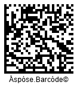
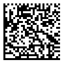

{}[Generate Data Matrix Barcodes Online](https://products.aspose.app/barcode/generate/datamatrix): You can test the quality of ***Aspose.BarCode*** generation for DataMatrix barcodes and get the results online.{}

## **Overview**
*Data Matrix* is a 2D matrix barcode that can be generated in both rectangular and square shapes. It is an industrially common barcode standard used for encoding character sets and byte streams. In its maximum configuration, *Data Matrix* barcodes have up to 144 rows and columns, supporting up to 1,555 bytes or 3,116 numeric (2,335 ASCII) characters. They also include additional recovery data for error correction, ensuring data integrity even if the barcode is damaged. The symbology supports two main standards, detailed below.

| **Data Matrix Standard** | **Description** |
|--------------------------|-----------------|
| *ECC 000-140*            | An older set of standards that only support square configurations, use outdated encoding methods, and rely on convolutional code error correction. These are not recommended for use and are primarily for legacy industrial tasks. |
| *ECC 200*                | The current standard that supports both square and rectangular barcodes. It uses modern encoding techniques and Reed-Solomon error correction. Recommended for all contemporary applications. |

### **Data Matrix Rectangular Extension**

The Data Matrix Rectangular Extension (DMRE) is part of the Data Matrix standard that allows for rectangular barcode creation. This subtype incorporates all *ECC 200* features and uses Reed-Solomon error correction for error detection and correction. To create DMRE barcodes, set the [*DataMatrixVersion*](https://reference.aspose.com/barcode/javascript-cpp/aspose.barcode.generation/datamatrixparameters/datamatrixversion/) parameter to values from DMRE_8x48 to DMRE_26x64.

{}For questions or further clarification, reach out to [Aspose Technical Support](/barcode/javascript-cpp/technical-support/), visit the [Aspose.Barcode Forum](https://forum.aspose.com/c/barcode/13), or contact the [Aspose Paid Support Helpdesk](https://helpdesk.aspose.com/).{}

## **Data Matrix ECC Standard Settings**
To choose the *Data Matrix* standard for barcode generation, use the [*DataMatrixEcc*](https://reference.aspose.com/barcode/javascript-cpp/aspose.barcode.generation/datamatrixparameters/properties/datamatrixecc) property in the [*DataMatrixParameters*](https://reference.aspose.com/barcode/javascript-cpp/aspose.barcode.generation/datamatrixparameters) class. This property lets you set either *ECC 000-140* (older standards) or *ECC 200* (the modern standard). By default, [*DataMatrixEcc*](https://reference.aspose.com/barcode/javascript-cpp/aspose.barcode.generation/datamatrixparameters/properties/datamatrixecc) is set to *DataMatrixEccType.Ecc200*.

### ***ECC 200***
To explicitly enable the *ECC 200* standard, set the [*DataMatrixEcc*](https://reference.aspose.com/barcode/javascript-cpp/aspose.barcode.generation/datamatrixparameters/properties/datamatrixecc) property to *EccAuto* or *Ecc200*. This standard supports all data encoding modes defined in [*DataMatrixEncodeMode*](https://reference.aspose.com/barcode/javascript-cpp/aspose.barcode.generation/datamatrixencodemode), including Unicode support using [*CodeTextEncoding*](https://reference.aspose.com/barcode/javascript-cpp/aspose.barcode.generation/datamatrixparameters/properties/codetextencoding). Error correction capacity is defined by the standard for different barcode sizes.

The following code snippet demonstrates how to set the *ECC 200* encoding standard.

  
[How to get *BarCodeInstance*](/barcode/javascript-cpp/get-barcode-module-instance/)
```javascript
// Create a DataMatrix barcode generator instance with the string "Åspóse.Barcóde©"
var gen = new BarCodeInstance.BarcodeGenerator("DataMatrix", "Åspóse.Barcóde©");

// Set the X dimension to 4 pixels
gen.Parameters.Barcode.XDimension.Pixels = 4;

// Set DataMatrix ECC to 200 (Ecc200)
gen.Parameters.Barcode.DataMatrix.DataMatrixEcc = BarCodeInstance.DataMatrixEccType.Ecc200;

// Display the barcode image
document.getElementById("img").src = gen.GenerateBarCodeImage(); // Display barcode image

gen.delete();

```
  
<p align="center"></p>  
  
### ***ECC 000-140***  
The *ECC 000-140* standards are compatible only with certain encoding modes defined in [*DataMatrixEncodeMode*](https://reference.aspose.com/barcode/javascript-cpp/aspose.barcode.generation/datamatrixencodemode): *Auto*, *ASCII*, and *Bytes*. All other encoding modes are automatically processed as *Bytes*. The following properties are not supported in these standards: [*CodeTextEncoding*](https://reference.aspose.com/barcode/javascript-cpp/aspose.barcode.generation/datamatrixparameters/properties/codetextencoding), [*ECIEncoding*](https://reference.aspose.com/barcode/javascript-cpp/aspose.barcode.generation/datamatrixparameters/eciencoding/), *StructuredAppend*, [*MacroCharacters*](https://reference.aspose.com/barcode/javascript-cpp/aspose.barcode.generation/datamatrixparameters/macrocharacters/), and [*IsReaderProgramming*](https://reference.aspose.com/barcode/javascript-cpp/aspose.barcode.generation/datamatrixparameters/isreaderprogramming/).

The *ECC 000-140* standards feature different barcode layout settings compared to *ECC 200*, varying mainly in damage recovery capacities for different error correction levels as shown below:

| Error Correction Level | Damage Recovery Capacity |
|------------------------|--------------------------|
| **Ecc000**             | Only error detection     |
| **Ecc050**             | 2.8%                     |
| **Ecc080**             | 5.5%                     |
| **Ecc100**             | 12.6%                    |
| **Ecc140**             | 25%                      |

The following code snippet demonstrates how to enable the *ECC 140* standard.

  
[How to get *BarCodeInstance*](/barcode/javascript-cpp/get-barcode-module-instance/)
```javascript
// Create a DataMatrix barcode generator instance with the string "Åspóse.Barcóde©"
var gen = new BarCodeInstance.BarcodeGenerator("DataMatrix", "Åspóse.Barcóde©");

// Set the X dimension to 4 pixels
gen.Parameters.Barcode.XDimension.Pixels = 4;

// Set DataMatrix ECC to 140
gen.Parameters.Barcode.DataMatrix.DataMatrixEcc = BarCodeInstance.DataMatrixEccType.Ecc140;

// Display the barcode image
document.getElementById("img").src = gen.GenerateBarCodeImage(); // Display barcode image

gen.delete();

```
  
<p align="center"></p>
   
## **Encoding Mode Settings**
In ***Aspose.BarCode for JavaScript via C++***, developers can select different encoding modes by initializing the [*DataMatrixEncodeMode*](https://reference.aspose.com/barcode/javascript-cpp/aspose.barcode.generation/datamatrixencodemode) property within the [*DataMatrixParameters*](https://reference.aspose.com/barcode/javascript-cpp/aspose.barcode.generation/datamatrixparameters) class. The library offers nine distinct encoding modes, with *Auto* set as the default.

| Encoding Mode | Description |
|---------------|-------------|
| *Auto*        | Encodes CodeText with maximum data compactness. |
| *ASCII*       | Supports encoding ASCII symbols and byte streams; characters 128-255 use 2 bytes. |
| *Binary*      | Encodes characters in 8 bits, ideal for byte streams. |
| *C40*, *Text*, *EDIFACT*, *ANSIX12* | Encode specific character sets using specialized industrial encodings. |
| *ECI*         | Indicates that encoded data follows the ECI protocol as defined by AIM ECI Specifications. |
| *Extended*    | Provides advanced encoding controls, allowing manual specification of encoding for part of the [*Codetext*](https://reference.aspose.com/barcode/javascript-cpp/aspose.barcode.generation/barcodegenerator/properties/codetext). |

### ***Auto* Encoding Mode**
In Auto mode, CodeText is encoded to maximize data compactness. Unicode characters are re-encoded using the encoding specified in the [*ECIEncoding*](https://reference.aspose.com/barcode/javascript-cpp/aspose.barcode.generation/datamatrixparameters/eciencoding/) property, and an ECI identifier is added. If an unsupported character is encountered in the chosen ECI encoding, an exception is triggered. By default, the [*ECIEncoding*](https://reference.aspose.com/barcode/javascript-cpp/aspose.barcode.generation/datamatrixparameters/eciencoding/) is set to [*ECIEncodings*](https://reference.aspose.com/barcode/javascript-cpp/aspose.barcode.generation/eciencodings/).UTF8 (ECI ID: "\000026").

The following code snippet illustrates how to set the *Auto* encoding mode.


[How to get *BarCodeInstance*](/barcode/javascript-cpp/get-barcode-module-instance/)
```javascript

// Create a DataMatrix barcode generator instance with the string "Aspose常に先を行く"
var gen = new BarCodeInstance.BarcodeGenerator("DataMatrix", "Aspose常に先を行く");

// Set the X dimension to 4 pixels
gen.Parameters.Barcode.XDimension.Pixels = 4;

// Set encode mode to Auto
gen.Parameters.Barcode.DataMatrix.DataMatrixEncodeMode = BarCodeInstance.DataMatrixEncodeMode.Auto;

// Display the barcode image
document.getElementById("img").src = gen.GenerateBarCodeImage(); // Display barcode image

gen.delete();

```

<p align="center"></p>   

### ***ASCII* Encoding Mode**
The *ASCII* encoding mode enables both encoding ASCII symbols and byte streams; however, encoding the characters from 128 to 255 requires 2 bytes.  
  
The following code sample shows how to use the *ASCII* encoding mode.

[How to get *BarCodeInstance*](/barcode/javascript-cpp/get-barcode-module-instance/)
```javascript
// Create a DataMatrix barcode generator instance with the string "Aspose"
var gen = new BarCodeInstance.BarcodeGenerator("DataMatrix", "Aspose");

// Set the X dimension to 4 pixels
gen.Parameters.Barcode.XDimension.Pixels = 4;

// Set encode mode to ASCII
gen.Parameters.Barcode.DataMatrix.DataMatrixEncodeMode = BarCodeInstance.DataMatrixEncodeMode.ASCII;

// Display the barcode image
document.getElementById("img").src = gen.GenerateBarCodeImage(); // Display barcode image

gen.delete();

```
  
<p align="center"></p> 

### ***Binary* Mode**
The *Binary* mode serves to encode byte streams. If a Unicode character is encountered, an exception is thrown. The code sample below explains how to work with this encoding mode.

[How to get *BarCodeInstance*](/barcode/javascript-cpp/get-barcode-module-instance/)
```javascript
// Create a DataMatrix barcode generator instance with binary data
var gen = new BarCodeInstance.BarcodeGenerator("DataMatrix");

// Set the code text to binary data
var encodedArr = [0xFF, 0xFE, 0xFD, 0xFC, 0xFB, 0xFA, 0xF9];
var b64encoded = btoa(String.fromCharCode.apply(null, encodedArr));
gen.SetCodeTextBase64(b64encoded);

// Set the DataMatrix encode mode to Binary
gen.Parameters.Barcode.DataMatrix.DataMatrixEncodeMode = BarCodeInstance.DataMatrixEncodeMode.Binary;

// Display the barcode image
document.getElementById("img").src = gen.GenerateBarCodeImage(); // Display barcode image

gen.delete();

```

<p align="center"></p> 

### ***ECI* Encoding Mode**
The Extended Channel Interpretation (ECI) mode ensures that the encoded data is processed according to the ECI protocol as defined by the AIM ECI Specifications. When ECI mode is enabled, the entire CodeText is re-encoded using the encoding specified in the [*ECIEncoding*](https://reference.aspose.com/barcode/javascript-cpp/aspose.barcode.generation/datamatrixparameters/eciencoding/) property, with an ECI identifier added. If a character unsupported by the selected ECI encoding is found, an exception will be thrown. By default, the [*ECIEncoding*](https://reference.aspose.com/barcode/javascript-cpp/aspose.barcode.generation/datamatrixparameters/eciencoding/) property is set to [*ECIEncodings*](https://reference.aspose.com/barcode/javascript-cpp/aspose.barcode.generation/eciencodings/).UTF8 (ECI ID: "\000026").

The following code sample shows how to use the *ECI* mode.


<p align="center"></p> 

[How to get *BarCodeInstance*](/barcode/javascript-cpp/get-barcode-module-instance/)
```javascript
// ECI mode, Latin/Greek alphabet encoding. ECI ID:"\000009"
// Create a DataMatrix barcode generator instance with ECI mode for Greek characters
var str = "ΑΒΓΔΕ";
var gen = new BarCodeInstance.BarcodeGenerator("DataMatrix", str);

// Set the encode mode to ECI
gen.Parameters.Barcode.DataMatrix.DataMatrixEncodeMode = BarCodeInstance.DataMatrixEncodeMode.ECI;
gen.Parameters.Barcode.DataMatrix.ECIEncoding = BarCodeInstance.ECIEncodings.ISO_8859_7;

// Display the barcode image
document.getElementById("img").src = gen.GenerateBarCodeImage(); // Display barcode image

gen.delete();

```

### ***Extended* Encoding Mode**
The *Extended* mode allows the inclusion of special control characters within the main barcode text. These characters enable advanced control over data encoding and allow switching between different encoding schemes and ECI modes within a single barcode. To generate barcodes in this mode, it is recommended to use the [*DataMatrixExtCodetextBuilder*](https://reference.aspose.com/barcode/javascript-cpp/aspose.barcode.generation/datamatrixextcodetextbuilder/) class.

The following code snippet demonstrates how to use the *Extended* mode.
 
  
<p align="center"></p> 

[How to get *BarCodeInstance*](/barcode/javascript-cpp/get-barcode-module-instance/)
```javascript
//create barcode text
// Create an extended Data Matrix codetext builder and add different types of codetext
var codetextBuilder = new BarCodeInstance.DataMatrixExtCodetextBuilder();
codetextBuilder.AddECICodetext(BarCodeInstance.ECIEncodings.UTF8, "犬Right狗");
codetextBuilder.AddECICodetextWithEncodeMode(BarCodeInstance.ECIEncodings.UTF8, BarCodeInstance.DataMatrixEncodeMode.C40, "ABCDE");
codetextBuilder.AddPlainCodetext("test");
codetextBuilder.AddCodetextWithEncodeMode(BarCodeInstance.DataMatrixEncodeMode.Text, "abcde");

// Generate the barcode text
var codetext = codetextBuilder.GetExtendedCodetext();

// Create a Data Matrix barcode generator instance
var generator = new BarCodeInstance.BarcodeGenerator("DataMatrix", codetext);
generator.Parameters.Barcode.XDimension.Pixels = 4;
generator.Parameters.Barcode.CodeTextParameters.TwoDDisplayText = "Extended";
// Set the encode mode to Extended
generator.Parameters.Barcode.DataMatrix.DataMatrixEncodeMode = BarCodeInstance.DataMatrixEncodeMode.Extended;

// Display the generated barcode image
document.getElementById("img").src = generator.GenerateBarCodeImage(); // Display barcode image

// Attempt to recognize the generated barcode
var reader = new BarCodeInstance.BarCodeReader(generator.GenerateBarCodeImage(), "DataMatrix");
reader.ReadBarCodes();
for (var i = 0; i < reader.FoundCount; i++) {
    const result = reader.FoundBarCodes(i);
    console.log("DatamatrixExtended: " + result.CodeText);
}

generator.delete();
reader.delete();

```
  
### **Industrial Encoding Modes: *C40*, *Text*, *EDIFACT*, and *ANSIX12***
*C40*, *Text*, *EDIFACT*, and *ANSIX12* encoding modes can be used to encode information using specialized industrial encodings. These modes are intended for specific industrial tasks only.  
  
The following code sample explains how to set the *C40* encoding mode.
  
[How to get *BarCodeInstance*](/barcode/javascript-cpp/get-barcode-module-instance/)
```javascript
// Create a Data Matrix barcode generator instance with C40 encoding mode
var gen = new BarCodeInstance.BarcodeGenerator("DataMatrix", "ASPOSE.BARCODE");
gen.Parameters.Barcode.XDimension.Pixels = 6;
// Set the encode mode to C40
gen.Parameters.Barcode.DataMatrix.DataMatrixEncodeMode = BarCodeInstance.DataMatrixEncodeMode.C40;

// Display the generated barcode image
document.getElementById("img").src = gen.GenerateBarCodeImage(); // Display barcode image

gen.delete();

```
  
<p align="center"></p> 
  
## **Layout Settings**
Data Matrix enables different layout variants, which can be set to generate barcodes with required size parameters. To set a layout, it is necessary to initialize the [*DataMatrixVersion*](https://reference.aspose.com/barcode/javascript-cpp/aspose.barcode.generation/datamatrixparameters/datamatrixversion/) property of class [*DataMatrixParameters*](https://reference.aspose.com/barcode/javascript-cpp/aspose.barcode.generation/datamatrixparameters/). It can take the following values:
-	*Auto*. The barcode size will be selected automatically depending on the amount of data to be encoded.
-	Values from *ECC000_9x9* to *ECC000_140_49x49*. These options can be used to set the barcode size manually for standards *ECC000-140*. If the amount of input data does not fit to the selected format, an exception will be thrown.
-	Values from *ECC200_10x10* to *ECC200_144x144*, from *ECC200_8x18* to *ECC200_16x48*, as well as from *DMRE_8x48* to DMRE_26x64. These settings allow selecting the barcode size manually for standard *ECC200*. If the amount of input data does not fit to the selected format, an exception will be thrown.
  
|Layout Settings|*ECC 200 Mode* 12 Rows 64 Columns 64|*ECC 200 Mode* 22 Rows and 22 Columns|*ECC 140 Mode* 29 Rows and 29 Columns|
| :-: | :-: | :-: | :-: |
| ||||
  
[How to get *BarCodeInstance*](/barcode/javascript-cpp/get-barcode-module-instance/)
```javascript
// Generate a DataMatrix barcode with Ecc200 and 22x22 rows/columns
var gen = new BarCodeInstance.BarcodeGenerator("DataMatrix", "Åspóse.Barcóde©");
gen.Parameters.Barcode.XDimension.Pixels = 4;
gen.Parameters.Barcode.DataMatrix.DataMatrixEcc = BarCodeInstance.DataMatrixEccType.Ecc200;
gen.Parameters.Barcode.DataMatrix.DataMatrixVersion = BarCodeInstance.DataMatrixVersion.ECC200_22x22;
document.getElementById("img1").src = gen.GenerateBarCodeImage(); // Display barcode image

// Generate a DataMatrix barcode with Ecc200 and 12x64 rows/columns
gen.Parameters.Barcode.DataMatrix.DataMatrixVersion = BarCodeInstance.DataMatrixVersion.DMRE_12x64;
document.getElementById("img2").src = gen.GenerateBarCodeImage(); // Display barcode image

// Set ECC type to Ecc140 and generate a DataMatrix barcode with 29x29 rows/columns
gen.Parameters.Barcode.DataMatrix.DataMatrixEcc = BarCodeInstance.DataMatrixEccType.Ecc140;
gen.Parameters.Barcode.DataMatrix.DataMatrixVersion = BarCodeInstance.DataMatrixVersion.ECC000_140_29x29;
document.getElementById("img3").src = gen.GenerateBarCodeImage(); // Display barcode image

gen.delete();

```

## **Using Macro Characters**
In ***Aspose.BarCode for JavaScript via C++***, developers can utilize macro characters when generating *Data Matrix* barcodes. Macro characters allow for the abbreviation of industry-specific headers and trailers into a single character. This feature helps reduce the number of characters needed for encoding data in certain structured formats, catering to specific industrial needs. The macro character should be placed in the first character position.

The following code snippet demonstrates how to use macro characters when generating *Data Matrix* barcodes.

[How to get *BarCodeInstance*](/barcode/javascript-cpp/get-barcode-module-instance/)
```javascript
// Generate a DataMatrix barcode with macro character set to 05
var gen = new BarCodeInstance.BarcodeGenerator("DataMatrix", "ASPOSE");
gen.Parameters.Barcode.XDimension.Pixels = 4;
gen.Parameters.Barcode.DataMatrix.MacroCharacters = BarCodeInstance.MacroCharacter.Macro05;
document.getElementById("img").src = gen.GenerateBarCodeImage(); // Display barcode image

// Attempt to recognize the generated barcode
var reader = new BarCodeInstance.BarCodeReader(gen.GenerateBarCodeImage(), "DataMatrix");
reader.ReadBarCodes();
for (var i = 0; i < reader.FoundCount; i++) {
    const result = reader.FoundBarCodes(i);
    console.log("DatamatrixMacro:" + result.CodeText);
}

gen.delete();
reader.delete();

```
  
<p align="center"></p> 
  
## **Aspect Ratio Settings**
*Aspect Ratio* refers to the relationship between the width and height of a barcode. In ***Aspose.BarCode for JavaScript via C++***, the [*AspectRatio*](https://reference.aspose.com/barcode/javascript-cpp/aspose.barcode.generation/datamatrixparameters/properties/aspectratio) property of the [*DataMatrixParameters*](https://reference.aspose.com/barcode/javascript-cpp/aspose.barcode.generation/datamatrixparameters) class allows developers to adjust the barcode's proportions based on the X and Y coordinates. This parameter is defined as a relative coefficient to the value of [*XDimension*](https://reference.aspose.com/barcode/javascript-cpp/aspose.barcode.generation/barcodeparameters/properties/xdimension). Typically, the *Aspect Ratio* should be set to 1.

|<p align="center">**Aspect Ratio**</p>|<p align="center">**Is Set to 1**</p>|<p align="center">**Is Set to 0.5**</p>|
| :-: | :-: | :-: |
| |||

  
[How to get *BarCodeInstance*](/barcode/javascript-cpp/get-barcode-module-instance/)
```javascript
// Generate a DataMatrix barcode with aspect ratio 1
var gen = new BarCodeInstance.BarcodeGenerator("DataMatrix", "Åspóse.Barcóde©");
gen.Parameters.Barcode.XDimension.Pixels = 4;
gen.Parameters.Barcode.DataMatrix.AspectRatio = 1;
document.getElementById("img1").src = gen.GenerateBarCodeImage(); // Display barcode image

// Generate a DataMatrix barcode with aspect ratio 0.5
gen.Parameters.Barcode.DataMatrix.AspectRatio = 0.5;
document.getElementById("img05").src = gen.GenerateBarCodeImage(); // Display barcode image

gen.delete();

```

## **Structured Append**
*Structured Append* is a special mode that allows combining up to 16 Data Matrix symbols. To activate this mode, you need to initialize the following parameters:

- [*StructuredAppendBarcodesCount*](https://reference.aspose.com/barcode/javascript-cpp/aspose.barcode.generation/datamatrixparameters/structuredappendbarcodescount/): Specifies the total number of barcodes (ranging from 2 to 16).
- [*StructuredAppendBarcodeId*](https://reference.aspose.com/barcode/javascript-cpp/aspose.barcode.generation/datamatrixparameters/structuredappendbarcodeid/): Indicates the position of a barcode within the set (from 1 to *StructuredAppendBarcodesCount*).
- [*StructuredAppendFileId*](https://reference.aspose.com/barcode/javascript-cpp/aspose.barcode.generation/datamatrixparameters/structuredappendfileid/): Represents the identifier of a file (ranging from 1 to 64516).


[How to get *BarCodeInstance*](/barcode/javascript-cpp/get-barcode-module-instance/)
```javascript
// Generate a DataMatrix barcode with structured append mode
var gen = new BarCodeInstance.BarcodeGenerator("DataMatrix", "Aspose");
gen.Parameters.Barcode.XDimension.Pixels = 4;
gen.Parameters.Barcode.DataMatrix.StructuredAppendBarcodeId = 3;
gen.Parameters.Barcode.DataMatrix.StructuredAppendBarcodesCount = 5;
gen.Parameters.Barcode.DataMatrix.StructuredAppendFileId = 150;
document.getElementById("img").src = gen.GenerateBarCodeImage(); // Display barcode image

gen.delete();

```

<p align="center"></p> 

## **Hardware Reader Initialization**
To encode a special flag denoting that barcode data is intended to initialize a hardware barcode reader, it is required to set the [*IsReaderProgramming*]( https://reference.aspose.com/barcode/javascript-cpp/aspose.barcode.generation/datamatrixparameters/isreaderprogramming/) property. The following code snippet explains how to use this property.  
  
[How to get *BarCodeInstance*](/barcode/javascript-cpp/get-barcode-module-instance/)
```javascript
// Generate a DataMatrix barcode with reader programming flag enabled
var gen = new BarCodeInstance.BarcodeGenerator("DataMatrix", "Aspose");
gen.Parameters.Barcode.XDimension.Pixels = 4;
gen.Parameters.Barcode.DataMatrix.IsReaderProgramming = true;
document.getElementById("img").src = gen.GenerateBarCodeImage(); // Display barcode image

gen.delete();

```
  
<p align="center"></p>   