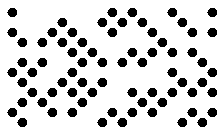
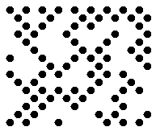
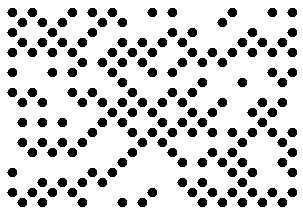
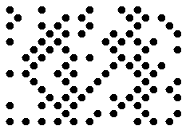
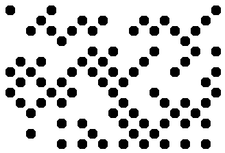
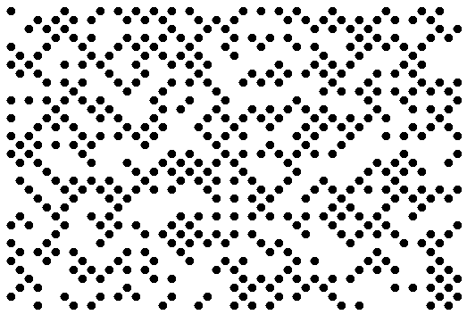
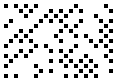

## **Overview**
DotCode is a 2D barcode type designed to ensure accurate reading and decoding, particularly for barcodes created using high-speed inkjet or laser printing.  
Key features of DotCode include:
- Capability to encode both text and byte streams.
- Support for Reed-Solomon error correction.
- No fixed limit on input data size, allowing variable data capacity.
- Support for Extended Channel Interpretation (ECI).
- Structured append mechanism to combine data from multiple barcodes.
- Ability to split data encoded in a single barcode into several messages.

{}*If you need any clarifications, feel free to reach out [Aspose Technical Support](/barcode/javascript-cpp/technical-support/): ask your questions at [Aspose.Barcode Forum](https://forum.aspose.com/c/barcode/13) or contact [Aspose Paid Support Helpdesk](https://helpdesk.aspose.com/).*{}

## **Set DotCode Layout**
To create DotCode barcodes with a specific layout, you need to set the [*Rows*](https://reference.aspose.com/barcode/javascript-cpp/aspose.barcode.generation/dotcodeparameters/rows/) and [*Columns*](https://reference.aspose.com/barcode/javascript-cpp/aspose.barcode.generation/dotcodeparameters/columns/) properties of the [*DotCodeParameters*](https://reference.aspose.com/barcode/javascript-cpp/aspose.barcode.generation/dotcodeparameters/) class. The DotCode standard has the following requirements for rows and columns:
- The minimum number of rows or columns is 5. To improve recognition quality, it is recommended to use at least 7 rows and columns.
- The sum of rows and columns in a DotCode barcode must be an odd number.
It is possible to specify only the number of rows or columns, with the other layout parameter being set automatically. If the manually set number of rows and columns is insufficient to generate a DotCode barcode, an exception will be raised.

| |12 Rows|18 Columns|26 Rows and 29 Columns|
|--|--|--|--|
| |<p align="center"></p>|<p align="center"></p>|<p align="center"></p>|

The following code sample demonstrates how to set the layout for a generated DotCode barcode.


```javascript
// Generate a DotCode barcode with specified column and row settings

// Create a DotCode barcode generator instance with data "Aspose"
var gen = new BarCodeInstance.BarcodeGenerator("DotCode", "Aspose");

// Set the XDimension (dot size) to 10 pixels
gen.Parameters.Barcode.XDimension.Pixels = 10;

// Set columns to 18 and save the image
gen.Parameters.Barcode.DotCode.Columns = 18;
document.getElementById("img1").src = gen.GenerateBarCodeImage(); // Display barcode image

// Set rows to 12 and save the image, with columns set to auto
gen.Parameters.Barcode.DotCode.Columns = -1; // Auto columns
gen.Parameters.Barcode.DotCode.Rows = 12;
document.getElementById("img2").src = gen.GenerateBarCodeImage(); // Display barcode image

// Set rows to 26 and columns to 29, and save the image
gen.Parameters.Barcode.DotCode.Columns = 29;
gen.Parameters.Barcode.DotCode.Rows = 26;
document.getElementById("img3").src = gen.GenerateBarCodeImage(); // Display barcode image

gen.delete();


```
## **Set Encoding Mode**
The barcode library provides several encoding modes for generating DotCode barcodes. You can select the required mode by setting the [*DotCodeEncodeMode*](https://reference.aspose.com/barcode/javascript-cpp/aspose.barcode.generation/dotcodeparameters/dotcodeencodemode/) property of the [*DotCodeParameters*](https://reference.aspose.com/barcode/javascript-cpp/aspose.barcode.generation/dotcodeparameters/) class. The possible values are defined in the [*DotCodeEncodeMode*](https://reference.aspose.com/barcode/javascript-cpp/aspose.barcode.generation/dotcodeencodemode/) enumeration. The available modes are described below:

- *Auto*: In Auto mode, the CodeText is encoded with maximum data compactness. This is the default setting.
- *Binary*: The *Binary* mode encodes binary data with maximum data compactness.
- *ECI*: The Extended Channel Interpretation (ECI) mode indicates that the encoded data is interpreted according to the ECI protocol defined by the AIM ECI Specifications.
- *Extended*: The *Extended* mode offers flexible encoding controls, allowing manual specification of the encoding for part of the Codetext.

### ***Auto* Encoding Mode**
In Auto mode, the CodeText is encoded with maximum data compactness. Unicode characters are re-encoded using the encoding specified in the [*ECIEncoding*](https://reference.aspose.com/barcode/javascript-cpp/aspose.barcode.generation/dotcodeparameters/eciencoding/) property, with an ECI identifier inserted. If a character not supported by the selected ECI encoding is encountered, an exception is thrown. By default, the [*ECIEncoding*](https://reference.aspose.com/barcode/javascript-cpp/aspose.barcode.generation/dotcodeparameters/eciencoding/) property is set to [*ECIEncodings*](https://reference.aspose.com/barcode/javascript-cpp/aspose.barcode.generation/eciencodings/).UTF8 (ECI ID: "\000026"). The following code sample demonstrates how to generate a DotCode barcode in *Auto* mode.

<p align="center"></p>
  
```javascript
// Generate a DotCode barcode with mixed character data

// Create a DotCode barcode generator instance with data "犬Right狗"
var gen = new BarCodeInstance.BarcodeGenerator("DotCode", "犬Right狗");

// Save the generated barcode image
document.getElementById("img").src = gen.GenerateBarCodeImage(); // Display barcode image

gen.delete();

```

### ***Binary* Encoding Mode**
The *Binary* mode serves to encode byte streams. If a Unicode character is encountered, an exception is thrown. The code sample below explains how to work with this encoding mode.

<p align="center"></p>  
  
```javascript
// Generate a DotCode barcode with binary encoded data

// Create a DotCode barcode generator instance
var gen = new BarCodeInstance.BarcodeGenerator("DotCode");

// Set the binary encoded data
var encodedArr = [0xFF, 0xFE, 0xFD, 0xFC, 0xFB, 0xFA, 0xF9];
var b64encoded = btoa(String.fromCharCode.apply(null, encodedArr));
gen.SetCodeTextBase64(b64encoded);

// Set DotCode encode mode to Binary
gen.Parameters.Barcode.DotCode.DotCodeEncodeMode = BarCodeInstance.DotCodeEncodeMode.Binary;

// Display the barcode image
document.getElementById("img").src = gen.GenerateBarCodeImage(); // Display barcode image

gen.delete();

```

### ***ECI* Encoding Mode**
The Extended Channel Interpretation (ECI) mode indicates that the encoded data is interpreted according to the ECI protocol defined by the AIM ECI Specifications. When ECI mode is selected, the entire CodeText is re-encoded using the encoding specified in the [*ECIEncoding*](https://reference.aspose.com/barcode/javascript-cpp/aspose.barcode.generation/dotcodeparameters/eciencoding/) property, with an ECI identifier inserted. If a character not supported by the chosen ECI encoding is encountered, an exception will be thrown. By default, the [*ECIEncoding*](https://reference.aspose.com/barcode/javascript-cpp/aspose.barcode.generation/dotcodeparameters/eciencoding/) property is set to [*ECIEncodings*](https://reference.aspose.com/barcode/javascript-cpp/aspose.barcode.generation/eciencodings/).UTF8 (ECI ID: "\000026").

The following code sample demonstrates how to use the *ECI* mode.

<p align="center"></p>

```javascript
// ECI mode, Latin/Greek alphabet encoding. ECI ID:"\000009"
var str = "ΑΒΓΔΕ";

// Create a DotCode barcode generator instance
var gen = new BarCodeInstance.BarcodeGenerator("DotCode", str);

// Set DotCode encode mode to ECI
gen.Parameters.Barcode.DotCode.DotCodeEncodeMode = BarCodeInstance.DotCodeEncodeMode.ECI;

// Set ECI encoding to ISO 8859-7 (Greek)
gen.Parameters.Barcode.DotCode.ECIEncoding = BarCodeInstance.ECIEncodings.ISO_8859_7;

// Display the barcode image
document.getElementById("img").src = gen.GenerateBarCodeImage(); // Display barcode image

gen.delete();

```

### ***Extended* Encoding Mode**
In the *Extended Codetext* mode, the input data provided to the [*Codetext*](https://reference.aspose.com/barcode/javascript-cpp/aspose.barcode.generation/barcodegenerator/codetext/) property includes special control words along with the main information. These control words activate extended encoding options and allow different parts of the text to be stored with distinct encodings within a single barcode. To generate DotCode barcodes using this format, it is recommended to use the [*DotCodeExtCodetextBuilder*](https://reference.aspose.com/barcode/javascript-cpp/aspose.barcode.generation/dotcodeextcodetextbuilder/) class. 

The following code sample demonstrates how to use the *Extended* mode.

<p align="center"></p>


```javascript
//create codetext
// Create an instance of DotCodeExtCodetextBuilder
var textBuilder = new BarCodeInstance.DotCodeExtCodetextBuilder();

// Add FNC1 format identifier
textBuilder.AddFNC1FormatIdentifier();

// Add ECI codetext with UTF-8 encoding and the string "犬Right狗"
textBuilder.AddECICodetext(BarCodeInstance.ECIEncodings.UTF8, "犬Right狗");

// Add plain codetext "Plain text"
textBuilder.AddPlainCodetext("Plain text");

// Add FNC3 symbol separator
textBuilder.AddFNC3SymbolSeparator();

// Add FNC3 reader initialization
textBuilder.AddFNC3ReaderInitialization();

// Add plain codetext "Reader initialization info"
textBuilder.AddPlainCodetext("Reader initialization info");

// Generate the extended codetext
var codetext = textBuilder.GetExtendedCodetext();

// Create a DotCode barcode generator instance
var gen = new BarCodeInstance.BarcodeGenerator("DotCode", codetext);

// Set DotCode encode mode to Extended
gen.Parameters.Barcode.DotCode.DotCodeEncodeMode = BarCodeInstance.DotCodeEncodeMode.Extended;

// Display the barcode image
document.getElementById("img").src = gen.GenerateBarCodeImage(); // Display barcode image

gen.delete();

```

## **Structured Append Mode**
The barcode library supports a special generation mode for creating DotCode barcodes with structured append. This mode allows up to 35 DotCode barcodes to be combined. To enable this mode, the following properties need to be initialized:
- [*DotCodeStructuredAppendModeBarcodesCount*](https://reference.aspose.com/barcode/javascript-cpp/aspose.barcode.generation/dotcodeparameters/dotcodestructuredappendmodebarcodescount/2) – the number of barcodes to be combined (values between 1 and 35)
- [*DotCodeStructuredAppendModeBarcodeId*](https://reference.aspose.com/barcode/javascript-cpp/aspose.barcode.generation/dotcodeparameters/dotcodestructuredappendmodebarcodeid/) – the position of a barcode in the set (values from 1 to DotCodeStructuredAppendModeBarcodesCount)

The following code sample demonstrates how to enable the *Structured Append* mode.

<p align="center"></p>

```javascript
// Create a DotCode barcode generator instance with the string "Aspose"
var gen = new BarCodeInstance.BarcodeGenerator("DotCode", "Aspose");

// Set the X dimension to 10 pixels
gen.Parameters.Barcode.XDimension.Pixels = 10;

// Set DotCode structured append mode
gen.Parameters.Barcode.DotCode.DotCodeStructuredAppendModeBarcodeId = 3;
gen.Parameters.Barcode.DotCode.DotCodeStructuredAppendModeBarcodesCount = 5;

// Display the barcode image
document.getElementById("img").src = gen.GenerateBarCodeImage(); // Display barcode image

gen.delete();

```

## **Aspect Ratio**
By default, the ratio between X and Y coordinates in a DotCode barcode equals to 1. To manually adjust this ratio with custom values, developers can initialize the [*AspectRatio*](https://reference.aspose.com/barcode/javascript-cpp/aspose.barcode.generation/dotcodeparameters/aspectratio/) property of class [*DotCodeParameters*](https://reference.aspose.com/barcode/javascript-cpp/aspose.barcode.generation/dotcodeparameters/), which is relative to the value of [*XDimension*](https://reference.aspose.com/barcode/javascript-cpp/aspose.barcode.generation/barcodeparameters/xdimension/). The code sample below explains how to modify the aspect ratio in a generated DotCode barcode.   

<p align="center"></p>
  
```javascript
// Create a DotCode barcode generator instance with the string "Aspose"
var gen = new BarCodeInstance.BarcodeGenerator("DotCode", "Aspose");

// Set the X dimension to 10 pixels
gen.Parameters.Barcode.XDimension.Pixels = 10;

// Set aspect ratio to 0.5
gen.Parameters.Barcode.DotCode.AspectRatio = 0.5;

// Display the barcode image
document.getElementById("img").src = gen.GenerateBarCodeImage(); // Display barcode image

gen.delete();

```

## **Hardware Reader Initialization**
To encode a special flag indicating that the data in a DotCode barcode is intended to initialize a hardware reader, you can set the [*IsReaderInitialization*](https://reference.aspose.com/barcode/javascript-cpp/aspose.barcode.generation/dotcodeparameters/isreaderinitialization/) property. The following code sample demonstrates how to enable this property.

```javascript
// Create a DotCode barcode generator instance with the string "Aspose"
var gen = new BarCodeInstance.BarcodeGenerator("DotCode", "Aspose");

// Set the X dimension to 10 pixels
gen.Parameters.Barcode.XDimension.Pixels = 10;

// Set flag indicating that the data is encoded for reader initialization
gen.Parameters.Barcode.DotCode.IsReaderInitialization = true;

// Display the barcode image
document.getElementById("img").src = gen.GenerateBarCodeImage(); // Display barcode image

gen.delete();

```