## **Overview**
The [*GS1 Composite barcode*](https://www.iso.org/standard/51425.html) symbology is a combination of *1D* and *2D* barcodes. This symbology was designed to enhance the data capacity of low-density *1D* barcodes by including a *2D* component for additional information. A *GS1 Composite* barcode consists of two parts: a *1D linear barcode* containing primary data that can be read by basic scanners and a *2D barcode* containing supplementary data that qualifies the primary message.

**Aspose.BarCode for JavaScript via C++** supports encoding this symbology as [*EncodeTypes.GS1CompositeBar*](https://reference.aspose.com/barcode/javascript-cpp/aspose.barcode.generation/encodetypes/gs1compositebar/) using [*GS1CompositeBar*](https://reference.aspose.com/barcode/javascript-cpp/aspose.barcode.generation/gs1compositebarparameters/) parameters to configure the *1D* and *2D* component types and other settings. The barcode generation engine requires a "|" symbol to separate the *1D* and *2D* CodeText.

### **1D Component Types**
The *1D* component types include:
- [EAN barcodes](/barcode/info-cards/ean-barcodes/): *EAN8*, *UPCA*, *EAN13*, *UPCE*.
- [DataBar barcodes](/barcode/info-cards/databar-family/): *Databar OmniDirectional*, *Databar Stacked OmniDirectional*, *Databar Stacked*, *Databar Limited*, *Databar Expanded*, *Databar Expanded Stacked*.
- [*GS1 Code128*](/barcode/javascript-cpp/gs1-barcodes/#barcode-generation-according-to-gs1-standards) barcode.

*Databar Expanded*, *Databar Expanded Stacked*, and *GS1 Code128* barcodes used as *1D* components can encode any character supported by [*ISO/IEC 646*](https://www.iso.org/standard/4777.html) for encoding [*GS1 Application Identifier*](https://www.gs1.org/standards/barcodes/application-identifiers). Other *1D* barcodes in *1D* components only support strict format data encoding.

### **2D Component Types**
The *2D* component types include:
- *CC_A* – based on [*MicroPDF417*](/barcode/javascript-cpp/pdf417-barcodes/#micro-pdf417)-like symbology.
- *CC_B* – uses [*MicroPDF417*](/barcode/javascript-cpp/pdf417-barcodes/#micro-pdf417) symbology for encoding *2D* binary data.
- *CC_C* – uses [*PDF417*](/barcode/javascript-cpp/pdf417-barcodes/#pdf417-and-macro-pdf417) symbology for encoding *2D* binary data.

{}*For clarifications or support, please visit [Aspose Technical Support](/barcode/javascript-cpp/technical-support/), post questions on the [Aspose.Barcode Forum](https://forum.aspose.com/c/barcode/13), or contact the [Aspose Paid Support Helpdesk](https://helpdesk.aspose.com/).*{}

## **1D Linear Barcode Component Selection**
*1D Linear Components* are used for primary item identification and share parameters typical for *1D* barcodes, such as data density and supported characters. The following provides more detail on each *1D component*:

- **1D Component Type**: [EAN8](/barcode/info-cards/ean-8/)<br> **Encoding**: 8 Digits (GTIN-8)<br> **2D Component**: CC_A, CC_B. Both are 3-column formats.
<p align="center">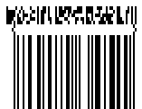</p>


[How to get *BarCodeInstance*](/barcode/javascript-cpp/get-barcode-module-instance/)
```javascript
//Encode GS1Composite barcode with EAN8 linear component
using (BarcodeGenerator gen = new BarcodeGenerator(EncodeTypes.GS1CompositeBar, "20123451|(10)ABCD0123(240)0123456789"))
{
    gen.Parameters.Barcode.XDimension.Pixels = 2;
    gen.Parameters.Barcode.CodeTextParameters.Location = CodeLocation.None;
    gen.Parameters.Barcode.GS1CompositeBar.TwoDComponentType = TwoDComponentType.CC_A;
    gen.Parameters.Barcode.GS1CompositeBar.LinearComponentType = EncodeTypes.EAN8;

    gen.Save($"{path}GS1Composite1D_EAN8.png", BarCodeImageFormat.Png);
}
```
- **1D Components Type**: [UPCA](/barcode/info-cards/upc-a/)<br> **Encoding**: 12 Digits (GTIN-12)<br> **2D component**: CC_A, CC_B. Both 4-columns.
<p align="center">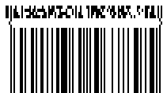</p>

[How to get *BarCodeInstance*](/barcode/javascript-cpp/get-barcode-module-instance/)
```javascript
var gen = new BarCodeInstance.BarcodeGenerator("GS1CompositeBar", "001234567895|(10)ABCD0123(240)0123456789");
gen.Parameters.Barcode.XDimension.Pixels = 2;
gen.Parameters.Barcode.CodeTextParameters.Location = BarCodeInstance.CodeLocation.None; // No code text display
gen.Parameters.Barcode.GS1CompositeBar.TwoDComponentType = BarCodeInstance.TwoDComponentType.CC_A;
gen.Parameters.Barcode.GS1CompositeBar.LinearComponentType = "UPCA"; // Set linear component to UPCA

document.getElementById("img").src = gen.GenerateBarCodeImage(); // Display barcode image

gen.delete();

```
- **1D Components Type**: [EAN13](/barcode/info-cards/ean-13/)<br> **Encoding**: 13 Digits (GTIN-13) <br> **2D component**: CC_A, CC_B. Both 4-columns.
<p align="center">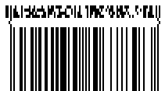</p>

[How to get *BarCodeInstance*](/barcode/javascript-cpp/get-barcode-module-instance/)
```javascript
var gen = new BarCodeInstance.BarcodeGenerator("GS1CompositeBar", "2001234567893|(10)ABCD0123(240)0123456789");
gen.Parameters.Barcode.XDimension.Pixels = 2;
gen.Parameters.Barcode.CodeTextParameters.Location = BarCodeInstance.CodeLocation.None; // No code text display
gen.Parameters.Barcode.GS1CompositeBar.TwoDComponentType = BarCodeInstance.TwoDComponentType.CC_A;
gen.Parameters.Barcode.GS1CompositeBar.LinearComponentType = "EAN13"; // Set linear component to EAN13

document.getElementById("img").src = gen.GenerateBarCodeImage(); // Display barcode image

gen.delete();

```
- **1D Components Type**: [UPCE](/barcode/info-cards/upc-e/)<br> **Encoding**: 8 Digits (GTIN-12 with zeros suppress) <br> **2D component**: CC_A, CC_B. Both 2-columns.
<p align="center">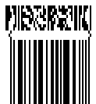</p>

[How to get *BarCodeInstance*](/barcode/javascript-cpp/get-barcode-module-instance/)
```javascript
//Encode GS1Composite barcode with UPCE linear component
var gen = new BarCodeInstance.BarcodeGenerator("GS1CompositeBar", "04252614|(10)ABCD0123(240)0123456789");
gen.Parameters.Barcode.XDimension.Pixels = 2;
gen.Parameters.Barcode.CodeTextParameters.Location = BarCodeInstance.CodeLocation.None; // No code text display
gen.Parameters.Barcode.GS1CompositeBar.TwoDComponentType = BarCodeInstance.TwoDComponentType.CC_A;
gen.Parameters.Barcode.GS1CompositeBar.LinearComponentType = "UPCE"; // Set linear component to UPCE

document.getElementById("img").src = gen.GenerateBarCodeImage(); // Display barcode image

gen.delete();

```
- **1D Components Type**: [Databar OmniDirectional](/barcode/info-cards/databar-omnidirectional/)<br> **Encoding**: 16 Digits (AI 01 and GTIN-14)<br> **2D component**: CC_A, CC_B. Both 4-columns.
<p align="center">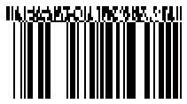</p>

[How to get *BarCodeInstance*](/barcode/javascript-cpp/get-barcode-module-instance/)
```javascript
//Encode GS1Composite barcode with DatabarOmniDirectional linear component
var gen = new BarCodeInstance.BarcodeGenerator("GS1CompositeBar", "(01)24012345678905|(10)ABCD0123(240)0123456789");
gen.Parameters.Barcode.XDimension.Pixels = 2;
gen.Parameters.Barcode.CodeTextParameters.Location = BarCodeInstance.CodeLocation.None; // No code text display
gen.Parameters.Barcode.GS1CompositeBar.TwoDComponentType = BarCodeInstance.TwoDComponentType.CC_A;
gen.Parameters.Barcode.GS1CompositeBar.LinearComponentType = "DatabarOmniDirectional"; // Set linear component to Databar OmniDirectional

document.getElementById("img").src = gen.GenerateBarCodeImage(); // Display barcode image

gen.delete();

```
- **1D Components Type**: [Databar Stacked OmniDirectional](/barcode/info-cards/databar-omnidirectional/)<br> **Encoding**: 16 Digits (AI 01 and GTIN-14)<br> **2D component**: CC_A, CC_B. Both 2-columns. 
<p align="center"></p>

[How to get *BarCodeInstance*](/barcode/javascript-cpp/get-barcode-module-instance/)
```javascript
var gen = new BarCodeInstance.BarcodeGenerator("GS1CompositeBar", "(01)24012345678905|(10)ABCD0123(240)0123456789");
gen.Parameters.Barcode.XDimension.Pixels = 2;
gen.Parameters.Barcode.CodeTextParameters.Location = BarCodeInstance.CodeLocation.None; // No code text display
gen.Parameters.Barcode.GS1CompositeBar.TwoDComponentType = BarCodeInstance.TwoDComponentType.CC_A;
gen.Parameters.Barcode.GS1CompositeBar.LinearComponentType = "DatabarStackedOmniDirectional"; // Set linear component to Databar Stacked OmniDirectional

document.getElementById("img").src = gen.GenerateBarCodeImage(); // Display barcode image

gen.delete();

```
- **1D Components Type**: [Databar Stacked](/barcode/info-cards/databar-truncated/)<br> **Encoding**: 16 Digits (AI 01 and GTIN-14)<br> **2D component**: CC_A, CC_B. Both 2-columns.
<p align="center"></p>

[How to get *BarCodeInstance*](/barcode/javascript-cpp/get-barcode-module-instance/)
```javascript
//Encode GS1Composite barcode with DatabarStacked linear component
var gen = new BarCodeInstance.BarcodeGenerator("GS1CompositeBar", "(01)24012345678905|(10)ABCD0123(240)0123456789");
gen.Parameters.Barcode.XDimension.Pixels = 2;
gen.Parameters.Barcode.CodeTextParameters.Location = BarCodeInstance.CodeLocation.None; // No code text display
gen.Parameters.Barcode.GS1CompositeBar.TwoDComponentType = BarCodeInstance.TwoDComponentType.CC_A;
gen.Parameters.Barcode.GS1CompositeBar.LinearComponentType = "DatabarStacked"; // Set linear component to Databar Stacked

document.getElementById("img").src = gen.GenerateBarCodeImage(); // Display barcode image

gen.delete();

```
- **1D Components Type**: [Databar Limited](/barcode/info-cards/databar-limited/)<br> **Encoding**: 15 Digits (AI 01 and GTIN-14 without checksum)<br> **2D component**: CC_A, CC_B. Both 3-columns. 
<p align="center">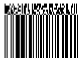</p>

[How to get *BarCodeInstance*](/barcode/javascript-cpp/get-barcode-module-instance/)
```javascript
//Encode GS1Composite barcode with DatabarLimited linear component
var gen = new BarCodeInstance.BarcodeGenerator("GS1CompositeBar", "(01)15012345678907|(10)ABCD0123(240)0123456789");
gen.Parameters.Barcode.XDimension.Pixels = 2;
gen.Parameters.Barcode.CodeTextParameters.Location = BarCodeInstance.CodeLocation.None; // No code text display
gen.Parameters.Barcode.GS1CompositeBar.TwoDComponentType = BarCodeInstance.TwoDComponentType.CC_A;
gen.Parameters.Barcode.GS1CompositeBar.LinearComponentType = "DatabarLimited"; // Set linear component to Databar Limited

document.getElementById("img").src = gen.GenerateBarCodeImage(); // Display barcode image

gen.delete();

```
- **1D Components Type**: [Databar Expanded](/barcode/info-cards/databar-expanded/)<br> **Encoding**: Up to 74 Digits or variable length of [ISO/IEC 646](https://www.iso.org/standard/4777.html)<br> **2D component**: CC_A, CC_B. Both 4-columns.
<p align="center">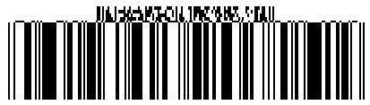</p>

[How to get *BarCodeInstance*](/barcode/javascript-cpp/get-barcode-module-instance/)
```javascript
//Encode GS1Composite barcode with DatabarExpanded linear component
var gen = new BarCodeInstance.BarcodeGenerator("GS1CompositeBar", "(01)98898765432106(3202)012345(15)991231|(10)ABCD0123(240)0123456789");
gen.Parameters.Barcode.XDimension.Pixels = 2;
gen.Parameters.Barcode.CodeTextParameters.Location = BarCodeInstance.CodeLocation.None; // No code text display
gen.Parameters.Barcode.GS1CompositeBar.TwoDComponentType = BarCodeInstance.TwoDComponentType.CC_A;
gen.Parameters.Barcode.GS1CompositeBar.LinearComponentType = "DatabarExpanded"; // Set linear component to Databar Expanded

document.getElementById("img").src = gen.GenerateBarCodeImage(); // Display barcode image

gen.delete();

```
- **1D Components Type**:[Databar Expanded Stacked](/barcode/info-cards/databar-expanded/) <br> **Encoding**: Up to 74 Digits or variable length of [ISO/IEC 646](https://www.iso.org/standard/4777.html)<br> **2D component**: CC_A, CC_B. Both 4-columns.
<p align="center">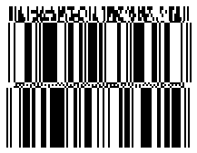</p>

[How to get *BarCodeInstance*](/barcode/javascript-cpp/get-barcode-module-instance/)
```javascript
//Encode GS1Composite barcode with DatabarExpandedStacked linear component
var gen = new BarCodeInstance.BarcodeGenerator("GS1CompositeBar", "(01)98898765432106(3202)012345(15)991231|(10)ABCD0123(240)0123456789");
gen.Parameters.Barcode.XDimension.Pixels = 2;
gen.Parameters.Barcode.CodeTextParameters.Location = BarCodeInstance.CodeLocation.None; // No code text display
gen.Parameters.Barcode.GS1CompositeBar.TwoDComponentType = BarCodeInstance.TwoDComponentType.CC_A;
gen.Parameters.Barcode.GS1CompositeBar.LinearComponentType = "DatabarExpandedStacked"; // Set linear component to Databar Expanded Stacked

document.getElementById("img").src = gen.GenerateBarCodeImage(); // Display barcode image

gen.delete();

```
- **1D Components Type**: [GS1 Code128](/barcode/javascript-cpp/gs1-barcodes/#barcode-generation-according-to-gs1-standards)<br> **Encoding**: Up to 48 Digits or variable length of [ISO/IEC 646](https://www.iso.org/standard/4777.html)<br> **2D component**: CC_A (4-columns), CC_B (4-columns), CC_C (variable length).
<p align="center">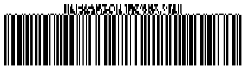</p>

[How to get *BarCodeInstance*](/barcode/javascript-cpp/get-barcode-module-instance/)
```javascript
//Encode GS1Composite barcode with GS1Code128 linear component
var gen = new BarCodeInstance.BarcodeGenerator("GS1CompositeBar", "(01)98898765432106(3202)012345|(10)ABCD0123(240)0123456789");
gen.Parameters.Barcode.XDimension.Pixels = 2;
gen.Parameters.Barcode.CodeTextParameters.Location = BarCodeInstance.CodeLocation.None; // No code text display
gen.Parameters.Barcode.GS1CompositeBar.TwoDComponentType = BarCodeInstance.TwoDComponentType.CC_A;
gen.Parameters.Barcode.GS1CompositeBar.LinearComponentType = "GS1Code128"; // Set linear component to GS1 Code 128

document.getElementById("img").src = gen.GenerateBarCodeImage(); // Display barcode image

gen.delete();

```
## **2D Linear Barcode Component Selection**
The number and type of *2D components* depend on the *1D linear* component used. *2D components* come in three types: *CC_A*, *CC_B*, and *CC_C*. The *CC_C* component can only be used with *GS1 Code128*, while *CC_A* and *CC_B* can be used with any *1D linear component*. 

All *2D components* can encode characters from the [ISO/IEC 646](https://www.iso.org/standard/4777.html) charset, which includes:
- Digits (0-9)
- Uppercase letters (A-Z)
- Lowercase letters (a-z)
- Special symbol *FNC1*, used internally as a [GS1 Application Identifier](https://www.gs1.org/standards/barcodes/application-identifiers) separator
- Punctuation symbols (!\"%&'()*+,-./:;<=>?_)
- Space symbol ( )

These symbols can be used freely in [non-GS1 encoding mode](https://reference.aspose.com/barcode/javascript-cpp/aspose.barcode.generation/gs1compositebarparameters/isallowonlygs1encoding/) or according to *GS1 rules* where permitted in a *GS1 Application Identifier*.

### **2D Component Details**
- **CC_A** – A *2D* component based on [MicroPDF417](/barcode/javascript-cpp/pdf417-barcodes/#micro-pdf417)-like symbology. It can encode up to 56 digits or any [ISO/IEC 646](https://www.iso.org/standard/4777.html) symbols with variable length. This component can be used with any *1D linear component*.
<p align="center"></p>


[How to get *BarCodeInstance*](/barcode/javascript-cpp/get-barcode-module-instance/)
```javascript
//Encode GS1Composite barcode with CC_A 2D component
var gen = new BarCodeInstance.BarcodeGenerator("GS1CompositeBar", "(01)98898765432106(3202)012345|(10)ABCD0123(240)0123456789");
gen.Parameters.Barcode.XDimension.Pixels = 2;
gen.Parameters.Barcode.CodeTextParameters.Location = BarCodeInstance.CodeLocation.None; // No code text display
gen.Parameters.Barcode.GS1CompositeBar.TwoDComponentType = BarCodeInstance.TwoDComponentType.CC_A;
gen.Parameters.Barcode.GS1CompositeBar.LinearComponentType = "GS1Code128"; // Set linear component to GS1 Code 128

document.getElementById("img").src = gen.GenerateBarCodeImage(); // Display barcode image

gen.delete();

```
- **CC_B** - is 2D component, used [MicroPDF417](/barcode/javascript-cpp/pdf417-barcodes/#micro-pdf417) symbology to encode 2D binary data. Can encode up to 338 digits or any [ISO/IEC 646](https://www.iso.org/standard/4777.html) symbols with variable length. Can be used with any 1D linear component.
<p align="center">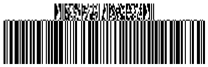</p>

[How to get *BarCodeInstance*](/barcode/javascript-cpp/get-barcode-module-instance/)
```javascript
//Encode GS1Composite barcode with CC_B 2D component
var gen = new BarCodeInstance.BarcodeGenerator("GS1CompositeBar", "(01)98898765432106(3202)012345|(10)ABCD0123(240)0123456789");
gen.Parameters.Barcode.XDimension.Pixels = 2;
gen.Parameters.Barcode.CodeTextParameters.Location = BarCodeInstance.CodeLocation.None; // No code text display
gen.Parameters.Barcode.GS1CompositeBar.TwoDComponentType = BarCodeInstance.TwoDComponentType.CC_B;
gen.Parameters.Barcode.GS1CompositeBar.LinearComponentType = "GS1Code128"; // Set linear component to GS1 Code 128

document.getElementById("img").src = gen.GenerateBarCodeImage(); // Display barcode image

gen.delete();

```
- **CC_C** - is 2D component, used [PDF417](/barcode/javascript-cpp/pdf417-barcodes/#pdf417-and-macro-pdf417) symbology to encode 2D binary data. Can encode up to 2361 digits or any [ISO/IEC 646](https://www.iso.org/standard/4777.html) symbols with variable length. Can be used only with [GS1 Code128](/barcode/javascript-cpp/gs1-barcodes/#barcode-generation-according-to-gs1-standards).
<p align="center">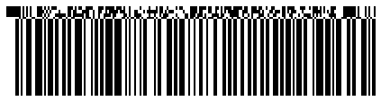</p>

[How to get *BarCodeInstance*](/barcode/javascript-cpp/get-barcode-module-instance/)
```javascript
//Encode GS1Composite barcode with CC_C 2D component
var gen = new BarCodeInstance.BarcodeGenerator("GS1CompositeBar", "(01)98898765432106(3202)012345|(10)ABCD0123(240)0123456789");
gen.Parameters.Barcode.XDimension.Pixels = 2;
gen.Parameters.Barcode.CodeTextParameters.Location = BarCodeInstance.CodeLocation.None; // No code text display
gen.Parameters.Barcode.GS1CompositeBar.TwoDComponentType = BarCodeInstance.TwoDComponentType.CC_C;
gen.Parameters.Barcode.GS1CompositeBar.LinearComponentType = "GS1Code128"; // Set linear component to GS1 Code 128

document.getElementById("img").src = gen.GenerateBarCodeImage(); // Display barcode image

gen.delete();

```
## **2D Component in non GS1 Mode**
Sometimes we need to encode *non GS1* data in *2D* component. For this you can use property [IsAllowOnlyGS1Encoding](https://reference.aspose.com/barcode/javascript-cpp/aspose.barcode.generation/gs1compositebarparameters/isallowonlygs1encoding/).
<p align="center">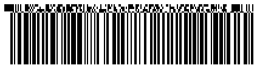</p>

[How to get *BarCodeInstance*](/barcode/javascript-cpp/get-barcode-module-instance/)
```javascript
//Encode GS1Composite barcode with not GS1 complaint 2D component
var gen = new BarCodeInstance.BarcodeGenerator("GS1CompositeBar", "(01)98898765432106(3202)012345|Aspose.Barcode");
gen.Parameters.Barcode.XDimension.Pixels = 2;
gen.Parameters.Barcode.CodeTextParameters.Location = BarCodeInstance.CodeLocation.None; // No code text display
gen.Parameters.Barcode.GS1CompositeBar.TwoDComponentType = BarCodeInstance.TwoDComponentType.CC_C;
gen.Parameters.Barcode.GS1CompositeBar.LinearComponentType = "GS1Code128"; // Set linear component to GS1 Code 128
gen.Parameters.Barcode.GS1CompositeBar.IsAllowOnlyGS1Encoding = false; // Allow non-GS1 encoding

document.getElementById("img").src = gen.GenerateBarCodeImage(); // Display barcode image

gen.delete();

```
## **Encode Special Modes for 2D Component**
Data for the *2D component* can be encoded in three different modes, each offering varying levels of data compaction:

- **Mode 0**: General-purpose data compaction that allows encoding any [GS1 Application Identifier](https://www.gs1.org/standards/barcodes/application-identifiers) or [non-GS1 data](https://reference.aspose.com/barcode/javascript-cpp/aspose.barcode.generation/gs1compositebarparameters/isallowonlygs1encoding/) using the [ISO/IEC 646](https://www.iso.org/standard/4777.html) charset.
- **Mode 10**: Used for encoding data with GS1 Application Identifiers (AIs) *11*, *17*, and *10* with maximum data compaction.
- **Mode 11**: Used for encoding data with GS1 AI *90* with maximum data compaction.

### **Mode 0**
This mode allows encoding any sequence of [ISO/IEC 646](https://www.iso.org/standard/4777.html) symbols.

**Digits encoding**:
<p align="center">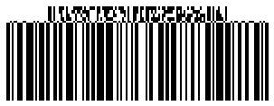</p>

[How to get *BarCodeInstance*](/barcode/javascript-cpp/get-barcode-module-instance/)
```javascript
//Encode GS1Composite barcode Encodation Method 0: Digits
var gen = new BarCodeInstance.BarcodeGenerator("GS1CompositeBar", "(01)98898765432106|0123456789");
gen.Parameters.Barcode.XDimension.Pixels = 2;
gen.Parameters.Barcode.CodeTextParameters.Location = BarCodeInstance.CodeLocation.None; // No code text display
gen.Parameters.Barcode.GS1CompositeBar.TwoDComponentType = BarCodeInstance.TwoDComponentType.CC_B;
gen.Parameters.Barcode.GS1CompositeBar.LinearComponentType = "GS1Code128"; // Set linear component to GS1 Code 128
gen.Parameters.Barcode.GS1CompositeBar.IsAllowOnlyGS1Encoding = false; // Allow non-GS1 encoding

document.getElementById("img").src = gen.GenerateBarCodeImage(); // Display barcode image

gen.delete();

```
**Uppercase letters encoding**:
<p align="center">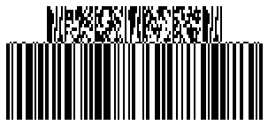</p>

[How to get *BarCodeInstance*](/barcode/javascript-cpp/get-barcode-module-instance/)
```javascript
//Encode GS1Composite barcode Encodation Method 0: Capital Letters
// Generate a GS1 Composite barcode with GS1Code128 linear component
var gen = new BarCodeInstance.BarcodeGenerator("GS1CompositeBar", "(01)98898765432106|ABCDEFGHIJKLMNOPQRSTUVWXYZ");
gen.Parameters.Barcode.XDimension.Pixels = 2;
gen.Parameters.Barcode.CodeTextParameters.Location = BarCodeInstance.CodeLocation.None; // No code text display
gen.Parameters.Barcode.GS1CompositeBar.TwoDComponentType = BarCodeInstance.TwoDComponentType.CC_B;
gen.Parameters.Barcode.GS1CompositeBar.LinearComponentType = "GS1Code128";
gen.Parameters.Barcode.GS1CompositeBar.IsAllowOnlyGS1Encoding = false;

document.getElementById("img").src = gen.GenerateBarCodeImage(); // Display barcode image

gen.delete();

```
**Lowercase letters encoding**:
<p align="center">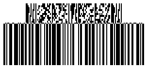</p>

[How to get *BarCodeInstance*](/barcode/javascript-cpp/get-barcode-module-instance/)
```javascript
//Encode GS1Composite barcode Encodation Method 0: Letters
// Generate a GS1 Composite barcode with GS1Code128 linear component
var gen = new BarCodeInstance.BarcodeGenerator("GS1CompositeBar", "(01)98898765432106|abcdefghijklmnopqrstuvwxyz");
gen.Parameters.Barcode.XDimension.Pixels = 2;
gen.Parameters.Barcode.CodeTextParameters.Location = BarCodeInstance.CodeLocation.None; // No code text display
gen.Parameters.Barcode.GS1CompositeBar.TwoDComponentType = BarCodeInstance.TwoDComponentType.CC_B;
gen.Parameters.Barcode.GS1CompositeBar.LinearComponentType = "GS1Code128";
gen.Parameters.Barcode.GS1CompositeBar.IsAllowOnlyGS1Encoding = false;

document.getElementById("img").src = gen.GenerateBarCodeImage(); // Display barcode image

gen.delete();

    
```
**Punctuation encoding**:
<p align="center">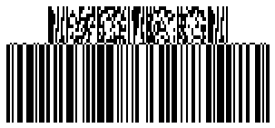</p>

[How to get *BarCodeInstance*](/barcode/javascript-cpp/get-barcode-module-instance/)
```javascript
//Encode GS1Composite barcode Encodation Method 0: Punctuation
// Generate a GS1 Composite barcode with GS1Code128 linear component
var gen = new BarCodeInstance.BarcodeGenerator("GS1CompositeBar", "(01)98898765432106|!\"%&'()*+,-./:;<=>?_ ");
gen.Parameters.Barcode.XDimension.Pixels = 2;
gen.Parameters.Barcode.CodeTextParameters.Location = BarCodeInstance.CodeLocation.None; // No code text display
gen.Parameters.Barcode.GS1CompositeBar.TwoDComponentType = BarCodeInstance.TwoDComponentType.CC_B;
gen.Parameters.Barcode.GS1CompositeBar.LinearComponentType = "GS1Code128";
gen.Parameters.Barcode.GS1CompositeBar.IsAllowOnlyGS1Encoding = false;

document.getElementById("img").src = gen.GenerateBarCodeImage(); // Display barcode image

gen.delete();

```
### **Mode 10**
In *Mode 10* you can encode supplement *2D* data with *GS1 AI* *11*, *17*, *10* and their combination like AI *11* with AI *10* or AI *17* with AI *10* with maximal compaction. Also, you can encode any other *GS1 AI* after these sequences.

**GS1 AI 10 encoding**:
<p align="center">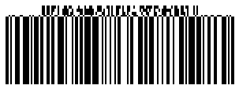</p>

[How to get *BarCodeInstance*](/barcode/javascript-cpp/get-barcode-module-instance/)
```javascript
//Encode GS1Composite barcode Encodation Method 10: AI 10(Batch or lot number)
// Generate a GS1 Composite barcode with GS1Code128 linear component and AI (10) data
var gen = new BarCodeInstance.BarcodeGenerator("GS1CompositeBar", "(01)98898765432106|(10)0123");
gen.Parameters.Barcode.XDimension.Pixels = 2;
gen.Parameters.Barcode.CodeTextParameters.Location = BarCodeInstance.CodeLocation.None; // No code text display
gen.Parameters.Barcode.GS1CompositeBar.TwoDComponentType = BarCodeInstance.TwoDComponentType.CC_A;
gen.Parameters.Barcode.GS1CompositeBar.LinearComponentType = "GS1Code128";

document.getElementById("img").src = gen.GenerateBarCodeImage(); // Display barcode image

gen.delete();

```
**GS1 AI 11 encoding**:
<p align="center">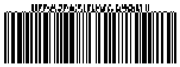</p>

[How to get *BarCodeInstance*](/barcode/javascript-cpp/get-barcode-module-instance/)
```javascript
//Encode GS1Composite barcode Encodation Method 10: AI 11(Production date (YYMMDD))
// Generate a GS1 Composite barcode with GS1Code128 linear component and AI (11) data
var gen = new BarCodeInstance.BarcodeGenerator("GS1CompositeBar", "(01)98898765432106|(11)991231");
gen.Parameters.Barcode.XDimension.Pixels = 2;
gen.Parameters.Barcode.CodeTextParameters.Location = BarCodeInstance.CodeLocation.None; // No code text display
gen.Parameters.Barcode.GS1CompositeBar.TwoDComponentType = BarCodeInstance.TwoDComponentType.CC_A;
gen.Parameters.Barcode.GS1CompositeBar.LinearComponentType = "GS1Code128";

document.getElementById("img").src = gen.GenerateBarCodeImage(); // Display barcode image

gen.delete();

```
**GS1 AI 17 encoding**:
<p align="center">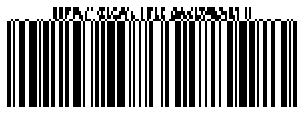</p>

[How to get *BarCodeInstance*](/barcode/javascript-cpp/get-barcode-module-instance/)
```javascript
//Encode GS1Composite barcode Encodation Method 10: AI 17(Expiration date (YYMMDD))
// Generate a GS1 Composite barcode with GS1Code128 linear component and AI (17) data
var gen = new BarCodeInstance.BarcodeGenerator("GS1CompositeBar", "(01)98898765432106|(17)991231");
gen.Parameters.Barcode.XDimension.Pixels = 2;
gen.Parameters.Barcode.CodeTextParameters.Location = BarCodeInstance.CodeLocation.None; // No code text display
gen.Parameters.Barcode.GS1CompositeBar.TwoDComponentType = BarCodeInstance.TwoDComponentType.CC_A;
gen.Parameters.Barcode.GS1CompositeBar.LinearComponentType = "GS1Code128";

document.getElementById("img").src = gen.GenerateBarCodeImage(); // Display barcode image

gen.delete();

```
**GS1 AI 11 with AI 10 encoding**:
<p align="center">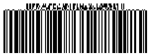</p>

[How to get *BarCodeInstance*](/barcode/javascript-cpp/get-barcode-module-instance/)
```javascript
//Encode GS1Composite barcode Encodation Method 10: AI 10(Batch or lot number) AI 11(Production date (YYMMDD))
// Generate a GS1 Composite barcode with GS1Code128 linear component and multiple AI data (11) and (10)
var gen = new BarCodeInstance.BarcodeGenerator("GS1CompositeBar", "(01)98898765432106|(11)991231(10)0123");
gen.Parameters.Barcode.XDimension.Pixels = 2;
gen.Parameters.Barcode.CodeTextParameters.Location = BarCodeInstance.CodeLocation.None; // No code text display
gen.Parameters.Barcode.GS1CompositeBar.TwoDComponentType = BarCodeInstance.TwoDComponentType.CC_A;
gen.Parameters.Barcode.GS1CompositeBar.LinearComponentType = "GS1Code128";

document.getElementById("img").src = gen.GenerateBarCodeImage(); // Display barcode image

gen.delete();

```

### **Mode 11**
In *Mode 11* you can encode *GS1 AI 90* and following data with maximal compaction.

<p align="center">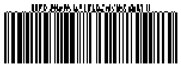</p>

[How to get *BarCodeInstance*](/barcode/javascript-cpp/get-barcode-module-instance/)
```javascript
//Encode GS1Composite barcode Encodation Method 11: AI 90 (containing alphanumeric data)
// Generate a GS1 Composite barcode with GS1Code128 linear component and multiple AI data (90) and (10)
var gen = new BarCodeInstance.BarcodeGenerator("GS1CompositeBar", "(01)98898765432106|(90)9K12(10)0123");
gen.Parameters.Barcode.XDimension.Pixels = 2;
gen.Parameters.Barcode.CodeTextParameters.Location = BarCodeInstance.CodeLocation.None; // No code text display
gen.Parameters.Barcode.GS1CompositeBar.TwoDComponentType = BarCodeInstance.TwoDComponentType.CC_A;
gen.Parameters.Barcode.GS1CompositeBar.LinearComponentType = "GS1Code128";

document.getElementById("img").src = gen.GenerateBarCodeImage(); // Display barcode image

gen.delete();

```
