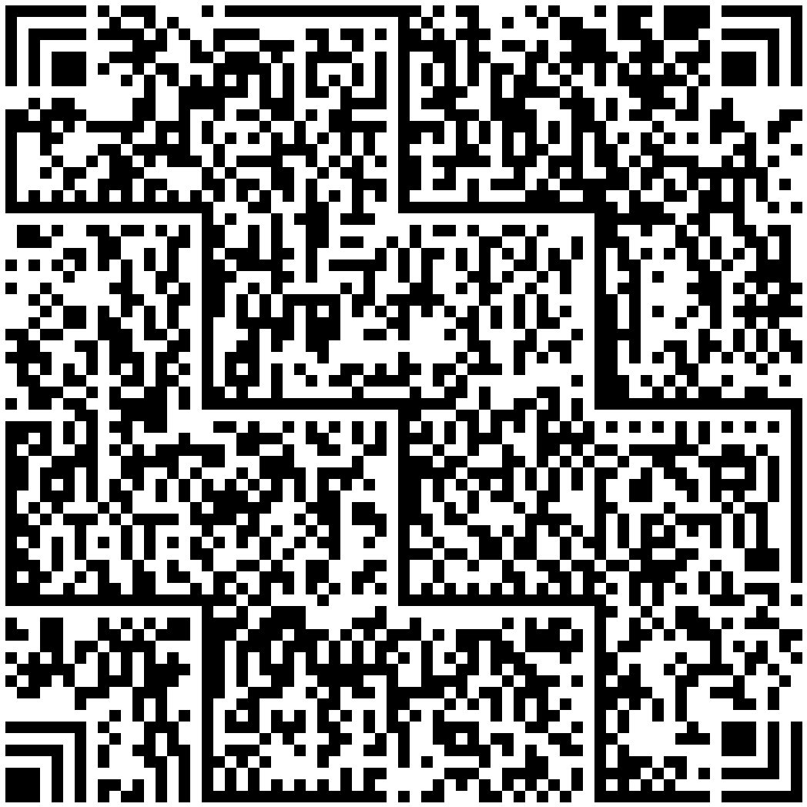

## **Overview**
Han Xin Code, also known as Chinese Sensible, is a matrix symbology introduced in 2007. It was designed to encode both simplified Chinese characters and all ASCII characters and digits. Han Xin Code symbols are two-dimensional, with a variable-size matrix structure made up of black and white modules arranged in a square pattern. The standard is managed and governed by GS1 China.

With the minimum error correction level, Han Xin Code can encode up to 2,174 common Chinese characters, 3,261 binary bytes, 4,350 ASCII characters, or 7,827 digits. It supports encoding multiple data types within a single barcode. The specification for this standard is defined in the AIMD-015 barcode symbology specification - Han Xin Code.

{}*For any clarifications, reach out to [Aspose Technical Support](/barcode/javascript-cpp/technical-support/): ask questions at [Aspose.Barcode Forum](https://forum.aspose.com/c/barcode/13) or contact [Aspose Paid Support Helpdesk](https://helpdesk.aspose.com/).*{}

## **Version Settings**
Han Xin Code includes 84 different versions, denoted as Version 1, Version 2, ..., Version 84. Version 1 has 23 modules × 23 modules, Version 2 has 25 modules × 25 modules, and so forth, increasing by modules per side up to Version 84, which features 189 modules × 189 modules.

By default, the [*HanXinVersion*](https://reference.aspose.com/barcode/javascript-cpp/aspose.barcode.generation/hanxinparameters/hanxinversion/) property of the [*HanXinParameters*](https://reference.aspose.com/barcode/javascript-cpp/aspose.barcode.generation/hanxinparameters) class is set to *HanXinVersion.Auto*, which allows the encoder to automatically select the smallest suitable version. To set a specific version, initialize the [*HanXinVersion*](https://reference.aspose.com/barcode/javascript-cpp/aspose.barcode.generation/hanxinversion/) property with the corresponding value from *HanXinVersion.Version01* to *HanXinVersion.Version84*.

| |Version 1|Version 24|Version 84|
|--|:---:|:------:|:------:|
| |<p align="center"></p>|<p align="center"></p>|<p align="center"></p>|

The following code sample demonstrates how to set the Han Xin Code version.


[How to get *BarCodeInstance*](/barcode/javascript-cpp/get-barcode-module-instance/)
```javascript
// Generate a HanXin barcode with Auto version (default)
var gen = new BarCodeInstance.BarcodeGenerator("HanXin", "1234567890");
document.getElementById("img1").src = gen.GenerateBarCodeImage(); // Display barcode image

// Generate a HanXin barcode with Version 24
gen.Parameters.Barcode.HanXin.HanXinVersion = BarCodeInstance.HanXinVersion.Version24;
document.getElementById("img2").src = gen.GenerateBarCodeImage(); // Display barcode image

gen.delete();

```

## **Encoding Mode Settings**
The barcode library supports different encoding modes to generate Han Xin barcodes. The required mode can be selected by setting the [*HanXinEncodeMode*](https://reference.aspose.com/barcode/javascript-cpp/aspose.barcode.generation/hanxinparameters/hanxinencodemode/) property of class [*HanXinParameters*](https://reference.aspose.com/barcode/javascript-cpp/aspose.barcode.generation/hanxinparameters). The possible values are defined in the [*HanXinEncodeMode*](https://reference.aspose.com/barcode/javascript-cpp/aspose.barcode.generation/hanxinencodemode/) enumeration. These modes are briefly described below:
- *Auto*: This mode automatically chooses between *Numeric*, *Text*, *Binary*, and four *GB18030* (Chinese) modes to achieve maximum data compactness. It is the default setting.
- *Binary*: Used for encoding binary data with the highest data compactness.
- *ECI*: The Extended Channel Interpretation (ECI) mode indicates that the encoded data is interpreted according to the ECI protocol defined by the AIM ECI Specifications.
- *Unicode*: Represents any text data in UTF8 encoding/charset format in Han Xin Code.
- *URI*: Indicates the data represented in Han Xin Code is a Uniform Resource Identifier (URI), conforming to [*RFC 3986*](https://datatracker.ietf.org/doc/html/rfc3986).
- *Extended*: Provides flexible encoding control, allowing manual specification of encoding for part of the Codetext.

### ***Auto* Encoding Mode**
The *Auto* mode automatically switches between different encoding types such as *Numeric*, *Text*, *Binary*, and four *GB18030* (Chinese) modes for optimal data compactness. This is the default setting.

The following code sample demonstrates how to generate Han Xin barcodes using the *Auto* encoding mode.

  
[How to get *BarCodeInstance*](/barcode/javascript-cpp/get-barcode-module-instance/)
```javascript
// Text + Region One + Region Two + GB18030 2 Byte
var str = "abc123全ň全漄灟漄灟螅全ň螅螅螅";

var gen = new BarCodeInstance.BarcodeGenerator("HanXin", str);
gen.Parameters.Barcode.HanXin.HanXinEncodeMode = BarCodeInstance.HanXinEncodeMode.Auto; // Default mode is Auto
document.getElementById("img").src = gen.GenerateBarCodeImage(); // Display barcode image

gen.delete();

```

### ***Binary* Encoding Mode**
The *Binary* mode serves to encode byte streams. If a Unicode character is encountered, an exception is thrown. The code sample below explains how to work with this encoding mode.

[How to get *BarCodeInstance*](/barcode/javascript-cpp/get-barcode-module-instance/)
```javascript
// Binary mode 
var gen = new BarCodeInstance.BarcodeGenerator("HanXin");
var encodedArr = new Uint8Array([0xFF, 0xFE, 0xFD, 0xFC, 0xFB, 0xFA, 0xF9]);
var b64encoded = btoa(String.fromCharCode.apply(null, encodedArr));
gen.SetCodeTextBase64(b64encoded);
gen.Parameters.Barcode.HanXin.HanXinEncodeMode = BarCodeInstance.HanXinEncodeMode.Binary;
document.getElementById("img").src = gen.GenerateBarCodeImage(); // Display barcode image

gen.delete();
```

### **Encoding Mode: *ECI***
The Extended Channel Interpretation (ECI) mode allows the encoded data to be interpreted according to the ECI protocol defined by the AIM ECI Specifications. When using ECI mode, the entire CodeText is re-encoded with the encoding specified in the [*HanXinECIEncoding*](https://reference.aspose.com/barcode/javascript-cpp/aspose.barcode.generation/hanxinparameters/hanxineciencoding/) property, and an ECI identifier is inserted. If any character is not supported by the chosen ECI encoding, an exception is thrown. By default, the [*HanXinECIEncoding*](https://reference.aspose.com/barcode/javascript-cpp/aspose.barcode.generation/hanxinparameters/hanxineciencoding/) property is set to [*ECIEncodings*](https://reference.aspose.com/barcode/javascript-cpp/aspose.barcode.generation/eciencodings/).UTF8 (ECI ID: "\000026").

The code sample below demonstrates how to use the *ECI* mode.


```csharp
// ECI mode, Latin/Greek alphabet encoding. ECI Id:"\000009"
var str = "ΑΒΓΔΕ";

var gen = new BarCodeInstance.BarcodeGenerator("HanXin", str);
gen.Parameters.Barcode.HanXin.HanXinEncodeMode = BarCodeInstance.HanXinEncodeMode.ECI;
gen.Parameters.Barcode.HanXin.HanXinECIEncoding = BarCodeInstance.ECIEncodings.ISO_8859_7;
document.getElementById("img").src = gen.GenerateBarCodeImage(); // Display barcode image

gen.delete();

```

### ***Unicode* Mode**
The *Unicode* mode provides a way to store text data entered in the UTF8 encoding format within Han Xin barcodes.
  
The following code sample shows how to enable the *Unicode* mode.

[How to get *BarCodeInstance*](/barcode/javascript-cpp/get-barcode-module-instance/)
```javascript
var str = "abcd АБВ ıntəˈnæʃənəl 语言语言 แผ่นดินฮั่นเสื่ ∑ f(i) = ∏ 🖨 🚘✉🥇⚽ 你好測試測試 こんにちは テスト テスト 안녕하세요 테스트 테스트";

var gen = new BarCodeInstance.BarcodeGenerator("HanXin", str);
gen.Parameters.Barcode.HanXin.HanXinEncodeMode = BarCodeInstance.HanXinEncodeMode.Unicode;
document.getElementById("img").src = gen.GenerateBarCodeImage(); // Display barcode image

gen.delete();
```

### **Encoding Mode: *URI***
The *URI* mode indicates that the data in the Han Xin Code represents a Uniform Resource Identifier (URI) as defined by [*RFC 3986*](https://datatracker.ietf.org/doc/html/rfc3986).

[How to get *BarCodeInstance*](/barcode/javascript-cpp/get-barcode-module-instance/)
```javascript
// URI mode 
var str = "https://www.test.com/%BC%DE%ab/search=test";

var gen = new BarCodeInstance.BarcodeGenerator("HanXin", str);
gen.Parameters.Barcode.HanXin.HanXinEncodeMode = BarCodeInstance.HanXinEncodeMode.URI;
document.getElementById("img").src = gen.GenerateBarCodeImage(); // Display barcode image

// Read the barcode value
var img = gen.GenerateBarCodeImage();
var reader = new BarCodeInstance.BarCodeReader(img, "HanXin");
reader.ReadBarCodes();

if (reader.FoundCount == 1) {
    const result = reader.FoundBarCodes(0);
    console.log(result.CodeText);
}

gen.delete();
reader.delete();

```

### **Encoding Mode: *Extended***
The *Extended* mode enables the combination of all supported encoding formats in a single barcode, including Auto, Binary, Text, Numeric, URI, Unicode, ECI, Common Chinese Region One, Common Chinese Region Two, GB18030 Two Byte, and GB18030 Four Byte.

The barcode text can be manually defined with prefixes and double backslashes, such as: `@"\auto:abc\000009:ΑΒΓΔΕ\auto:ab\\c"`, or by using the HanXinExtCodetextBuilder.

If the barcode text contains an ECI segment, only the following modes can be used after the ECI segment: *Auto*, *Binary*, *Text*, *Numeric*, *URI*, or *ECI*.

The following code examples demonstrate the use of all these modes.


[How to get *BarCodeInstance*](/barcode/javascript-cpp/get-barcode-module-instance/)
```javascript
// Extended mode example 1
var str = "\\auto:abc\\000009:ΑΒΓΔΕ\\auto:abc";

var gen = new BarCodeInstance.BarcodeGenerator("HanXin", str);
gen.Parameters.Barcode.HanXin.HanXinEncodeMode = BarCodeInstance.HanXinEncodeMode.Extended;
document.getElementById("img").src = gen.GenerateBarCodeImage(); // Display barcode image

// Read the barcode value
var img = gen.GenerateBarCodeImage();
var reader = new BarCodeInstance.BarCodeReader(img, "HanXin");
reader.ReadBarCodes();

if (reader.FoundCount == 1) {
    const result = reader.FoundBarCodes(0);
    console.log(result.CodeText);
}

gen.delete();
reader.delete();


// Using HanXinExtCodetextBuilder for Extended mode 
// Create codetext
var codeTextBuilder = new BarCodeInstance.HanXinExtCodetextBuilder();
codeTextBuilder.AddGB18030TwoByte("漄");
codeTextBuilder.AddGB18030FourByte("㐁");
codeTextBuilder.AddCommonChineseRegionOne("全");
codeTextBuilder.AddCommonChineseRegionTwo("螅");
codeTextBuilder.AddNumeric("123");
codeTextBuilder.AddText("qwe");
codeTextBuilder.AddUnicode("ıntəˈnæʃənəl");
codeTextBuilder.AddECI("ΑΒΓΔΕ", 9);
codeTextBuilder.AddAuto("abc");
codeTextBuilder.AddBinary("abc");
codeTextBuilder.AddURI("backslashes_should_be_doubled\\000555:test");

// Generate codetext
var str = codeTextBuilder.GetExtendedCodetext();

// Generate
var gen = new BarCodeInstance.BarcodeGenerator("HanXin", str);
gen.Parameters.Barcode.HanXin.HanXinEncodeMode = BarCodeInstance.HanXinEncodeMode.Extended;
document.getElementById("img").src = gen.GenerateBarCodeImage(); // Display barcode image

// Read the barcode value
var img = gen.GenerateBarCodeImage();
var reader = new BarCodeInstance.BarCodeReader(img, "HanXin");
reader.ReadBarCodes();

if (reader.FoundCount == 1) {
    const result = reader.FoundBarCodes(0);
    console.log(result.CodeText);
}

codeTextBuilder.delete();
gen.delete();
reader.delete();

```
## **Error Correction Settings**
Han Xin Code supports four levels of Reed-Solomon error correction, as shown in the table below.

|Error Correction Level|Data Recovery Capability|
|:--:|:--:|
|L1|8%|
|L2|15%|
|L3|23%|
|L4|30%|

The desired error correction level can be set using the [*HanXinErrorLevel*](https://reference.aspose.com/barcode/javascript-cpp/aspose.barcode.generation/hanxinparameters/hanxinerrorlevel/) property of the [*HanXinParameters*](https://reference.aspose.com/barcode/javascript-cpp/aspose.barcode.generation/hanxinparameters) class. By default, this property is set to *HanXinErrorLevel.L1*.

The following code sample shows how to configure the error correction level.


[How to get *BarCodeInstance*](/barcode/javascript-cpp/get-barcode-module-instance/)
```javascript
var gen = new BarCodeInstance.BarcodeGenerator("HanXin", "1234567890");

// Set error level to L4
gen.Parameters.Barcode.HanXin.HanXinErrorLevel = BarCodeInstance.HanXinErrorLevel.L4;
document.getElementById("img").src = gen.GenerateBarCodeImage(); // Display barcode image

gen.delete();

```

