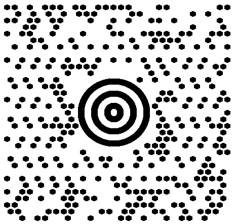
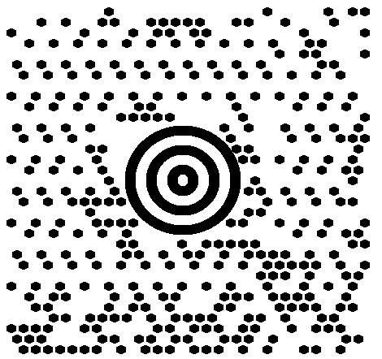
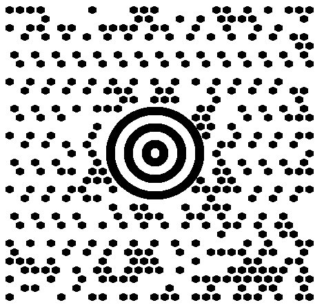
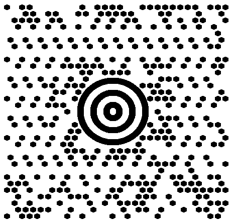
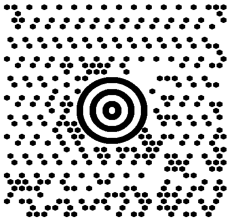
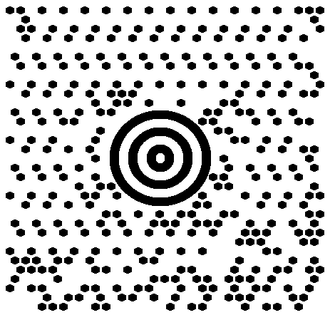

{}[Generate MaxiCode Barcodes Online](https://products.aspose.app/barcode/generate/maxicode): You can test the quality of ***Aspose.BarCode*** generation for MaxiCode barcodes and view the results online.{}

## **Overview**
*MaxiCode* is a 2D matrix barcode format that can encode both text and byte data. It uses Reed-Solomon error correction, with strict specifications for data capacity and barcode size as defined by the *MaxiCode* standard. The barcode features a round bullseye finder pattern consisting of three concentric circles, six orientation patterns, and 33 rows with 29 or 30 hexagonal modules.

The data capacity for encoding depends on the characteristics of the input and can hold a maximum of 60 bytes or up to 140 numerical (90 alphanumeric) digits. Although initially developed for postal services, *MaxiCode* is intended for industrial use and is not typically recommended for general business applications.

{}*If you need further assistance, please contact [Aspose Technical Support](/barcode/javascript-cpp/technical-support/). You can ask questions at the [Aspose.Barcode Forum](https://forum.aspose.com/c/barcode/13) or reach out to [Aspose Paid Support Helpdesk](https://helpdesk.aspose.com/).*{}

## **MaxiCode Mode Settings**
In ***Aspose.BarCode for JavaScript via C++***, developers can configure different generation modes for creating *MaxiCode* barcodes using the [*MaxiCodeMode*](https://reference.aspose.com/barcode/javascript-cpp/aspose.barcode.generation/maxicodeparameters/maxicodemode) property of the [*MaxiCodeParameters*](https://reference.aspose.com/barcode/javascript-cpp/aspose.barcode.generation/maxicodeparameters) class. Supported data modes include:
- *Modes 2 and 3* - Specialized industrial standards for the transportation industry, designed to store shipping information along with additional data.
- *Modes 4 and 5* - Capable of storing arbitrary text or byte data, differing only in the number of codewords used for error correction and potential data capacity.
- *Mode 6* - Similar to *Mode 4*, but specifically used for setting up hardware readers.

For more details and code samples for complex data modes, visit [here](/net/complex-maxicode/).

### **MaxiCode Modes 2 and 3**
*MaxiCode Modes 2 and 3* require the input data to be formatted in predefined structures:
- <mark>Format 1: “[)>(rs)01(gs)(Postal Code)(gs)(Country Code)(gs)(Service Category)(gs)(Secondary Message)(eot)”</mark>
- <mark>Format 2: “(Postal Code 9 digits)(gs)(Country Code)(gs)(Service Category)(gs)(Secondary Message)(eot)”</mark>

Special characters used:
- Group separator Unicode character (gs): \u001d
- Record separator Unicode character (rs): \u001e
- End-of-transmission Unicode character (eot): \u0004

The sample *MaxiCode* barcodes below were created using Formats 1 and 2 of *MaxiCode Mode 2*.

|Mode 2|Format 1|Format 2|
| :-: | :-: | :-: |
| |||

The following code snippet demonstrates how to work with *MaxiCode* modes.

```javascript
// [)>(RS)01(GS)(Postal Code)(GS)(Country Code)(GS)(Service Category)(GS)(Secondary Message)(EOT)
var gs = "\u001d";
var rs = "\u001e";
var eot = "\u0004";
var codetext = `[)>${rs}01${gs}B1050${gs}056${gs}001${gs}ADDITIONAL DATA${eot}`;

var gen = new BarCodeInstance.BarcodeGenerator("MaxiCode", codetext);
// Set MaxiCode mode to 2
gen.Parameters.Barcode.MaxiCode.MaxiCodeMode = BarCodeInstance.MaxiCodeMode.Mode2;

gen.Parameters.Barcode.XDimension.Pixels = 15;
gen.Parameters.Barcode.CodeTextParameters.TwoDDisplayText = "MaxiCode Mode 2";
document.getElementById("img1").src = gen.GenerateBarCodeImage(); // Display barcode image


// (Postal Code 9 digits)(GS)(Country Code)(GS)(Service Category)(GS)(Secondary Message)(EOT)
codetext = `123456789${gs}056${gs}001${gs}ADDITIONAL DATA${eot}`;
gen = new BarCodeInstance.BarcodeGenerator("MaxiCode", codetext);
// Set MaxiCode mode to 2
gen.Parameters.Barcode.MaxiCode.MaxiCodeMode = BarCodeInstance.MaxiCodeMode.Mode2;

gen.Parameters.Barcode.XDimension.Pixels = 15;
gen.Parameters.Barcode.CodeTextParameters.TwoDDisplayText = "MaxiCode Mode 2";
document.getElementById("img2").src = gen.GenerateBarCodeImage(); // Display barcode image

gen.delete();


```
  
### **MaxiCode Modes 4, 5, and 6**
*MaxiCode* barcodes generated in these modes can store the arbitrary text data or byte streams. The code sample given below shows how to use the *MaxiCode Mode 4*.

```javascript
var gen = new BarCodeInstance.BarcodeGenerator("MaxiCode", "Åspóse.Barcóde©");
gen.Parameters.Barcode.XDimension.Pixels = 15;
// Set MaxiCode encode mode to 4
gen.Parameters.Barcode.MaxiCode.MaxiCodeMode = BarCodeInstance.MaxiCodeMode.Mode4;
document.getElementById("img").src = gen.GenerateBarCodeImage(); // Display barcode image

gen.delete();


```
  
<p align="center"></p>


## **Encoding Mode Settings**
The barcode library supports various encoding modes for generating *MaxiCode* barcodes. You can select the required mode by setting the [*MaxiCodeEncodeMode*](https://reference.aspose.com/barcode/javascript-cpp/aspose.barcode.generation/maxicodeparameters/maxicodeencodemode) property of the [*MaxiCodeParameters*](https://reference.aspose.com/barcode/javascript-cpp/aspose.barcode.generation/maxicodeparameters) class. The available modes are defined in the [*MaxiCodeEncodeMode*](https://reference.aspose.com/barcode/javascript-cpp/aspose.barcode.generation/maxicodeencodemode/) enumeration. A brief overview of each mode is provided below:

- *Auto*: The default mode, where the CodeText is encoded with the maximum possible data compactness.
- *Binary*: Encodes binary data with maximum data compactness.
- *ECI*: The Extended Channel Interpretation (ECI) mode, which specifies that the encoded data should be interpreted according to the ECI protocol defined by the AIM ECI Specifications.
- *Extended*: Provides more flexible encoding options, allowing manual specification of the encoding for parts of the CodeText.

### **Encoding Mode *Auto***
In *Auto* mode, the CodeText is encoded to achieve maximum data compactness. Unicode characters are re-encoded based on the encoding specified in the [*ECIEncoding*](https://reference.aspose.com/barcode/javascript-cpp/aspose.barcode.generation/maxicodeparameters/eciencoding/) property, and an ECI identifier is included. If an unsupported character is encountered based on the selected ECI encoding, an exception will be raised. By default, the [*ECIEncoding*](https://reference.aspose.com/barcode/javascript-cpp/aspose.barcode.generation/maxicodeparameters/eciencoding/) property is set to [*ECIEncodings*](https://reference.aspose.com/barcode/javascript-cpp/aspose.barcode.generation/eciencodings/).UTF8 (ECI ID: "\000026"). The following code snippet demonstrates how to generate a *MaxiCode* barcode in *Auto* mode.

<p align="center"></p>

```javascript
var gen = new BarCodeInstance.BarcodeGenerator("MaxiCode", "犬Right狗");
document.getElementById("img").src = gen.GenerateBarCodeImage(); // Display barcode image

gen.delete();


```

### **Encoding Mode *Binary***
The *Binary* mode serves to encode byte streams. If a Unicode character is encountered, an exception is thrown. The code sample below explains how to work with this encoding mode.

<p align="center"></p>  
  
```javascript
var encodedArr = new Uint8Array([0xFF, 0xFE, 0xFD, 0xFC, 0xFB, 0xFA, 0xF9]);
var gen = new BarCodeInstance.BarcodeGenerator("MaxiCode");
var b64encoded = btoa(String.fromCharCode.apply(null, encodedArr));
gen.SetCodeTextBase64(b64encoded);

// Set MaxiCode encode mode to Binary
gen.Parameters.Barcode.MaxiCode.MaxiCodeEncodeMode = BarCodeInstance.MaxiCodeEncodeMode.Binary;
document.getElementById("img").src = gen.GenerateBarCodeImage(); // Display barcode image

gen.delete();

```

### **Encoding Mode *ECI***
The Extended Channel Interpretation (ECI) mode indicates that the encoded data should be interpreted according to the ECI protocol defined by the AIM ECI Specifications. When using ECI mode, the entire CodeText is re-encoded based on the encoding specified in the [*ECIEncoding*](https://reference.aspose.com/barcode/javascript-cpp/aspose.barcode.generation/maxicodeparameters/eciencoding/) property, with an ECI identifier added. If the selected ECI encoding cannot support a character, an exception is triggered. By default, the [*ECIEncoding*](https://reference.aspose.com/barcode/javascript-cpp/aspose.barcode.generation/maxicodeparameters/eciencoding/) property is set to [*ECIEncodings*](https://reference.aspose.com/barcode/javascript-cpp/aspose.barcode.generation/eciencodings/).UTF8 (ECI ID: "\000026").

The following code sample shows how to utilize the *ECI* mode.


<p align="center"></p>

```csharp
// ECI mode, Latin/Greek alphabet encoding. ECI ID: "\000009"
var str = "ΑΒΓΔΕ";
var gen = new BarCodeInstance.BarcodeGenerator("MaxiCode", str);

// Set MaxiCode encode mode to ECI
gen.Parameters.Barcode.MaxiCode.MaxiCodeEncodeMode = BarCodeInstance.MaxiCodeEncodeMode.ECI;
gen.Parameters.Barcode.MaxiCode.ECIEncoding = BarCodeInstance.ECIEncodings.ISO_8859_7;

document.getElementById("img").src = gen.GenerateBarCodeImage(); // Display barcode image

gen.delete();

```

### **Encoding Mode *Extended***
In *Extended* mode, the data passed to the [*CodeText*](https://reference.aspose.com/barcode/javascript-cpp/aspose.barcode.generation/barcodegenerator/codetext/) property can include control words in addition to the main input data. These control words provide extended control over the data encoding process, enabling the storage of textual sequences with different encodings within a single barcode. To create *MaxiCode* barcodes in this format, it is recommended to use the [*MaxiCodeExtCodetextBuilder*](https://reference.aspose.com/barcode/javascript-cpp/aspose.barcode.generation/maxicodeextcodetextbuilder/) class.

<p align="center"></p>

```javascript
// Create codetext
var textBuilder = new BarCodeInstance.MaxiCodeExtCodetextBuilder();
textBuilder.AddECICodetext(BarCodeInstance.ECIEncodings.Win1251, "Will");
textBuilder.AddECICodetext(BarCodeInstance.ECIEncodings.UTF8, "犬Right狗");
textBuilder.AddECICodetext(BarCodeInstance.ECIEncodings.UTF16BE, "犬Power狗");
textBuilder.AddPlainCodetext("Plain text");

// Generate codetext
var codetext = textBuilder.GetExtendedCodetext();

// Generate barcode
var gen = new BarCodeInstance.BarcodeGenerator("MaxiCode", codetext);
gen.Parameters.Barcode.XDimension.Pixels = 15;
// Set encode mode to Extended
gen.Parameters.Barcode.MaxiCode.MaxiCodeEncodeMode = BarCodeInstance.MaxiCodeEncodeMode.Extended;
gen.Parameters.Barcode.CodeTextParameters.TwoDDisplayText = "Extended mode";

document.getElementById("img").src = gen.GenerateBarCodeImage(); // Display barcode image

gen.delete();

```

## **Aspect Ratio**
*Aspect Ratio* is the ratio between the width and height of a barcode. In ***Aspose.BarCode for JavaScript via C++***, developers can use the [*AspectRatio*](https://reference.aspose.com/barcode/javascript-cpp/aspose.barcode.generation/maxicodeparameters/properties/aspectratio) property of the [*MaxiCodeParameters*](https://reference.aspose.com/barcode/javascript-cpp/aspose.barcode.generation/maxicodeparameters) class to adjust the barcode's proportions based on the X and Y coordinates. This property is a relative coefficient to the [*XDimension*](https://reference.aspose.com/barcode/javascript-cpp/aspose.barcode.generation/barcodeparameters/properties/xdimension) parameter. For optimal generation, *MaxiCode* barcodes should have an *AspectRatio* value of 1. Below is an example of a *MaxiCode* barcode generated with an *Aspect Ratio* of 0.5.

<p align="center"></p>

The following code snippet demonstrates how to configure the *Aspect Ratio* for *MaxiCode* barcode generation.

```javascript
var gen = new BarCodeInstance.BarcodeGenerator("MaxiCode", "Åspóse.Barcóde©");
gen.Parameters.Barcode.XDimension.Pixels = 15;
// Set aspect ratio to 0.5
gen.Parameters.Barcode.MaxiCode.AspectRatio = 0.5;

document.getElementById("img").src = gen.GenerateBarCodeImage(); // Display barcode image

gen.delete();


```

## **Structured Append**
The structured append mode is a special generation mode that enables the combination of up to eight MaxiCode barcodes. To use this mode, the following properties must be initialized:

- [*MaxiCodeStructuredAppendModeBarcodesCount*](https://reference.aspose.com/barcode/javascript-cpp/aspose.barcode.generation/maxicodeparameters/maxicodestructuredappendmodebarcodescount/) – specifies the number of MaxiCode barcodes to be generated (between 2 and 8).
- [*MaxiCodeStructuredAppendModeBarcodeId*](https://reference.aspose.com/barcode/javascript-cpp/aspose.barcode.generation/maxicodeparameters/maxicodestructuredappendmodebarcodeid/) – sets the position of the barcode in the sequence.


<p align="center"></p>

```javascript
var gen = new BarCodeInstance.BarcodeGenerator("MaxiCode", "Åspóse.Barcóde©");
gen.Parameters.Barcode.XDimension.Pixels = 15;
// Set MaxiCode structured append mode with barcode ID
gen.Parameters.Barcode.MaxiCode.MaxiCodeStructuredAppendModeBarcodeId = 3;
gen.Parameters.Barcode.MaxiCode.MaxiCodeStructuredAppendModeBarcodeId = 5;

document.getElementById("img").src = gen.GenerateBarCodeImage(); // Display barcode image

gen.delete();

```


