{}[Generate PDF417 and Micro PDF417 Barcodes Online](https://products.aspose.app/barcode/generate/pdf417): You can test the quality of ***Aspose.BarCode*** generation for PDF417 and Micro PDF417 barcodes and get the results online.{}
## **Overview**

*PDF417* is a group of 2D variable-length stacked symbologies that resemble matrix barcodes in various aspects. This standard supports laser scanning for high-quality document applications. The *PDF417* group includes *PDF417* barcodes based on [*ISO/IEC 15438*](https://www.iso.org/standard/65502.html) and *Micro PDF417* barcodes based on [*ISO/IEC 24728*](https://www.iso.org/standard/38838.html). Compared to matrix symbologies, *PDF417* barcodes have lower data density but are more data-dense than basic 1D stacked barcodes. *PDF417* standards support encoding both byte streams and Unicode characters, and they incorporate Reed-Solomon error correction for data recovery.

*PDF417* barcodes are structured in rows and columns. The basic *PDF417* standard can encode up to 1,108 bytes or 1,850 alphanumeric (2,710 numerical) characters in a maximum of 30 columns and 90 rows. On the other hand, *Micro PDF417* can encode up to 150 bytes or 266 alphanumeric (366 numerical) characters in a maximum of 4 columns and 44 rows. A key feature of the *PDF417* family is the ability to represent metadata, allowing a single file to be split across multiple barcodes, including information such as file date, name, and checksum. However, metadata requires additional space within the barcode image.

|<p align="center">**PDF417 Standard**</p>|<p align="center">**Description**</p>|
|---|---|
|[**Basic PDF417**](#pdf417)|Standard *PDF417* suitable for document applications of any quality, supporting laser scanning.|
|[**Macro PDF417**](#macropdf417)|A type of *PDF417* with additional metadata, such as file details and checksum, allowing for enhanced data handling.|
|[**Compact PDF417**](#compactpdf417)|A *PDF417* variant with reduced space by removing the right row indicator and stop column, replaced by a single line for better compaction.|
|[**Micro PDF417**](#micropdf417)|A specialized *PDF417* standard designed to save print space and used in conjunction with GS1 composite barcodes or high-quality documents.|
|[**GS1 Micro PDF417**](#gs1micropdf417)|An extension of *Micro PDF417* with a short data encoding format for GS1 Application Identifiers.|

{}*For any clarifications, contact [Aspose Technical Support](/barcode/javascript-cpp/technical-support/), ask questions at [Aspose.Barcode Forum](https://forum.aspose.com/c/barcode/13), or reach out to [Aspose Paid Support Helpdesk](https://helpdesk.aspose.com/).*{}

## **PDF417**

*PDF417* barcodes can encode data in 1 to 30 columns and 3 to 90 rows. They include start and stop columns, as well as left and right columns that carry indicator information, such as the row indicator and column count. *PDF417* can be further divided into *Macro PDF417* and *Compact PDF417* formats.

### **Basic PDF417 and Macro PDF417**
<a name="pdf417"></a>

*Basic PDF417* and *Macro PDF417* share the full set of rows and columns. The main difference between them is that *Macro PDF417* supports encoding additional metadata about the barcode's contents. This extra metadata allows *Macro PDF417* barcodes to be scanned by laser scanners and can reduce the quality requirements for the barcode image. Details on using *Macro PDF417* in ***Aspose.BarCode for JavaScript via C++*** are covered in the [**subsection**](#macropdf417).

<p align="center">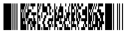</p>

[How to get *BarCodeInstance*](/barcode/javascript-cpp/get-barcode-module-instance/)
```javascript
// Generate a Pdf417 barcode
var gen = new BarCodeInstance.BarcodeGenerator("Pdf417", "Åspóse.Barcóde©");
gen.Parameters.Barcode.XDimension = "2px";
gen.Parameters.Barcode.Pdf417.Columns = 3;
document.getElementById("img").src = gen.GenerateBarCodeImage(); // Display barcode image

gen.delete();

```
### **Compact PDF417**
<a name="compactpdf417"></a>

*Compact PDF417* shares similarities with *Basic PDF417* and *Macro PDF417*, but it differs by removing the right-side metadata column and stop pattern to save space, making it suitable for smaller barcodes. Due to the removal of the metainformation redundancy, recognition of low-quality *Compact PDF417* barcodes may be more challenging. To enable *Compact PDF417* generation in ***Aspose.BarCode for JavaScript via C++***, set the [*Pdf417Truncate*](https://reference.aspose.com/barcode/javascript-cpp/aspose.barcode.generation/pdf417parameters/properties/pdf417truncate) property of the [*Pdf417Parameters*](https://reference.aspose.com/barcode/javascript-cpp/aspose.barcode.generation/pdf417parameters) class.

<p align="center">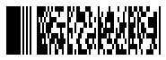</p>

[How to get *BarCodeInstance*](/barcode/javascript-cpp/get-barcode-module-instance/)
```javascript
// Generate a compact Pdf417 barcode
var gen = new BarCodeInstance.BarcodeGenerator("Pdf417", "Åspóse.Barcóde©");
gen.Parameters.Barcode.XDimension = "2px";
gen.Parameters.Barcode.Pdf417.Columns = 3;
gen.Parameters.Barcode.Pdf417.Pdf417Truncate = true; // Set to truncated (compact) mode
document.getElementById("img").src = gen.GenerateBarCodeImage(); // Display barcode image

gen.delete();

```

## **Micro PDF417 and GS1 Micro PDF417**
<a name="micropdf417"></a>

*Micro PDF417* can encode from 1 to 4 columns and 4 to 44 rows, with the exact number of rows dependent on the columns used and predefined combinations of rows, columns, and error correction codewords. Each barcode typically includes 2-3 columns of metadata to help locate the barcode within an image. *Micro PDF417* is mainly used for high-quality documents due to its recognition challenges. It supports both linked and non-linked modes, which can be used for encoding GS1 data, with a subset called *GS1 Micro PDF417* for specialized GS1 data encoding.


<p align="center"></p>

[How to get *BarCodeInstance*](/barcode/javascript-cpp/get-barcode-module-instance/)
```javascript
// Generate a Micro Pdf417 barcode
var gen = new BarCodeInstance.BarcodeGenerator("MicroPdf417", "Åspóse.Barcóde©");
gen.Parameters.Barcode.XDimension = "2px";
gen.Parameters.Barcode.Pdf417.Columns = 4;
document.getElementById("img").src = gen.GenerateBarCodeImage(); // Display barcode image

gen.delete();

```

## **Barcode Layout Settings**

The *PDF417* barcode family consists of data rows arranged into columns. *PDF417* and *Micro PDF417* differ in the number of rows and columns they support. Both symbology types also include additional columns for metadata that define row parameters, such as the row number and total column count. In ***Aspose.BarCode for JavaScript via C++***, the number of rows and columns in *PDF417* barcodes can be set using the [*Rows*](https://reference.aspose.com/barcode/javascript-cpp/aspose.barcode.generation/pdf417parameters/properties/rows) and [*Columns*](https://reference.aspose.com/barcode/javascript-cpp/aspose.barcode.generation/pdf417parameters/properties/columns) properties of the [*Pdf417Parameters*](https://reference.aspose.com/barcode/javascript-cpp/aspose.barcode.generation/pdf417parameters) class.

### **Pdf417 Layout Settings**
*PDF417* barcodes, including Basic PDF417, Macro PDF417, and Compact PDF417, allow for setting between 1 to 30 columns and 3 to 90 rows in various combinations. Examples of different layout settings for *PDF417* barcodes are shown below.

The *PDF417* barcode images below were generated using different layout settings.

|Layout Settings|2 Columns|6 Rows|9 Rows and 4 Columns|
| :-: | :-: | :-: | :-: |
| |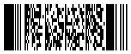||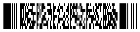|

[How to get *BarCodeInstance*](/barcode/javascript-cpp/get-barcode-module-instance/)
```javascript
// Generate a Pdf417 barcode with 2 columns
var gen = new BarCodeInstance.BarcodeGenerator("Pdf417", "Åspóse.Barcóde©");
gen.Parameters.Barcode.XDimension = "2px";
gen.Parameters.Barcode.Pdf417.Columns = 2;
document.getElementById("img").src = gen.GenerateBarCodeImage(); // Display barcode image
gen.delete();

// Generate a Pdf417 barcode with 6 rows
var gen = new BarCodeInstance.BarcodeGenerator("Pdf417", "Åspóse.Barcóde©");
gen.Parameters.Barcode.XDimension = "2px";
gen.Parameters.Barcode.Pdf417.Columns = 0;
gen.Parameters.Barcode.Pdf417.Rows = 6;
document.getElementById("img").src = gen.GenerateBarCodeImage(); // Display barcode image
gen.delete();

// Generate a Pdf417 barcode with 4 columns and 9 rows
var gen = new BarCodeInstance.BarcodeGenerator("Pdf417", "Åspóse.Barcóde©");
gen.Parameters.Barcode.XDimension = "2px";
gen.Parameters.Barcode.Pdf417.Columns = 4;
gen.Parameters.Barcode.Pdf417.Rows = 9;
document.getElementById("img").src = gen.GenerateBarCodeImage(); // Display barcode image
gen.delete();

```

### **Micro PDF417 Layout Settings**
*Micro PDF417* and its variation *GS1 Micro PDF417* barcodes can have 1 to 4 columns and 4 to 44 rows. Only specific combinations of rows and columns, as defined by the standard, are allowed, as detailed in the table below. If the requested number of rows and columns exceeds the barcode type's capacity, an exception will be thrown.

|<p align="center">**Data Columns**</p>|<p align="center">**Allowed Rows**</p>|<p align="center">**Data Columns**</p>|<p align="center">**Allowed Rows**</p>|
|---|---|---|---|
| 1 column | 11, 14, 17, 20, 24, 28 rows | 3 columns | 6, 8, 10, 12, 15, 20, 26, 32, 38, 44 rows |
| 2 columns | 8, 11, 14, 17, 20, 23, 26 rows | 4 columns | 4, 6, 8, 10, 12, 15, 20, 26, 32, 38, 44 rows |

*Micro PDF417* barcode images below were generated using different layout settings.

|Layout Settings|2 Columns|6 Rows|8 Rows and 4 Columns|
| :-: | :-: | :-: | :-: |
| |||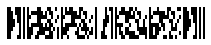|

[How to get *BarCodeInstance*](/barcode/javascript-cpp/get-barcode-module-instance/)
```javascript
// Generate a MicroPdf417 barcode with 2 columns
var gen = new BarCodeInstance.BarcodeGenerator("MicroPdf417", "ASPOSE");
gen.Parameters.Barcode.XDimension = "2px";
gen.Parameters.Barcode.Pdf417.Columns = 2;
document.getElementById("img").src = gen.GenerateBarCodeImage(); // Display barcode image
gen.delete();

// Generate a MicroPdf417 barcode with 6 rows
var gen = new BarCodeInstance.BarcodeGenerator("MicroPdf417", "ASPOSE");
gen.Parameters.Barcode.Pdf417.Columns = 0;
gen.Parameters.Barcode.Pdf417.Rows = 6;
document.getElementById("img").src = gen.GenerateBarCodeImage(); // Display barcode image
gen.delete();

// Generate a MicroPdf417 barcode with 4 columns and 8 rows
var gen = new BarCodeInstance.BarcodeGenerator("MicroPdf417", "ASPOSE");
gen.Parameters.Barcode.Pdf417.Columns = 4;
gen.Parameters.Barcode.Pdf417.Rows = 8;
document.getElementById("img").src = gen.GenerateBarCodeImage(); // Display barcode image
gen.delete();

```
## **Aspect Ratio Settings**
*Aspect Ratio* is the ratio between the width and height of a barcode cell. In ***Aspose.BarCode for JavaScript via C++***, you can customize the barcode proportions using the X and Y coordinates by setting the [*AspectRatio*](https://reference.aspose.com/barcode/javascript-cpp/aspose.barcode.generation/pdf417parameters/properties/aspectratio) property of the [*Pdf417Parameters*](https://reference.aspose.com/barcode/javascript-cpp/aspose.barcode.generation/pdf417parameters) class. This property acts as a relative coefficient to the [*XDimension*](https://reference.aspose.com/barcode/javascript-cpp/aspose.barcode.generation/barcodeparameters/properties/xdimension) value. For *PDF417* barcodes, the *AspectRatio* should be set between 3 and 5.

### **Pdf417 Aspect Ratio Settings**
The *PDF417* barcodes shown below were generated using different aspect ratio settings.

|Aspect Ratio|Is Set to 2|Is Set to 5|
| :-: | :-: | :-: |
| ||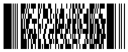|

[How to get *BarCodeInstance*](/barcode/javascript-cpp/get-barcode-module-instance/)
```javascript
// Generate a Pdf417 barcode with an aspect ratio of 2
var gen = new BarCodeInstance.BarcodeGenerator("Pdf417", "Åspóse.Barcóde©");
gen.Parameters.Barcode.XDimension = "2px";
gen.Parameters.Barcode.Pdf417.Columns = 3;
gen.Parameters.Barcode.Pdf417.AspectRatio = 2;
document.getElementById("img").src = gen.GenerateBarCodeImage(); // Display barcode image
gen.delete();

// Generate a Pdf417 barcode with an aspect ratio of 5
var gen = new BarCodeInstance.BarcodeGenerator("Pdf417", "Åspóse.Barcóde©");
gen.Parameters.Barcode.XDimension = "2px";
gen.Parameters.Barcode.Pdf417.Columns = 3;
gen.Parameters.Barcode.Pdf417.AspectRatio = 5;
document.getElementById("img").src = gen.GenerateBarCodeImage(); // Display barcode image
gen.delete();

```

### **Micro PDF417 Aspect Ratio Settings**
* Micro PDF417* barcodes demonstrated below have been created using different aspect ratio settings.  

|Aspect Ratio|Is Set to 2|Is Set to 5|
| :-: | :-: | :-: |
| ||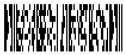|

[How to get *BarCodeInstance*](/barcode/javascript-cpp/get-barcode-module-instance/)
```javascript
// Generate a MicroPdf417 barcode with an aspect ratio of 2
var gen = new BarCodeInstance.BarcodeGenerator("MicroPdf417", "Åspóse.Barcóde©");
gen.Parameters.Barcode.XDimension = "2px";
gen.Parameters.Barcode.Pdf417.Columns = 4;
gen.Parameters.Barcode.Pdf417.AspectRatio = 2;
document.getElementById("img").src = gen.GenerateBarCodeImage(); // Display barcode image
gen.delete();

// Generate a MicroPdf417 barcode with an aspect ratio of 5
var gen = new BarCodeInstance.BarcodeGenerator("MicroPdf417", "Åspóse.Barcóde©");
gen.Parameters.Barcode.XDimension = "2px";
gen.Parameters.Barcode.Pdf417.Columns = 4;
gen.Parameters.Barcode.Pdf417.AspectRatio = 5;
document.getElementById("img").src = gen.GenerateBarCodeImage(); // Display barcode image
gen.delete();

```

## **PDF417 Encoding Modes**

The barcode library supports various encoding modes for generating *Pdf417* barcodes. You can select the desired mode by setting the [*Pdf417EncodeMode*](https://reference.aspose.com/barcode/javascript-cpp/aspose.barcode.generation/pdf417parameters/pdf417encodemode) property of the [*Pdf417Parameters*](https://reference.aspose.com/barcode/javascript-cpp/aspose.barcode.generation/pdf417parameters) class. The possible values for this property are defined in the [*Pdf417EncodeMode*](https://reference.aspose.com/barcode/javascript-cpp/aspose.barcode.generation/pdf417encodemode/) enumeration. These modes are outlined below:

- *Auto*: In Auto mode, the CodeText is encoded for maximum data compactness. This is the default setting.
- *Binary*: The *Binary* mode encodes binary data with maximum data compactness.
- *ECI*: The Extended Channel Interpretation (ECI) mode ensures that the encoded data is interpreted according to the ECI protocol as specified in the AIM ECI Specifications.
- *Extended*: The *Extended* mode provides flexible encoding options, allowing manual specification of the encoding for part of the CodeText.

### **Encoding Mode *Auto***
In Auto mode, the CodeText is encoded with the highest level of data compactness. Unicode characters are re-encoded according to the encoding set in the [*Pdf417ECIEncoding*](https://reference.aspose.com/barcode/javascript-cpp/aspose.barcode.generation/pdf417parameters/pdf417eciencoding/) property, which inserts an ECI identifier. If a character that is not supported by the selected ECI encoding is encountered, an exception is raised. By default, the [*Pdf417ECIEncoding*](https://reference.aspose.com/barcode/javascript-cpp/aspose.barcode.generation/pdf417parameters/pdf417eciencoding/) property is set to [*ECIEncodings*](https://reference.aspose.com/barcode/javascript-cpp/aspose.barcode.generation/eciencodings/).UTF8 (ECI ID: "\000026"). The code snippet below illustrates how to generate a *Pdf417* barcode in *Auto* mode.

<p align="center">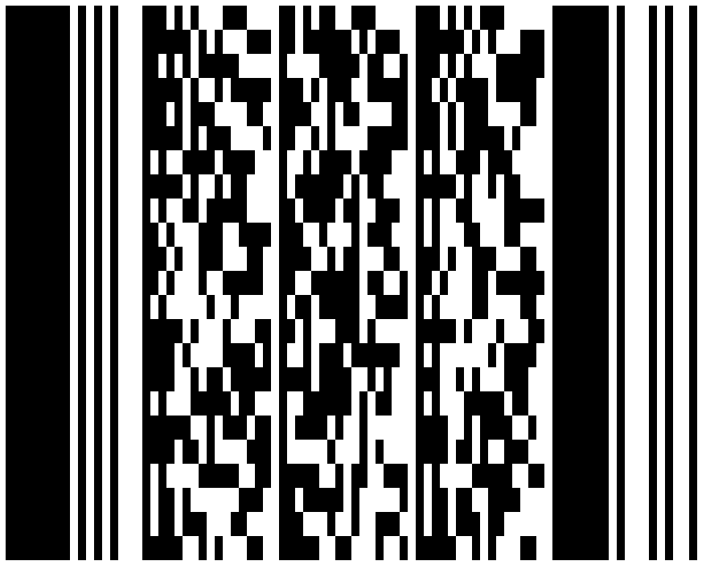</p>

[How to get *BarCodeInstance*](/barcode/javascript-cpp/get-barcode-module-instance/)
```javascript
// Generate a Pdf417 barcode with automatic encoding mode
var gen = new BarCodeInstance.BarcodeGenerator("Pdf417", "犬Right狗");
document.getElementById("img").src = gen.GenerateBarCodeImage(); // Display barcode image

gen.delete();


```

### **Encoding Mode *Binary***
The *Binary* mode serves to encode byte streams. If a Unicode character is encountered, an exception is thrown. The code sample below explains how to work with this encoding mode.

<p align="center">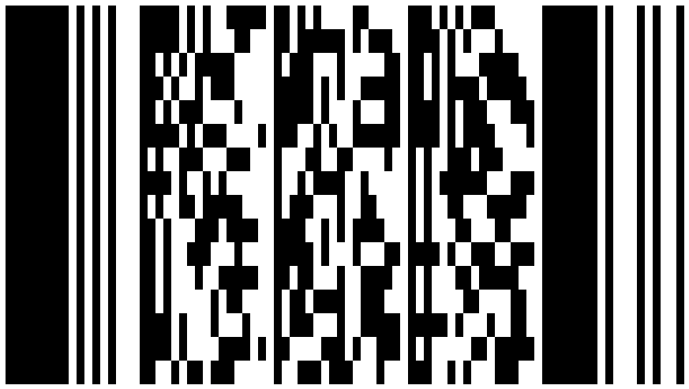</p>  
  
[How to get *BarCodeInstance*](/barcode/javascript-cpp/get-barcode-module-instance/)
```javascript
// Generate a Pdf417 barcode with binary encoding mode
var gen = new BarCodeInstance.BarcodeGenerator("Pdf417");
var encodedArr = new Uint8Array([0xFF, 0xFE, 0xFD, 0xFC, 0xFB, 0xFA, 0xF9]);
var b64encoded = btoa(String.fromCharCode.apply(null, encodedArr));
gen.SetCodeTextBase64(b64encoded);
gen.Parameters.Barcode.Pdf417.Pdf417EncodeMode = BarCodeInstance.Pdf417EncodeMode.Binary;
document.getElementById("img").src = gen.GenerateBarCodeImage(); // Display barcode image

gen.delete();

```

### **Encoding Mode *ECI***
The Extended Channel Interpretation (ECI) mode ensures that the encoded data is interpreted according to the ECI protocol defined by the AIM ECI Specifications. When ECI mode is selected, the entire CodeText is re-encoded using the encoding specified in the [*Pdf417ECIEncoding*](https://reference.aspose.com/barcode/javascript-cpp/aspose.barcode.generation/pdf417parameters/pdf417eciencoding/) property, and an ECI identifier is added. If a character unsupported by the chosen ECI encoding is encountered, an exception will be raised. By default, the [*Pdf417ECIEncoding*](https://reference.aspose.com/barcode/javascript-cpp/aspose.barcode.generation/pdf417parameters/pdf417eciencoding/) property is set to [*ECIEncodings*](https://reference.aspose.com/barcode/javascript-cpp/aspose.barcode.generation/eciencodings/).UTF8 (ECI ID: "\000026").

The code sample below shows how to implement the *ECI* mode.


<p align="center">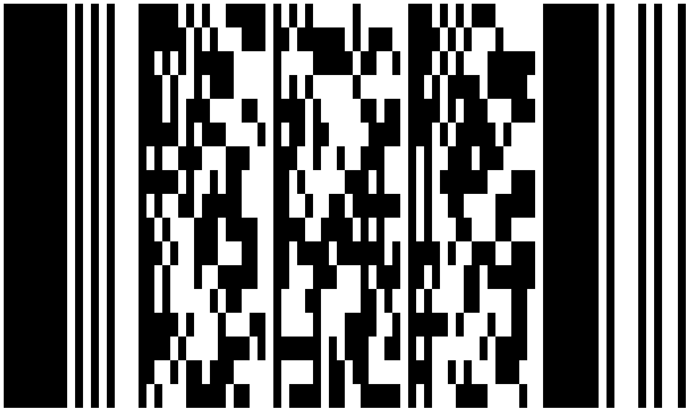</p>

[How to get *BarCodeInstance*](/barcode/javascript-cpp/get-barcode-module-instance/)
```javascript
// ECI mode, Latin/Greek alphabet encoding. ECI ID:"\000009"
var str = "ΑΒΓΔΕ";

var gen = new BarCodeInstance.BarcodeGenerator("Pdf417", str);
gen.Parameters.Barcode.Pdf417.Pdf417EncodeMode = BarCodeInstance.Pdf417EncodeMode.ECI;
gen.Parameters.Barcode.Pdf417.Pdf417ECIEncoding = BarCodeInstance.ECIEncodings.ISO_8859_7;
document.getElementById("img").src = gen.GenerateBarCodeImage(); // Display barcode image

gen.delete();

```
## **PDF417 Error Correction Level Settings**
The *PDF417* barcode family applies the [Reed-Solomon error correction](https://en.wikipedia.org/wiki/Reed%E2%80%93Solomon_error_correction) mechanism to perform data recovery and integrity check. In *Micro PDF417* barcodes, the amount of redundant recovery information is defined automatically. To set the error correction level for *Basic PDF417*, *Macro PDF417*, and *Compact PDF417* in ***Aspose.BarCode for JavaScript via C++***, developers can use the [*Pdf417ErrorLevel*](https://reference.aspose.com/barcode/javascript-cpp/aspose.barcode.generation/pdf417parameters/properties/pdf417errorlevel) property of class [*Pdf417Parameters*](https://reference.aspose.com/barcode/javascript-cpp/aspose.barcode.generation/pdf417parameters). Adding each two errors correction (EC) codewords allows recovering one unknown error or two known character removals. The higher the EC level, the larger the number of EC codewords in a barcode and, accordingly, the better the result of data recovery for severely damaged barcode images. The maximal *Level8* implies that from 255 to 511 errors can be corrected; at the same time, the barcode encoding capacity will be reduced by 512 bytes. All supported EC levels are listed below.    

|EC Level|Number of EC Codewords|Error Correction Level|Number of EC Codewords|
| :-: | :-: | :-: | :-: |
|**Level 0**|2 EC codewords|**Level 5**|64 EC codewords|
|**Level 1**|4 EC codewords|**Level 6**|128 EC codewords|
|**Level 2**|8 EC codewords|**Level 7**|256 EC codewords|
|**Level 3**|16 EC codewords|**Level 8**|512 EC codewords|
|**Level 4**|32 EC codewords| |
  
*PDF417* barcode images shown below have been created using different error correction level settings.  
  
|Error Correction Level|Is Set to 2|Is Set to 5|
| :-: | :-: | :-: |
| ||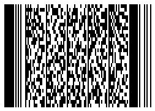|

  
[How to get *BarCodeInstance*](/barcode/javascript-cpp/get-barcode-module-instance/)
```javascript
// Set error level to 2
var gen = new BarCodeInstance.BarcodeGenerator("Pdf417", "Åspóse.Barcóde©");
gen.Parameters.Barcode.XDimension = "2px";
gen.Parameters.Barcode.Pdf417.Columns = 3;
gen.Parameters.Barcode.Pdf417.Pdf417ErrorLevel = BarCodeInstance.Pdf417ErrorLevel.Level2;
document.getElementById("img").src = gen.GenerateBarCodeImage(); // Display barcode with error level 2
gen.delete();

// Set error level to 5
var gen = new BarCodeInstance.BarcodeGenerator("Pdf417", "Åspóse.Barcóde©");
gen.Parameters.Barcode.XDimension = "2px";
gen.Parameters.Barcode.Pdf417.Columns = 3;
gen.Parameters.Barcode.Pdf417.Pdf417ErrorLevel = BarCodeInstance.Pdf417ErrorLevel.Level5;
document.getElementById("img").src = gen.GenerateBarCodeImage(); // Display barcode with error level 5
gen.delete();

```
 
## **PDF417 Metadata Encoding**

The *Macro PDF417* and *Micro PDF417* standards support encoding additional metadata about data origin and identification. This metadata is stored within the same data blocks as the primary information. Metadata is categorized into main and optional fields, as detailed below. Due to the limited capacity of *Micro PDF417*, it typically supports only the main metadata fields.

### **Main Metadata Settings**

The main metadata fields define essential information required for encoding additional fields:

| Metadata Field Name | Description |
|----------------------|-------------|
| **Pdf417MacroFileID** | A manually assigned unique identifier for a barcode series or PDF417 file. |
| **Pdf417MacroSegmentID** | Specifies the current segment number, starting at 0. Often paired with the optional **Pdf417MacroSegmentsCount** field, which indicates the total number of barcodes in the series. |

The code snippet below demonstrates how to configure main metadata for *Macro PDF417* barcodes.


[How to get *BarCodeInstance*](/barcode/javascript-cpp/get-barcode-module-instance/)
```javascript
// Generate MacroPDF417 barcode
var gen = new BarCodeInstance.BarcodeGenerator("MacroPdf417", "Åspóse.Barcóde©");
gen.Parameters.Barcode.XDimension = "2px";
gen.Parameters.Barcode.Pdf417.Columns = 4;

// Set metadata
gen.Parameters.Barcode.Pdf417.Pdf417MacroFileID = 12345678;
gen.Parameters.Barcode.Pdf417.Pdf417MacroSegmentID = 12;

// Display barcode
document.getElementById("img").src = gen.GenerateBarCodeImage(); 

// Try to recognize it
var reader = new BarCodeInstance.BarCodeReader(gen.GenerateBarCodeImage(), "MacroPdf417");
reader.ReadBarCodes();
for (var i = 0; i < reader.FoundCount; i++) {
    const result = reader.FoundBarCodes(i);
    console.log("---MacroPdf417Main---");
    console.log(`Codetext: ${result.CodeText}`);
    console.log(`Pdf417MacroFileID: ${result.Extended.Pdf417.MacroPdf417FileID}`);
    console.log(`Pdf417MacroSegmentID: ${result.Extended.Pdf417.MacroPdf417SegmentID}`);
}

gen.delete();
reader.delete();

```

<p align="center"></p>

### **Optional Metadata Settings**

Optional metadata fields allow for additional information to be encoded in *Macro PDF417* barcodes. These fields are described below:

| Optional Metadata Field | Description |
|---|---|
| [*Pdf417MacroSegmentsCount*](https://reference.aspose.com/barcode/javascript-cpp/aspose.barcode.generation/pdf417parameters/properties/pdf417macrosegmentscount) | Specifies the total number of barcodes in a series. |
| [*Pdf417MacroFileName*](https://reference.aspose.com/barcode/javascript-cpp/aspose.barcode.generation/pdf417parameters/properties/pdf417macrofilename) | Indicates the name of the file. |
| [*Pdf417MacroChecksum*](https://reference.aspose.com/barcode/javascript-cpp/aspose.barcode.generation/pdf417parameters/properties/pdf417macrochecksum) | Represents the file checksum calculated using the CCITT-16 polynomial. |
| [*Pdf417MacroFileSize*](https://reference.aspose.com/barcode/javascript-cpp/aspose.barcode.generation/pdf417parameters/properties/pdf417macrofilesize) | Defines the total file size in bytes for a series. |
| [*Pdf417MacroTimeStamp*](https://reference.aspose.com/barcode/javascript-cpp/aspose.barcode.generation/pdf417parameters/properties/pdf417macrotimestamp) | Records the file creation or sending time. |
| [*Pdf417MacroAddressee*](https://reference.aspose.com/barcode/javascript-cpp/aspose.barcode.generation/pdf417parameters/properties/pdf417macroaddressee) | Specifies the address of the file recipient. |
| [*Pdf417MacroSender*](https://reference.aspose.com/barcode/javascript-cpp/aspose.barcode.generation/pdf417parameters/properties/pdf417macrosender) | Denotes the name of the file sender. |
| [*Pdf417MacroTerminator*](https://reference.aspose.com/barcode/javascript-cpp/aspose.barcode.generation/pdf417parameters/pdf417macroterminator/) | Marks the last segment in a *Macro PDF417* barcode (codeword 922). |

Below is an example of how to configure optional metadata for *Macro PDF417* barcodes.

  
[How to get *BarCodeInstance*](/barcode/javascript-cpp/get-barcode-module-instance/)
```javascript
// Generate MacroPDF417 barcode
var gen = new BarCodeInstance.BarcodeGenerator("MacroPdf417", "Åspóse.Barcóde©");
gen.Parameters.Barcode.XDimension = "2px";
gen.Parameters.Barcode.Pdf417.Columns = 4;

// Set metadata
gen.Parameters.Barcode.Pdf417.Pdf417MacroFileID = 12345678;
gen.Parameters.Barcode.Pdf417.Pdf417MacroSegmentID = 12;
gen.Parameters.Barcode.Pdf417.Pdf417MacroSegmentsCount = 20;
gen.Parameters.Barcode.Pdf417.Pdf417MacroFileName = "file01";
gen.Parameters.Barcode.Pdf417.Pdf417MacroChecksum = 1234; // Example checksum
gen.Parameters.Barcode.Pdf417.Pdf417MacroFileSize = 400000;
gen.Parameters.Barcode.Pdf417.Pdf417MacroTimeStamp = "1970-10-20T15:20:35.123Z"
gen.Parameters.Barcode.Pdf417.Pdf417MacroAddressee = "street";
gen.Parameters.Barcode.Pdf417.Pdf417MacroSender = "aspose";
gen.Parameters.Barcode.Pdf417.Pdf417MacroTerminator = BarCodeInstance.Pdf417MacroTerminator.Set;

// Display the barcode
document.getElementById("img").src = gen.GenerateBarCodeImage();

// Try to recognize the barcode
var reader = new BarCodeInstance.BarCodeReader(gen.GenerateBarCodeImage(), "MacroPdf417");
reader.ReadBarCodes();
for (var i = 0; i < reader.FoundCount; i++) {
    const result = reader.FoundBarCodes(i);
    console.log("---MacroPdf417Optional---");
    console.log(`Codetext: ${result.CodeText}`);
    console.log(`Pdf417MacroFileID: ${result.Extended.Pdf417.MacroPdf417FileID}`);
    console.log(`Pdf417MacroSegmentID: ${result.Extended.Pdf417.MacroPdf417SegmentID}`);
    console.log(`Pdf417MacroSegmentsCount: ${result.Extended.Pdf417.MacroPdf417SegmentsCount}`);
    console.log(`Pdf417MacroFileName: ${result.Extended.Pdf417.MacroPdf417FileName}`);
    console.log(`Pdf417MacroChecksum: ${result.Extended.Pdf417.MacroPdf417Checksum}`);
    console.log(`Pdf417MacroFileSize: ${result.Extended.Pdf417.MacroPdf417FileSize}`);
    console.log(`Pdf417MacroTimeStamp: ${result.Extended.Pdf417.MacroPdf417TimeStamp}`);
    console.log(`Pdf417MacroAddressee: ${result.Extended.Pdf417.MacroPdf417Addressee}`);
    console.log(`Pdf417MacroSender: ${result.Extended.Pdf417.MacroPdf417Sender}`);
    console.log(`Pdf417MacroTerminator: ${result.Extended.Pdf417.MacroPdf417Terminator}`);
}

gen.delete();
reader.delete();

```
  
<p align="center">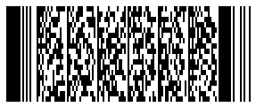</p>
  
### **Unicode Metadata Settings**

Optional metadata fields can be transmitted in Unicode encoding by configuring the [*Pdf417MacroECIEncoding*](https://reference.aspose.com/barcode/javascript-cpp/aspose.barcode.generation/pdf417parameters/properties/pdf417macroeciencoding) property. This property converts the metadata and appends the appropriate encoding identifier for transmission. 

The following code sample demonstrates how to set this up for *Macro PDF417* barcodes.

[How to get *BarCodeInstance*](/barcode/javascript-cpp/get-barcode-module-instance/)
```javascript
// Generate MacroPDF417 barcode
var gen = new BarCodeInstance.BarcodeGenerator("MacroPdf417", "Åspóse.Barcóde©");
gen.Parameters.Barcode.XDimension = "2px";
gen.Parameters.Barcode.Pdf417.Columns = 4;

// Set metadata
gen.Parameters.Barcode.Pdf417.Pdf417MacroFileID = 12345678;
gen.Parameters.Barcode.Pdf417.Pdf417MacroSegmentID = 12;
gen.Parameters.Barcode.Pdf417.Pdf417MacroFileName = "伍01";
gen.Parameters.Barcode.Pdf417.Pdf417MacroAddressee = "街";
gen.Parameters.Barcode.Pdf417.Pdf417MacroSender = "компания";

// Set ECI encoding to UTF-8
gen.Parameters.Barcode.Pdf417.Pdf417MacroECIEncoding = BarCodeInstance.ECIEncodings.UTF8;

// Display the barcode
document.getElementById("img").src = gen.GenerateBarCodeImage();

// Try to recognize the barcode
var reader = new BarCodeInstance.BarCodeReader(gen.GenerateBarCodeImage(), "MacroPdf417");
reader.ReadBarCodes();
for (var i = 0; i < reader.FoundCount; i++) {
    const result = reader.FoundBarCodes(i);
    console.log("---MacroPdf417ECIEncoding---");
    console.log(`Codetext: ${result.CodeText}`);
    console.log(`Pdf417MacroFileID: ${result.Extended.Pdf417.MacroPdf417FileID}`);
    console.log(`Pdf417MacroSegmentID: ${result.Extended.Pdf417.MacroPdf417SegmentID}`);
    console.log(`Pdf417MacroFileName: ${result.Extended.Pdf417.MacroPdf417FileName}`);
    console.log(`Pdf417MacroAddressee: ${result.Extended.Pdf417.MacroPdf417Addressee}`);
    console.log(`Pdf417MacroSender: ${result.Extended.Pdf417.MacroPdf417Sender}`);
}

gen.delete();
reader.delete();

```
  
<p align="center">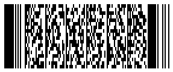</p>


## **GS1 Micro PDF417 Encoding Modes**
<a name="gs1micropdf417"></a>

*Micro PDF417* barcodes have limited data capacity. To address this, the *Micro PDF417* standard supports encoding some [*GS1 Application Identifiers*](https://www.gs1.org/standards/barcodes/application-identifiers) in a compact format using special Codewords. The [*EncodeTypes.GS1MicroPdf417*](https://reference.aspose.com/barcode/javascript-cpp/aspose.barcode.generation/encodetypes/gs1micropdf417/) barcode type is used for this purpose. These encoding modes are divided into standard and "Linked" modes. In Linked modes, a linear symbol printed below the *Micro PDF417* barcode is "linked" to the barcode's data.

### **UCC/EAN-128 Modes**
Codewords *903*, *904*, and *905* in *GS1 Micro PDF417* barcodes allow for encoding GS1 CodeText in a short form without a linked state. Codeword *905* can encode GS1 text with the "01" application identifier in the shortest form.

[How to get *BarCodeInstance*](/barcode/javascript-cpp/get-barcode-module-instance/)
```javascript
// Generate GS1 MicroPDF417 barcode
var gen = new BarCodeInstance.BarcodeGenerator("GS1MicroPdf417", "(01)12345678901231(240)ABCD123456789012345");
gen.Parameters.Barcode.XDimension = "2px";
gen.Parameters.Barcode.Pdf417.Columns = 4;

// Save barcode image
document.getElementById("img").src = gen.GenerateBarCodeImage();

// Try to recognize the barcode
var reader = new BarCodeInstance.BarCodeReader(gen.GenerateBarCodeImage(), "GS1MicroPdf417");
reader.ReadBarCodes();
for (var i = 0; i < reader.FoundCount; i++) {
    const result = reader.FoundBarCodes(i);
    console.log(`CodeText: ${result.CodeText}`);
    console.log(`Pdf417_IsLinked: ${result.Extended.Pdf417.IsLinked}`);
}

gen.delete();
reader.delete();

```

<p align="center">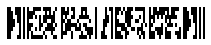</p>

### **Linked UCC/EAN-128 modes**
Codewords *906*, *907*, *912*, *914*, *915* of *GS1 Micro PDF417* barcode allow in short form encode any GS1 CodeText and implement "Linked" state to the barcode. To enable these modes you need to set [*IsLinked*](https://reference.aspose.com/barcode/javascript-cpp/aspose.barcode.generation/pdf417parameters/islinked/) property.

#### **Linked UCC/EAN-128 906 and 907 modes**
Codewords *906* and *907* allow to encode any GS1 Application Identifiers in short mode. You can see this in the following example.

[How to get *BarCodeInstance*](/barcode/javascript-cpp/get-barcode-module-instance/)
```javascript
// Generate GS1 MicroPDF417 barcode with linked mode
var gen = new BarCodeInstance.BarcodeGenerator("GS1MicroPdf417", "(01)12345678901231(240)ABCD123456789012345");
gen.Parameters.Barcode.XDimension = "2px";
gen.Parameters.Barcode.Pdf417.Columns = 4;
gen.Parameters.Barcode.Pdf417.IsLinked = true;

// Save barcode image
document.getElementById("img").src = gen.GenerateBarCodeImage();

// Try to recognize the barcode
var reader = new BarCodeInstance.BarCodeReader(gen.GenerateBarCodeImage(), "GS1MicroPdf417");
reader.ReadBarCodes();
for (var i = 0; i < reader.FoundCount; i++) {
    const result = reader.FoundBarCodes(i);
    console.log(`CodeText: ${result.CodeText}`);
    console.log(`Pdf417_IsLinked: ${result.Extended.Pdf417.IsLinked}`);
}

gen.delete();
reader.delete();

```

<p align="center">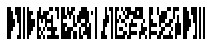</p>

#### **Linked UCC/EAN-128 912 mode**
Codeword *912* allows to encode GS1 Application Identifiers “17”, “15”, “13”, “11”, which can be followed by “10” and “21” GS1 AI or without any. The provided examples demonstrate this.

|GS1 Application Identifiers| “17” And “10” | “15” And “10” | “13” And “21” | “11” And “21” | “17” |
| :-: | :-: | :-: | :-: | :-: | :-: |
| ||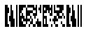|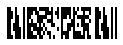|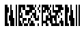|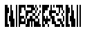|

[How to get *BarCodeInstance*](/barcode/javascript-cpp/get-barcode-module-instance/)
```javascript
// Generate a GS1 Micro Pdf417 barcode for (17)991231(10)ABCD
var gen = new BarCodeInstance.BarcodeGenerator("GS1MicroPdf417", "(17)991231(10)ABCD");
gen.Parameters.Barcode.XDimension = "2px";
gen.Parameters.Barcode.Pdf417.Columns = 2;
gen.Parameters.Barcode.Pdf417.IsLinked = true;
document.getElementById("img17_10").src = gen.GenerateBarCodeImage(); // Display barcode image

// Generate a GS1 Micro Pdf417 barcode for (15)991231(10)ABCD
gen.CodeText = "(15)991231(10)ABCD";
document.getElementById("img15").src = gen.GenerateBarCodeImage(); // Display barcode image

// Generate a GS1 Micro Pdf417 barcode for (13)991231(21)ABCD
gen.CodeText = "(13)991231(21)ABCD";
document.getElementById("img13").src = gen.GenerateBarCodeImage(); // Display barcode image

// Generate a GS1 Micro Pdf417 barcode for (11)991231(21)ABCD
gen.CodeText = "(11)991231(21)ABCD";
document.getElementById("img11").src = gen.GenerateBarCodeImage(); // Display barcode image

// Generate a GS1 Micro Pdf417 barcode for (17)991231 (without second GS1 AI)
gen.CodeText = "(17)991231";
document.getElementById("img17").src = gen.GenerateBarCodeImage(); // Display barcode image

gen.delete();

```

#### **Linked UCC/EAN-128 914 and 915 modes**
Codeword *914* allows in short form encoding “10” GS1 AI as the first identifier, Codeword 915 in short form encodes CodeText with “21” GS1 AI.

|GS1 Application Identifiers| “10” | “21” |
| :-: | :-: | :-: |
| |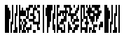|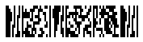|

[How to get *BarCodeInstance*](/barcode/javascript-cpp/get-barcode-module-instance/)
```javascript
// Generate a GS1 Micro Pdf417 barcode for (10)ABCD12345(240)ABCD
var gen = new BarCodeInstance.BarcodeGenerator("GS1MicroPdf417", "(10)ABCD12345(240)ABCD");
gen.Parameters.Barcode.XDimension = "2px";
gen.Parameters.Barcode.Pdf417.Columns = 3;
gen.Parameters.Barcode.Pdf417.IsLinked = true;
document.getElementById("img10").src = gen.GenerateBarCodeImage(); // Display barcode image

// Generate a GS1 Micro Pdf417 barcode for (21)ABCD12345(240)ABCD
gen.CodeText = "(21)ABCD12345(240)ABCD";
document.getElementById("img21").src = gen.GenerateBarCodeImage(); // Display barcode image

gen.delete();

```


  
## **PDF417 and Micro PDF417 Special Parameters**
The *PDF417* barcode family supports special control parameters in ***Aspose.BarCode for JavaScript via C++***, such as hardware reader initialization and *Code 128* emulation. Code examples for working with these settings are provided below.

### **Hardware Reader Initialization**
To encode the special flag "921," which indicates that the barcode data is intended for hardware reader initialization, developers can use the [*IsReaderInitialization*](https://reference.aspose.com/barcode/javascript-cpp/aspose.barcode.generation/pdf417parameters/properties/isreaderinitialization) property. The following code sample shows how to set this property.

[How to get *BarCodeInstance*](/barcode/javascript-cpp/get-barcode-module-instance/)
```javascript
// Generate a Pdf417 barcode with reader initialization flag set
var gen = new BarCodeInstance.BarcodeGenerator("Pdf417", "Aspose");
gen.Parameters.Barcode.XDimension = "2px";
gen.Parameters.Barcode.Pdf417.Columns = 3;
gen.Parameters.Barcode.Pdf417.IsReaderInitialization = true;
document.getElementById("img").src = gen.GenerateBarCodeImage(); // Display barcode image

// Try to read and recognize the barcode
var reader = new BarCodeInstance.BarCodeReader(gen.GenerateBarCodeImage(), "Pdf417");
reader.ReadBarCodes();
for (var i = 0; i < reader.FoundCount; i++) {
    const result = reader.FoundBarCodes(i);
    console.log("CodeText: " + result.CodeText);
    console.log("IsReaderInitialization: " + result.Extended.Pdf417.IsReaderInitialization);
}

gen.delete();
reader.delete();

```

<p align="center"></p>

### **Linkage Flag to Non EAN.UCC Linear Component**
You can encode special flag “918” indicating that current barcode is associated with linear component in any composite symbology. You can use [*IsLinked*](https://reference.aspose.com/barcode/javascript-cpp/aspose.barcode.generation/pdf417parameters/islinked/) property for this.

[How to get *BarCodeInstance*](/barcode/javascript-cpp/get-barcode-module-instance/)
```javascript
// Generate a Pdf417 barcode with the "IsLinked" flag set for NON EAN.UCC Linked mode 918
var gen = new BarCodeInstance.BarcodeGenerator("Pdf417", "Aspose");
gen.Parameters.Barcode.XDimension = "2px";
gen.Parameters.Barcode.Pdf417.Columns = 3;
gen.Parameters.Barcode.Pdf417.IsLinked = true;
document.getElementById("img").src = gen.GenerateBarCodeImage(); // Display barcode image

// Try to read and recognize the barcode
var reader = new BarCodeInstance.BarCodeReader(gen.GenerateBarCodeImage(), "Pdf417");
reader.ReadBarCodes();
for (var i = 0; i < reader.FoundCount; i++) {
    const result = reader.FoundBarCodes(i);
    console.log("CodeText: " + result.CodeText);
    console.log("IsLinked: " + result.Extended.Pdf417.IsLinked);
}

gen.delete();
reader.delete();

```

<p align="center"></p>

### **Micro PDF417 Code 128 Emulation Mode**
Special flags “908”, “909”, “910”, and “911” can be used to indicate that a *Micro PDF417* barcode is encoded in "Code 128 emulation" mode. This allows it to be decoded as a [*Code 128*](https://reference.aspose.com/barcode/javascript-cpp/aspose.barcode.generation/encodetypes/code128/) barcode instead of a *Micro PDF417* barcode in certain cases. The [*IsCode128Emulation*](https://reference.aspose.com/barcode/javascript-cpp/aspose.barcode.generation/pdf417parameters/iscode128emulation/) property can be used for this purpose. The flags “908” and “909” encode data as FNC1 in the second position, an outdated mode previously used by the AIM Association.

| Code 128 Emulation Codewords | Codeword 908 FNC1 + a-z and A-Z Symbols | Codeword 909 FNC1 + 00-99 Symbols | Codewords 910, 911 Any Code 128 Symbols |
| :-: | :-: | :-: | :-: |
| ||||


[How to get *BarCodeInstance*](/barcode/javascript-cpp/get-barcode-module-instance/)
```javascript
// Encodes MicroPdf417 in Code 128 emulation mode with FNC1 in second position and Application Indicator "a", mode 908.
var gen = new BarCodeInstance.BarcodeGenerator("MicroPdf417", "a\u001d1222322323");
gen.Parameters.Barcode.XDimension = "2px";
gen.Parameters.Barcode.Pdf417.Columns = 4;
gen.Parameters.Barcode.Pdf417.IsCode128Emulation = true;
document.getElementById("img1").src = gen.GenerateBarCodeImage(); // Display barcode image

// Try to recognize it
var reader = new BarCodeInstance.BarCodeReader(gen.GenerateBarCodeImage(), "MicroPdf417");
reader.ReadBarCodes();
for (var i = 0; i < reader.FoundCount; i++) {
    const result = reader.FoundBarCodes(i);
    console.log("CodeText: " + result.CodeText);
    console.log("IsCode128Emulation: " + result.Extended.Pdf417.IsCode128Emulation);
}


// Encodes MicroPdf417 in Code 128 emulation mode with FNC1 in second position and Application Indicator "99", mode 909.
gen.CodeText = "99\u001d1222322323";
document.getElementById("img2").src = gen.GenerateBarCodeImage(); // Display barcode image

// Try to recognize it
reader = new BarCodeInstance.BarCodeReader(gen.GenerateBarCodeImage(), "MicroPdf417");
reader.ReadBarCodes();
for (var i = 0; i < reader.FoundCount; i++) {
    const result = reader.FoundBarCodes(i);
    console.log("CodeText: " + result.CodeText);
    console.log("IsCode128Emulation: " + result.Extended.Pdf417.IsCode128Emulation);
}

// Encodes MicroPdf417 in Code 128 emulation mode, modes 910, 911
gen.CodeText = "123456789012345678";
document.getElementById("img3").src = gen.GenerateBarCodeImage(); // Display barcode image

// Try to recognize it
reader = new BarCodeInstance.BarCodeReader(gen.GenerateBarCodeImage(), "MicroPdf417");
reader.ReadBarCodes();
for (var i = 0; i < reader.FoundCount; i++) {
    const result = reader.FoundBarCodes(i);
    console.log("CodeText: " + result.CodeText);
    console.log("IsCode128Emulation: " + result.Extended.Pdf417.IsCode128Emulation);
}

gen.delete();
reader.delete();

```

### **Micro PDF417 Macro Characters**

In ***Aspose.BarCode for JavaScript via C++***, developers can use macro characters for generating *Micro PDF417* barcodes. The [*MacroCharacters*](https://reference.aspose.com/barcode/javascript-cpp/aspose.barcode.generation/pdf417parameters/macrocharacters/) property is used for this purpose. *Micro PDF417* allows the use of abbreviated industry-specific headers and trailers as a single character. This feature reduces the number of characters needed to encode data using specific structured formats and can be used to meet certain industrial requirements.

| Macro Characters | Macro Character 05 | Macro Character 06 |
| :-: | :-: | :-: |
| |||

[How to get *BarCodeInstance*](/barcode/javascript-cpp/get-barcode-module-instance/)
```javascript
// Encodes MicroPdf417 Codewords 916 Macro strings 05
var gen = new BarCodeInstance.BarcodeGenerator("MicroPdf417", "12345ABC");
gen.Parameters.Barcode.XDimension = "2px";
gen.Parameters.Barcode.Pdf417.Columns = 4;
gen.Parameters.Barcode.Pdf417.MacroCharacters = BarCodeInstance.MacroCharacter.Macro05;
document.getElementById("img1").src = gen.GenerateBarCodeImage(); // Display barcode image

// Try to recognize it
var reader = new BarCodeInstance.BarCodeReader(gen.GenerateBarCodeImage(), "MicroPdf417");
reader.ReadBarCodes();
for (var i = 0; i < reader.FoundCount; i++) {
    const result = reader.FoundBarCodes(i);
    console.log("CodeText: " + result.CodeText);
}

// Encodes MicroPdf417 Codewords 917 Macro strings 06
gen.Parameters.Barcode.Pdf417.MacroCharacters = BarCodeInstance.MacroCharacter.Macro06;
document.getElementById("img2").src = gen.GenerateBarCodeImage(); // Display barcode image

// Try to recognize it
reader = new BarCodeInstance.BarCodeReader(gen.GenerateBarCodeImage(), "MicroPdf417");
reader.ReadBarCodes();
for (var i = 0; i < reader.FoundCount; i++) {
    const result = reader.FoundBarCodes(i);
    console.log("CodeText: " + result.CodeText);
}

gen.delete();
reader.delete();

```
