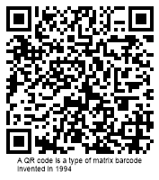

{}[Generate QR Code Online](https://products.aspose.app/barcode/generate/qr): You can test the quality of ***Aspose.BarCode*** generation for QR Codes and get the results online.{}

## **Overview**
The *QR Code* family corresponds to 2D matrix barcodes of square or rectangular shapes. *QR Code* and *Micro QR* Code barcodes require placement on a surface with a square space, while the *Rectangular Micro QR Code (rMQR)* barcode requires placement on a surface with a rectangular space. This group of symbologies has a high data density and allows for the encoding of both byte streams of data and arbitrary information represented as a set of Unicode symbols. In ***Aspose.BarCode for JavaScript via C++***, the data encoding in Unicode is performed using Extended Channel Interpretation (ECI) and supports various encoding modes, among which UTF8 is the most common.

At the minimal error correction level, the *QR Code* symbology can encode up to 7,089 numerical characters (or 4,296 alphanumeric characters) or 2,953 bytes. The *QR Code* standard supports all *QR Code* family features, including Extended Channel Interpretation (ECI), Structured Append Mode, and etc.

The *Micro QR Code* standard allows encoding at most 35 numerical (21 alphanumeric) or 15 bytes. *Micro QR Code* is used to generate barcodes of reasonably small size; at the same time, to enable such a possibility, it does not support Extended Channel Interpretation (ECI), does not support encoding Unicode symbols and does not support Structured Append Mode. Specifically, the M1 version allows encoding only 5 numerical digits, while M2 can encode 10 numerical or 6 alphanumeric symbols. This capacity may be sufficient to encode particular industrial markers.

The *Rectangular Micro QR Code (rMQR)* standard allows for the encoding of a maximum of 361 numerical characters (or 219 alphanumeric characters) or 150 bytes. The *rMQR Code* specifically designed for generating rectangular barcodes that can be applied to surfaces with limited height, such as test tubes. The *rMQR Code* standard does not support Structured Append Mode.

The key features of QR codes are summarized below:
- very high barcode recognition speed owing to geometrical specifics 
- barcode reading capability under severe 3D distortions 
- encoding byte streams of data
- encoding Unicode symbols using ECI (is not valid for *Micro QR Code*)
- high data encoding density
- customizable error correction that allows recovering up to 30% of the barcode data at the maximal level H 
  
However, *QR Code* barcodes are sensitive to substantial damages of a target pattern as they can hinder barcode detection in the scanned image.

{}*If you need any clarifications, feel free to reach out Aspose [Technical Support](/barcode/javascript-cpp/technical-support/): ask your questions at [Aspose.Barcode Forum](https://forum.aspose.com/c/barcode/13) or contact [Aspose Paid Support Helpdesk](https://helpdesk.aspose.com/).*{}

## **Layout Settings**

To define the size of the barcode, it is necessary to initialize the properties [*QrVersion*](https://reference.aspose.com/barcode/javascript-cpp/aspose.barcode.generation/qrparameters/qrversion/), [*MicroQrVersion*](https://reference.aspose.com/barcode/javascript-cpp/aspose.barcode.generation/qrparameters/microqrversion/), or [*RectMicroQrVersion*](https://reference.aspose.com/barcode/javascript-cpp/aspose.barcode.generation/qrparameters/rectmicroqrversion/) of the [*QrParameters*](https://reference.aspose.com/barcode/javascript-cpp/aspose.barcode.generation/qrparameters) class for *QR Code*, *Micro QR Code*, and *Rectangular Micro QR Code* barcodes, respectively. The [*QrVersion*](https://reference.aspose.com/barcode/javascript-cpp/aspose.barcode.generation/qrparameters/qrversion/) property can have values of *Auto* or from *Version01* to *Version40*, the [*MicroQrVersion*](https://reference.aspose.com/barcode/javascript-cpp/aspose.barcode.generation/qrparameters/microqrversion/) property can have values of *Auto* or from *M1* to *M4*, and the [*RectMicroQrVersion*](https://reference.aspose.com/barcode/javascript-cpp/aspose.barcode.generation/qrparameters/rectmicroqrversion/) property can have values of *Auto* or from *R7x43* to *R17x139*. When using the *Auto* option, the size of the barcode will be automatically selected based on the data size.

The code sample and barcode images below are provided to illustrate how to generate *QR Code* barcodes of various sizes.

|<p align="center">**Size Setting Mode**</p>|<p align="center">***Auto***</p>|<p align="center">***Version05***</p>|
| :-: | :-: | :-: |
| |||

  
```javascript
var gen = new BarCodeInstance.BarcodeGenerator("QR", "ASPOSE");
gen.Parameters.Barcode.XDimension.Pixels = 4;
// Auto (by default)
document.getElementById("img").src = gen.GenerateBarCodeImage(); // Display barcode image
gen.delete();

// Set QR version 05
var gen = new BarCodeInstance.BarcodeGenerator("QR", "ASPOSE");
gen.Parameters.Barcode.XDimension.Pixels = 4;
gen.Parameters.Barcode.QR.QrVersion = BarCodeInstance.QRVersion.Version05;
document.getElementById("img").src = gen.GenerateBarCodeImage(); // Display barcode image
gen.delete();

```

## **Micro QR Code Size Settings**

The code sample and barcode images below are provided to illustrate how to generate *Micro QR Code* barcodes of various sizes.

|<p align="center">**Size Setting Mode**</p>|<p align="center">***Auto***</p>|<p align="center">***Version M4***</p>|
| :-: | :-: | :-: |
| |||

```javascript
var gen = new BarCodeInstance.BarcodeGenerator("MicroQR", "ASPOSE");
gen.Parameters.Barcode.XDimension.Pixels = 4;
// Auto (by default)
document.getElementById("img").src = gen.GenerateBarCodeImage(); // Display barcode image
gen.delete();

// Set MicroQR M4 version
var gen = new BarCodeInstance.BarcodeGenerator("MicroQR", "ASPOSE");
gen.Parameters.Barcode.XDimension.Pixels = 4;
gen.Parameters.Barcode.QR.MicroQRVersion = BarCodeInstance.MicroQRVersion.M4;
document.getElementById("img").src = gen.GenerateBarCodeImage(); // Display barcode image
gen.delete();

```
   
## **Rectangular Micro QR Code Size Settings**

The code sample and barcode images below are provided to illustrate how to generate *Rectangular Micro QR Code* barcodes of various sizes.

|<p align="center">**Size Setting Mode**</p>|<p align="center">***Auto***</p>|<p align="center">***Version R11x77***</p>|
| :-: | :-: | :-: |
| |||

```javascript
var gen = new BarCodeInstance.BarcodeGenerator("RectMicroQR", "ASPOSE");
gen.Parameters.Barcode.XDimension.Pixels = 4;
// Auto (by default)
document.getElementById("img").src = gen.GenerateBarCodeImage(); // Display barcode image
gen.delete();

// Set RectMicroQR R11x77 version
var gen = new BarCodeInstance.BarcodeGenerator("RectMicroQR", "ASPOSE");
gen.Parameters.Barcode.XDimension.Pixels = 4;
gen.Parameters.Barcode.QR.RectMicroQrVersion = BarCodeInstance.RectMicroQRVersion.R11x77;
document.getElementById("img").src = gen.GenerateBarCodeImage(); // Display barcode image
gen.delete();

```
   
## **Data Encoding Modes**
*Aspose.BarCode for JavaScript via C++* supports several common data encoding modes, including the Unicode standard. To set the desired encoding mode, initialize the `QrEncodeMode` property of the `QrParameters` class. This property can take the following values:

- **Auto**: In Auto mode, the CodeText is encoded with maximum data compactness. This is the default value.
- **Binary**: The *Binary* mode is used to encode binary data with maximum data compactness.
- **ECI**: The Extended Channel Interpretation (ECI) mode indicates that the encoded data is interpreted according to the ECI protocol defined by the AIM ECI Specifications.
- **Extended**: The *Extended* mode offers flexible encoding controls and allows for manually specifying the encoding for a part of the CodeText.

### **Auto Mode**
In Auto mode, the CodeText is encoded with maximum data compactness. Unicode characters are encoded in kanji mode if possible, or they are re-encoded using the encoding specified in the `QrECIEncoding` parameter, with an ECI identifier inserted. If a character that is not supported by the selected ECI encoding is found, an exception is thrown. By default, the `QrECIEncoding` property is set to `ECIEncodings.UTF8` (ECI ID: "\000026").

The following code sample demonstrates how to generate a QR Code barcode in *Auto* mode:

```javascript
var gen = new BarCodeInstance.BarcodeGenerator("QR", "Aspose常に先を行く");
document.getElementById("img").src = gen.GenerateBarCodeImage(); // Display barcode image

// Attempt to recognize it
var reader = new BarCodeInstance.BarCodeReader(gen.GenerateBarCodeImage(), "QR");
reader.ReadBarCodes();
for (var i = 0; i < reader.FoundCount; i++) {
    var result = reader.FoundBarCodes(i);
    console.log("QrEncodeModeAuto:" + result.CodeText);
}
gen.delete();
reader.delete();

```
  
<p align="center"></p>

### ***ECI* Mode**
The Extended Channel Interpretation (ECI) mode indicates that the encoded data is interpreted according to the ECI protocol defined by the AIM ECI Specifications. When the ECI mode is selected, the entire CodeText is re-encoded using the encoding specified in the `QrECIEncoding` parameter, with an ECI identifier inserted. If a character is found that is not supported by the selected ECI encoding, an exception is thrown. By default, the `QrECIEncoding` property is set to `ECIEncodings.UTF8` (ECI ID: "\000026").

The following code sample demonstrates how to use the *ECI* mode:


```javascript
var str = "ΑΒΓΔΕ";

var gen = new BarCodeInstance.BarcodeGenerator("QR", str);
gen.Parameters.Barcode.QR.QrEncodeMode = BarCodeInstance.QrEncodeMode.ECI;
gen.Parameters.Barcode.QR.ECIEncoding = BarCodeInstance.ECIEncodings.ISO_8859_7;
document.getElementById("img").src = gen.GenerateBarCodeImage(); // Display barcode image
gen.delete();

```
  
<p align="center"></p>
  
### *Extended* Mode

*Aspose.BarCode for JavaScript via C++* includes an *Extended* data encoding mode that offers flexible manual configuration for *QR Code* barcode generation. This mode supports features like multi-ECI mode and setting FNC symbols, which help detect and distinguish fields in variable-length application identifiers. Developers can create barcodes with extended text using the [*QrExtCodetextBuilder*](https://reference.aspose.com/barcode/javascript-cpp/aspose.barcode.generation/qrextcodetextbuilder) class. To modify the text shown under the barcode, set the [*TwoDDisplayText*](https://reference.aspose.com/barcode/javascript-cpp/aspose.barcode.generation/codetextparameters/properties/twoddisplaytext) property.

The code snippet below demonstrates how to use the multi-encoding ECI mode in *Extended* mode.

  
```javascript
// Generate extended codetext
var textBuilder = new BarCodeInstance.QrExtCodetextBuilder();
textBuilder.AddECICodetext(BarCodeInstance.ECIEncodings.Win1251, "Aspose");
textBuilder.AddECICodetext(BarCodeInstance.ECIEncodings.UTF8, "常に先");
textBuilder.AddECICodetext(BarCodeInstance.ECIEncodings.UTF16BE, "を行く");
textBuilder.AddPlainCodetext("!!!");

// Generate barcode
var gen = new BarCodeInstance.BarcodeGenerator("QR", textBuilder.GetExtendedCodetext());
gen.Parameters.Barcode.QR.QrEncodeMode = BarCodeInstance.QREncodeMode.Extended;
gen.Parameters.Barcode.CodeTextParameters.TwoDDisplayText = "Extended mode";
document.getElementById("img").src = gen.GenerateBarCodeImage(); // Display barcode image


// Attempt to recognize it
var reader = new BarCodeInstance.BarCodeReader(gen.GenerateBarCodeImage(), "QR");
reader.ReadBarCodes();
for (var i = 0; i < reader.FoundCount; i++) {
    var result = reader.FoundBarCodes(i);
    console.log("QrEncodeModeExtended:" + result.CodeText);
}
textBuilder.delete();
gen.delete();
reader.delete();

```
  
<p align="center"></p>
## **Error Correction Level Settings**

The *QR Code* family supports four levels of Reed-Solomon error correction. This mechanism adds redundant data to a barcode, allowing errors to be detected and corrected if the barcode is damaged. Typically, 2% redundancy is needed to recover 1% of errors.

The *QR Code* standards offer the following error correction levels:

|<p align="center">**Error Correction**</p>|<p align="center">**Recovery Capacity**</p>|<p align="center">**Supported Barcode Types**</p>|
| :-: | :-: | :-- |
|Level L| 7% |*QR*<br>*Micro QR*|
|Level M| 15% |*QR*<br>*Rectangular Micro QR*<br>*Micro QR* (versions *M2* to *M4*)|
|Level Q| 25% |*QR*<br>*Micro QR* (version *M4*)|
|Level H| 30% |*QR*<br>*Rectangular Micro QR*|

|<p align="center">**Error Correction Level**</p>|<p align="center">**Is Set to L**</p>|<p align="center">**Is Set to M**</p>|<p align="center">**Is Set to Q**</p>|<p align="center">**Is Set to H**</p>|
| :-: | :-: | :-: | :-: | :-: |
| |||||

The following code sample shows how to set the error correction level for generating a *QR Code*.

```javascript
// Create a new BarcodeGenerator instance for QR code generation
var gen = new BarCodeInstance.BarcodeGenerator("QR", "A QR code is a type of matrix barcode invented in 1994");
gen.Parameters.Barcode.XDimension.Pixels = 4;

// Set error level L and save the QR code image
gen.Parameters.Barcode.QR.QrErrorLevel = BarCodeInstance.QRErrorLevel.LevelL;
document.getElementById("img").src = gen.GenerateBarCodeImage(); // Display QR image
gen.delete();

// Set error level M and save the QR code image
var gen = new BarCodeInstance.BarcodeGenerator("QR", "A QR code is a type of matrix barcode invented in 1994");
gen.Parameters.Barcode.XDimension.Pixels = 4;
gen.Parameters.Barcode.QR.QrErrorLevel = BarCodeInstance.QRErrorLevel.LevelM;
document.getElementById("img").src = gen.GenerateBarCodeImage(); // Display QR image
gen.delete();

// Set error level Q and save the QR code image
var gen = new BarCodeInstance.BarcodeGenerator("QR", "A QR code is a type of matrix barcode invented in 1994");
gen.Parameters.Barcode.XDimension.Pixels = 4;
gen.Parameters.Barcode.QR.QrErrorLevel = BarCodeInstance.QRErrorLevel.LevelQ;
document.getElementById("img").src = gen.GenerateBarCodeImage(); // Display QR image
gen.delete();

// Set error level H and save the QR code image
var gen = new BarCodeInstance.BarcodeGenerator("QR", "A QR code is a type of matrix barcode invented in 1994");
gen.Parameters.Barcode.XDimension.Pixels = 4;
gen.Parameters.Barcode.QR.QrErrorLevel = BarCodeInstance.QRErrorLevel.LevelH;
document.getElementById("img").src = gen.GenerateBarCodeImage(); // Display QR image
gen.delete();

```

## **Aspect Ratio Settings**

*Aspect Ratio* refers to the relationship between the height and width of a barcode. To modify the proportions using the X and Y coordinates in ***Aspose.BarCode for JavaScript via C++***, set the [*AspectRatio*](https://reference.aspose.com/barcode/javascript-cpp/aspose.barcode.generation/qrparameters/properties/aspectratio) property in the [*QrParameters*](https://reference.aspose.com/barcode/javascript-cpp/aspose.barcode.generation/qrparameters) class. This property is a coefficient relative to the value of the [*XDimension*](https://reference.aspose.com/barcode/javascript-cpp/aspose.barcode.generation/barcodeparameters/properties/xdimension) parameter. By default, the *AspectRatio* value is set to 1. To change the proportions of generated *QR Code* barcodes, adjust the [*AspectRatio*](https://reference.aspose.com/barcode/javascript-cpp/aspose.barcode.generation/qrparameters/properties/aspectratio) property. 

The sample barcode images below illustrate the results of different aspect ratio settings.

|<p align="center">**Aspect Ratio**</p>|<p align="center">**Is Set to 1**</p>|<p align="center">**Is Set to 2**</p>|
| :-: | :-: | :-: |
| |||

The following code snippet shows how to set the *AspectRatio* value for *QR Code* barcodes.

```javascript
// Generate a QR code with Aspect Ratio set to 1
var gen = new BarCodeInstance.BarcodeGenerator("QR", "ASPOSE");
gen.Parameters.Barcode.XDimension.Pixels = 4;
gen.Parameters.Barcode.QR.AspectRatio = 1;
document.getElementById("img").src = gen.GenerateBarCodeImage(); // Display barcode image
gen.delete();

// Generate a QR code with Aspect Ratio set to 2
var gen = new BarCodeInstance.BarcodeGenerator("QR", "ASPOSE");
gen.Parameters.Barcode.XDimension.Pixels = 4;
gen.Parameters.Barcode.QR.AspectRatio = 2;
document.getElementById("img").src = gen.GenerateBarCodeImage(); // Display barcode image

gen.delete();

```