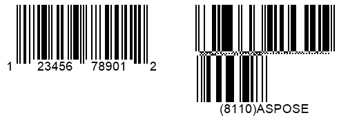

{}[Generate GS1 Code 128 and](https://products.aspose.app/barcode/generate/code128?type=gs1code128) [GS1 DataMatrix Barcodes Online](https://products.aspose.app/barcode/generate/datamatrix?type=gs1datamatrix): You can test the quality of ***Aspose.BarCode*** generation for GS1 barcodes and view the results online.{}

## **Overview**
GS1 is a non-profit international organization that develops encoding standards for automatic identification and data capture (AIDC), which refers to the methods of machine-based data reading used in the trading and transportation of goods. To facilitate item tracking, GS1 has introduced various identification codes, known as application identifiers (AIs), to encode information about goods. GS1 Application Identifiers (AIs) are prefixes included in barcodes and RFID tags that specify the context and format of the data being encoded. GS1 has also developed data encoding standards for different barcode types that are widely used for item identification.

The table below lists barcode types that support all GS1 Application Identifiers and those that are compatible only with the GS1AI_01 type.

|<p align="center">**Compatibility with GS1 AIs**</p>|<p align="center">**Barcode Types**</p>|
|---|---|
|All GS1 Application Identifiers Are Supported|DataBar Expanded, DataBar Expanded Stacked, GS1 Codablock-F, GS1 Code 128, GS1 DataMatrix, GS1 QR Code, UPC-A GS1 DataBar Coupon, UPC-A GS1 Code 128 Coupon|
|Only GS1AI_01 Is Supported|DataBar OmniDirectional, DataBar Stacked OmniDirectional, DatabarLimited, DataBar Truncated, DataBar Stacked, EAN14, ITF14|

{}*If you need any clarifications, feel free to reach out [Aspose Technical Support](/barcode/javascript-cpp/technical-support/): ask your questions at [Aspose.Barcode Forum](https://forum.aspose.com/c/barcode/13) or contact [Aspose Paid Support Helpdesk](https://helpdesk.aspose.com/).*{}

## **Barcode Generation according to GS1 Standards**
***Aspose.BarCode for JavaScript via C++*** supports generating barcodes that comply with GS1 standards. To generate barcodes using GS encoding, the [*CodeText*](https://reference.aspose.com/barcode/javascript-cpp/aspose.barcode.generation/barcodegenerator/properties/codetext) property of the [*BarcodeGenerator*](https://reference.aspose.com/barcode/javascript-cpp/aspose.barcode.generation/barcodegenerator) class must be initialized as a string formatted with predefined application identifiers:

<p align="center"><mark>"(Application_Identifier_1)Application_Data(Application_Identifier_2)Application_Data"</mark></p>

For example, the [*CodeText*](https://reference.aspose.com/barcode/javascript-cpp/aspose.barcode.generation/barcodegenerator/properties/codetext) value could be: "(01)12345678901231(21)ASPOSE(30)9876".

Below are code snippets that demonstrate how to generate GS1-compatible barcodes for *Code 128* and *DataMatrix* symbologies, along with sample barcode labels.

**GS1 Code 128**

[How to get *BarCodeInstance*](/barcode/javascript-cpp/get-barcode-module-instance/)
```javascript
var gen = new BarCodeInstance.BarcodeGenerator("GS1Code128", "(01)12345678901231(21)ASPOSE(30)9876");
gen.Parameters.Barcode.XDimension.Pixels = 2;
document.getElementById("img").src = gen.GenerateBarCodeImage(); // Display barcode image
gen.delete();

```
  
<p align="center"></p>
  
**GS1 Data Matrix**  
  
[How to get *BarCodeInstance*](/barcode/javascript-cpp/get-barcode-module-instance/)
```javascript
var gen = new BarCodeInstance.BarcodeGenerator("GS1DataMatrix", "(01)12345678901231(21)ASPOSE(30)9876");
gen.Parameters.Barcode.XDimension.Pixels = 8;
gen.Parameters.Barcode.DataMatrix.DataMatrixVersion = BarCodeInstance.DataMatrixVersion.ECC200_12x36;
document.getElementById("img").src = gen.GenerateBarCodeImage(); // Display barcode image
gen.delete();

```
  
<p align="center"></p>
  
## **GS1 UPC-A Coupon Generation**
For the *UPC-A* symbology, ***Aspose.BarCode for JavaScript via C++*** allows generating a barcode label with an additional coupon barcode (*DataBar Expanded* or *GS1 Code128*) placed in the same image. This operation can also be performed by generating two barcodes separately and then combining them into an image using an appropriate graphic library; however, the feature provided by ***Aspose.BarCode for JavaScript via C++*** facilitates generating such barcodes in a much simpler and faster way.

As mentioned above, in ***Aspose.BarCode for JavaScript via C++***, it is possible to generate two types of coupon barcodes:
- *UPC-A GS1 DataBar Coupon* that allows combining *UPC-A* and *DataBar Expanded*
- *UPC-A GS1 Code 128 Coupon* that allows merging *UPC-A* and *GS1 Code128*

In the library, these two barcode types can be specified by initializing instances of the [*EncodeTypes*](https://reference.aspose.com/barcode/javascript-cpp/aspose.barcode.generation/encodetypes) class using the following fields: ["*UpcaGs1Code128Coupon*"](https://reference.aspose.com/barcode/javascript-cpp/aspose.barcode.generation/encodetypes/fields/upcags1code128coupon) and ["*UpcaGs1DatabarCoupon*"](https://reference.aspose.com/barcode/javascript-cpp/aspose.barcode.generation/encodetypes/fields/upcags1databarcoupon). To generate a barcode with a coupon, initialize the [*CodeText*](https://reference.aspose.com/barcode/javascript-cpp/aspose.barcode.generation/barcodegenerator/properties/codetext) parameter of the [*BarcodeGenerator*](https://reference.aspose.com/barcode/javascript-cpp/aspose.barcode.generation/barcodegenerator) class using an input string in the following format:  
<p align="center"><mark>"UPC-A Input Data(Application Identifier)GS1 Barcode Text"</mark></p>

For example, [*CodeText*](https://reference.aspose.com/barcode/javascript-cpp/aspose.barcode.generation/barcodegenerator/properties/codetext) can take the following value: "123456789012(8110)ASPOSE".

Below, the code samples are provided to explain how to generate barcodes with coupons for *UpcaGs1DatabarCoupon* and *UpcaGs1Code128Coupon* barcode types along with corresponding sample barcode labels.

### **UPC-A + DataBar Expanded**

[How to get *BarCodeInstance*](/barcode/javascript-cpp/get-barcode-module-instance/)
```javascript
BarcodeGenerator gen = new BarcodeGenerator(EncodeTypes.UpcaGs1DatabarCoupon, "123456789012(8110)ASPOSE");
gen.Parameters.Barcode.XDimension.Pixels = 2;
gen.Save($"{path}Gs1CouponUpcaDatabar.png", BarCodeImageFormat.Png);
```

<p align="center"></p>

### **UPC-A + GS1 Code 128**
[How to get *BarCodeInstance*](/barcode/javascript-cpp/get-barcode-module-instance/)
```javascript
var gen = new BarCodeInstance.BarcodeGenerator("UpcaGs1Code128Coupon", "123456789012(8110)ASPOSE");
gen.Parameters.Barcode.XDimension.Pixels = 2;
document.getElementById("img").src = gen.GenerateBarCodeImage(); // Display barcode image
gen.delete();

```
<p align="center"></p>

## **Coupon Spacing Settings**
In ***Aspose.BarCode for JavaScript via C++***, it is possible to adjust the size of spacing between coupon barcodes placed in the same image. It can be done by setting the [*SupplementSpace*](https://reference.aspose.com/barcode/javascript-cpp/aspose.barcode.generation/couponparameters/properties/supplementspace) property in class [*CouponParameters*](https://reference.aspose.com/barcode/javascript-cpp/aspose.barcode.generation/couponparameters).

Sample barcode images provided below have been generated using the *UPC-A GS1 DataBar Coupon* standard and applying different spacing settings.

|Supplement Space|Is Set to 30 Pixels|Is Set to 50 Pixels|
| :-: | :-: | :-: |
| |||

The following code snippet shows how to modify the size of spacing between coupon barcodes.

[How to get *BarCodeInstance*](/barcode/javascript-cpp/get-barcode-module-instance/)
```javascript
var gen = new BarCodeInstance.BarcodeGenerator("UpcaGs1Code128Coupon", "123456789012(8110)ASPOSE");
gen.Parameters.Barcode.XDimension.Pixels = 2;

// Set coupon supplement space 30 pixels
gen.Parameters.Barcode.Coupon.SupplementSpace.Pixels = 30;
document.getElementById("img").src = gen.GenerateBarCodeImage(); // Display barcode image
gen.delete();

var gen = new BarCodeInstance.BarcodeGenerator("UpcaGs1Code128Coupon", "123456789012(8110)ASPOSE");
gen.Parameters.Barcode.XDimension.Pixels = 2;
// Set coupon supplement space 50 pixels
gen.Parameters.Barcode.Coupon.SupplementSpace.Pixels = 50;
document.getElementById("img").src = gen.GenerateBarCodeImage(); // Display barcode image
gen.delete();

```