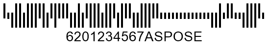

## **Overview**
*Postal* barcode standards were created to address the limitations of 1D barcodes. In *Postal* barcodes, data is encoded by varying the barcode height, unlike 1D barcodes that use line and space width for encoding. When reading *Postal* barcodes, horizontal parameters are ignored to prevent false recognition.

These barcodes are designed for postal services around the world and share functional similarities with minor differences. There are two types of *Postal* symbologies: 2-state barcodes, which encode only numerical digits, and 4-state barcodes, which can encode both numbers and uppercase English letters. The 2-state format encodes one bit per data unit, while the 4-state format encodes two bits.

***Aspose.BarCode for JavaScript via C++*** supports the generation and recognition of 2- and 4-state *Postal* barcodes, including *Planet*, *Postnet*, *RM4SCC*, *Dutch KIX*, *OneCode*, *Australia Post*, and *Mailmark*. More information about these barcode types is provided below.

{}*For any questions or support, contact [Aspose Technical Support](/barcode/javascript-cpp/technical-support/), post on the [Aspose.Barcode Forum](https://forum.aspose.com/c/barcode/13), or reach out to the Aspose [Paid Support Helpdesk](https://helpdesk.aspose.com/).*{}

## **Barcode Height Settings**
In ***Aspose.BarCode for JavaScript via C++***, the height and width of *postal* barcodes are calculated automatically based on the [*XDimension*](https://reference.aspose.com/barcode/javascript-cpp/aspose.barcode.generation/barcodeparameters/properties/xdimension) property. However, the barcode height can be manually adjusted without changing the width by setting the [*BarHeight*](https://reference.aspose.com/barcode/javascript-cpp/aspose.barcode.generation/barcodeparameters/properties/barheight) property in the [*BarcodeParameters*](https://reference.aspose.com/barcode/javascript-cpp/aspose.barcode.generation/barcodeparameters) class.

Below are examples of *Planet* and *RM4SCC* barcodes with different bar height settings.

|Planet Barcode Height| | |
|---| :-: | :-: |
|<p align="center">**Bar Height**</p>|<p align="center">**Set to None**</p>|<p align="center">**Set to 100 Pixels**</p>|
| |||

|RM4SCC Barcode Height| | |
|---| :-: | :-: |
|<p align="center">**Bar Height**</p>|<p align="center">**Set to None**</p>|<p align="center">**Set to 100 Pixels**</p>|
| |||

The following code snippet shows how to adjust the height of *Planet* and *RM4SCC* postal barcodes.

[How to get *BarCodeInstance*](/barcode/javascript-cpp/get-barcode-module-instance/)
```javascript
// Set Planet barcode BarHeight none
var gen = new BarCodeInstance.BarcodeGenerator("Planet", "123456");
gen.Parameters.Barcode.XDimension = "4px";
document.getElementById("img").src = gen.GenerateBarCodeImage(); // Display barcode image
gen.delete();

// Set RM4SCC barcode BarHeight none
var gen = new BarCodeInstance.BarcodeGenerator("RM4SCC", "123456");
gen.Parameters.Barcode.XDimension = "4px";
document.getElementById("img").src = gen.GenerateBarCodeImage(); // Display barcode image
gen.delete();

// Set Planet barcode BarHeight 100 pixels
var gen = new BarCodeInstance.BarcodeGenerator("Planet", "123456");
gen.Parameters.Barcode.XDimension = "4px";
gen.Parameters.Barcode.BarHeight = "100px";
document.getElementById("img").src = gen.GenerateBarCodeImage(); // Display barcode image
gen.delete();

// Set RM4SCC barcode BarHeight 100 pixels
var gen = new BarCodeInstance.BarcodeGenerator("RM4SCC", "123456");
gen.Parameters.Barcode.XDimension = "4px";
gen.Parameters.Barcode.BarHeight = "100px";
document.getElementById("img").src = gen.GenerateBarCodeImage(); // Display barcode image
gen.delete();
```

## **Bar Filling Settings**
In ***Aspose.BarCode for JavaScript via C++***, developers can modify the appearance of *Postal* barcodes by setting bars to be filled or empty. This can be controlled using the [*FilledBars*](https://reference.aspose.com/barcode/javascript-cpp/aspose.barcode.generation/barcodeparameters/properties/filledbars) property in the [*BarcodeParameters*](https://reference.aspose.com/barcode/javascript-cpp/aspose.barcode.generation/barcodeparameters) class. By default, this property is set to *True*, which results in barcode images with filled bars.

Below are examples of *Planet* and *RM4SCC* barcodes generated with different bar filling settings.

|Planet Bar Filling| | |
|---| :-: | :-: |
|**Bar Filling Settings**|<p align="center">**Filled Bars**</p>|<p align="center">**Empty Bars**</p>|
| |||

|RM4SCC Bar Filling| | |
|---| :-: | :-: |
|**Bar Filling Settings**|<p align="center">**Filled Bars**</p>|<p align="center">**Empty Bars**</p>|
| |||

The following code sample demonstrates how to adjust the bar filling settings for *Planet* and *RM4SCC* postal barcodes.

  
[How to get *BarCodeInstance*](/barcode/javascript-cpp/get-barcode-module-instance/)
```javascript
// Set Planet barcode filled bars
var gen = new BarCodeInstance.BarcodeGenerator("Planet", "123456");
gen.Parameters.Barcode.XDimension = "4px";
document.getElementById("img").src = gen.GenerateBarCodeImage(); // Display barcode image
gen.delete();

// Set RM4SCC barcode filled bars
var gen = new BarCodeInstance.BarcodeGenerator("RM4SCC", "123456");
gen.Parameters.Barcode.XDimension = "4px";
document.getElementById("img").src = gen.GenerateBarCodeImage(); // Display barcode image
gen.delete();

// Set Planet barcode empty bars
var gen = new BarCodeInstance.BarcodeGenerator("Planet", "123456");
gen.Parameters.Barcode.XDimension = "4px";
gen.Parameters.Barcode.FilledBars = false;
document.getElementById("img").src = gen.GenerateBarCodeImage(); // Display barcode image
gen.delete();

// Set RM4SCC barcode empty bars
var gen = new BarCodeInstance.BarcodeGenerator("RM4SCC", "123456");
gen.Parameters.Barcode.XDimension = "4px";
gen.Parameters.Barcode.FilledBars = false;
document.getElementById("img").src = gen.GenerateBarCodeImage(); // Display barcode image
gen.delete();

```
  
## **2-State Postal Standards**
***Aspose.BarCode for JavaScript via C++*** supports the following 2-state postal standards: *Planet* and *Postnet*. Both can only encode numerical digits and require a checksum. The length of the numerical data to be encoded is unlimited. Below are code samples and examples of *Planet* and *Postnet* barcode labels.

### **Planet Symbology**
In the *Planet* symbology, each character is represented by five bars, with three bars being full-length and two bars being half-length. The following code snippet demonstrates how to generate a *Planet* barcode.

[How to get *BarCodeInstance*](/barcode/javascript-cpp/get-barcode-module-instance/)
```javascript
var gen = new BarCodeInstance.BarcodeGenerator("Planet", "123456");
gen.Parameters.Barcode.XDimension = "4px";
gen.Parameters.Barcode.BarHeight = "50px";
gen.Parameters.Barcode.Postal.PostalShortBarHeight = "20px";
document.getElementById("img").src = gen.GenerateBarCodeImage(); // Display barcode image
gen.delete();

```
<p align="center"></p> 

### **Postnet Symbology**
The *Postnet* barcode type encodes each character using five bars, with three bars being full-length and two bars being half-length. The following code sample demonstrates how to create a *Postnet* barcode.

[How to get *BarCodeInstance*](/barcode/javascript-cpp/get-barcode-module-instance/)
```javascript
var gen = new BarCodeInstance.BarcodeGenerator("Postnet", "123456");
gen.Parameters.Barcode.XDimension = "4px";
gen.Parameters.Barcode.BarHeight = "50px";
gen.Parameters.Barcode.Postal.PostalShortBarHeight = "20px";
document.getElementById("img").src = gen.GenerateBarCodeImage(); // Display barcode image
gen.delete();

```
<p align="center"></p>

## **Generation Specifics for 2-State Barcodes**
In ***Aspose.BarCode for JavaScript via C++***, generating 2-state postal barcodes (*Planet* or *Postnet*) involves certain considerations related to handling incorrect input text and adjusting bar lengths. These details are outlined below.

### **Incorrect Input Text Handling**
By default, if incorrect input text is passed to the [*CodeText*](https://reference.aspose.com/barcode/javascript-cpp/aspose.barcode.generation/barcodegenerator/properties/codetext) property (for *Planet* or *Postnet* barcodes, any non-numeric characters), the [*BarcodeGenerator*](https://reference.aspose.com/barcode/javascript-cpp/aspose.barcode.generation/barcodegenerator) class filters out any characters that do not match the required format and generates a barcode using only the valid numeric digits. 

If it is necessary to raise an exception for invalid symbols in [*CodeText*](https://reference.aspose.com/barcode/javascript-cpp/aspose.barcode.generation/barcodegenerator/properties/codetext), set the [*ThrowExceptionWhenCodeTextIncorrect*](https://reference.aspose.com/barcode/javascript-cpp/aspose.barcode.generation/barcodeparameters/properties/throwexceptionwhencodetextincorrect) property to *True*, as shown in the code snippet below. This will result in the following exceptions being thrown: "*Exception: Symbology Planet - codetext is invalid*"; "*Exception: Symbology Postnet - codetext is invalid*".


[How to get *BarCodeInstance*](/barcode/javascript-cpp/get-barcode-module-instance/)
```javascript
var gen = new BarCodeInstance.BarcodeGenerator("Planet", "1234567WRONG");
gen.Parameters.Barcode.ThrowExceptionWhenCodeTextIncorrect = true;
try {
    gen.GenerateBarCodeImage();
} catch (e) {
    console.log(e.message);
}
gen.delete();

var gen = new BarCodeInstance.BarcodeGenerator("Postnet", "1234567WRONG");
gen.Parameters.Barcode.ThrowExceptionWhenCodeTextIncorrect = true;
try {
    gen.GenerateBarCodeImage();
} catch (e) {
    console.log(e.message);
}
gen.delete();

```
### **Short Bar Height Settings**
In general, **2-state** barcodes are made up of long and short bars, with the short bars typically being half the length of the long bars. In ***Aspose.BarCode for JavaScript via C++***, you can customize the height of short bars by setting the [*PostalShortBarHeight*](https://reference.aspose.com/barcode/javascript-cpp/aspose.barcode.generation/postalparameters/properties/postalshortbarheight) property in the [*PostalParameters*](https://reference.aspose.com/barcode/javascript-cpp/aspose.barcode.generation/postalparameters) class.

Below are examples of barcode labels generated with different short bar height settings.

|<p align="center">**Short Bar Height Settings**</p>|<p align="center">**Set to 10 Pixels**</p>|<p align="center">**Set to 30 Pixels**</p>|
| :-: | :-: | :-: |  
| |||

The following code snippet illustrates how to customize the short bar length in 2-state postal barcodes.


[How to get *BarCodeInstance*](/barcode/javascript-cpp/get-barcode-module-instance/)
```javascript
// Set Planet barcode ShortBarHeight 10 pixels
var gen = new BarCodeInstance.BarcodeGenerator("Planet", "123456");
gen.Parameters.Barcode.XDimension = "4px";
gen.Parameters.Barcode.BarHeight = "50px";
gen.Parameters.Barcode.Postal.PostalShortBarHeight = "10px";
document.getElementById("img").src = gen.GenerateBarCodeImage(); // Display barcode image
gen.delete();

// Set Planet barcode ShortBarHeight 30 pixels
var gen = new BarCodeInstance.BarcodeGenerator("Planet", "123456");
gen.Parameters.Barcode.XDimension = "4px";
gen.Parameters.Barcode.BarHeight = "50px";
gen.Parameters.Barcode.Postal.PostalShortBarHeight = "30px";
document.getElementById("img").src = gen.GenerateBarCodeImage(); // Display barcode image
gen.delete();

```
   
## **4-State Postal Standards**
***Aspose.BarCode for JavaScript via C++*** supports the following 4-state postal symbologies: *RM4SCC*, *Dutch KIX*, *OneCode*, *Australia Post*, and *Mailmark*. In **4-state** barcodes, four types of bars are used to encode data: tracker (T), descender (D), ascender (A), and full (F) bars. Each input character is represented by four separate bars, allowing two bits of data to be encoded per digit. Most 4-state standards are based on the *RM4SCC* barcode type, which can encode both numerical digits and uppercase English letters. All 4-state postal standards, except *Dutch KIX*, include a checksum. Additionally, *Australia Post* and *Mailmark* support information recovery using Reed-Solomon error correction. The specifics of 4-state symbology generation in ***Aspose.BarCode for JavaScript via C++*** are explained further below.

### **RM4SCC Symbology**
The *RM4SCC* symbology encodes numerical digits and uppercase English letters. Each character is represented by four bars, with two bars extending upward and the other two extending downward. Different combinations of these bars create 36 possible symbols: 10 digits and 26 letters. This symbology requires an obligatory check digit, which is calculated using the modulo 6 algorithm.

<p align="center"></p>

The following code sample demonstrates how to generate *RM4SCC* barcodes.

  
[How to get *BarCodeInstance*](/barcode/javascript-cpp/get-barcode-module-instance/)
```javascript
var gen = new BarCodeInstance.BarcodeGenerator("RM4SCC", "123456ASPOSE");
gen.Parameters.Barcode.XDimension = "4px";
gen.Parameters.Barcode.BarHeight = "50px";
document.getElementById("img").src = gen.GenerateBarCodeImage(); // Display barcode image
gen.delete();

```

### **Dutch KIX Symbology**
The *Dutch KIX* symbology is used by the Royal Dutch TPG Post in the Netherlands for the automated sorting of postal codes and mail. Its specification is similar to that of the RM4SCC symbology and can encode numerical digits and uppercase English letters. However, it does not include a checksum, nor does it have start and stop digits.

<p align="center"></p>

The following code snippet demonstrates how to generate *Dutch KIX* barcodes.

[How to get *BarCodeInstance*](/barcode/javascript-cpp/get-barcode-module-instance/)
```javascript
var gen = new BarCodeInstance.BarcodeGenerator("DutchKIX", "123456ASPOSE");
gen.Parameters.Barcode.XDimension = "4px";
gen.Parameters.Barcode.BarHeight = "50px";
document.getElementById("img").src = gen.GenerateBarCodeImage(); // Display barcode image
gen.delete();

```

### **OneCode Symbology**
The *OneCode* standard is used to encode messages composed of numerical digits, with a fixed length of 20, 25, 29, or 31 digits, into 65-bar barcodes. It features an eleven-bit cyclic redundancy check for error detection but does not support error correction.

|<p align="center">**OneCode Standard**</p>|<p align="center">**20 Digits**</p>|<p align="center">**25 Digits**</p>|<p align="center">**29 Digits**</p>|<p align="center">**31 Digits**</p>|
| :-: | :-: | :-: | :-: | :-: |  
| |||||

The following code sample demonstrates how to generate *OneCode* barcodes.

[How to get *BarCodeInstance*](/barcode/javascript-cpp/get-barcode-module-instance/)
```javascript
// Create OneCode with 20 digits
var gen = new BarCodeInstance.BarcodeGenerator("OneCode", "12345678901234567890");
gen.Parameters.Barcode.XDimension = "4px";
gen.Parameters.Barcode.BarHeight = "50px";
document.getElementById("img").src = gen.GenerateBarCodeImage(); // Display barcode image
gen.delete();

// Create OneCode with 25 digits
var gen = new BarCodeInstance.BarcodeGenerator("OneCode", "1234567890123456789012345");
gen.Parameters.Barcode.XDimension = "4px";
gen.Parameters.Barcode.BarHeight = "50px";
document.getElementById("img").src = gen.GenerateBarCodeImage(); // Display barcode image
gen.delete();

// Create OneCode with 29 digits
var gen = new BarCodeInstance.BarcodeGenerator("OneCode", "12345678901234567890123456789");
gen.Parameters.Barcode.XDimension = "4px";
gen.Parameters.Barcode.BarHeight = "50px";
document.getElementById("img").src = gen.GenerateBarCodeImage(); // Display barcode image
gen.delete();

// Create OneCode with 31 digits
var gen = new BarCodeInstance.BarcodeGenerator("OneCode", "1234567890123456789012345678901");
gen.Parameters.Barcode.XDimension = "4px";
gen.Parameters.Barcode.BarHeight = "50px";
document.getElementById("img").src = gen.GenerateBarCodeImage(); // Display barcode image
gen.delete();

```

### **Australia Post Symbology**
The *Australia Post* symbology encodes input messages that include a specific 2-digit format control code (FCC) field and an 8-digit sorting code (SC) field. The FCC field is used to indicate one of three available barcode types with fixed lengths of 37, 52, or 67 bars. Depending on the FCC, barcodes may also include a customer information (CI) field that specifies the encoding type, supporting either numerical or alphanumeric symbols. The encoding types are defined in the [*AustralianPostEncodingTable*](https://reference.aspose.com/barcode/javascript-cpp/aspose.barcode.generation/australianpostparameters/properties/australianpostencodingtable) property. Customer information can occupy 16 bars in 52-length barcodes or 31 bars in 67-length barcodes. The *Australia Post* standard includes a checksum and uses Reed-Solomon error correction for data recovery.

Input messages can be defined using one of the following formats:

|<p align="center">**FCC Field**</p>|<p align="center">**Sorting Code Field**</p>|<p align="center">**Customer Information Field**</p>|  
| :-: | :-: | :-: |
|11|8 digits|None|
|59|8 digits|16 bars|
|62|8 digits|31 bars|

The FCC field value can be set using the [*AustralianPostEncodingTable*](https://reference.aspose.com/barcode/javascript-cpp/aspose.barcode.generation/australianpostparameters/properties/australianpostencodingtable) property, which should be initialized with one of the values from the [*CustomerInformationInterpretingType*](https://reference.aspose.com/barcode/javascript-cpp/aspose.barcode/customerinformationinterpretingtype) enumeration (as shown in the table below).

|Australia Post Encoding Table|Supported Symbols|
| :-: |---|
|CTable|0-9, A-Z, a-z, space symbol, and #|
|NTable|0-9|
|Other|0, 1, 2, and 3 representing H, A, D, and T states, respectively|

The following barcode images illustrate different FCC field settings in *Australia Post* barcodes.

|<p align="center">**Australia Post Standards**</p>|<p align="center">**FCC 11**</p>|<p align="center">**FCC 59 Table**</p>|<p align="center">**FCC 62N Table**</p>|<p align="center">**FCC 62C Table**</p>|<p align="center">**FCC 62C Other Table**</p>|
| :-: | :-: | :-: | :-: | :-: | :-: |  
| ||||||

The following code snippet demonstrates how to generate *Australia Post* barcodes with different settings.

[How to get *BarCodeInstance*](/barcode/javascript-cpp/get-barcode-module-instance/)
```javascript
// Create AustraliaPost FCC 11
var gen = new BarCodeInstance.BarcodeGenerator("AustraliaPost", "1101234567");
gen.Parameters.Barcode.XDimension = "4px";
gen.Parameters.Barcode.BarHeight = "50px";
document.getElementById("img").src = gen.GenerateBarCodeImage(); // Display barcode image
gen.delete();

// Create AustraliaPost FCC 59 NTable
var gen = new BarCodeInstance.BarcodeGenerator("AustraliaPost", "590123456701234");
gen.Parameters.Barcode.XDimension = "4px";
gen.Parameters.Barcode.BarHeight = "50px";
gen.Parameters.Barcode.AustralianPost.AustralianPostEncodingTable = BarCodeInstance.CustomerInformationInterpretingType.NTable;
document.getElementById("img").src = gen.GenerateBarCodeImage(); // Display barcode image
gen.delete();

// Create AustraliaPost FCC 62 NTable
var gen = new BarCodeInstance.BarcodeGenerator("AustraliaPost", "620123456701234");
gen.Parameters.Barcode.XDimension = "4px";
gen.Parameters.Barcode.BarHeight = "50px";
gen.Parameters.Barcode.AustralianPost.AustralianPostEncodingTable = BarCodeInstance.CustomerInformationInterpretingType.NTable;
document.getElementById("img").src = gen.GenerateBarCodeImage(); // Display barcode image
gen.delete();

// Create AustraliaPost FCC 62 CTable
var gen = new BarCodeInstance.BarcodeGenerator("AustraliaPost", "6201234567ASPOSE");
gen.Parameters.Barcode.XDimension = "4px";
gen.Parameters.Barcode.BarHeight = "50px";
gen.Parameters.Barcode.AustralianPost.AustralianPostEncodingTable = BarCodeInstance.CustomerInformationInterpretingType.CTable;
document.getElementById("img").src = gen.GenerateBarCodeImage(); // Display barcode image
gen.delete();

// Create AustraliaPost FCC 62
var gen = new BarCodeInstance.BarcodeGenerator("AustraliaPost", "6201234567321032103210");
gen.Parameters.Barcode.XDimension = "4px";
gen.Parameters.Barcode.BarHeight = "50px";
gen.Parameters.Barcode.AustralianPost.AustralianPostEncodingTable = BarCodeInstance.CustomerInformationInterpretingType.Other;
document.getElementById("img").src = gen.GenerateBarCodeImage(); // Display barcode image
gen.delete();

```

### **Mailmark Symbology**
The *Mailmark* symbology was developed by the Royal Mail of the United Kingdom. Its specification is similar to *RM4SCC*, but it has predefined data format requirements and does not allow additional space for customer-specific content. This standard supports the encoding of numerical digits, uppercase English letters, and spaces. Barcodes generated using this standard include a checksum and data recovery information through Reed-Solomon error correction.

*Mailmark* supports the following types:
- **Type L** - encodes 26 characters
- **Type C** - encodes 22 characters

|<p align="center">**Mailmark Standards**</p>|<p align="center">**Type C**</p>|<p align="center">**Type L**</p>|
| :-: | :-: | :-: |  
| |||

The following code sample demonstrates how to generate *Mailmark* barcodes of different types.

    
[How to get *BarCodeInstance*](/barcode/javascript-cpp/get-barcode-module-instance/)
```javascript
// Create Mailmark C Type
var gen = new BarCodeInstance.BarcodeGenerator("Mailmark", "21B2254800659JW5O9QA6Y");
gen.Parameters.Barcode.XDimension = "4px";
gen.Parameters.Barcode.BarHeight = "50px";
document.getElementById("img").src = gen.GenerateBarCodeImage(); // Display barcode image
gen.delete();

// Create Mailmark L Type
var gen = new BarCodeInstance.BarcodeGenerator("Mailmark", "41038422416563762EF61AH8T");
gen.Parameters.Barcode.XDimension = "4px";
gen.Parameters.Barcode.BarHeight = "50px";
document.getElementById("img").src = gen.GenerateBarCodeImage(); // Display barcode image
gen.delete();

```