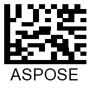
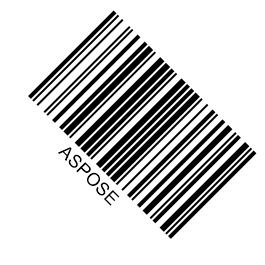

This article provides all necessary information about adjusting barcode appearance-related properties, including image size, rotation angle, paddings, and borders.

## Overview
In ***Aspose.Barcode for .NET***, class *BarcodeGenerator* allows creating barcode labels according to the specified scenario in which each element has the fixed position relative to other elements in a barcode image, as shown in the scheme below. A barcode image may include the following elements: barcode itself, borders, paddings, top and bottom captions, and barcode text. All elements besides the bars constituting the barcode label itself are optional.
  

  
## Barcode Image Sizing Modes

In the general case, ***Aspose.BarCode for .NET*** adjusts image size (width and height) automatically according to the size of the generated barcode. However, it is possible to customize the image size settings manually by specifying the height and width of a barcode image using [*ImageHeight*](https://apireference.aspose.com/barcode/net/aspose.barcode.generation/basegenerationparameters/properties/imageheight) and [*ImageWidth*] properties of class [*BaseGenerationParameters*](https://apireference.aspose.com/barcode/net/aspose.barcode.generation/basegenerationparameters).  
The size of a barcode image can be managed according to different sizing modes that are set by initializing the [*AutosizeMode*](https://apireference.aspose.com/barcode/net/aspose.barcode.generation/basegenerationparameters/properties/autosizemode) parameter of class *BaseGenerationParameters*. This parameter can take the following values: *Interpolation*, *Nearest*, and *None*. The *Interpolation* and *Nearest* modes imply that barcode image size gets adjusted according to the required values of width and height while most of the other parameters are ignored. In contrast, the *None* mode defines the size of a barcode image ignoring width and height but considers other parameters, for example, such as [*XDimension*](https://apireference.aspose.com/barcode/net/aspose.barcode.generation/barcodeparameters/properties/xdimension). By default, *AutoSizeMode* is set to "*None"*.
Below, the available barcode sizing modes are described in detail along with barcode examples and code snippets.

### AutoSizeMode.None  
As mentioned previously, when the *None* mode is set, the size of the generated barcode image is based on various parameters while the values of width and height are not taken into consideration. The main parameter used to define barcode size is the [*XDimension*](https://apireference.aspose.com/barcode/net/aspose.barcode.generation/barcodeparameters/properties/xdimension) property. It specifies the minimum size value of bars for 1D barcodes or cells for 2D ones. Then, this value is used to calculate most of the other parameters.   
The barcode image provided below has been created in the *None* mode.

  
The following code snippet illustrates how to set the *AutoSizeMode* property to *None*.  


BarcodeGenerator gen = new BarcodeGenerator(EncodeTypes.DataMatrix, "ASPOSE");
gen.Parameters.AutoSizeMode = AutoSizeMode.None;
gen.Parameters.ImageWidth.Pixels = 300;
gen.Parameters.ImageHeight.Pixels = 300;
gen.Parameters.Barcode.XDimension.Pixels = 3;
gen.Save($"{path}AutoSizeModeNone.png", BarCodeImageFormat.Png);
 
  

### AutoSizeMode.Interpolation  
When the *AutoSizeMode* property is set to "*Interpolation*", only the values of [*ImageHeight*](https://apireference.aspose.com/barcode/net/aspose.barcode.generation/basegenerationparameters/properties/imageheight) and [*ImageWidth*] are taken into account. This sizing mode attempts to adjust barcode image size to the specified height and width precisely even though it will lead to the distortion of barcode proportions and accordingly, to the loss of barcode readability for side scanners *Interpolation* is intended to generate barcode images with the resolution of 300 dpi or higher in which proportion distortion will be negligible and will not affect barcode readability.  
The sample barcode image created with the *Interpolation* mode being set is shown below.  

 

The following code sample explains how to initialize the *AutoSizeMode* property with the *Interpolation* value. 

BarcodeGenerator gen = new BarcodeGenerator(EncodeTypes.DataMatrix, "ASPOSE");
gen.Parameters.AutoSizeMode = AutoSizeMode.Interpolation;
gen.Parameters.ImageWidth.Pixels = 300;
gen.Parameters.ImageHeight.Pixels = 300;
gen.Parameters.Barcode.XDimension.Pixels = 3;
gen.Save($"{path}AutoSizeModeInterpolation.png", BarCodeImageFormat.Png);
 
  
### AutoSizeMode.Nearest  
The *Nearest* mode uses only the values of [*ImageHeight*](https://apireference.aspose.com/barcode/net/aspose.barcode.generation/basegenerationparameters/properties/imageheight) and [*ImageWidth*] to set the size of the resulting barcode image similarly to *Interpolation*. However, in this case, *BarcodeGenerator* seeks to specify the most appropriate image size to avoid distorting barcode proportions and deteriorating its readability.  
The resulting barcode image generated using the *Nearest* mode is demonstrated below.
  

  
The following code snippet shows how to set the *Nearest* mode.
  

BarcodeGenerator gen = new BarcodeGenerator(EncodeTypes.DataMatrix, "ASPOSE");
gen.Parameters.AutoSizeMode = AutoSizeMode.Nearest;
gen.Parameters.ImageWidth.Pixels = 300;
gen.Parameters.ImageHeight.Pixels = 300;
gen.Parameters.Barcode.XDimension.Pixels = 3;
gen.Save($"{path}AutoSizeModeNearest.png", BarCodeImageFormat.Png);

  
## Barcode Rotation
***Aspose.BarCode for .NET*** enables barcode image rotation that can be implemented by initializing the *RotationAngle* property of class [*BaseGenerationParameters*](https://apireference.aspose.com/barcode/net/aspose.barcode.generation/basegenerationparameters). Setting this property to a value in degrees results in generating a barcode image rotated according to the required angle clockwise or counterclockwise.
The sample barcode images rotated by different angles are represented below.
  
|Rotation|+90°|-90°|+45°|-45°|180°| 
|---|:---:|:---:|:---:|:---:|:---:| 
|**Output**||||||
  
The following code snippet illustrates how to set various rotation angles.
   

BarcodeGenerator gen = new BarcodeGenerator(EncodeTypes.Code128, "ASPOSE");
gen.Parameters.RotationAngle = 90;
gen.Save($"{path}RotationAngle+90.png", BarCodeImageFormat.Png);
gen.Parameters.RotationAngle = -90;
gen.Save($"{path}RotationAngle-90.png", BarCodeImageFormat.Png);
gen.Parameters.RotationAngle = 45;
gen.Save($"{path}RotationAngle+45.png", BarCodeImageFormat.Png);
gen.Parameters.RotationAngle = -45;
gen.Save($"{path}RotationAngle-45.png", BarCodeImageFormat.Png);
gen.Parameters.RotationAngle = 180;
gen.Save($"{path}RotationAngle180.png", BarCodeImageFormat.Png);
 
  
## Customizing Barcode Borders and Padding
***Aspose.BarCode for .NET*** enables setting barcode borders and paddings during barcode generation. By default, borders are created tightly to image edges; then, corresponding paddings are specified.
  
### Borders
By default, a barcode image is generated without borders; however, they can be specified explicitly according to five different styles: solid, dashed, dotted, dash-dot, and dash dot dot. Border appearance can be adjusted using the [*Border*](https://apireference.aspose.com/barcode/net/aspose.barcode.generation/basegenerationparameters/properties/border) property of class [*BaseGenerationParameters*](https://apireference.aspose.com/barcode/net/aspose.barcode.generation/basegenerationparameters). In turn, this property gets an instance of class [*BorderParameters*](https://apireference.aspose.com/barcode/net/aspose.barcode.generation/borderparameters) in which all barcode configuration parameters are set. In addition, this class enables adjusting border thickness that can be defined in any supported [**units**](http://localhost:1313/barcode/net/setting-barcode-parameters/#measuring-barcode-size-in-different-units) and color by initializing the *Width* and *Color* properties, respectively.
Barcode images provided below are the sample barcode labels generated using different border styles. The border style can be customized by initializing the [*DashStyle*](https://apireference.aspose.com/barcode/net/aspose.barcode.generation/borderparameters/properties/dashstyle) of class *BorderParameters*.
  
|Borders|Solid|Dashed|Dotted|Dash Dot|Dash Dot Dot| 
|---|:---:|:---:|:---:|:---:|:---:| 
|**Output**||||||
  
The following code sample explains how to set the required barcode border style.
  

BarcodeGenerator gen = new BarcodeGenerator(EncodeTypes.Code128, "ASPOSE");
//set border visible
gen.Parameters.Border.Visible = true;
//set border size to 5 pizels
gen.Parameters.Border.Width.Pixels = 5;
gen.Parameters.Border.DashStyle = BorderDashStyle.Solid;
gen.Save($"{path}BorderSolid.png", BarCodeImageFormat.Png);
gen.Parameters.Border.DashStyle = BorderDashStyle.Dash;
gen.Save($"{path}BorderDash.png", BarCodeImageFormat.Png);
gen.Parameters.Border.DashStyle = BorderDashStyle.Dot;
gen.Save($"{path}BorderDot.png", BarCodeImageFormat.Png);
gen.Parameters.Border.DashStyle = BorderDashStyle.DashDot;
gen.Save($"{path}BorderDashDot.png", BarCodeImageFormat.Png);
gen.Parameters.Border.DashStyle = BorderDashStyle.DashDotDot;
gen.Save($"{path}BorderDashDotDot.png", BarCodeImageFormat.Png);
 

### Paddings
The border paddings from the edges of a barcode image or its borders can be set in four directions by initializing the [Padding](https://apireference.aspose.com/barcode/net/aspose.barcode.generation/barcodeparameters/properties/padding) property of class [*BarcodeParameters*](https://apireference.aspose.com/barcode/net/aspose.barcode.generation/barcodeparameters). The *Padding* property creates an instance of class [Aspose.BarCode.Generation.Padding](https://apireference.aspose.com/barcode/net/aspose.barcode.generation/padding) that specifies *Left*, *Right*, *Top*, and *Bottom* padding settings. The default values are set to 5 points in all directions.
  
|Padding|Millimeters|Pixels|  
|---|:---:|:---:|  
|**Output**|

|

| 


BarcodeGenerator gen = new BarcodeGenerator(EncodeTypes.Code128, "ASPOSE");
//set border
gen.Parameters.Border.Visible = true;
gen.Parameters.Border.Width.Pixels = 5;
gen.Parameters.Border.DashStyle = BorderDashStyle.Solid;
//set padding to 10 pixels
gen.Parameters.Barcode.Padding.Left.Pixels = 10;
gen.Parameters.Barcode.Padding.Top.Pixels = 10;
gen.Parameters.Barcode.Padding.Right.Pixels = 10;
gen.Parameters.Barcode.Padding.Bottom.Pixels = 10;
gen.Save($"{path}Padding10Pixels.png", BarCodeImageFormat.Png);
//set padding to 10 Millimeters
gen.Parameters.Barcode.Padding.Left.Millimeters = 10;
gen.Parameters.Barcode.Padding.Top.Millimeters = 10;
gen.Parameters.Barcode.Padding.Right.Millimeters = 10;
gen.Parameters.Barcode.Padding.Bottom.Millimeters = 10;
gen.Save($"{path}Padding10Millimeters.png", BarCodeImageFormat.Png);
 
  
## Bar Width Reduction
The width of bars in a barcode is an important parameter that requires to be set with high precision to ensure proper barcode scanning. Depending on the way of barcode printing, the initially specified width of bars may increase after printing out barcode labels due to ink floating. This effect is especially common in commercial printing with the use of conventional printing presses. Therefore, to ensure that printed barcode labels have acceptable bar width, it may be necessary to reduce this parameter in the barcode generation application by setting an appropriate bar width reduction value.  
Bar width reduction (BWR) is a method to adjust a graphics design file of a barcode aiming to compensate for ink floating. ***Aspose.Barcode for .NET*** allows adjusting the width of bars in generated barcodes by setting the [*BarWidthReduction*](https://apireference.aspose.com/barcode/net/aspose.barcode.generation/barcodeparameters/properties/barwidthreduction) property of class [*BarcodeParameters*](https://apireference.aspose.com/barcode/net/aspose.barcode.generation/barcodeparameters). Initializing this property with the required value leads to decreasing the width of bars or the size of cells in 1D and 2D barcodes, respectively. The BWR value for a particular printer is defined by printer manufacturers and can be found in dedicated tables. Note that adjusting this parameter does not have any impact in the case of laser printers.  
The sample barcodes shown below have been generated with and without bar width reduction.
  
|Symbology|Bar Width Reduction 0|Bar Width Reduction 4|  
|---|:---:|:---:|  
|**Code 128**|

|

| 
|**Data Matrix**|

|

|
  
The following code example describes how to set bar width reduction.
   

//Code 128
BarcodeGenerator gen = new BarcodeGenerator(EncodeTypes.Code128, "ASPOSE");
gen.Parameters.Barcode.XDimension.Pixels = 10;
//Code 128 without barwidth rediction
gen.Parameters.Barcode.BarWidthReduction.Pixels = 0;
gen.Save($"{path}Code128BarWidthReduction0.png", BarCodeImageFormat.Png);
//Code 128 with 4 pix barwidth rediction
gen.Parameters.Barcode.BarWidthReduction.Pixels = 4;
gen.Save($"{path}Code128BarWidthReduction4.png", BarCodeImageFormat.Png);

//DataMatrix
gen = new BarcodeGenerator(EncodeTypes.DataMatrix, "ASPOSE");
gen.Parameters.Barcode.XDimension.Pixels = 10;
//DataMatrix without barwidth rediction
gen.Parameters.Barcode.BarWidthReduction.Pixels = 0;
gen.Save($"{path}DataMatrixBarWidthReduction0.png", BarCodeImageFormat.Png);
//DataMatrix with 4 pix barwidth rediction
gen.Parameters.Barcode.BarWidthReduction.Pixels = 4;
gen.Save($"{path}DataMatrixBarWidthReduction4.png", BarCodeImageFormat.Png);
 
  