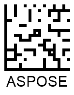

This article provides all necessary information about adjusting barcode appearance-related properties.

## Overview
In ***Aspose.Barcode for .NET***, *BarcodeGenerator* class allows creating barcode labels according to the specified scenario where each element has a fixed position with respect to other elements in a barcode image, as shown in the scheme below. A barcode image may include the following elements: barcode itself, barcode text, border, paddings, top and bottom captions.
  

  
## Adjusting Barcode Size

Specifies the different types of automatic sizing modes. Default value: AutoSizeMode.None.

**AutosizeModeNone**


BarcodeGenerator gen = new BarcodeGenerator(EncodeTypes.DataMatrix, "ASPOSE");
gen.Parameters.AutoSizeMode = AutoSizeMode.None;
gen.Parameters.ImageWidth.Pixels = 300;
gen.Parameters.ImageHeight.Pixels = 300;
gen.Parameters.Barcode.XDimension.Pixels = 3;
gen.Save($"{path}AutoSizeModeNone.png", BarCodeImageFormat.Png);
 
  

**Autosize Mode Interpolation**


BarcodeGenerator gen = new BarcodeGenerator(EncodeTypes.DataMatrix, "ASPOSE");
gen.Parameters.AutoSizeMode = AutoSizeMode.Interpolation;
gen.Parameters.ImageWidth.Pixels = 300;
gen.Parameters.ImageHeight.Pixels = 300;
gen.Parameters.Barcode.XDimension.Pixels = 3;
gen.Save($"{path}AutoSizeModeInterpolation.png", BarCodeImageFormat.Png);
 
  

  

**AutosizeModeNearest**


BarcodeGenerator gen = new BarcodeGenerator(EncodeTypes.DataMatrix, "ASPOSE");
gen.Parameters.AutoSizeMode = AutoSizeMode.Nearest;
gen.Parameters.ImageWidth.Pixels = 300;
gen.Parameters.ImageHeight.Pixels = 300;
gen.Parameters.Barcode.XDimension.Pixels = 3;
gen.Save($"{path}AutoSizeModeNearest.png", BarCodeImageFormat.Png);

  

    
## Barcode Rotation


BarcodeGenerator gen = new BarcodeGenerator(EncodeTypes.Code128, "ASPOSE");
gen.Parameters.RotationAngle = 90;
gen.Save($"{path}RotationAngle+90.png", BarCodeImageFormat.Png);
gen.Parameters.RotationAngle = -90;
gen.Save($"{path}RotationAngle-90.png", BarCodeImageFormat.Png);
gen.Parameters.RotationAngle = 45;
gen.Save($"{path}RotationAngle+45.png", BarCodeImageFormat.Png);
gen.Parameters.RotationAngle = -45;
gen.Save($"{path}RotationAngle-45.png", BarCodeImageFormat.Png);
gen.Parameters.RotationAngle = 180;
gen.Save($"{path}RotationAngle180.png", BarCodeImageFormat.Png);
 

|Rotation Angle|+90|-90|+45|-45|180| 
|---|:---:|:---:|:---:|:---:|:---:| 
|**Output**|

|

|

|

|

|

## Customizing Barcode Borders and Padding


BarcodeGenerator gen = new BarcodeGenerator(EncodeTypes.Code128, "ASPOSE");
//set border visible
gen.Parameters.Border.Visible = true;
//set border size to 5 pizels
gen.Parameters.Border.Width.Pixels = 5;
gen.Parameters.Border.DashStyle = BorderDashStyle.Solid;
gen.Save($"{path}BorderSolid.png", BarCodeImageFormat.Png);
gen.Parameters.Border.DashStyle = BorderDashStyle.Dash;
gen.Save($"{path}BorderDash.png", BarCodeImageFormat.Png);
gen.Parameters.Border.DashStyle = BorderDashStyle.Dot;
gen.Save($"{path}BorderDot.png", BarCodeImageFormat.Png);
gen.Parameters.Border.DashStyle = BorderDashStyle.DashDot;
gen.Save($"{path}BorderDashDot.png", BarCodeImageFormat.Png);
gen.Parameters.Border.DashStyle = BorderDashStyle.DashDotDot;
gen.Save($"{path}BorderDashDotDot.png", BarCodeImageFormat.Png);
 
  
|Border Style|Solid|Dashed|Dotted|Dash Dot|Dash Dot Dot| 
|---|:---:|:---:|:---:|:---:|:---:| 
|**Output**|

|

|

|

|

|
  

BarcodeGenerator gen = new BarcodeGenerator(EncodeTypes.Code128, "ASPOSE");
//set border
gen.Parameters.Border.Visible = true;
gen.Parameters.Border.Width.Pixels = 5;
gen.Parameters.Border.DashStyle = BorderDashStyle.Solid;
//set padding to 10 pixels
gen.Parameters.Barcode.Padding.Left.Pixels = 10;
gen.Parameters.Barcode.Padding.Top.Pixels = 10;
gen.Parameters.Barcode.Padding.Right.Pixels = 10;
gen.Parameters.Barcode.Padding.Bottom.Pixels = 10;
gen.Save($"{path}Padding10Pixels.png", BarCodeImageFormat.Png);
//set padding to 10 Millimeters
gen.Parameters.Barcode.Padding.Left.Millimeters = 10;
gen.Parameters.Barcode.Padding.Top.Millimeters = 10;
gen.Parameters.Barcode.Padding.Right.Millimeters = 10;
gen.Parameters.Barcode.Padding.Bottom.Millimeters = 10;
gen.Save($"{path}Padding10Millimeters.png", BarCodeImageFormat.Png);
 
  
|Padding Styles|10 Millimeters|10 Pixels|  
|---|:---:|:---:|  
|**Output**|

|

| 
  
## Bar Width Reduction


//Code 128
BarcodeGenerator gen = new BarcodeGenerator(EncodeTypes.Code128, "ASPOSE");
gen.Parameters.Barcode.XDimension.Pixels = 10;
//Code 128 without barwidth rediction
gen.Parameters.Barcode.BarWidthReduction.Pixels = 0;
gen.Save($"{path}Code128BarWidthReduction0.png", BarCodeImageFormat.Png);
//Code 128 with 4 pix barwidth rediction
gen.Parameters.Barcode.BarWidthReduction.Pixels = 4;
gen.Save($"{path}Code128BarWidthReduction4.png", BarCodeImageFormat.Png);

//DataMatrix
gen = new BarcodeGenerator(EncodeTypes.DataMatrix, "ASPOSE");
gen.Parameters.Barcode.XDimension.Pixels = 10;
//DataMatrix without barwidth rediction
gen.Parameters.Barcode.BarWidthReduction.Pixels = 0;
gen.Save($"{path}DataMatrixBarWidthReduction0.png", BarCodeImageFormat.Png);
//DataMatrix with 4 pix barwidth rediction
gen.Parameters.Barcode.BarWidthReduction.Pixels = 4;
gen.Save($"{path}DataMatrixBarWidthReduction4.png", BarCodeImageFormat.Png);
 
  
|Symbology|Bar Width Reduction 0|Bar Width Reduction 4|  
|---|:---:|:---:|  
|**Code 128**|

|

| 
|**Data Matrix**|

|

| 
  