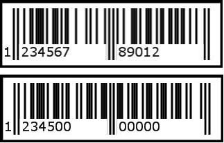
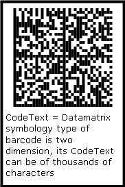

## **Specify Symbologies for Barcodes**
### **What is Barcode**
Barcode is a means for automatic item identification, for example, books in a library. IBarcodes are machine-readable graphical codes composed of numbers and lines of different widths or other figures. Once generated, barcodes may be printed and scanned on any item or product that requires to be tracked. Barcodes have various implementations, inlcuding speeding up the check-out procedure, tracking sales, managing inventory, and many others. The first set of numbers in a barcode represents the manufacturer code; the second set corresponds to the product code. <!--The barcode technology was introduced in early 80s and is often printed on the record sleeve only, sometimes also on the center record paper label.-->
### **What is Barcode Symbology**
Barcode symbology is the protocol that defines the standard for arranging bars and spaces between them, in this way, defining a particular type of barcode, such as UPCA, EAN, Code128, etc.
### **Aspose.BarCode and Barcode Symbologies**
***Aspose.BarCode for .NET*** supports most of the widely used barcode symbologies. All barcode generation classes, such as *LinearBarCode* and [*BarCodeGeneratorControl*](https://apireference.aspose.com/barcode/net/aspose.barcode.windows.forms/barcodegeneratorcontrol) have the common property named [*EncodeType*](https://apireference.aspose.com/barcode/net/aspose.barcode.generation/encodetypes) that is used to identify the barcode symbology of a barcode to be generated. Developers can set *SymbologyType* property to any symbology from the list of pre-defined symbologies supported by *BarcodeGenerator* class, as outlined below.

|**Symbologies**|**Description**|
| :- | :- |
|Codabar|Specifies that the data should be encoded with Codabar barcode specification|
|Code11|Specifies that the data should be encoded with Code11 barcode specification|
|Code128|Specifies that the data should be encoded with Code128 barcode specification|
|Code39Standard|Specifies that the data should be encoded with Standard Code39 barcode specification|
|Code39Extended|Specifies that the data should be encoded with Extended Code39 barcode specification|
|Code93Standard|Specifies that the data should be encoded with Standard Code93 barcode specification|
|Code93Extended|Specifies that the data should be encoded with Extended Code93 barcode specification|
|EAN13|Specifies that the data should be encoded with EAN-13 barcode specification|
|EAN8|Specifies that the data should be encoded with EAN-8 barcode specification|
|BooklandEAN|Specifies that the data should be encoded with BooklandEAN barcode specification|
|Interleaved2of5|Specifies that the data should be encoded with Interleaved 2 of 5 barcode specification|
|MSI|Specifies that the data should be encoded with MSI Plessey barcode specification|
|Standard2of5|Specifies that the data should be encoded with Standard 2 of 5 barcode specification|
|UPCA|Specifies that the data should be encoded with UPC-A barcode specification|
|UPCE|Specifies that the data should be encoded with UPC-E barcode specification|
|Postnet|Specifies that the data should be encoded with Postnet barcode specification|
|Planet|Specifies that the data should be encoded with Planet barcode specification|
|PDF417|Specifies that the data should be encoded with Pdf417 barcode specification|
|Datamatrix|Specifies that the data should be encoded with Datamatrix barcode specification|
|QR|Specifies that the data should be encoded with QR barcode specification|
|Aztec|Specifies that the data should be encoded with Aztec barcode specification|



### **Set Code Text**
<!--A barcode is the representation of characters in the form of bars and spaces between them. So, it is a simple fact that we would also have to assign some characters to Aspose.BarCode so that the input characters could be converted to a barcode.--> 
***Aspose.BarCode for .NET*** inlcudes three classes to create barcodes for different kinds of applications: ([*BarcodeGenerator*](https://apireference.aspose.com/barcode/net/aspose.barcode.generation/barcodegenerator), [*BarCodeGeneratorControl*](https://apireference.aspose.com/barcode/net/aspose.barcode.windows.forms/barcodegeneratorcontrol)). These classes have a common property *CodeText* that stores all characters to be encoded into a barcode.
### **Code Text versus Symbology**
Developers can assign any set of characters to *CodeText* property but only according to its symbology type. For example, If *EncodeType property* of a barcode control is set to "Symbology.EAN13", the valid character set of EAN13 specification is limited to numeric values and contains 13 digits only. If you attempt to enter a shorter value of [*CodeText*](https://apireference.aspose.com/barcode/net/aspose.barcode.generation/barcodegenerator/properties/codetext), zeros will be added. On the contrary, if the valule of *CodeText* is longer than the limit, the excessive part will be truncated.



|**When CodeText value is too long or too short**|
| :- |
||
Some barcode symbologies enable longer *CodeText* values. If the value of *CodeText* is longer than the image width, it will be wrapped to the next line.

|**CodeText Wrapping**|
| :- |
||
The human-readable contents of *CodeText* are intended for human reading only and do not affect the machine scanning process. Some 2D barcodes can contain a large amount of data (up to thousands of characters), and developers may decide not to print out the underlying code text. See [here](/barcode/net/working-with-barcode-text-appearance/) to get information about how to customize the appearance of CodeText. For the functionality differences in Aspose.BarCode for .NET and for Java, please check out [*EditionType*](https://docs.aspose.com/barcode/net/product-overview/#edition-types).
