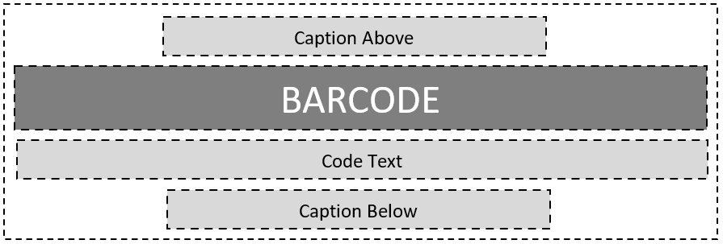
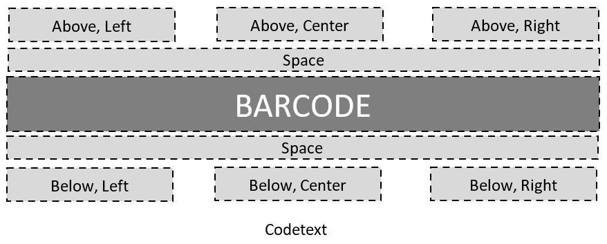
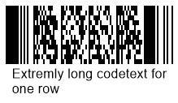
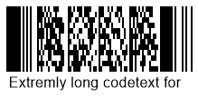
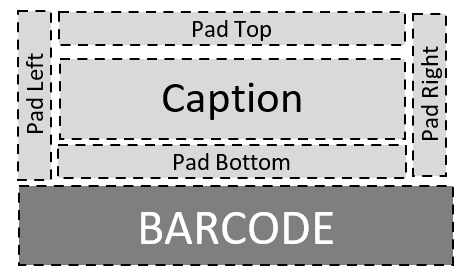

## Overview
  

  
## Barcode Text

  
### Text Positioning
**Location**

BarcodeGenerator gen = new BarcodeGenerator(EncodeTypes.Pdf417, "Åspóse.Barcóde©");
gen.Parameters.Barcode.Pdf417.Rows = 12;
gen.Parameters.Barcode.XDimension.Pixels = 2;
//codetext Above
gen.Parameters.Barcode.CodeTextParameters.Location = CodeLocation.Above;
gen.Save($"{path}CodetextLocationAbove.png", BarCodeImageFormat.Png);
//codetext Below
gen.Parameters.Barcode.CodeTextParameters.Location = CodeLocation.Below;
gen.Save($"{path}CodetextLocationBelow.png", BarCodeImageFormat.Png);
 

|Text Location|Above|Below|
|---|:---:|:---:|
|**Output**|||

**Alignment**


            BarcodeGenerator gen = new BarcodeGenerator(EncodeTypes.Pdf417, "Åspóse.Barcóde©");
            gen.Parameters.Barcode.Pdf417.Rows = 12;
            gen.Parameters.Barcode.XDimension.Pixels = 2;
            //set Codetext Left alignment
            gen.Parameters.Barcode.CodeTextParameters.Alignment = TextAlignment.Left;
            gen.Save($"{path}CodetextAligmentLeft.png", BarCodeImageFormat.Png);
            //set Codetext Center alignment
            gen.Parameters.Barcode.CodeTextParameters.Alignment = TextAlignment.Center;
            gen.Save($"{path}CodetextAligmentCenter.png", BarCodeImageFormat.Png);
            //set Codetext Right alignment
            gen.Parameters.Barcode.CodeTextParameters.Alignment = TextAlignment.Right;
            gen.Save($"{path}CodetextAligmentRight.png", BarCodeImageFormat.Png);
 
  
|Text Alignment|Left|Center|Right|
|---|:---:|:---:|:---:|
|**Output**||||

### Text Visibility


BarcodeGenerator gen = new BarcodeGenerator(EncodeTypes.Pdf417, "Åspóse.Barcóde©");
gen.Parameters.Barcode.Pdf417.Rows = 12;
gen.Parameters.Barcode.XDimension.Pixels = 2;
//hide codetext
gen.Parameters.Barcode.CodeTextParameters.Location = CodeLocation.None;
gen.Save($"{path}CodetextHide.png", BarCodeImageFormat.Png);
 
  

  
### Space between Barcode and Text
  

BarcodeGenerator gen = new BarcodeGenerator(EncodeTypes.Pdf417, "Åspóse.Barcóde©");
gen.Parameters.Barcode.Pdf417.Rows = 12;
gen.Parameters.Barcode.XDimension.Pixels = 2;
//codetext space 5 pixels
gen.Parameters.Barcode.CodeTextParameters.Space.Pixels = 5;
gen.Save($"{path}CodetextSpace5Pixels.png", BarCodeImageFormat.Png);
//codetext space 40 pixels
gen.Parameters.Barcode.CodeTextParameters.Space.Pixels = 40;
gen.Save($"{path}CodetextSpace40Pixels.png", BarCodeImageFormat.Png);
 
  
|Text Spacing|5 Pixels|40 Pixels|
|---|:---:|:---:|
|**Output**|||
  
### Text Font Settings

|Font Setting Mode|Auto|Manual|
|---|:---:|:---:|
|**Output**|||
  
**Auto Mode**  

BarcodeGenerator gen = new BarcodeGenerator(EncodeTypes.Pdf417, "Åspóse.Barcóde©");
gen.Parameters.Barcode.Pdf417.Rows = 12;
gen.Parameters.Barcode.XDimension.Pixels = 2;
//automatic font set
gen.Parameters.Barcode.CodeTextParameters.FontMode = FontMode.Auto;
gen.Parameters.Barcode.CodeTextParameters.Font.FamilyName = "Lucida Handwriting";
gen.Parameters.Barcode.CodeTextParameters.Font.Style = FontStyle.Underline;
//font size is ignored
gen.Parameters.Barcode.CodeTextParameters.Font.Size.Point = 10;
gen.Save($"{path}CodetextFontModeAuto.png", BarCodeImageFormat.Png);
 
  
**Manual Mode**


BarcodeGenerator gen = new BarcodeGenerator(EncodeTypes.Pdf417, "Åspóse.Barcóde©");
gen.Parameters.Barcode.Pdf417.Rows = 12;
gen.Parameters.Barcode.XDimension.Pixels = 2;
//manual font set
gen.Parameters.Barcode.CodeTextParameters.FontMode = FontMode.Manual;
gen.Parameters.Barcode.CodeTextParameters.Font.FamilyName = "Lucida Handwriting";
gen.Parameters.Barcode.CodeTextParameters.Font.Style = FontStyle.Underline;
//font size is set
gen.Parameters.Barcode.CodeTextParameters.Font.Size.Point = 10;
gen.Save($"{path}CodetextFontModeManual.png", BarCodeImageFormat.Png);
 

### NoWrap Mode for Text

|Wrapping Mode|Long Text Wrap|Long Text No Wrap|
|---|:---:|:---:|
|**Output**|||


BarcodeGenerator gen = new BarcodeGenerator(EncodeTypes.Pdf417, "Extremly long codetext for one row");
gen.Parameters.Barcode.Pdf417.Rows = 12;
gen.Parameters.Barcode.XDimension.Pixels = 2;
gen.Parameters.Barcode.CodeTextParameters.FontMode = FontMode.Manual;
gen.Parameters.Barcode.CodeTextParameters.Font.Size.Point = 12;
//text wrapapping mode on
gen.Parameters.Barcode.CodeTextParameters.NoWrap = false;
gen.Save($"{path}CodetextLongTextWrap.png", BarCodeImageFormat.Png);
//text wrapapping mode off
gen.Parameters.Barcode.CodeTextParameters.NoWrap = true;
gen.Save($"{path}CodetextLongTextNoWrap.png", BarCodeImageFormat.Png);
 
  
## Caption

### Text Positioning

### Caption Visibility

### Caption Padding

### Caption Font

### NoWrap Mode for Caption

<!--
## **Customize the appearance of Code text**
[Aspose.BarCode for .NET](https://apireference.aspose.com/barcode/net/) provides the ability to manage the appearance of code text underlying the generated barcode. To customize appearance-related parameters, various settings can be applied to code text using the properties of *CodeTextParameters* class. 
### **Location of Code text**
***Aspose.BarCode for .NET*** allows developers to decide whether code text needs to be displayed or not. Moreover, it is possible to customize the display location of code text (above or below the generated barcode), as shown in the figure below.

|**Possible Locations of Code Text**|
| :- |
||
All barcode generation classes have *CodeTextParameters.Location* property that can accept any pre-defined value stored in *CodeLocation* enumeration. The values in [*CodeLocation* ](https://apireference.aspose.com/barcode/net/aspose.barcode.generation/codetextparameters/properties/location) enumeration are listed below.

|**Code Locations**|**Description** |
| :- | :- |
|Above|Code text on the top of a barcode|
|Below |Code text on the bottom of a barcode|
|None |Code text is hidden|



### **Alignment of Code Text**
The horizontal alignment of code text can be configured using *CodeTextParameters.Alignment* property of *BarcodeGenerator* class. *CodeTextParameters.Alignment* property accepts any enumerated value stored in *Aspose.BarCode.Generation.TextAlignment* enumeration (that is a part of Microsoft .NET Framework). The pre-defined values in *StringAlignment* enumeration are listed below.

|**Alignment Types**|**Description** |
| :- | :- |
|Center |Text in the center of the layout rectangle|
|Left|Text is left-aligned from the original position of the layout rectangle|
|Right|Text is right-aligned on the right of the layout rectangle|



### **Color of Code Text**
Besides customizing barcode color, the color of code text can be changed as well; it can be done by setting *CodeTextParameters.Color* property, as demonstrated below in the provided code snippet.



### **Set Code Text Font Family Name and Size**
Setting *CodeTextParameters.Font* property to any font family name and modifying the size of code text can be done as demonstrated below in the code snippet.



### **Space between Code text and Barcode**
By default, the default gap between a barcode and code text is rather small. Developers can increase/decrease the space (gap) between a barcode and code text by setting *CodeTextParameters.Space* property. The following code snippet illustrates how to space between code text and the barcode.



The example provided below illustrates all possible format settings that can be applied to code text.


-->