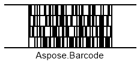

## Overview
*Code 16K* is a multiple-row barcode symbology that may contain up to 16 rows; each row has a fixed length and can include up to five characters. It has a data encoding structure similar to that of the *Code128* barcode type and allows encoding the same set of characters with equal data density. *Code 16K* contains a checksum for an entire barcode that is calculated in two last characters; however, it does not provide a separate checksum for each row. A barcode of this symbology can encode up to 77 data characters or 154 numerical digits. At present, this barcode type is interesting mainly from the historical point of view and is rarely used in healthcare applications.

## Barcode Height Settings
***Aspose.BarCode for .NET*** allows adjusting the height of each row in a *Code 16K* barcode by initializing the [*AspectRatio*](https://apireference.aspose.com/barcode/net/aspose.barcode.generation/code16kparameters/properties/aspectratio) property of class [Code16KParameters](https://apireference.aspose.com/barcode/net/aspose.barcode.generation/code16kparameters). *AspectRatio* is defined as a relative coefficient to the value of the [*XDimension*](https://apireference.aspose.com/barcode/net/aspose.barcode.generation/barcodeparameters/properties/xdimension) property. In the *Code 16K* symbology, it is recommended to set the value of *AspectRatio* greater than 8.  
  
Sample *Code 16K* barcode labels demonstrated below have been generated with different barcode height settings of the aspect ratio. 
  
|Aspect Ratio|Is Set to 10|Is Set to 20|
|:---:|:---:|:---:|
| |||
  
The following code snippet shows how to set the height of *Code 16K* barcodes by defining the aspect ratio.
  

BarcodeGenerator gen = new BarcodeGenerator(EncodeTypes.Code16K, "Aspose.Barcode");
gen.Parameters.Barcode.XDimension.Pixels = 2;
//set Code 16K aspect ratio 10
gen.Parameters.Barcode.Code16K.AspectRatio = 10;
gen.Save($"{path}Code16KAspectRatio10.png", BarCodeImageFormat.Png);
//set Code 16K aspect ratio 20
gen.Parameters.Barcode.Code16K.AspectRatio = 20;
gen.Save($"{path}Code16KAspectRatio20.png", BarCodeImageFormat.Png);


## Quiet Zone Settings
For the *Code 16K* symbology, ***Aspose.BarCode for .NET*** enables adjusting the size of quiet zones on the left and right sides of a barcode by setting the [QuietZoneLeftCoef](https://apireference.aspose.com/barcode/net/aspose.barcode.generation/code16kparameters/properties/quietzoneleftcoef) and [QuietZoneRightCoef](https://apireference.aspose.com/barcode/net/aspose.barcode.generation/code16kparameters/properties/quietzoneleftcoef) properties respectively. These properties correspond to class [Code16KParameters](https://apireference.aspose.com/barcode/net/aspose.barcode.generation/code16kparameters) and are defined as relative coefficients to the value of the [*XDimension*](https://apireference.aspose.com/barcode/net/aspose.barcode.generation/barcodeparameters/properties/xdimension) parameter.  
  
*Code 16K* barcode images demonstrated below have been created using different settings of quiet zones.
  
|Quiet Zone Coefficient|Is Set to 10|Is Set to 20|
|:---:|:---:|:---:|:---:|:---:|
| |||
  
The following code sample illustrates how to customize quiet zone settings for *Code 16K* barcodes.
  

BarcodeGenerator gen = new BarcodeGenerator(EncodeTypes.Code16K, "Aspose.Barcode");
gen.Parameters.Barcode.XDimension.Pixels = 2;
//set Code 16K quiet zone 10
gen.Parameters.Barcode.Code16K.QuietZoneLeftCoef = 10;
gen.Parameters.Barcode.Code16K.QuietZoneRightCoef = 10;
gen.Save($"{path}Code16KQuietZoneL10R10.png", BarCodeImageFormat.Png);
//set Code 16K quiet zone 20
gen.Parameters.Barcode.Code16K.QuietZoneLeftCoef = 20;
gen.Parameters.Barcode.Code16K.QuietZoneRightCoef = 20;
gen.Save($"{path}Code16KQuietZoneL20R20.png", BarCodeImageFormat.Png);
