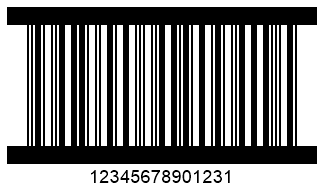
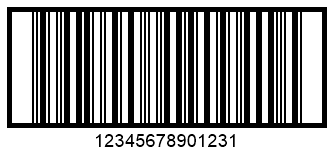

## Overview
The *ITF14* symbology has been introduced by GS based on the *Interleaved 2 of 5* standard to encode trade identifiers defined as Global Trade Item Number (GTIN). This barcode type allows encoding a set of only 14 digits so that the last character is set as a check digit. The *ITF6* symbology is mainly used as an addition to *ITF14* to encode the quantity or weight of a trade item.  
*ITF* barcode labels usually have borders or frames of different types with a quiet zone. Such appearance-related settings may vary depending on particular industrial needs. In ***Aspose.Barcode for .NET***, parameters of *ITF* barcodes to be generated can be adjusted using the [*ITF*](https://apireference.aspose.com/barcode/net/aspose.barcode.generation/barcodeparameters/properties/itf) property group of class [*BarcodeGenerator*](https://apireference.aspose.com/barcode/net/aspose.barcode.generation/barcodegenerator). Further in the article, these properties are discussed in detail along with instructions on their use and corresponding code samples. 

## Frame Settings
ITF barcode labels may have frames of different types depending on industrial needs. ***Aspose.Barcode for .NET*** allows customizing the appearance of *ITF* barcode frames depending on specific requirements. Namely, it is possible to adjust frame style and thickness, as explained below.
 
### Frame Style for ITF14 and ITF 6
Developers can customize five different styles for *ITF* barcode frames, including the absence of such. It can be done by setting the [*ItfBorderType*](https://apireference.aspose.com/barcode/net/aspose.barcode.generation/itf14bordertype) property using the following options: *None*, *Frame*, *Bar*, *FrameOut*, and *BarOut*. Note that *FrameOut* and *BarOut* allow setting the frame outside of the barcode image without affecting its original height. 
  
The sample barcode labels provided below illustrate how the appearance of barcode frames will change depeding on particular settings. 
  
|ITF Frame Style|No Borders (*None*)|Normal Frame (*Frame*)|Horizontal Lines (*Bar*)|Outside Frame (*FrameOut*)|Outside Lines (*BarOut*)|
|:---:|:---:|:---:|:---:|:---:|:---:|
| ||||||
  
The following code snippet explains how to adjust frame style considering the *ITF14* symbology as an example.
  

BarcodeGenerator gen = new BarcodeGenerator(EncodeTypes.ITF14, "12345678901231");
gen.Parameters.Barcode.XDimension.Pixels = 2;
//ITF border type None
gen.Parameters.Barcode.ITF.ItfBorderType = ITF14BorderType.None;
gen.Save($"{path}ITF14BorderNone.png", BarCodeImageFormat.Png);
//ITF border type Bar
gen.Parameters.Barcode.ITF.ItfBorderType = ITF14BorderType.Bar;
gen.Save($"{path}ITF14BorderBar.png", BarCodeImageFormat.Png);
//ITF border type BarOut
gen.Parameters.Barcode.ITF.ItfBorderType = ITF14BorderType.BarOut;
gen.Save($"{path}ITF14BorderBarOut.png", BarCodeImageFormat.Png);
//ITF border type Frame
gen.Parameters.Barcode.ITF.ItfBorderType = ITF14BorderType.Frame;
gen.Save($"{path}ITF14BorderFrame.png", BarCodeImageFormat.Png);
//ITF border type FrameOut
gen.Parameters.Barcode.ITF.ItfBorderType = ITF14BorderType.FrameOut;
gen.Save($"{path}ITF14BorderFrameOut.png", BarCodeImageFormat.Png);

  
### Border Thickness
Depending on specific industrial requirements, the library enables setting border thickness for ITF barcodes by initializing the [*ItfBorderThickness*](https://apireference.aspose.com/barcode/net/aspose.barcode.generation/itfparameters/properties/itfborderthickness) property of class [*ITFParameters*]( https://apireference.aspose.com/barcode/net/aspose.barcode.generation/itfparameters). By default, this property is set to 12 pt.
  
The *ITF14* barcode labels shown below have been generated with different border thickness settings.
  
|Border Thickness|Is Set to 5 Pixels|Is Set to 15 Pixels|
|:---:|:---:|:---:|
| |||
  
The following code sample shows how to set different border thickness values using the *ITF14* symbology as an example.
  

BarcodeGenerator gen = new BarcodeGenerator(EncodeTypes.ITF14, "12345678901231");
gen.Parameters.Barcode.XDimension.Pixels = 2;
gen.Parameters.Barcode.ITF.ItfBorderType = ITF14BorderType.Frame;
//ITF border size 5 Pixels
gen.Parameters.Barcode.ITF.ItfBorderThickness.Pixels = 5;
gen.Save($"{path}ITF14BorderSize5Pixels.png", BarCodeImageFormat.Png);
//ITF border size 15 Pixels
gen.Parameters.Barcode.ITF.ItfBorderThickness.Pixels = 15;
gen.Save($"{path}ITF14BorderSize15Pixels.png", BarCodeImageFormat.Png);

  
## Setting Quiet Zone
In ***Aspose.Barcode for .NET***, developers can customize the size of the quiet zone in *ITF* barcodes by setting the [*QuietZoneCoef*](https://apireference.aspose.com/barcode/net/aspose.barcode.generation/itfparameters/properties/quietzonecoef) property of class [*ITFParameters*]( https://apireference.aspose.com/barcode/net/aspose.barcode.generation/itfparameters). This property is defined as a relative coefficient to the [*XDimension*](https://apireference.aspose.com/barcode/net/aspose.barcode.generation/barcodeparameters/properties/xdimension) parameter.  
  
The *ITF14* barcode images demonstrated below as examples have been generated using different settings for the quiet zone. 
  
|Quiet Zone Coefficient|Is Set to 10|Is Set to 30|
|:---:|:---:|:---:|
| |||
  
The following code sample illustrates how to adjust the appearance of the quiet zone for *ITF14* barcodes.
  

arcodeGenerator gen = new BarcodeGenerator(EncodeTypes.ITF14, "12345678901231");
gen.Parameters.Barcode.XDimension.Pixels = 2;
gen.Parameters.Barcode.ITF.ItfBorderType = ITF14BorderType.Frame;
//ITF quiet zone 10 * XDimension
gen.Parameters.Barcode.ITF.QuietZoneCoef = 10;
gen.Save($"{path}ITF14QuietZone10.png", BarCodeImageFormat.Png);
//ITF quiet zone 30 * XDimension
gen.Parameters.Barcode.ITF.QuietZoneCoef = 30;
gen.Save($"{path}ITF14QuietZone30.png", BarCodeImageFormat.Png);
