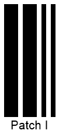
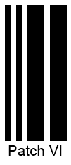

## Overview
The *Patch Code* symbology has been developed by Kodak to facilitate task management for automatic multi-page document scanners. Such barcodes do not encode any data; instead, a barcode pattern indicates an action to be performed. ***Aspose.BarCode for .NET*** supports six main *Patch Code* patterns and allows generating barcodes in two modes: as separate barcode labels for subsequent manual placement on a page; as a complete A4 or US Letter page with required resolution. *Patch Code* barcode labels are printed on four sides of a document; however, it is sufficient to read only one of them to complete scanning. This allows reading barcodes successfully even if pages are rotated.

## Supported Patterns
***Aspose.BarCode for .NET*** enables generating the main *Patch Code* set that consists of six patterns. The extended set of patterns introduced by Kodak later on but not standardized is not supported by the library. The main pattern set includes the following options: *Patch I*, *Patch II*, *Patch III*, *Patch IV*, *Patch T*, and *Patch VI*.
The sample barcode labels provided below illustrate six basic *Patch Code* barcode types.
  
|Patch Code Standards|Patch I|Patch II|Patch III|Patch IV|Patch T|Patch VI|  
|:---:|:---:|:---:|:---:|:---:|:---:|:---:|
| |||||||
  
The following code snippet explains how to generate *Patch Code* barcodes u sing available patterns.
  

BarcodeGenerator gen = new BarcodeGenerator(EncodeTypes.PatchCode, "Patch I");
gen.Parameters.Barcode.CodeTextParameters.FontMode = FontMode.Manual;
gen.Parameters.Barcode.CodeTextParameters.Font.Size.Pixels = 20;
//Patch I
gen.CodeText = "Patch I";
gen.Save($"{path}PatchCodeI.png", BarCodeImageFormat.Png);
//Patch II
gen.CodeText = "Patch II";
gen.Save($"{path}PatchCodeII.png", BarCodeImageFormat.Png);
//Patch III
gen.CodeText = "Patch III";
gen.Save($"{path}PatchCodeIII.png", BarCodeImageFormat.Png);
//Patch IV
gen.CodeText = "Patch IV";
gen.Save($"{path}PatchCodeIV.png", BarCodeImageFormat.Png);
//Patch T
gen.CodeText = "Patch T";
gen.Save($"{path}PatchCodeT.png", BarCodeImageFormat.Png);
//Patch VI
gen.CodeText = "Patch VI";
gen.Save($"{path}PatchCodeVI.png", BarCodeImageFormat.Png);


## Generation Modes

### Setting *PatchFormat* Property

[*PatchFormat*](https://apireference.aspose.com/barcode/net/aspose.barcode.generation/patchcodeparameters/properties/patchformat)

### Adding Complementary QR Code

[ExtraBarcodeText](https://apireference.aspose.com/barcode/net/aspose.barcode.generation/patchcodeparameters/properties/extrabarcodetext)

|Complementary QR Code|Is Disabled|Is Enabled|
|:---:|:---:|:---:|
| |<a href="PatchCodeA4WithoutQR.png"> 

</a>|<a href="PatchCodeA4WithQR.png"> 

</a>|
