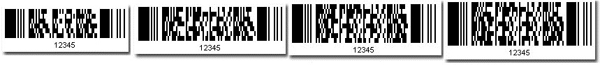

## **Create PDF417 Barcode**
Data File 417 is a two-dimensional stacked barcode symbology that is capable of encoding over a kilobyte of data per label. It has been introduced by Symbol Technologies (1989-1992) and is currently maintained by ANSI/AIM USA. To create a PDF417 barcode, follow the steps outlined below.

1. Create an instance of class [*BarcodeGenerator*](https://apireference.aspose.com/barcode/net/aspose.barcode.generation/barcodegenerator)
1. Set up its *EncodeTypes* property to be PDF417
1. Set CodeText property for the data to be encoded



### **PDF417 Error correction level**
PDF417 barcodes with error correction can resist certain types of damages. Setting a higher error correction level in class [*BarcodeGenerator*](https://apireference.aspose.com/barcode/net/aspose.barcode.generation/barcodegenerator) results in generating a larger barcode label. A sample with the maximum error correction level being set is provided below.


### **Truncated PDF417**
[Aspose.BarCode for .NET](https://apireference.aspose.com/net/barcode) supports the truncated PDF417 version that omits the right-hand side quiet zone to save space. Setting the [*Pdf417Truncate*](https://apireference.aspose.com/barcode/net/aspose.barcode.generation/pdf417parameters/properties/pdf417truncate) property to true leads to a generating comparatively small barcode image.
### **Rows and columns**
*Rows and columns* settings are generally available in two-dimensional barcodes and are applicable to PDF417 as well. PDF417 barcode labels are composed of black and white rectangular modules. If *Rows and Columns* settings are incorrect, the encoder will ignore these settings. Setting *Rows and Columns* to zero means that no specific settings apply in this case. The sample pictures provided below are PDF417 barcodes with the same CodeText but generated with different *Rows and Columns* settings.

|**Different Rows and Columns Settings**|
| :- |
||
### **PDF417 Compaction Mode**
Setting the [Pdf417CompactionMode](https://apireference.aspose.com/barcode/net/aspose.barcode.generation/pdf417parameters/properties/pdf417compactionmode) property allows selecting the required compaction mode out of four available options: 

- Auto: automatically detect the compaction mode
- Text: the text compaction mode for text data
- Numeric: the numeric compaction mode for numeric data
- Binary: the binary compaction mode for binary data

The code snippet provided below generates a PDF417 barcode using the Text compaction mode.



Please note that in this case, the barcode size is large because we have applied the *Binary* compaction mode to encode text data. Alternatively, you can set the compaction mode to *Auto* to automatically select the best possible compaction mode. Otherwise, you must choose it attentively based on the type of the *CodeText* value.

## **Generate Multiple MacroPDF417 Barcodes for Large or Multiple CodeText Values**
It may be necessary to generate multiple MacroPDF417 barcodes in cases when you either have multiple *CodeText* values or a very large *CodeText* value. To handle a large *CodeText value*, it is divided into several smaller CodeText values, and then, multiple MacroPDF417 barcodes are generated for them. Each generated barcode contains *File ID* and *Segment ID* so that it can be recognized correctly in a series of barcodes. The last barcode is also marked with the last segment flag. The following code snippet illustrates how to generate four MacroPDF417 barcodes corresponding to four different CodeText values.


