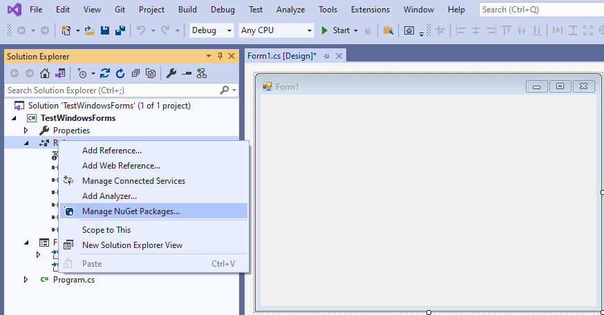
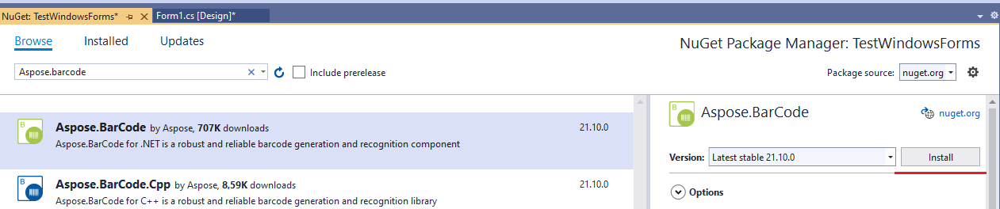
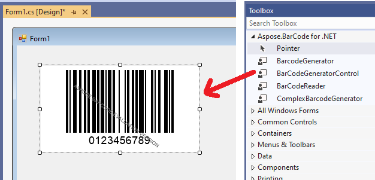
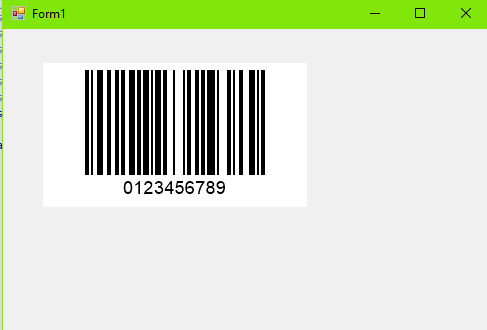
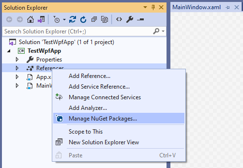
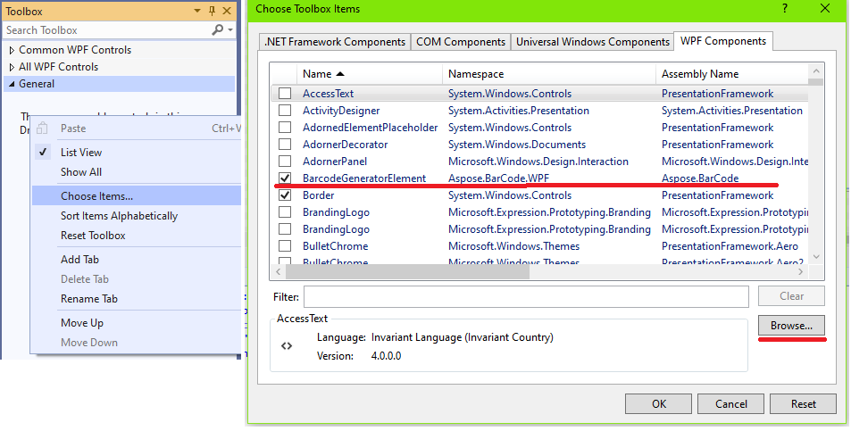
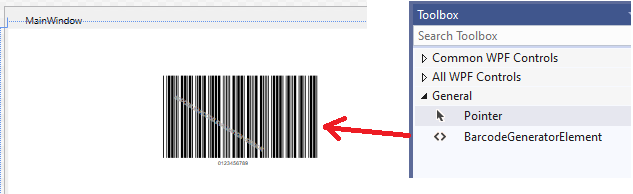
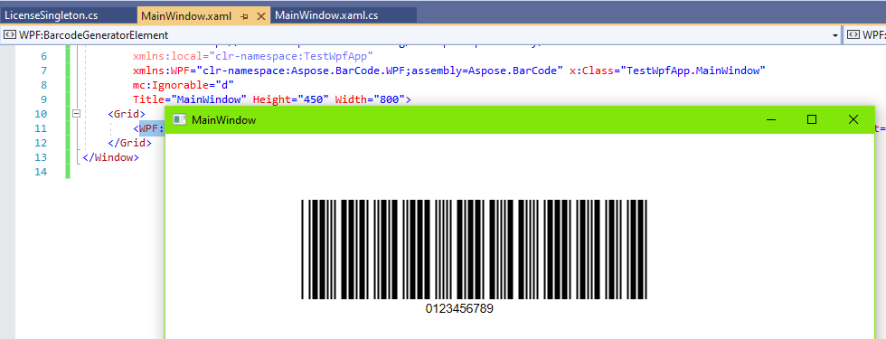

This article provides all necessary information and instructions to implement barcode generation through GUI-based C# tools, such as WinForms and WPF.

## Overview
***AsposeBarCode for .NET*** enables GUI-based development through standard C# visual component frameworks: Windows Forms and Windows Presentation Foundation.  

**Windows Forms (WinForms)** is a UI development platform that benefits from wide functionality, including graphics, controls, user input, data biding, and other features. It enables a drag-and-drop visual designer in Visual Studio to facilitate implementing Windows applications. WinForms provides various controls that can be added to forms, such as text boxes, buttons, drop-down boxes, radio buttons, and even web pages. To realize custom UI elements, developers can use the *System.Drawing* namespace that includes specified classes to render lines, circles, and other shapes directly on a form. In ***Aspose.BarCode for .NET***, *System.Drawing* is an important component used to generate customized barcodes.

**Windows Presentation Foundation (WPF)** is a UI framework that allows creating desktop client applications. As a development tool, it is resolution-independent and employs a vector-based rendering engine to benefit from modern graphics hardware. It supports various application development features, including an application model, security, resources, graphics, controls, layout, documents, data binding, and others. WPF relies on the Extensible Application Markup Language (XAML) to enable a declarative model for application programming. Core WPF building blocks include the following: an application model to deploy application contents; the WPF layout system to simplify the arrangement of controls in a UI; data binding to facilitate integrating UI with data; the comprehensive range of graphics, animation, and media support to enhance the visual appearance of an application. 
{} 
Before starting development through GUI-based frameworks, it is necessary to have installed .NET Framework 2.0 for WinForms and .NET Framework 3.0 for WPF. Please note that .NET Core does not support this option.
{} 

## License Setting

To work with ***Aspose.BarCode for .NET*** through GUI-based tools, it is necessary to activate the product license in application code. General information about how to buy a license or get a trial period is available in [Licensing](/barcode/net/licensing/). 
In this case, the recommended way to install the license is to do that through lazy initialization using the Singleton pattern that will serve to call the license setting code through the form initialization constructor, as shown in the code sample below.  


internal class LicenseSingleton
{
    private static LicenseSingleton _instance = new LicenseSingleton();
    private LicenseSingleton()
    {
        // init the license
        (new Aspose.BarCode.License()).SetLicense(@"{path}Aspose.Total.Product.Family.lic");
    }

    public static void SetLicense()
    {
        LicenseSingleton local = _instance;
    }
}
	
	//lazy initialization before using the library
	LicenseSingleton.SetLicense();
 

The following code snippets illustrate how to call license installation code in WinForms and WPF.  

**Calling License Setting Code in WinForms**
  
public Form1()
{
    //set license
	LicenseSingleton.SetLicense();
    InitializeComponent();
}


**Calling License Setting code in WPF**

public MainWindow()
{
    //set license
    LicenseSingleton.SetLicense();
    InitializeComponent();
}


## Barcode Generation through WinForms GUI
***Aspose.BarCode for .NET*** includes a control class called [*BarCodeGeneratorControl*](https://apireference.aspose.com/barcode/net/aspose.barcode.windows.forms/barcodegeneratorcontrol) that is inherited from *System.Windows.Forms.Control* class. *BarcodeGeneratorControl* class is the key component that enables barcode generation through WinForms. To start working with barcodes through WinForms, follow the steps outlined below:
1. Create a new project in WinForms.
2. Upload the ***Aspose.BarCode for .NET*** library using NuGet:
   - Right-click on *References* and then on *Manage NuGet Packages*.  
     
  
  
 
     
   - Select and install the package ***the Aspose.BarCode for .NET***.  
     
   
  

     
3. Add the *BarCodeGeneratorControl* component to the form from **Toolbox** in the ***Aspose.BarCode for .NET*** directory.  
  

  
  
  
4. Insert the license setting code to the [*System.Windows.Forms.Form*] constructor as described above in [License Setting](#licensesetting); otherwise, watermarks will be placed onto generated barcode labels. If the license is activated successfully, a barcode will be generated as in the example below.  
  

  

## Barcode Generation through WPF

***Aspose.BarCode for .NET*** is compatible with the DLL for the Microsoft WPF framework to enable building WPF-based applications. Namely, barcode generation and recognition functionality can be deployed by referencing *Aspose.BarCode.WPF.dll* in WPF applications. To implement barcode generation through WPF, follow the steps described below.  
1. Create a new WPF project.
2. Add the ***Aspose.BarCode for .NET*** library using NuGet:
   - Right-click on *References* and then on *Manage NuGet Packages*.  
     
   
  
  
     
   - Install the package ***Aspose.BarCode for .NET***.  
     
   
  

     
3. In **Toolbox**, open the *Choose Items* menu. Then, on the *WPF Components* tab, make sure that the checkbox for *BarcodeGeneratorElement* is selected. After that, click the *Browse* button and choose the library *.NET Framework 3.0* or later.     
  
  
  
    
4. Drag the *BarcodeGeneratorElement* component from **Toolbox** to the form.  
  
  
  
  
    
5. Add the license setting code to the *System.Windows.Window* WPF window as described above in [License Setting](#licensesetting); otherwise, watermarks will be placed onto generated barcode images. If the license is activated successfully, a barcode will be generated as in the example below.  
  
   
  
   

