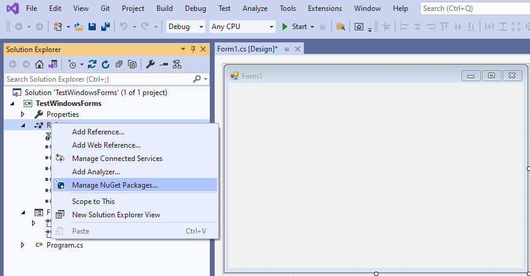
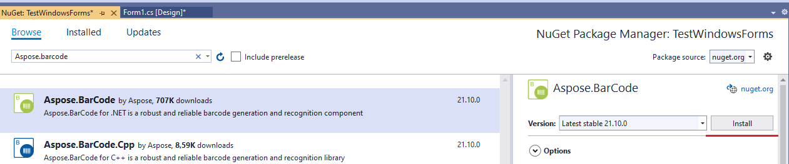
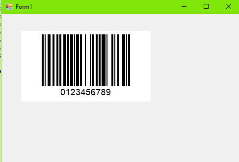

{}*If you need any clarifications, feel free to reach out [Aspose Technical Support](/barcode/net/technical-support/): ask your questions at [Aspose.Barcode Forum](https://forum.aspose.com/c/barcode/13) or contact [Aspose Paid Support Helpdesk](https://helpdesk.aspose.com/).*{}

## Overview
***AsposeBarCode for .NET*** enables GUI-based development through standard C# visual component frameworks: Windows Forms and Windows Presentation Foundation.  

**Windows Forms (WinForms)** is a UI development platform that benefits from wide functionality, including graphics, controls, user input, data biding, and other features. It enables a drag-and-drop visual designer in Visual Studio to facilitate the implementation of Windows applications. WinForms provides various controls that can be added to forms, such as text boxes, buttons, drop-down boxes, radio buttons, and even web pages. To work with custom UI elements, developers can use the *System.Drawing* namespace that includes specified classes to render lines, circles, and other shapes directly on a form.  

{} 
Before starting development with the use of GUI-based frameworks, it is necessary to have installed .NET Framework 2.0 for WinForms and .NET Framework 3.0 for WPF. Please note that .NET Core does not support this option.
{} 

## Barcode Generation through WinForms GUI
***Aspose.BarCode for .NET*** includes a control class called [*BarCodeGeneratorControl*](https://apireference.aspose.com/barcode/net/aspose.barcode.windows.forms/barcodegeneratorcontrol) that is inherited from *System.Windows.Forms.Control* class. *BarcodeGeneratorControl* class is the key component that enables barcode generation through WinForms. To start a new project in this way, follow the steps outlined below:

1. Create a new project in WinForms
2. Add the ***Aspose.BarCode for .NET*** library using NuGet:
- Right-click on *References* and then on *Manage NuGet Packages*
     

  
 
  
- Select and install the ***Aspose.BarCode for .NET*** package
  

  

     
3. Drag the *BarCodeGeneratorControl* component from the ***Aspose.BarCode for .NET*** directory in **Toolbox** to the form 
  

  
  
  
4. Insert the license setting code to the [*System.Windows.Forms.Form*](https://docs.microsoft.com/en-us/dotnet/api/system.windows.forms.form.-ctor?view=netframework-4.8) constructor as described above in [License Setting](#licensesetting); otherwise, watermarks will be placed onto generated barcode labels. If the license is activated successfully, the barcode will be generated as in the example below.  
  

  

