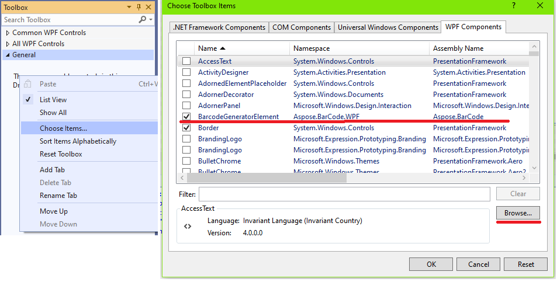
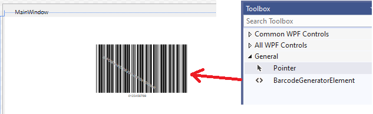
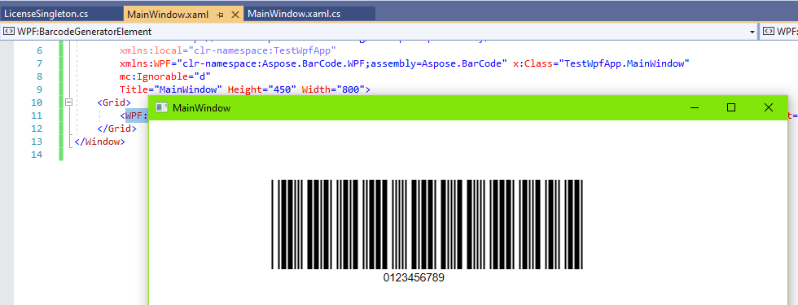

{}*If you need any clarifications, feel free to reach out [Aspose Technical Support](/barcode/net/technical-support/): ask your questions at [Aspose.Barcode Forum](https://forum.aspose.com/c/barcode/13) or contact [Aspose Paid Support Helpdesk](https://helpdesk.aspose.com/).*{}

## Overview
**Windows Presentation Foundation (WPF)** is a UI framework that allows creating desktop client applications. As a development tool, it is resolution-independent and employs a vector-based rendering engine to benefit from modern graphics hardware. It supports various application development features, including an application model, security, resources, graphics, controls, layout, documents, data binding, and others. WPF relies on the Extensible Application Markup Language (XAML) to enable a declarative model for application programming. Core WPF building blocks include the following: an application model to deploy application contents; the WPF layout system to simplify the arrangement of controls in a UI; data binding to facilitate the integration between UI and data; the comprehensive range of graphics, animation, and media support to enhance the visual appearance of an application.  

{} 
Before starting development with the use of GUI-based frameworks, it is necessary to have installed .NET Framework 2.0 for WinForms and .NET Framework 3.0 for WPF. Please note that .NET Core does not support this option.
{} 
 
## Barcode Generation through WPF

***Aspose.BarCode for .NET*** is compatible with the DLL for the **Microsoft WPF framework** to enable building WPF-based applications. Namely, barcode generation and recognition functionality can be deployed by referencing *Aspose.BarCode.WPF.dll* in WPF applications. To implement barcode generation through WPF, follow the steps described below.  

1. Create a new WPF project
2. Add the ***Aspose.BarCode for .NET*** library using NuGet:
- Right-click on *References* and then on *Manage NuGet Packages*  
     

  
  
     
- Install the ***Aspose.BarCode for .NET*** package
     

  

     
3. In **Toolbox**, open the *Choose Items* menu. Then, on the *WPF Components* tab, make sure that the checkbox for *BarcodeGeneratorElement* is selected. After that, click on the *Browse* button and choose the library *.NET Framework 3.0* or later  

  
  
    
4. Drag the *BarcodeGeneratorElement* component from **Toolbox** to the form  
  

  
  
    
5. Add the license setting code to the *System.Windows.Window* WPF window as described in [License Setting](/barcode/net/gui-license-setting/); otherwise, watermarks will be placed onto generated barcode images. If the license is activated successfully, the barcode will be generated as in the example below.  
  

  
   

